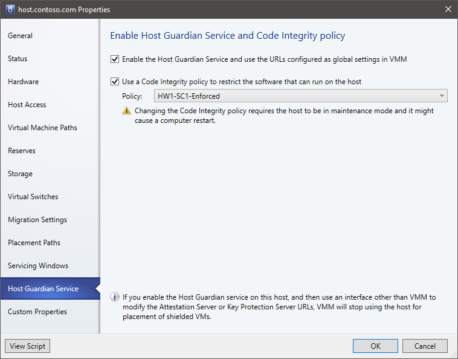

# Scenario: Provision guarded hosts in VMM

>Applies To: System Center 2016 - Virtual Machine Manager

This article describes how to deploy Hyper-V guarded hosts in the System Center 2016 - Virtual Machine Manager (VMM) compute fabric.

Guarded fabric helps guarantee the security of Hyper-V virtual machines. As a cloud service provider, or private cloud administrator, you can deploy a guarded fabric that typically consists of a server running the host guardian service (HGS), one or more guarded Hyper-V host servers, and a set of shielded VMs running on those hosts. [Learn more](https://technet.microsoft.com/windows-server-docs/security/guarded-fabric-and-shielded-vms) about guarded fabric.

There are a couple of ways to set up guarded Hyper-V hosts in the VMM fabric.
- **Enable an existing host**: You can configure a Hyper-V host that’s already in the fabric to act as a guarded host.
- **Add or provision a new guarded host**: This host could be:
    - An existing guarded host
    - An existing Windows Server computer (with or without the Hyper-V role)
    - A bare-metal computer

You set up guarded hosts in the VMM fabric as follows:

1. **Configure global HGS settings**: VMM connects all guarded hosts to the same HGS server so that you can successfully migrate shielded VMs between the hosts. You specify global HGS settings that apply to all guarded hosts, although you can specify host-specific settings that override the global settings. Settings include:
    - **Attestation URL**: The URL that the host uses to connect to the HGS attestation service. This service confirms that the host is authorized to run shielded VMs.
    - **Key protection server URL**: The URL that the host uses to retrieve the key needed to decrypt VMs. The host must pass attestation before you can do this.
    - **Code integrity policies**: A code integrity policy restricts the software that can run in kernel mode, to only the software specified in the code integrity policy file. It’s only relevant when using TPM-attestation mode, and it’s an optional setting. You specify the location from which the policy file can be retrieved.
    - **Shielding helper VHD**: A downloaded tool that helps turn non-shielded VMs into shielded machines. It prepares and encrypts the existing virtual hard drive of the VM you want to configure as shielded. Note that the helper file and VM you want to shield can’t have the same VHDX file.

2. **Configure the cloud**: If the guarded host will be included in a VMM cloud, you need to enable the cloud to support shielded VMs.

## Before you start

Make sure you have the following:

- **HGS server**: You should have the HGS server deployed. [Learn more](https://technet.microsoft.com/windows-server-docs/security/guarded-fabric-setting-up-the-host-guardian-service-hgs)
- **Operating system**: Host computers must run Windows Server 2016 Datacenter edition
- **Role and features**: Host servers should be running the Hyper-V role and the Host Guardian Hyper-V Support feature. Host Guardian Hyper-V Support lets the host communicate with HGS to attest to its health and request keys for shielded VMs.
- **TPM-attestation**: If you’ve configured HGS to use TPM-attestation, Hyper-V hosts must have:
    - TPM 2.0 and UEFI 2.3.1 installed
    - Boot in UEFI mode (not BIOS or “legacy” mode).
    - Secure boot enabled.
- **HGS registration**: Hyper-V hosts must be registered with HGS. How they’re registered depending on whether HGS is using admin-trusted attestation or TPM attestation.
- **Live migration**: If you want to do live migration of shielded VMs you need to deploy two or more guarded hosts.
- **Domain**: Guarded hosts and the VMM server must be in the same domain, or in domains with a two-way trust.

## Enable an existing host as guarded

If you have an unguarded host in the VMM fabric, and you want to enable it as guarded, here's what you need to do:

1.	If you’re using TPM-attestation and code integrity policies, place the host in [maintenance mode](../manage/manage-compute-host-service.md#put-hosts-in-maintenance-mode)
2.	In the VMM console, click **Settings** > **Host Guardian Service Settings**.
3.	Configure the global HGS settings, including the attestation server URL and key protection server URL. Specify a path on which code integrity policies are located (if relevant), and download the shielding helper VHD.

    

4. In **All Hosts**, right-click the host > **Properties** > **Host Guardian Service**.

    

5. Select to enable the host guardian service. Note that:

    - The global attestation and key protection server URLs will be set for the host.
    - If you modify these URLs outside the VMM console, you need to update them in VMM too. If you don’t VMM won’t place shielded VM on guarded hosts using the old URLs.
6.	Enable use of a code integrity policy if you’re using one. This is only relevant for TPM-attestation.
7.	Click **OK** to start using the host to run shielded VMs.
8.	Take the host out of maintenance mode if you need to.

VMM checks that the host passes attestation when you add it, and every time that the host status is refreshed. VMM only deploys and migrates shielded VMs on hosts that have passes attestation. You can check the attestation status of a host in **Properties** > **Status** > **HGS Client Overall**.

## Add or provision a new guarded host

1.	Add the host:
    a.	If you want to add an existing guarded host to the fabric, make sure it can attest properly, before you [add it to the fabric]( ../manage/manage-compute-add-existing-servers.md).
    b.	If you want provision a Windows Server (with or without the Hyper-V role) as a guarded Hyper-V host, [add it to the fabric](../manage/manage-compute-add-existing-servers.md)
    c.	If you want to provision a Hyper-V host from a bare-metal computer, [follow these prerequisites and instructions](../manage/manage-compute-bare-metal-hyper-v.md). Note that you can deploy the host as guarded when you provision it (Add Resource Wizard > **OS Settings** > **Configure as guarded host**.
2.	In the VMM console, click **Settings** > **Host Guardian Service Settings**.
3.	Configure the global HGS settings, including the attestation server URL and key protection server URL. Specify a path on which code integrity policies are located (if relevant), and download the [shielding helper VHD](https://technet.microsoft.com/windows-server-docs/security/guarded-fabric-vm-shielding-helper-vhd).

    

4. Right-click the host > **Properties** > **Host Guardian Service**.

    

5. Select to enable the host guardian service. Note that:
    - The global attestation and key protection server URLs will be set for the host.
    - If you modify these URLs outside the VMM console, you need to update them in VMM too. If you don’t VMM won’t place shielded VM on guarded hosts using the old URLs.
6.	Enable use of a code integrity policy if you’re using one. Only relevant for TPM-attestation.
7.	Click **OK** to start using the host to run shielded VMs.

## Enable guarded hosts on a VMM cloud

Enable a cloud to support guarded hosts:

1.	In the VMM console click **VMs and Services** > **Clouds**. Right-click the cloud name > **Properties**.
2.	In **General** > **Shielded VM support**, select **Supported on this private cloud**.

## Next steps

- [Deploy shielded virtual machines in the VMM fabric](guarded-vms.md)
