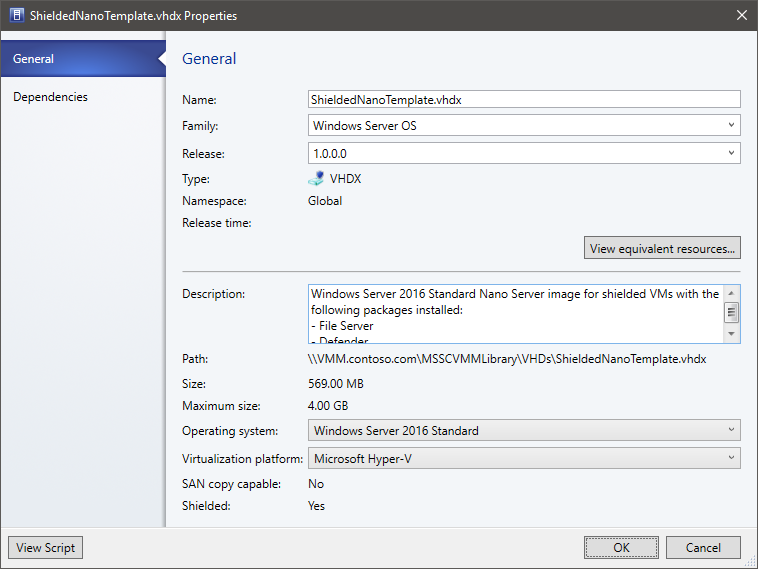

#  Set up a template disk, shielding helper disk, and VM template to deploy shielded VMs in the VMM fabric

>Applies To: System Center 2016 - Virtual Machine Manager

You deploy shielded virtual machines in the System Center 2016 - Virtual Machine Manager (VMM) compute fabric using a signed virtual machine hard disk (VHDX), and optionally with a VM template. This article describes how to add signed template disks to VMM, configure a shielding utility disk, deploy new shielded VMs and convert existing VMs to shielded VMs in VMM.

## Adding signed template disks for shielded VMs to the VMM library

Shielded VMs can be deployed in two ways: by deploying directly from a signed template disk or by converting an existing VM to a shielded VM. Signed template disks assure tenants that the disk contents have not been modified and enable tenants to securely transfer deployment secrets like administrator passwords and certificates to the VM in an encrypted manner. For this reason, it is preferred to deploy shielded VMs from signed template disks.

To prepare and add a signed template disk to the VMM library, complete the following steps:

1. [Prepare a signed template disk](https://technet.microsoft.com/en-us/windows-server-docs/security/guarded-fabric-shielded-vm/guarded-fabric-create-a-shielded-vm-template) on a machine running Server 2016 with Desktop Experience or a Windows 10 computer with the [Remote Server Administration Tools](https://www.microsoft.com/en-us/download/details.aspx?id=45520) installed.
2. [Copy the template disk](../manage/manage-library-add-files.md) to a library share (\\\\\<vmmserver\>\\MSSCVMMLibrary\\VHDs by default), and refresh the library server.
3. To provide VMM with information about the operating system on the template disk, in **Library**, right-click the disk > **Properties**.
4. In **Operating system**, select the operating system installed on the disk. This indicates to VMM that the VHDX isn't blank. The shield icon next to the disk name denotes it as a signed template disk for shielded VMs. Supply information about the **Family** and **Release** of the disk as well to make the resources available in the tenant Azure Pack self-service portal (optional).

    
5. Click **OK** to save the properties of the signed template disk.

## Create a shielded VM template

You can optionally create a shielded VM template using a signed template disk. VM templates define virtual machine resources such as CPU count, RAM, and networking for an OS disk.

Templates for shielded VMs vary slightly from a regular VM template. Some settings are fixed – for example the VM must be a Generation 2 VM with Secure Boot enabled. Create the VM template as follows:

1.	Click **Library** > **Create VM Template**. In **Select Source**, click Use an existing VM template or a virtual hard disk stored in the library > **Browse**.
2.	Select the signed template disk, specify a template name and optional description, and click **OK**.
3.	In **Configure Hardware**, specify the hardware properties for VMs you create from the template. Make sure there's at least one NIC configured and available. Tenants connect to shielded VMs over Remote Desktop Connection, Windows Remote Management, or other remote management tools that require networking.
4.	If you want to use static IP addressing in the tenant pool, you need to let your tenants know. Tenants need to provide an answer file with values that specializes a shielded VM for them. There are special, well-known placeholder values required to support static IP pools.
5.	In **Configure Operating System**, specify the OS version, computer name, product key and time zone. The tenant provides secure information such as the administrator password in a shielding data file (.PDK) that they'll provide when provisioning a new VM. If you specify a product key make sure it's valid for the operating system on the template disk. If it isn't, the VM will not provision successfully.
After the VM template is created, make sure that it's available to the Tenant Administrator user role. Tenants can then use it to provision new VMs.

## Configure the shielding helper VHD

Existing Windows VMs can also be converted to shielded VMs with the use of a shielding helper VHD. The helper VHD is a special disk prepared with tools to encrypt another VM's operating system drive. VMM must be configured with a helper VHD before you can shield existing VMs.

1. [Prepare a helper VHD](https://technet.microsoft.com/en-us/windows-server-docs/security/guarded-fabric-shielded-vm/guarded-fabric-vm-shielding-helper-vhd) on a computer running Windows Server 2016 or Windows 10 with the [Remote Server Administration Tools](https://www.microsoft.com/en-us/download/details.aspx?id=45520) installed.
2. [Copy the helper VHD](../manage/manage-library-add-files.md) to a library share, and refresh the library server.
3. In the VMM console, click **Settings** > **Host Guardian Service Settings**.
4. In the Shielding Helper VHD section, click **Browse** and select the helper VHD from the list of files in the library shares.
5. Click **Finish** to save the configuration.

With the shielding helper VHD configured, you can proceed to [shield an existing VM](guarded-vms.md#shield-an-existing-vm).

## Next steps

[Provision shielded VMs](guarded-vms.md)
