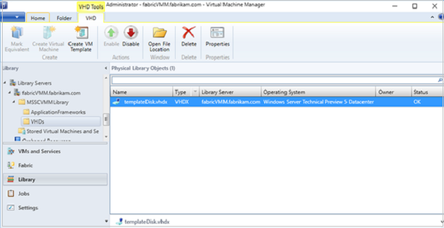

#  Set up a virtual hard disk and VM template to provision shielded virtual machines in the VMM fabric

>Applies To: System Center 2016 - Virtual Machine Manager

You deploy shielded virtual machines in the System Center 2016 - Virtual Machine Manager (VMM) compute fabric using a signed virtual machine hard disk (VHDX), and optionally with a VM template. This article describes how to prepare the signed hard disk and template.

Guarded fabric helps guarantee the security of Hyper-V virtual machines. As a cloud service provider, or private cloud administrator, you can deploy a guarded fabric that typically consists of a server running the host guardian service (HGS), one or more guarded Hyper-V host servers, and a set of shielded VMs running on those hosts. [Learn more](https://technet.microsoft.com/windows-server-docs/security/guarded-fabric-and-shielded-vms) about guarded fabric.

## Before you start

There are a number of requirements for the signed VHDX:

- The OS disk must be a GUID Partition Table (GPT disk). This is required for generation 2 VMs to support UEFI.
- The logical disk type must be basic. BitLocker doesn’t support dynamic disks.
- The disk should have at least two partitions. One partition should include the Windows installation drive. BitLocker encrypts this drive. The other partition is the active one. It contains the bootloader, and is unencrypted so that the machine can be started. This is required for BitLocker.
- The disk should have an NTFS file system – required for BitLocker.
- The VHDX operating system should support generation 2 VMs and the Microsoft secure boot template.
- Supported operating systems: Windows Server 2016, Windows Server 2012 R2, Windows Server 2012, Windows 10, Windows 8.1, Windows 8
- The operating system must be generalized (by running Sysprep) – for template provisioning VMs need to be specialized for specific tenant workloads.
- You need a certificate to sign the VHDX that will act as the template disk for shielded VMs. Note that:
    - Tenants will see the certificate details so it’s important to obtain a certificate from a CA that’s trusted by your and your tenants
    - If you’re both the hoster and tenant you could issue this certificate from your enterprise CA.
    - For test purposes you could use a self-signed certificate using a command similar to this one: New-SelfSignedCertificate -DnsName publisher.fabrikam.com.
- If you want to run Nano Server as the guest operating system on shielded VMs, the Nano Server image should include these packages:
    - Microsoft-NanoServer-Guest-Package
    - Microsoft-NanoServer-SecureStartup-Package

## Create the disk

1.	Create an OS disk that meet the above requirements. Use a tool such as Desktop Image Service Manager (DISM), or create a VM with a blank hard disk and install the OS on that disk.
2.	Generalize the disk by running [Sysprep](https://technet.microsoft.com/en-us/library/bb457073.aspx).
3.	Run Windows Update on the disk, to make sure the operating system is up-to-date.

## Sign and encrypt the disk with BitLocker

1.	Copy the generalized OS disk to a server on which you can set up certificates (it doesn’t need to be a guarded host or the VMM server)
2.	On the server, install the **Shielded VM Tools** feature from [Remote Server Administration] Tools(https://www.microsoft.com/download/details.aspx?id=45520) (RSAT).
•	To install the feature using PowerShell run ``Install-WindowsFeature RSAT-Shielded-VM-Tools -Restart``.
•	**Shielded VM Tools** includes the Provisioning Data File Wizard and the Template Disk Wizard.
3.	Open the Template Disk Wizard in the **Administrative Tools** folder on the **Start** menu. Or, type **TemplateDiskWizard.exe** in a command prompt.
4.	In **Certificate** > **Browse**, select the certificate you want to use to sign the disk template.
5.	In **Virtual Disk** > **Browse**, select the VHDX you prepared.
6.	In **Signature Catalog**, specify a friendly disk name, and version, to help you identify the disk.
7.	In **Review Settings**, check the settings, and click **Generate**. The wizard enables BitLocker on the template disk, computes the disk hash, and creates the volume signature catalog (stored in the VHDX metadata).
8.	In **Summary**, verify information about the disk template, the certificate, and the issues. Click **Close** to finish the wizard.

## Copy the disk to the VMM library

1.	[Copy the template disk](manage-library-add-files.md) to a library share (\\vmmserver>\MSSCVMMLibrary\VHDs by default), and refresh the library server.
2.	To provide VMM with information about the operating system on the template disk, in **Library**, right-click the disk > **Properties**.
3.	In **Operating system**, select the operating system installed on the disk. This indicates to VMM that the VHDX isn’t blank. The shield icon next to the disk name denotes it as a signed template disk for shielded VMs.

    

## Deploy a VM template

When the signed template disk is the VMM library, you can create a VM template to provision shielded VMs.

A shielded VM template varies slightly from a regular VM template. Some settings are fixed – for example generation 2 M, UEFI, secure boot enabled, and some settings are unavailable. For example, there are limited tenant customization settings. Create the VM template as follows:

1.	Click **Library** > **Create VM Template**. In **Select Source**, click Use an existing VM template or a virtual hard disk stored in the library > **Browse**.
2.	Select the signed template disk, specify a template name and optional description, and click **OK**.
3.	In **Configure Hardware**, specify the hardware properties for VMs you create from the template. Make sure there’s at least one NIC configured and available. Tenants connect to shielded VMs over Remote Desktop Connection, Windows Remote Management, or other remote management tools that require networking.
4.	If you want to use static IP addressing in the tenant pool, you need to let your tenants know. Tenants need to provide an answer file with values that specializes a shielded VM for them. They’ll need to add placeholder values for the static IP pool.
5.	In **Configure Operating System**, specify the product key, time zone, and computer name. The tenant provides secure information such as the administrator password in a shielding data file (.PDK) that they’ll create. If you specify a product key make sure it’s valid for the operating system on the template disk. If it isn’t, VMs won’t be created.
After the VM template is created, make sure that it’s available to the Tenant Administrator user role. Tenants can then use it to provision new VMs.

## Next steps

[Provision shielded VMs](guarded-vms.md)
