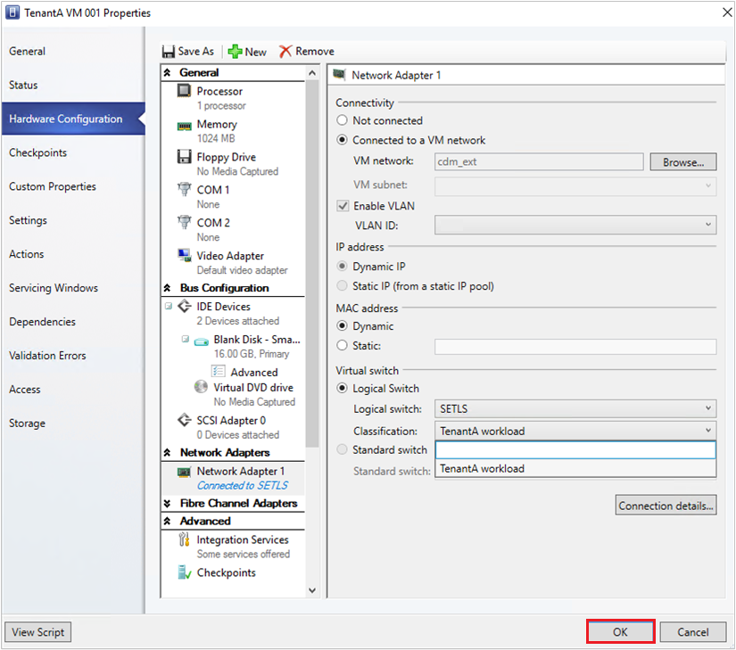

# Control virtual network bandwidth with SDN QoS

>Applies To: System Center 2016 - Virtual Machine Manager

This article provides information about how to configure the SDN QoS by using System Center 2016 - Virtual Machine Manager (VMM).
Through this configuration, you can limit the bandwidth of the traffic flowing in or out of a virtual network adapter (vNIC) by specifying the minimum reserved bandwidth or maximum bandwidth for the adapter.

With SDN QoS:

- Service providers can prevent a high-traffic VM from blocking other VMs.
- Tenants can get the minimum reserved bandwidth regardless of the network traffic.

For detailed information about the SDN QoS settings available in Network Controller, see [Configure Quality of Service (QoS) for a Tenant VM Network Adapter](https://technet.microsoft.com/en-us/windows-server-docs/networking/sdn/manage/configure-qos-for-tenant-vm-network-adapter).

SDN QoS settings are managed in VMM through virtual network adapter port profiles associated with a port classification. Port profile settings enable uniformity and ease of application across multiple adapters.

## Before you start
Ensure you have the network controller deployed in the SDN fabric. [Learn more](sdn-network-controller.md).

## QoS configuration steps
   - [Create virtual network adapter port profiles](#create-virtual-network-adapter-port-profiles)
   - [Create port classification](#create-port-classsification)
   - [Associate port classifications to logical switch](#associate-port-classifications-to-logical-switch)
   - [Apply port classification to virtual network adapter](#apply-port-classification-to-virtual-network-adapter)

### Create virtual network adapter port profiles

To create virtual network adapter port profile, use the following procedure:

1.	Go to **Fabric** > **Port Profiles**.
2.	Right-click **Port Profile** and select **Create Hyper -V Port Profile**. Provide a name and optional description. For example, name can be **TenantA**.
3.	In **General**, select **Virtual Network Adapter Port Profile**.
4.	Go to **Bandwidth Settings**.

    .
5.	In **Bandwidth Settings**, enter the minimum and maximum bandwidth values that you want to apply to the selected vNIC. Maximum bandwidth (Mbps) and Minimum bandwidth (Weight) are used to reserve a portion of the outbound bandwidth for the vNICs.

    - **Maximum bandwidth (Mbps)**: Specify the maximum outbound bandwidth that can be used by this vNIC. This is irrespective of the bandwidth mode configured on the switch. A value of 0 implies that the maximum is not configured.

    - **Minimum bandwidth (Weight)**: Specify a weighted portion of the outbound bandwidth that you want to reserve for this vNIC. This will reserve a weighted portion of the total physical NIC(s) bandwidth based on the total weights reserved by all other vNICs for a particular switch.

6. In **Summary**, view the settings and click **Finish**.

> [!NOTE]

> - Minimum bandwidth (Mbps) is not supported by VMM for SDN.  
> - Limiting the inbound bandwidth of the vNIC is not supported by VMM.
> - Minimum bandwidth (Weight) sets the **outboundReservedValue** setting on the network controller and maximum bandwidth (Mbps) sets the **outboundMaximumMbps** setting.
- Ensure that the minimum and maximum values for bandwidth are within the bandwidth range of the physical NIC(s) that the logical switch is deployed on. Otherwise the bandwidth allocation request will be rejected.

### Create port classification

To create a port classification:
1.	Go to **Fabric** >  **Networking**.
2.	Right-click  **Port Classifications** > **Create Port Classification**.
3.	In the **Create Port Classification** wizard, in **General**, give a name to the classification and click **Finish**.

> [!NOTE]

> As an example, we created a port classification with the name **TenantA workload**, which we use later.

## Associate port classifications to logical switch
To associate a port classification to the logical switch, use the following procedure:

1.	Go to **Fabric** > **Networking** > **Logical Switches**.
2.	Right-click the selected logical switch to view its **Properties**.
3.	Select  Virtual Ports , click **Add** to open the **Add Virtual Port** dialog.

4.	**Browse** to select the port classification (as an example: **TenantA Workload**) and click **OK**.
5.	Select the **Include the Hyper-V virtual network adapter port profile** option and click **Browse**.

    Select the vNIC port profile, (as an example, **TenantA**  that you created in the previous procedure) click **OK**.

6. Repeat the above steps to add the port classifications required for this logical switch.

## Apply port classification to virtual network adapter
To apply a port classification (and hence the QoS settings) to a virtual network adapter, use the following procedure:

1.	Go to **VMs and Services**, right-click the selected VM and open its **Properties**.
2.	Go to the **Hardware Configuration** page and select the virtual network adapter.
3.	Select the desired port classification from the **Classification** drop-down list.

> [!NOTE]
- Only the classifications available for the logical switch are displayed here. You can also apply a port classification while creating a VM.
- You can also apply a port classification to the host virtual network adapter via the host properties Virtual Switches page.
