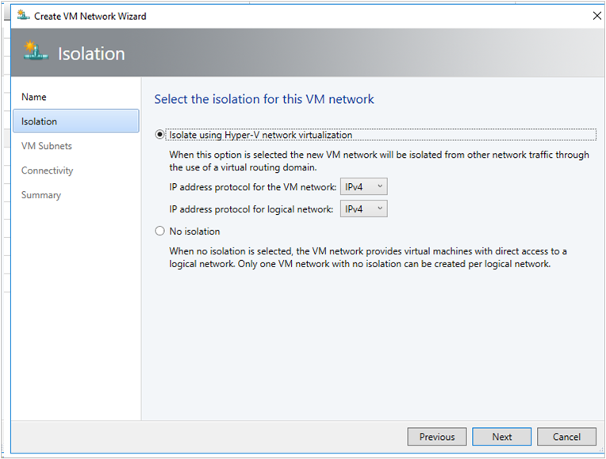

# Set up VM networks in SDN using VMM

>Applies To: System Center 2016 - Virtual Machine Manager

This article provides information about how to create VM networks in an SDN, using System Center 2016 - Virtual Machine Manager (VMM).

VM networks are abstract objects that act as an interface to logical networks. In a virtualized network environment, by using the VM networks, you can abstract virtual machines from the underlying logical network.

A logical network can have one or more VM networks associated with it based on its isolation settings.

The following two types of isolation settings are supported in SDN fabric:

- **Network virtualization** : If a logical network is isolated using network virtualization, you can create multiple VM networks for this logical network. Within a VM network, tenants can use any IP addresses regardless of the IP addresses used on other VM networks. As a service provider, you can host workloads from multiple tenants on a single logical network. Tenants can also configure network connections on these VM networks.

- **No Isolation** :  If a logical network has no isolation, then, only a single VM network can be associated with it. As a service provider, you can host infrastructure workloads using this type of isolation settings.

>[!NOTE]
> VLAN isolation is not supported in SDN fabric.

## Before you start

 Ensure the following:

- Network controller is deployed in the SDN fabric. [Learn more](sdn-network-controller.md).

- Created a logical network with appropriate isolation settings and is set to be managed by the Microsoft network controller. Also, created the IP pools for this logical network.

>[!NOTE]  
> If you want to deploy the VMs with dynamic IP on "no isolation" network, then IP pools are not required.

- By default, VMs connected to a VM network with network virtualization isolation setting, cannot connect to other networks. If you want your VM network to connect to other networks, you need to first deploy [SDN SLB ](sdn-slb.md) and [SDN gateway](sdn-gateway.md).

## Create a VM network (network virtualization)

1. In the VMM fabric, click **VMs and Services** > **VM Networks** > **Create VM Network**.
2. In **Create VM Network Wizard** > **Name**, type a name, optional description and select a logical network that was created with network virtualization isolation settings.
3. In **Isolation** , select **Isolate using Hyper-V network virtualization** , and select IPv4 for IP address protocols. Click **Next**.

 
4. In **VM Subnets** click **Add**, specify the name and subnets for VM network and then click **Next**.
>[!NOTE]  
> You can add multiple subnets.

5. In **Connectivity** panel, select the type of connectivity you want to use for this VM network.

 >[!NOTE]

 > By default, all virtual machines in a VM network communicate with each other. If you want virtual machines on this VM network to communicate with other networks, configure the following settings in the **Connectivity** page.

 >Based on your selection, the **VPN Connections** and **Border Gateway Protocol** pages appear, complete the settings based on the information provided by the VPN admin.

   - **Connect to another network through a VPN tunnel**: Select this option if you want the virtual machines on this VM network to communicate with other networks, over a VPN. To automatically learn routes between the sites connected through the VPN tunnel, select the **Enable the border gateway protocol** option.  Select the **VPN gateway device** that you want to use and confirm the settings.

   - **Connect directly to an additional logical network**: Select this option if you want the virtual machines on this VM network to connect directly to an additional logical network. To enable access to internet resources, select **Network Address Translation (NAT)** or select **Direct Routing** to bridge a virtualized IP address space with a physical IP address space.

6. In **Summary**,  verify the settings and click **Finish**.

Once the job is successfully completed, you can view the newly created VM network under **VMs and Services** > **VM Networks**.

> [!NOTE]

> After you create a VM network with network virtualization, ensure you [create an IP Pool](../manage/manage-network-static-address-pools.md#set-up-an-ip-address-pool-on-a-vm-network) for this VM network.

## Create a VM network (no isolation)

> [!NOTE]

> While creating the logical network, If you have chosen the option **Create VM network with same name to allow virtual machines to access this logical network directly** , then you can skip the following steps.

1. Click **VMs and Services** > **VM Networks** . **Create VM Network**.
2. In **Create VM Network Wizard** > **Name**,  enter a name, optional description. Select a One connected logical network for this VM network. Click **Next**.
3. In **Summary** , verify the settings and click **Finish**.

Once the job is successfully completed, you can view the newly created VM network under **VMs and Services** > **VM Networks**.

> [!NOTE]

>If you had created an IP pool on the logical network, the same will be directly available for the VM network.

## Next steps

[Create an IP pool for a VM network](../manage/manage-network-static-address-pools.md#set-up-an-ip-address-pool-on-a-vm-network)
