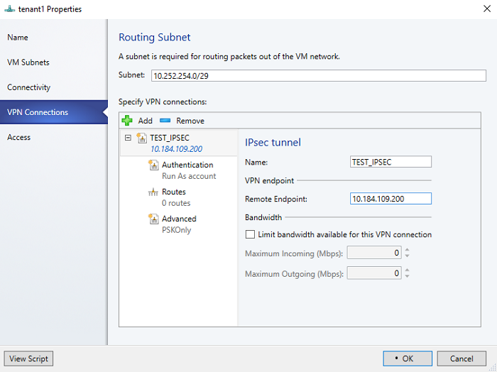
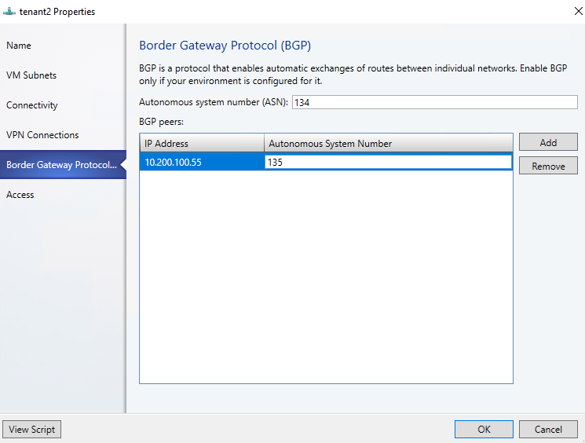

# Set up an SDN RAS gateway in the VMM fabric

> Applies To: System Center 2016 - Virtual Machine Manager

This article describes how to set up a Software Defined Networking (SDN) RAS gateway in the System Center 2016 - Virtual Machine Manager (VMM) fabric.

An SDN RAS gateway is a data path element in SDN that enables site-to-site connectivity between two autonomous systems. Specifically, a RAS gateway enables site-to-site connectivity between remote tenant networks and your datacenter using IPSec, Generic Routing Encapsulation (GRE) or Layer 3 Forwarding. [Learn more](https://technet.microsoft.com/windows-server-docs/networking/sdn/technologies/network-function-virtualization/ras-gateway-for-sdn).


## Before you start


Ensure the following before you start:

- **Planning**: Read about planning a software defined network, and review the planning topology in [this](https://technet.microsoft.com/windows-server-docs/networking/sdn/plan/plan-a-software-defined-network-infrastructure) document. The diagram shows a sample 4-node setup. The setup is highly available with Three network controller nodes (VM), and Three SLB/MUX nodes. It shows Two tenants with One virtual network broken into Two virtual subnets to simulate a web tier and a database tier. Both the infrastructure and tenant virtual machines can be redistributed across any physical host.
- **Network controller**: You should deploy the network controller before you deploy the RAS gateway.
- **SLB**: To ensure that dependencies are handled correctly, you should also deploy the SLB before setting up the gateway. If an SLB and a gateway are configured, you can use and validate an IPsec connection.
- **Service template**: VMM uses a service template to automate GW deployment. Service templates support multi-node deployment on generation 1 and generation 2 VMs.

## Deployment steps

To set up a RAS gateway, do the following:

1. **Download the service template**: Download the service template that you need to deploy the GW.
2. **Create the VIP logical network**: Create a GRE VIP logical network. It needs an IP address pool for private VIPs, and to assign VIPs to GRE endpoints. The network exists to define VIPs that are assigned to gateway VMs running on the SDN fabric for a site-to-site GRE connection.
2. **Import the service template**: Import the RAS gateway service template.
3. **Deploy the gateway**: Deploy a gateway service instance, and configure its properties.
4. **Validate the deployment**: Configure site-to-site GRE, IPSec, or L3, and validate the deployment.


## Download the service template

1. Download the SDN folder from the [Microsoft SDN GitHub repository](https://github.com/Microsoft/SDN) and copy the templates from **VMM** >**Templates** > **GW** to a local path on the VMM server.
2. Extract the contents to a folder on a local computer. You'll import them to the library later.

The download contains Two templates:
- The EdgeServiceTemplate_Generation 1 VM.xml template is for deploying the GW Service on generation 1 virtual machines.
- The EdgeServiceTemplate_Generation 2 VM.xml is for deploying the GW Service on Generation 2 virtual machines.

Both the templates have a default count of three virtual machines which can be changed in the service template designer.

## Create the GRE VIP logical network

1. In the VMM console, run the Create Logical Network Wizard. Type a **Name**, optionally provide a description, and  click **Next**.
2. In **Settings**, select **One Connected Network**. Optionally you can select **Create a VM network with the same name**. This setting allows VMs to access this logical network directly. Select **Managed by the Network Controller**, and click **Next**.
3. In **Network Site**, specify the settings:

    - Network name: GRE VIP
    - Subnet: 31.30.30.0
    - Mask: 24
    - VLAN ID on trunk: NA
    - Gateway: 31.30.30.1  

4. In **Summary**, review the settings and finish the wizard.

### Create an IP address pool for GRE VIP addresses

1. Right-click the GRE VIP logical network > **Create IP Pool**.
2. Type a **Name** and optional description for the pool, and check that the VIP network is selected. Click **Next**.
3. Accept the default network site and click **Next**.
4. Choose a starting and ending IP address for your range.

    **Note**: Start the range on the second address of your available subnet. For example, if your available subnet is from .1 to .254, start the range at .2.
5. In the **IP addresses reserved for load balancer VIPs** box, type the IP addresses range in the subnet. This should match the range you used for starting and ending IP addresses.
6. You don't need to provide gateway, DNS or WINS information as this pool is used to allocate IP addresses for VIPs through the network controller only. Click **Next** to skip these screens.
7. In **Summary**, review the settings and finish the wizard.

## Import the service template

1. Click **Library** > **Import Template**.
2. Browse to your service template folder. As an example,  select the **EdgeServiceTemplate Generation 2.xml** file.
3. Update the parameters for your environment as you import the service template. Note that the library resources were imported during network controller deployment.
 - **WinServer.vhdx**: Select the virtual hard drive image that you prepared and imported earlier, during the network controller deployment.
 - **EdgeDeployment.CR**: Map to the EdgeDeployment.cr library resource in the VMM library.

4. On the **Summary** page, review the details and click **Import**.

    **Note**: You can customize the service template. [Learn more](sdn-network-controller.md#customize-the-template).

## Deploy the gateway service

This example uses the generation 2 template.

1. Select the **EdgeServiceTemplate Generation2.xml** service template, and click **Configure Deployment**.
2. Type a **Name** and choose a destination for the service instance. The destination must map to a host group that contains the hosts configured previously for gateway deployment.
3. In **Network Settings**, map the management network to the management VM network.

    **Note**: The **Deploy Service** dialog appears after mapping is complete. It's normal for the VM instances to be initially Red. Click **Refresh Preview** to automatically find suitable hosts for the VM.
4. On the left of the **Configure Deployment** window, configure the following settings:

  - **AdminAccount**. Required. Select a RunAs account that will be used as the local administrator on the gateway VMs.
  - **Management Network**. Required. Choose the Management VM network that you created for host management.
  - **Management Account**. Required. Select a Run as account with permissions to add the gateway to the Active Directory domain associated with the network controller. This can be the same account used for MgmtDomainAccount while deploying the network controller.
  - **FQDN**. Required. FQDN for the Active directory domain for the gateway.

5. Click **Deploy Service** to begin the service deployment job.

    **Note**:

    - Deployment times will vary depending on your hardware but are typically between 30 and 60 minutes. If gateway deployment fails, delete the failed service instance in **All Hosts** > **Services** before you retry the deployment.

    - If you aren't using a volume licensed VHDX (or the product key isn't supplied using an answer file), then deployment will stop at the **Product Key** page during VM provisioning. You need to manually access the VM desktop, and either enter the key, or skip it.

    - If you want to scale-in or scale-out a deployed SLB instance, read this [blog](https://blogs.technet.microsoft.com/scvmm/2011/05/18/scvmm-2012-an-explanation-of-scale-in-and-scale-out-for-a-service/).

## Configure the gateway manager role

Now that the gateway service is deployed, you can configure the properties, and associate it with the network controller service.

1. Click **Fabric** > **Network Service** to display the list of network services installed. Right-click the network controller service > **Properties**.
2. Click the **Services** tab, and select the **Gateway Manager Role**.
3. Find the **Associated Service** field under **Service information**, and click **Browse**. Select the gateway service instance you created earlier, and click **OK**.
4. Select the **Run As account** that will be used by network controller to access the gateway virtual machines.

    **Note**: The Run as account must have Administrator privileges on the gateway VMs.
5. In **GRE VIP subnet**, select the VIP subnet that you created previously.
6. In **Public IPv4 pool**, select the pool you configured during SLB deployment. In **Public IPv4 address**, provide an IP address from the previous pool, and ensure you don't select the initial three IP addresses from the range.
7. In **Gateway Capacity**, configure the capacity settings.

    The gateway capacity (Mbps) denotes the normal TCP bandwidth that is expected out of the gateway VM. You must set this parameter based on the underlying network speed you use.

    IPsec tunnel bandwidth is limited to (3/20) of the gateway capacity. Which means, if the gateway capacity is set to 1000 Mbps, the equivalent IPsec tunnel capacity would be limited to 150 Mbps.

    The equivalent ratios For GRE, and L3 tunnels are 1/5 and 1/2 respectively.

8. Configure the number of reserved nodes for back-up in **Nodes for reserved for failures field**.
9. To configure individual gateway VMs, click each VM and select the IPv4 frontend subnet, specify the local ASN, and optionally add the peering device information for the BGP peer.


The service instance you deployed is now associated with the gateway Manager role. You should see the gateway VM instance listed under it.

## Validate the deployment

After you deploy the gateway, you can configure S2S GRE, S2S IPSec, or L3 connection types, and validate them.

**Note**:
- Currently, SCVMM console does not support bandwidth changes for a VPN connection. By default, the inbound and outbound bandwidth is set as 500 Kbps.

    To change bandwidth settings, you must use the following network controller PowerShell command:

    **New-NetworkControllerVirtualGatewayNetworkConnection** with the parameters **OutboundKiloBitsPerSecond** and **InboundKiloBitsPerSecond**.

    After changing the bandwidth, in case of any further changes to the VPN connection through the SCVMM, the bandwidth settings will be reset to the default value (500 Kbps). You must run the NC PowerShell command once again, to make any changes to the bandwidth settings.


- When you use BGP with a tunnel connection, BGP peering must be established between the gateway (VSID interface IP address) and the peer device on the physical network. For script based configuration, you will need to know the VSID interface IP address to be able to setup BGP peering. This IP is available in the JSON.  

- For BGP peering to work, there should be a route on the physical network with the destination as the GW VSID Address and the next hop as the L3 interface IP Address.


For more information on connection types, see [this](https://technet.microsoft.com/en-us/windows-server-docs/networking/sdn/technologies/network-function-virtualization/ras-gateway-for-sdn) article.


### Create and validate a site-to-site IPSec connection

A site-to-site IPSec connection allows you to securely access remote virtual machines and services from your datacenter.

**Create the IPSec connection as follows**:

1. Select the VM Network that you want to configure a site-to-site IPSec connection, and click **Connectivity**.
2. Select **Connect to another network through a VPN tunnel**. Optionally, to enable BGP peering in your datacenter, select **Enable Border Gateway Protocol (BGP)**.
3. Select the network controller service for the gateway device.
4. Select the **VPN Connections** > **Add** > **Add IPSec Tunnel**.
5. Type a subnet as shown in the following diagram.
This subnet is used to route packets out of the VM Network. This subnet need not be pre-configured in your datacenter.

    
6. Type a connection **Name**, and the IP address of the remote endpoint. Optionally, configure the bandwidth.
7. In **Authentication**, select the type of authentication you want to use. If you choose to authenticate by using a Run as account, create a user account with a user name, and the IPSec key as the password for the account.
8. In **Routes**, type all the remote subnets that you want to connect to.
9. If you selected **Enable Border Gateway Protocol (BGP)**, then you can leave this screen blank and instead fill out your ASN, peer BGP IP and its ASN on the **Border Gateway Protocol** tab as shown below:

    
10. On the **Advanced** tab, accept the default settings.
11. To validate the connection, try to ping the remote endpoint IP address from one of the virtual machines on your VM Network.

### Create and validate site-to-site GRE connections

A S2S GRE connection allows you to access remote virtual machines and services from your datacenter.

**Configure the connection as follows**:

1. Select the VM network where you want to configure a S2S GRE connection, and click **Connectivity**.
2. Select **Connect to another network through a VPN tunnel**. Optionally, to enable BGP peering in your datacenter, select **Enable Border Gateway Protocol (BGP)**.
3. Select the Network Controller Service for the Gateway Device.
4. Select **VPN Connections** > **Add** > **Add GRE Tunnel**.
5. Type a subnet as shown in the following diagram. This subnet is used to route packets out of the VM network. This subnet doesn't need to be preconfigured in your datacenter.

  
6. Type a connection **Name**, and specify the IP address of the remote endpoint.
7. Type the GRE key.
8. Optionally, you can complete the other fields on this screen but these values aren't needed to set up a connection.
9. In **Routes**, add all the remote subnets that you want to connect to. If you selected **Enable Border Gateway Protocol (BGP)** in **Connectivity**, you can leave this screen blank and instead complete your ASN, peer BGP IP and ASN fields on the **Border Gateway Protocol** tab.
10. You can use the defaults for the remaining settings.
11. To validate the connection, try to ping the remote endpoint IP address from one of the virtual machines on the VM network.

**Note**:

On the remote peer device, you must specify the GRE VIP address that was assigned to the gateway where your GRE connection is residing.
To get the GRE VIP, run the following PowerShell command on a network controller VM:

    Get-NetworkControllerVirtualGateway -ConnectionUri <Connection uri of your deployment> | Convertto-Json -Depth 10

In the resource, you will find a NetworkConnection resource with **connectionType** as **GRE**. In this resource, check the **sourceIPAddress** field. This is the VIP used by the GRE tunnel. If you have multiple GRE connections, you can identify the relevant one by checking the **destinationIPaddress** field.

### Validate an L3 connection

An L3 gateway acts as a bridge between the physical infrastructure in the datacenter and the virtualized infrastructure in the Hyper-V Network Virtualization cloud. To learn more, check these articles: [Windows server gateway as a forwarding gateway](https://technet.microsoft.com/library/dn313101.aspx#bkmk_private) and [RAS gateway high availability](https://technet.microsoft.com/en-us/windows-server-docs/networking/sdn/technologies/network-function-virtualization/ras-gateway-high-availability).

1. Ensure you're logged on as an administrator on the VMM server.
2. Run the following script:

```
param (
    [Parameter(Mandatory=$true)]
    # Name of the L3 VPN connection
    $L3VPNConnectionName,
    [Parameter(Mandatory=$true)]
    # Name of the VM network to create gateway
    $VmNetworkName,
    [Parameter(Mandatory=$true)]
    # Name of the Next Hop one connected VM network
    # used for forwarding
    $NextHopVmNetworkName,
    [Parameter(Mandatory=$true)]
    # IPAddresses on the local side that will be used
    # for forwarding
    # Format should be @("10.10.10.100/24")
    $LocalIPAddresses,
    [Parameter(Mandatory=$true)]
    # IPAddresses on the remote side that will be used
    # for forwarding
    # Format should be @("10.10.10.200")
    $PeerIPAddresses,
    [Parameter(Mandatory=$false)]
    # Subnet for the L3 gateway
    # default value 10.254.254.0/29
    $GatewaySubnet = "10.254.254.0/29",
    [Parameter(Mandatory=$false)]
    # List of subnets for remote tenants to add routes for static routing
    # Format should be @("14.1.20.0/24","14.1.20.0/24");
    $RoutingSubnets = @(),
    [Parameter(Mandatory=$false)]
    # Enable BGP in the tenant space
    $EnableBGP = $false,
    [Parameter(Mandatory=$false)]
    # ASN number for the tenant gateway
    # Only applicable when EnableBGP is true
    $TenantASN = "0"
)

# Import SC-VMM PowerShell module
Import-Module virtualmachinemanager

# Retrieve Tenant VNET info and exit if VM Network not available
$vmNetwork = Get-SCVMNetwork -Name $VmNetworkName;
if ($vmNetwork -eq $null)
{
    Write-Verbose "VM Network $VmNetworkName not found, quitting"
    return
}

# Retrieve L3 Network info and exit if VM Network not available
$nextHopVmNetwork = Get-SCVMNetwork -Name $NextHopVmNetworkName;
if ($nextHopVmNetwork -eq $null)
{
    Write-Verbose "Next Hop L3 VM Network $NextHopVmNetworkName not found, quitting"
    return
}

# Retrieve gateway Service and exit if not available
$gatewayDevice = Get-SCNetworkGateway | Where {$_.Model -Match "Microsoft Network Controller"};
if ($gatewayDevice -eq $null)
{
    Write-Verbose "Gateway Service not found, quitting"
    return
}

# Retrieve Tenant Virtual Gateway info
$vmNetworkGatewayName = $VmNetwork.Name + "_Gateway";
$VmNetworkGateway = Get-SCVMNetworkGateway -Name $vmNetworkGatewayName -VMNetwork $vmNetwork

# Create a new Tenant Virtual Gateway if not configured
if($VmNetworkGateway -eq $null)
{
    if($EnableBGP -eq $false)
    {
        # Create a new Virtual Gateway for tenant
        $VmNetworkGateway = Add-SCVMNetworkGateway -Name $vmNetworkGatewayName -EnableBGP $false -NetworkGateway $gatewayDevice -VMNetwork $vmNetwork -RoutingIPSubnet $GatewaySubnet;
    }
    else
    {
        if($TenantASN -eq "0")
        {
            Write-Verbose "Please specify valid ASN when using BGP"
            return
        }

        # Create a new Virtual Gateway for tenant
        $VmNetworkGateway = Add-SCVMNetworkGateway -Name $vmNetworkGatewayName -EnableBGP $true -NetworkGateway $gatewayDevice -VMNetwork $vmNetwork -RoutingIPSubnet $GatewaySubnet -AutonomousSystemNumber $TenantASN;
    }

}

if ($VmNetworkGateway -eq $null)
{
    Write-Verbose "Could not Find / Create Virtual Gateway for $($VmNetwork.Name), quitting"
    return
}

# Check if the network connection already exists
$vpnConnection = Get-SCVPNConnection -VMNetworkGateway $VmNetworkGateway -Name $L3VPNConnectionName
if ($vpnConnection -ne $null)
{
    Write-Verbose "L3 Network Connection for $($VmNetwork.Name) already configured, skipping"
}
else
{
    # Create a new L3 Network connection for tenant
    $vpnConnection = Add-SCVPNConnection  -NextHopNetwork $nexthopvmNetwork  -Name $L3VPNConnectionName -IPAddresses $LocalIPAddresses -PeerIPAddresses $PeerIPAddresses -VMNetworkGateway $VmNetworkGateway -protocol L3;

    if ($vpnConnection -eq $null)
    {
        Write-Verbose "Could not add network connection for $($VmNetwork.Name), quitting"
        return
    }
    Write-Output "Created VPN Connection " $vpnConnection;
}

# Add all the required static routes to the newly created network connection interface
foreach($route in $RoutingSubnets)
{
    Add-SCNetworkRoute -IPSubnet $route -RunAsynchronously -VPNConnection $vpnConnection -VMNetworkGateway $VmNetworkGateway
}

```

The table below provides examples of dynamic and static L3 connections.

**Parameter** | **Details** | **Example value**
--- | --- | ---
L3VPNConnectionName | User-defined name for the L3 forwarding network connection. | "Contoso_L3_GW"
VmNetworkName | Name of the tenant virtual network that's reachable over L3 network connection. | "ContosoVMNetwork"
NextHopVMNetworkName | User-defined name for the L3 forwarding network connection. Name of VLAN tagged L3 VM network you created. | "Contoso_L3_Network"
LocalIPAddresses | IP addresses to be configured on the HNV gateway L3 network interface.<br/><br/> IP address from the logical network you created. | "10.127.134.55/25"
PeerIPAddresses| IP address of the physical network gateway, reachable over L3 logical network.<br/><br/> IP address from the logical network you created. | "10.127.134.65"
GatewaySubnet | Subnet to be used for routing between HVN gateway and tenant virtual network. | "192.168.2.0/24"
RoutingSubnets | Static routes that need to be on the L3 interface on the HNV gateway. |
EnableBGP | Option to enable BGP. Default is false. |
TenantASNRoutingSubnets |ASN number of tenant gateway. Only if BGP is enabled. |

## Remove the gateway from the SDN fabric

Use [these steps](sdn-remove-an-sdn.md#remove-the-gateway) to remove the gateway from the SDN fabric.
