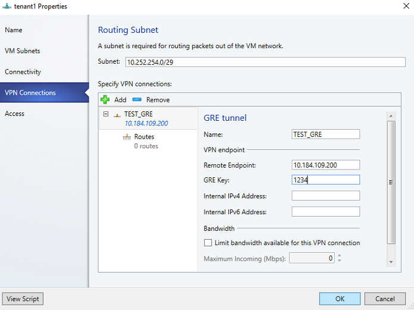

# Set up an SDN RAS gateway in the VMM fabric

> Applies To: System Center 2016 - Virtual Machine Manager

This article describes how to set up a Software Defined Networking (SDN) RAS gateway in the System Center 2016 - Virtual Machine Manager (VMM) fabric.

An SDN RAS gateway RAS Gateway is a data path element in SDN that enables site-to-site connectivity between two autonomous systems. Specifically, a RAS Gateway enables site-to-site connectivity between remote tenant networks and your datacenter using IPSec, Generic Routing Encapsulation (GRE) or Layer 3 Forwarding. [Learn more](https://technet.microsoft.com/windows-server-docs/networking/sdn/technologies/network-function-virtualization/ras-gateway-for-sdn).


## Before you start


Follow these steps before you start:

- **Planning**: [Read about](https://technet.microsoft.com/windows-server-docs/networking/sdn/plan/plan-a-software-defined-network-infrastructure) planning an SDN, and review the planning topology in [Plan a Software Defined Network Infrastructure](https://technet.microsoft.com/library/mt605207.aspx). The diagram shows a sample 4-node setup. The setup is highly available with three network controller nodes (virtual machines), and three SLB/MUX nodes. It shows two tenants with one virtual networks broken into two virtual subnets to simulate a web tier and a database tier. Both the infrastructure and tenant virtual machines can be redistributed across any physical host.
- **Network controller**: You should deploy the network controller before you deploy the RAS gateway.
- **SLB**: To ensure that dependencies are handled correctly, you should also deploy SLB before setting up the gateway. If an SLB and gateway configured, you can use an validate an IPsec connection.


## Deployment steps

To set up an RAS gateway you do the following:

1. **Logical network**: Create a GRE VIP logical network. It needs an IP address pool for private VIPs, and to assign VIPs to GRE endpoints. The network exists to defines VIPs that are assigned to gateway VMs running on the SDN fabric for a site-to-site GRE connection.
2. **Service template**: Download and import the RAS gateway service template.
3. **Deploy the gateway**: Deploy a gateway service instance, and configure its properties.
4. **Validate the deployment**: Configure site-to-site GRE, IPSec, or L3, and validate the deployment.

## Create the GRE VIP logical network

1. In the VMM console, run the Create Logical Network Wizard. Type in a name and optional description, and click **Next**.
2. In **Settings** select **One Connected Network**. Optionally you can select **Create a VM network with the same name**. This setting allows VMs to access this logical network directly. Select **Managed by the Network Controller**, and click **Next**.
3. In **Network Site**, specify the settings:

    - Network name: GRE VIP
    - Subnet: 31.30.30.0
    - Mask: 24
    - VLAN ID on trunk: NA
    - Gateway: 31.30.30.1  

4. In **Summary**, review the settings and finish the wizard.

### Create an IP address pool for GRE VIP addresses

1. Right-click the GRE VIP logical network > **Create IP Pool**.
2. Type a name and optional description for pool, and check that the VIP network is selected. Click **Next**.
3. Accept the default network site and click **Next**.
4. Choose a starting and ending IP address for your range. Start the range on the second address of your available subnet. For example, if your available subnet is from .1 to .254, start the range at .2.
5. In the **IP addresses reserved for load balancer VIPs** box, type the IP addresses range in the subnet. This should match the range you used for starting and ending IP addresses.
6. You don't need to provide gateway, DNS or WINS information as this pool is used to allocate IP addresses for VIPs through the network controller only. Click **Next** to skip these screens.
7. In **Summary**, review the settings and finish the wizard.

## Download and import the template

1. Download the RAS gateway service template from the [Microsoft SDN GitHub repository](https://github.com/Microsoft/SDN/tree/master/VMM/Templates/GW). The download contains two templates.

    - The EdgeServiceTemplate_Generation1.xml template is for deploying the gateway service on generation 1 virtual machines
    - The EdgeServiceTemplate_Generation2.xml is for deploying the gateway service on Generation 2 virtual machines.
    - Both the templates have a default count of three virtual machines which can be changed in the Service Template designer. You can configure the number of passive gateway VMs during deployment.

2. Extract the contents to a folder on a local computer.
3. Click **Library** > **Templates** > **Service Templates** > **Import Template**.
4. Browse to your service template folder. For the purposes of this procedure, select the **EdgeServiceTemplate Generation 2.xml** file.
5. Update the parameters for your environment as you import the service template. Note that the library resources were imported during network controller deployment.

    - **WinServer.vhdx** Select the base virtual hard drive image that you downloaded and imported earlier, during network controller deployment.
    - **NCCertificate.CR**: Map to the NCCertificate.cr library resource in the VMM library.
    - **EdgeDeployment.CR**: Map to the EdgeDeployment.cr library resource in the VMM library


3. On the **Summary** page, click **Import**.

## Deploy the gateway service

This example uses the generation 2 template.

1. Select the **EdgeServiceTemplate Generation2.xml** service template, and click **Configure Deployment**.
2. Type a name, and choose a destination for the service instance. The destination must map to a host group that contains the hosts configured previously for gateway deployment.
3. In **Network Settings**, map the management network to the management VM network.
4. In **Deploy Service**, it's normal for the VM instances to be initially red. Click **Refresh Preview** to automatically find suitable hosts for the virtual machine.
5. On the left side of the **Configure Deployment** window, there are a number of settings that you must configure:

  - **AdminAccount**. Required. Select a Run as account in your environment which will be used as the local admin on the gateway VMs. For example - Administrator
  - **Management Network**. Required. Choose the Management VM network that you created for host management.
  - **SelfSignedConfiguration**. Required. If you're using a self-signed certificate, set this value to **True**. If you are using a certificate that has been assigned by an Enterprise CA or external Root CA, set this value to **False**.

6. Click **Deploy Service** to begin the service deployment job. Deployment times will vary depending on your hardware but are typically between 30 and 60 minutes. If gateway deployment fails, delete the failed service instance in **All Hosts** > **Services**.
7. If you aren't using a volume licensed VHDX (or the product key isn't supplied using an answer file), then deployment will stop at the **Product Key** page during VM provisioning. You need to manually access the VM desktop, and either enter the key, or skip it.

If you want to scale-in or scale-out a deployed SLB instance, read more in this [blog](https://blogs.technet.microsoft.com/scvmm/2011/05/18/scvmm-2012-an-explanation-of-scale-in-and-scale-out-for-a-service/).

## Configure the Gateway Manager role

Now that the gateway service is deployed, you can configure the properties, and associate it with the network controller service.

1. Click **Fabric** > **Network Service** to display the list of network services installed. Right-click the network controller service > **Properties**.
2. Click the **Services** tab, and select the **Gateway Manager Role**.
3. Find the **Associated Service** field under **Service information**, and click **Browse**. Select the gateway service instance you created earlier, and click **OK**.
4. Select the **Run As account** that will be used by network controller to access the gateway virtual machines.
5. In **GRE VIP subnet**, select the VIP subnet that you created previously.
6. In **Public IPv4 pool**, select the pool you configured during SLB deployment. In **Public IPv4 address**, provide an IP address from the previous pool, and ensure you don't select the initial three IP addresses from the range.
7. In **Gateway Capacity**, configure the capacity settings.
8. Configure the number of reserved nodes for back-up in **Nodes for reserved for failures field**.
9. To configure individual gateway VMs, click each VM and select the IPv4 frontend subnet, specify the local ASN, and optionally add the peering device information for the BGP peer.


The service instance you deployed is now associated with the Gateway Manager role. You should see the gateway VM instance listed under it.

## Validate the deployment

After you deploy the gateway you can configure S2S GRE, S2S IPSec, or L3 connection types, and validate them.

### Create and validate a site-to-site IPSec connection

A site-to-site IPSec connection allows you to securely access remote virtual machines and services from your datacenter. Create the connection as follows:

1. Select the VM Network that you want to configure a site-to-stie IPSec connection, and click **Connectivity**.
2. Select **Connect to another network through a VPN tunnel**. Optionally, if you want to enable BGP peering in your datacenter, you can select **Enable Border Gateway Protocol (BGP)**.
3. Select the Network Controller service for the gateway device.
4. Select the **VPN Connections** > **Add** > **IPSec**.
5. Type a subnet as shown in the following diagram. This subnet is used to route packets out of the VM Network. This subnet need not be pre-configured in your datacenter.
6. Type a connection name, and the IP address of the remote endpoint. Optionally configure bandwidth.
7. In **Authentication**, select the type of authentication you want to use. If you choose to authenticate using a Run As account, create a user account with a user name, and the the IPSec key as the password for the account.
8. In **Routes**, type all the remote subnets that you want to connect to.
9. If you selected **Enable Border Gateway Protocol (BGP)** then you can leave this screen blank and instead fill out your ASN, peer BGP IP and its ASN on the **Border Gateway Protocol** tab as shown below:
10. On the **Advanced** tab, accept the default settings.
11. To validate the connection, try to ping the remote endpoint IP address from one of the virtual machines on your VM Network.

### Create and validate site-to-site GRE connections

A S2S GRE connection allows you to access remote virtual machines and services from your datacenter. Configure the connection as follows:

1. Select the VM network where you want to configure a S2S GRE connection, and click **Connectivity**.
2. Select **Connect to another network through a VPN tunnel**.
3. Optionally, if you want to enable BGP peering in your datacenter, you can also select **Enable Border Gateway Protocol (BGP)**.
4. Select the Network Controller Service for the Gateway Device.
5. Select **VPN Connections** > **Add** > **GRE**.
6. Type a subnet as shown in the following diagram. This subnet is used to route packets out of the VM network. This subnet doesn't need to be preconfigured in your datacenter.

  

7. Type a connection name, and specify the IP address of the remote endpoint.
8. Type the GRE key.
9. Optionally, you can complete the other fields on this screen but these values aren't need to set up a connection.
10. In **Routes**, add all the remote subnets that you want to connect to. If you selected **Enable Border Gateway Protocol (BGP)** in **Connectivity**, you can leave this screen blank and instead complete your ASN, peer BGP IP and ASN fields on the **Border Gateway Protocol** tab.
11. You can use the defaults for the remaining settings.
12. To validate connectivity, try to ping the remote endpoint IP address from one of the virtual machines on the VM network.

### Validate an L3 connection

An L3 gateway acts as a bridge between the physical infrastructure in the datacenter and the virtualized infrastructure in the Hyper-V Network Virtualization cloud. [Learn more](https://technet.microsoft.com/library/dn313101.aspx#bkmk_private).

VMM doesn't currently support BGP-enabled dynamic L3 connectivity, but an L3 connection can be configured using a PowerShell script.

1. Ensure you're logged on as an administrator on the VMM server.
2. Run the following script.

```
param(
[Parameter(Mandatory=$true)]
# Name of the L3 VPN connection
$L3VPNConnectionName,
[Parameter(Mandatory=$true)]
# Name of the VM network to create gateway
$VmNetworkName,
[Parameter(Mandatory=$true)]
# Name of the Next Hop one connected VM network
# used for forwarding
$NextHopVmNetworkName,
[Parameter(Mandatory=$true)]
# IPAddresses on the local side that will be used
# for forwarding
# Format should be @("10.10.10.100/24")
$LocalIPAddresses,
[Parameter(Mandatory=$true)]
# IPAddresses on the remote side that will be used
# for forwarding
# Format should be @("10.10.10.200")
$PeerIPAddresses,
[Parameter(Mandatory=$false)]
# Subnet for the L3 gateway
# default value 10.254.254.0/29
$GatewaySubnet = "10.254.254.0/29",
[Parameter(Mandatory=$false)]
# List of subnets for remote tenants to add routes for static routing
# Format should be @("14.1.20.0/24","14.1.20.0/24");
$RoutingSubnets = @()
)

Import-Module virtualmachinemanager

$vmNetwork = Get-SCVMNetwork -Name $VmNetworkName;

$nextHopVmNetwork = Get-SCVMNetwork -Name $NextHopVmNetworkName;

$gatewayDevice = Get-SCNetworkGateway | Where {$_.Model -Match "Microsoft Network Controller"};

$vmNetworkGatewayName = $VmNetwork.Name + "_Gateway";
$VmNetworkGateway = Add-SCVMNetworkGateway -Name $vmNetworkGatewayName -EnableBGP $false -NetworkGateway $gatewayDevice
    -VMNetwork $vmNetwork -RoutingIPSubnet $GatewaySubnet;

$vpnConnection = Add-SCVPNConnection  -NextHopNetwork $nexthopvmNetwork  -Name $L3VPNConnectionName
    -IPAddresses $LocalIPAddresses -PeerIPAddresses $PeerIPAddresses -VMNetworkGateway $VmNetworkGateway -protocol L3;
Write-Output "Created VPN Connection " $vpnConnection;

foreach($route in $RoutingSubnets)
{
    Add-SCNetworkRoute -IPSubnet $route -RunAsynchronously -VPNConnection $vpnConnection
        -VMNetworkGateway $VmNetworkGateway
}
```

The table below provides examples of dynamic and static L3 connections.

**Parameter** | **Details** | **Example value**
--- | --- | ---
L3VPNConnectionName | User-defined name for L3 forwarding network connection | "Contoso_L3_GW"
VmNetworkName | Name of tenant virtual network that's reachable over L3 network connection | "ContosoVMNetwork"
NextHopVMNetworkName | User-defined name for L3 forwarding network connectionName of VLAN tagged L3 VM network you created | "Contoso_L3_Network"
LocalIPAddresses | IP addresses to be configured on the HNV gateway L3 network interface.<br/><br/> IP address from the logical network you created | "10.127.134.55/25"
PeerIPAddresses| IP address of physical network gateway, reachable over L3 logical network.<br/><br/> IP address from the logical network you created | "10.127.134.65"
GatewaySubnet | Subnet to be used for routing between HVN gateway and tenant virtual network | "192.168.2.0/24"
RoutingSubnets | Static routes that need to be on the L3 interace on the HNV gateway |
EnableBGP | Option to enable BGP. Default is false. |
TenantASNRoutingSubnets |ASN number of tenant gateway. Only if BGP is enabled. |
