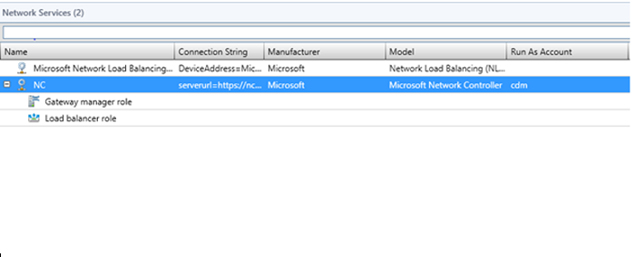
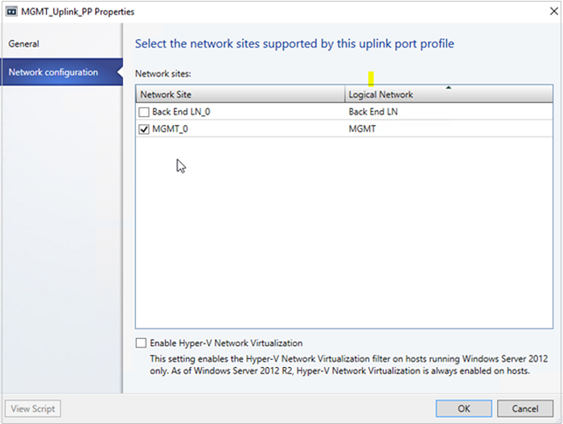

# Set up an SDN network controller in the VMM fabric

>Applies To: System Center 2016 - Virtual Machine Manager

This article describes how to set up a Software Defined Networking (SDN) network controller in the System Center 2016 - Virtual Machine Manager (VMM) fabric.

The SDN network controller is a scalable and highly available server role that enables you to automate network infrastructure configuration instead of performing manual network device configuration. [Learn more](https://technet.microsoft.com/windows-server-docs/networking/sdn/technologies/network-controller/network-controller).

To set up SDN in the VMM fabric you need the following:

- **A downloaded virtual hard drive and service template** to automate network controller deployment.
- **A management logical network** that mirrors your physical management network. It models connectivity for the VMM host, network controller hosts, and tenant VM hosts. If you want to assign static IP addresses to network controller VMs, you need an IP address pool in the management logical network.
- **A logical switch** to provide the management logical network with connectivity to the network controller VMs.
- **An SSL certificate** to authenticate communications between the VMM server and the network controller.
- **An HNV provider logical network and tenant VM networks** to validate the network controller deployment.

## Before you start

- **Planning**: [Read](https://technet.microsoft.com/windows-server-docs/networking/sdn/plan/plan-a-software-defined-network-infrastructure) the SDN planning guide.
- **Download a virtual hard disk**: Download a virtual hard disk for network controller VMs. VMM uses a service template to deploy network controller. This service template needs a virtual hard disk that's prepare and imported into the VMM library.
- **Download the service templates**: You download the network controller service templates and import them to the VMM library.
-  **Set up Active Directory security groups**: You'll need an Active Directory security group for network controller management, and another security group for network controller clients.
- **Set up a VMM library share**. You can have an optional library file share for keeping diagnostic logs. This library share will be accessed by the network controller to store diagnostics information throughout its lifetime.
- **Set up hosts**: Set up a dedicated host group for All Hyper-V hosts must have the latest version of Windows Server RTM (Windows Server 2012 R2 with the latest Upgrading-and-Uninstalling-Agents-on-UNIX-and-Linux-Computers) installed, and the Hyper-V role enabled.
- **Other prerequisites**: [Verify](https://technet.microsoft.com/windows-server-docs/networking/sdn/plan/installation-and-preparation-requirements-for-deploying-network-controller) other requirements.

## Download the virtual hard disk for the service template

1. Download the virtual hard disk. It can be downloaded in VHD or VHDX format. The operating system is Windows Server 2016. The VMM service template for the network controller support deployment on both generation 1 and generation 2 VMs. If you want to deploy a non-English environment, you can download the language pack you need. The product key is 6XBNX-4JQGW-QX6QG-74P76-72V67.

    - [Download VHD](http://download.microsoft.com/download/4/4/F/44F93CCF-1AAE-42E5-BDCB-924991A005DA/14300.1000.amd64fre.rs1_release_svc.160324-1723_server_serverdatacenter_en-us.vhd)
    - [Download VHDX](http://download.microsoft.com/download/4/4/F/44F93CCF-1AAE-42E5-BDCB-924991A005DA/14300.1000.amd64fre.rs1_release_svc.160324-1723_server_serverdatacenter_en-us.vhdx)

2.   Import the files to the VMM library. [Learn more](../manage/manage-library-add-files.md).

## Download the network controller service templates

1. Download the network controller service templates. The download contains four service templates and five custom resource folders:

    **Name** | **Type** | **Details**
    --- | --- | ---
    **Network Controller Production Generation 1 VM.xml** | Template | Three-node network controller for generation 1 VMs
    **Network Controller Production Generation 1 VM.xml** | Template | Three-node network controller for generation 2 VMs
    **Network Controller Standalone Generation 1 VM.xml** | Template | Single-node network controller for generation 1 VMs
    **Network Controller Standalone Generation 1 VM.xml** | Template | Single-node network controller for generation 2 VMs
    **NcSetup.cr** | Custom resource file | Library resource contains scripts used to set up the network controller
    **ServerCertificate.cr** | Custom resource file | Library resource containing the private key for the network controller (.pfx)
    **TrustedRootCertificate.cr** | Custom resource file | Library resource containing the certificate public key (.cer), imported as the trusted root certificate to validate the SSL certificate
    **EdgeDeployment.cr** | Template | Used for installing SLB MUX roles and gateway roles (for example, VPN)
    
2. Import the templates into the VMM library.

## Set up Active Directory groups

1. In Active Directory Users and Computers, create a security group for network controller management.

    - In the group, add all the users who have permission to configure the network controller. For example, create a group named Network Controller Admins.
    -  All of the users that you add to this group must also be members of the Domain Users group in Active Directory.
    - The group for network controller management should be a domain local group. Members of this group will be able to create, delete, and update the deployed network controller configuration.
    - Create at least one user account that is a member of this group and have access to its credentials. After the network controller is deployed, VMM can be configured to use the user account credentials to establish communication with the network controller.
2. Create another security group for network controller clients
    - Add users with permission to configure and manage networks using network controller. For example, create a group named Network Controller Users.
    - All of the users that you add to the new group must also be members of the Domain Users group in Active Directory.
    - All Network Controller configuration and management is performed using Representational State Transfer (REST).
    -  The group should be a Domain Local group. After the network controller is deployed, any members of this group will have permissions to communicate with the network controller via the REST based interface.
    - Create at least one user account that is a member of this group. After the network controller is deployed, VMM can be configured to use the user account credentials to establish communication with the network controller.

## Create a library share for logging

1. Optionally create a file share in the VMM library to keep diagnostic logs.
2. Ensure that the share can be accessed by the network controller. The network controller accesses the share to store diagnostic information. Note the credentials for the account that will have write access to the share.

## Set up host groups and hosts

1. [Create a dedicated host group](../manage/manage-compute-host-groups.md) for Hyper-V hosts that will be managed by SDN.
2. Make sure Hyper-V hosts are running Windows Server 2016.

## Create the management logical network

You create a management logical network in VMM, to mirror your physical management network.

- The logical network provides network connectivity settings for the VMM host, network controller hosts, and tenant VM hosts.
- We recommend that you create this logical network specifically to provide connectivity for infrastructure VMs that are managed by the network controller.
- If you already have a One Connected Management Logical Network that's configured with **Create a VM Network with the same name to allow virtual machines to access this logical network directly**, then you can use this logical network to provide management connectivity to network controller.

1.  Click **Fabric** > **Networking**. Right-click **Logical Networks**  > **Create Logical Network**.
2.  Specify a **Name** and optional **Description**.
3.  In **Settings** select **One Connected Network**. All management networks need to have routing and connectivity between all hosts in that network. Select **Create a VM Network with the same name to allow virtual machines to access this logical network directly** to automatically create a VM network for your management network.
4.  Click **Network Site** > **Add** Select the host group for the hosts that will be managed by the network controller. Insert your management network IP subnet details. This network should already exist and be configured in your physical switch.
5.  Review the **Summary** information and click **Finish** to complete.

###  Create an IP address pool

If you want to allocate static IP addresses to network controller VMs, create an IP address pool in the management network

1.  Right-click the management logical network in VMM > **Create IP Pool**.
2.  Provide a name and optional description for pool and ensure that the management network is selected for the logical network.
3.  In **Network Site** panel, select the subnet that this IP address pool will service.
4.  In **IP Address range** panel, type the starting and ending IP addresses. Don't use the first three IP addresses of your available subnet. For example, if your available subnet is from .1 to .254, start your range at .4 or greater. In **IP addresses to be reserved for other uses**, type one of the IP addresses from the specified range. This is the IP address that you will later use as the REST IP of the network controller service
5. Specify the default gateway address and optionally configure DNS and WINS settings
6.  In **Summary** review the settings and click **Finish** to complete the wizard.

## Create a logical switch

You need to deploy a logical switch on the management logical network. The switch provides connectivity between the management logical network and the network controller VMs.

1.  Click **Create Logical Switch**. Review the Getting Started information and click **Next**.
2. Provide a name and optional description. Select **No Uplink Team**. If you need teaming, select **Team**.
3.  For minimum bandwidth mode, choose the default option.
4.  In **Extensions** clear all the switch extensions. This is important. Selecting any of the switch extensions at this stage could block network controller onboarding later.
5.  You can optionally add a virtual port profile and choose a port classification for host management.
6.  Click **Add** > **New Uplink Port Profile**. Provide a name and optional description. Use the defaults for load balancing algorithm and teaming mode.  Select all the network sites in the management logical network.
7. Select the uplink port profile you created > **New virtual network adapter**. This adds a host virtual network adapter (vNIC) to your logical switch and uplink port profile, so that when you add the logical switch to your hosts, the vNICs get added automatically.
8. Provide a name for the vNIC. Verify that the management VM network is listed in **Connectivity**.
 Select **This network adapter will be used for host management** > **Inherit connection settings from the host adapter**. This allows you to take the vNIC adapter settings from the adapter that already exists on the host. If you created a port classification and virtual port profile earlier, you can select it now.
 In **Summary** review the information and click **Finish** to complete the wizard.

### Deploy the logical switch

 You'll need to deploy the management logical switch on all hosts. [Learn more](../manage/manage-compute-add-networking-hyper-v.md)

## Set up certificates

You need an SSL certificate that will be used to establish HTTPS communications between VMM and the network controller. There are two methods you can use to generate an SSL certificate:

- **Self-signed certificate**: You generate the self-signed certificate, and export it with the private key protected with a password.
- **Certificate Authority (CA) certificate**: The certificate must include the serverAuth EKU, specified by the OID 1.3.6.1.5.5.7.3.1. In addition, the certificate Subject Name must match the FQDN of the network controller.

### Use a self-signed certificate

The following example creates a new self-signed certificate, and should be run on the VMM server. Note that using an IP address as the DNS name is supported, but not recommended because it restricts the network controller to a single subnet.

#### Multi-node deployment

You can use any friendly name for the network controller. The DNS name should be the REST name you want to use. Using an IP address as the DNS name is supported but isn't recommended because it restricts network controller deployment to a single subnet.

  ``New-SelfSignedCertificate -KeyUsageProperty All -Provider "Microsoft Strong Cryptographic Provider" -FriendlyName "<YourNCComputerName>" -DnsName @("<NCRESTName>")``

 Example:

  ``New-SelfSignedCertificate -KeyUsageProperty All -Provider "Microsoft Strong Cryptographic Provider" -FriendlyName "MultiNodeNC" -DnsName @("NCCluster.Contoso.com")``

#### Single node deployment

 You can use any friendly name for your NC. The DNS name should be the network controller name followed by the full domain name.

  ``New-SelfSignedCertificate -KeyUsageProperty All -Provider "Microsoft Strong Cryptographic Provider" -FriendlyName "<YourNCComputerName>" -DnsName @("<NCFQDN>")``

Example:

  ``New-SelfSignedCertificate -KeyUsageProperty All -Provider "Microsoft Strong Cryptographic Provider" -FriendlyName "SingleNodeNC" -DnsName @("SingleNodeNC.Contoso.com")``

#### Export the self-signed certificate

  1. Open the **Certificates** snap-in (certlm.msc) and locate the certificate in Personal/Certificates.
  2. Select the certificate > **All Tasks** > **Export**. Select to export the private key. Assign a password to protect it. You'll need this password later.
  3. When exporting, choose **Personal Information Exchange - PKCS #12 (.PFX)** and accept the default to **Include all certificates in the certification path if possible**.
  4. In addition, export the certificate in .CER format.
  5. Copy the .PFX to the ServerCertificate.cr folder.
  6. Copy the .CER file to the NCCertificate.cr folder.

### Use a CA

1. Request a CA-signed certificate. For a Windows-based enterprise CA, [request certificates using the certificate request Wizard](https://technet.microsoft.com/library/cc754490.aspx).
2. Make sure that the certificate must include the serverAuth EKU, specified by the OID 1.3.6.1.5.5.7.3.1. In addition, the certificate subject name must match the DNS name of the network controller.
3. Copy the .PFX to the ServerCertificate.cr folder.
4. Copy the .CER file to the NCCertificate.cr folder.
5. Copy the public key of the CA in .CER format to TrustedRootCertificate.cr.

## Set up the service template

Import the template, and update the parameters for your environment.

### Import the template

Import the service template into the VMM library. For this example we'll import the generation 2 template.

1.  Click **Library** > **Templates** > **Service Templates** > **Import Template**.
2.  Browse to your service template folder, select the **Network Controller Production Generation 2 VM.xml** file.
3. Update the parameters for your environment as you import the service template.

    - **WinServer.vhdx** Select the base virtual hard drive image that you prepared, or downloaded earlier, and import into your VMM library.
    - **NCSetup.cr**: Map to the NCSetup.cr library resource in the VMM library.
    - **ServerCertificate.cr**: Select the ServerCertificate.cr library resource that you downloaded earlier and imported into you VMM library. In addition, put the .pfx SSL certificate that you prepared earlier inside this folder. Make sure you only have one certificate in the ServerCertificate.cr folder.
    - **TrustedRootCertificate.cr**:  If a trusted root certificate is not needed, this resource will still need to be mapped to a CR folder, however the folder should be left empty. Map to the TrustedRootCertificate.cr folder in your VMM library.
    - **NCCertificate.CR**: Map to the NCCertificate.cr library resource in the VMM library.

### Customize the template

1. In the VMM library, select the service template, and open it in designer mode.
2. Double-click on the computer tier to open the Windows Server Network Controller Properties wizard.
3. To specify a product key, click **Product Key**, and specify the key shared by CCEP.
4. To enable dynamic IP configuration in case you want to leverage DHCP for network controller management, click on the adapter, and change the IPV4 address type to **Dynamic**.

## Deploy the network controller

1. Select the network controller service template > **Configure Deployment**. You will have to type a service name and select a destination for the service instance. The destination must map to the dedicated host group containing hosts that will be managed by network controller.
2. Configure the deployment settings as described in the table below.
3. It's normal for the virtual machine instances to be initially red. Click **Refresh Preview** to have the deployment service automatically find suitable hosts for the virtual machines to be created.
4. After you configure these settings, click **Deploy Service** to begin the service deployment job. Deployment times will vary depending on your hardware but are typically between 30 and 60 minutes. Note that if you're not using a Volume Licensed VHD\VHDX or if the VHD\VHDX is not supplied the Product Key using an Answer file, then the deployment will stop at the Product Key page during network controller virtual machine(s) provisioning. You need to manually access the virtual machine(s) desktop and either skip entering the product key or enter the product key if you have it handy.
5. If the network controller deployment fails, ensure you delete the failed instance of the Service using the following steps before you retry the  network controller deployment. if you need to remove a failed instance click **VMs and Services** > **All Hosts** > **Services** and delete the instance.

### Deployment settings

Setting | Requirement | Description
--- | --- |---
ClientSecurityGroup | Required | Name of the security group containing network controller client accounts. This is the group you created previously.
DiagnosticLogShare | Optional | File share location where the diagnostic logs will be periodically uploaded. If this is not provided, the logs are stored locally on each node.
DiagnosticLogShareUsername | Optional | Full username (including domain name) for an account that has access permissions to the diagnostic log share. Must be in the form [domain]\\[username].
DiagnosticLogSharePassword | Optional | The password for the account specified in the DiagnosticLogShareUsername parameter.
LocalAdmin | Required | Select a Run as account in your environment which will be used as the local Administrator on the network controller virtual machines.   User name should be .\Administrator (create it if it doesn't exist).
Management | Required | Select the management logical network you created earlier.
MgmtDomainAccount | Required | Select a Run as account in your environment which will be used to prepare the network controller. This user must be a member of the management security group, specified below, which has privileges to manage the network controller.
MgmtDomainAccountName | Required | This must be the full user name (including domain name) of the Run as account mapped to MgmtDomainAccount.   The domain user name will be added to the Administrators group during deployment.
MgmtDomainAccountPassword | Required | Password for the management Run as account mapped to MgmtDomainAccount.
MgmtDomainFQDN | Required | FQDN for the Active directory domain that the network controller virtual machines will join.
MgmtSecurityGroup | Required | Name of the security group you created previously containing network controller management accounts.
RestIPAddress | Required| Enter the VIP address along with the subnet mask from the Management logical network IP address pool you reserved for the network controller earlier.
ServerCertificatePassword | Required | Password need to import the certificate into the machine store.

## Add the network controller service to VMM

After the network controller service is successfully deployed, the next step is to add it to VMM as a network service.

### Run the Add Network Service wizard

1.  In **Fabric** right-click **Networking** > **Network Service** and click **Add Network Service.**
2.   The **Add Network Service Wizard** starts. Specify a name and optional description.
Select **Microsoft** for the manufacturer and for model select **Microsoft network controller**.
3. In **Credentials** provide the Run As account you want to use to configure the network service. This should be the same account that you included in the network controller clients group.
4. For the Connection String, in multi-node deployment, the ServerURL should use the REST endpoint, and the servicename should be the name of the  network controller instance. It should look similar to this: **serverurl=https://NCCluster.contoso.com;servicename=NC_VMM**
5. In **Review Certificates** a connection is made to the network controller virtual machine to retrieve the certificate. Verify that the certificate shown is the one you expect. Ensure you select **These certificates have been reviewed and can be imported to the trusted certificate storebox**.
6. On the next screen, click **Scan Provider** to connect to your service and list the properties and their status. This is also a good test of whether or not the service was created correctly, and that you’re using the right connect string to connect to it. Examine the results, and when it completes successfully click **Next**.
7. Configure the host group that your network controller will manage.
8. Click **Finish** to complete the wizard. When the service has been added to VMM, you should see it appear in the **Network Services** list in the VMM Console, and it should look similar to the following:

    

## Validate the deployment

You can validate the network controller deployment. To do this you'll create a network controller managed **HNV provider** network (the backend network)  and configure two tenant VM networks on top of it. You'll also test connectivity between two tenant VMs deployed on different hosts to ensure the network controller is deployed correctly.

As a quick validation step, you can also try to access the URL https://<RESTIP-or-FQDN>/networking/v1/servers. For example: https://10.184.108.56/networking/v1/servers. This URL shows a JSON file with details about the server objects managed by the network controller. If the network controller hasn't onboarded successfully, this URL won't be accessible.

### Create the HNV provider network for tenant VM connectivity

The network controller is connected to the management network, which is the network used to deploy and manage the network controller through VMM. You need to create the HNV provider network that is managed by the network controller in your SDN fabric. This network is used to validate that the network controller has been deployed successfully and that tenant virtual machines within same virtual network can ping each other.

1.  Start the **Create Logical Network Wizard**. Type a name and optional description for this network.
2.  In **Settings** verify that **One Connected Network** is selected, since all HNV Provider networks need to have routing and connectivity between all hosts in that network. Ensure you check **Allow new VM networks created on this logical network to use network virtualization**. In addition check **Managed by the network controller**.
3.  In **Network Site** add the network site information for your HNV Provider network. This should include the Host Group, Subnet and VLAN information for your HNV provider network. Remember, this network should already exist in your physical network devices and all your SDN fabric hosts should have physical connectivity to it.
4. Review the **Summary** information and complete the wizard.

### Create the HNV Provider logical network IP address pool

The HNV provider logical network needs an IP address pool, even if DHCP is available on this network. If you have more than one subnet on the HNV provider network, create a pool for each subnet.

1.  Right-click the HNV Provider logical network > **Create IP Pool**.
2.  Provide a name and optional description, and ensure that the HNV Provider logical network is selected for the logical network.
3.  In **Network Site** you need to select the subnet that this IP address pool will service. If you have more than one subnet as part of your HNV provider network, you need to create a static IP address pool for each subnet. If you have only one site (for example, like the sample topology) then you can just click **Next**.
4.  In **IP Address range** configure the starting and ending IP address. Don't use the first IP address of your available subnet. For example, if your available subnet is from .1 to .254, start your range at .4 or greater.
5.  Next, configure the default gateway address. Click **Insert** next to the **Default gateways** box, type the address and use the default metric. Optionally configure DNS and WINS.
6.  Review the summary information and click **Finish** to complete the wizard.
7. As part of network controller on-boarding, the switch that you deployed on the hosts for the Management logical network connectivity was converted to an SDN switch. This switch can now be used to deploy a network controller managed network including the HNV provider logical network. Ensure you select the network site corresponding to the  HNV provider logical network in the uplink port profile settings for the Management logical switch.

   

The HNV provider logical network is now accessible to all the hosts in the network controller managed host group.

### Create tenant VM networks and IP pools

Now, create two VM networks and IP pools for two tenants in your SDN infrastructure, to test connectivity. Note that:

- You shouldn't use the first IP address of your available subnet. For example, if your available subnet is from .1 to .254, start your range at .2 or greater.
- Currently you can’t create a VM network with **No Isolation** for logical networks that are managed by the network controller. You must choose the **Isolate using Hyper-V Network Virtualization** isolation option when creating VM Networks associated with HNV Provider logical networks.
- Since the network controller is not yet tested with IPv6, use IPv4 for both the logical network and the VM network when you create a VM network.

### Create tenant virtual machines

Now you can create tenant virtual machines connected to the tenant virtual network. Note that:

- After you deploy at least two virtual machines connected to your VM Network, you can ping one tenant virtual machine from the other tenant virtual machine to validate that the network controller has been deployed as a network service successfully, and that it can manage the HNV Provider network so that tenant virtual machines can ping each other.
- Ensure that your tenant virtual machines allow IPv4 ICMP through their firewall. By default, Windows Server blocks this.
- You can run the following PowerShell cmdlet to allow ICMP v4 in through the firewall with **New-NetFirewallRule –DisplayName “Allow ICMPv4-In” –Protocol ICMPv4**

## Next steps

[Create a software load balancer](sdn-slb.md)
