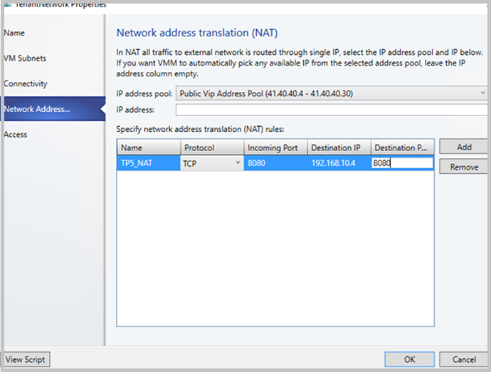

# Set up an SDN software load balancer in the VMM fabric

>Applies To: System Center 2016 - Virtual Machine Manager

This article describes how to deploy a Software Defined Networking (SDN) software load balancer (SLB) in the System Center 2016 - Virtual Machine Manager (VMM) fabric.

The SLB enables even distribution of tenant and tenant customer network traffic among virtual network resources, so that multiple servers can host the same workload to provide high availability and scalability. [Learn more](https://technet.microsoft.com/windows-server-docs/networking/sdn/technologies/network-function-virtualization/software-load-balancing--slb--for-sdn).

You can use VMM to deploy a network controller and a software load balancer. After you set up the SLB, you can leverage the multiplexing and NAT capabilities in your SDN infrastructure.

## Before you start
Ensure the following:

- **Planning**: Read about planning a software defined network, and review the planning topology in [this](https://technet.microsoft.com/windows-server-docs/networking/sdn/plan/plan-a-software-defined-network-infrastructure) document. The diagram shows a sample 4-node setup. The setup is highly available with Three network controller nodes (VM), and Three SLB/MUX nodes. It shows Two tenants with One virtual network broken into Two virtual subnets to simulate a web tier and a database tier. Both the infrastructure and tenant virtual machines can be redistributed across any physical host.
- **Network controller**: You should have an [SDN network controller](sdn-network-controller.md) deployed in the VMM fabric, so that you have the compute and network infrastructure running before you set up the load balancing.
- **SSL certificate**: To import the SLB service template you'll need to prepare an SSL certificate. You made the certificate available during network controller deployment. To use the certificate you prepared in network controller deployment for SLB, right-click the certificate and export it without a password in .CER format. Place it in the library, in the NCCertificate.CR folder you created when you set up the network controller.
- **Service template**: VMM uses a service template to automate SLB deployment. Service templates support multi-node deployment on generation 1 and generation 2 VMs.
- **SLB VMs**: All the SLB virtual machines must be running Windows Server 2016 with the latest patches installed.
- **HNV Network**: Ensure that you created the Provider HNV network as part of NC validation. [Learn more](https://technet.microsoft.com/en-us/system-center-docs/vmm/scenario/sdn-network-controller).

## Deployment steps

1. **Prepare the SSL certificate**: Put the certificate in the VMM library.
2. **Download the service template**: Download the service template that you need to deploy the SLB/MUX.
3. **Create the transit logical networks**: You need to create logical networks:
    - A logical network to mirror the transit (Frontend) physical network.
    - Private virtual IP (VIP) and public VIP networks, to assign VIPs to the SLB service.
4. **Create private and public VIP logical networks**: Private virtual IP (VIP) and public VIP networks, to assign VIPs to the SLB service.
5. **Import the service template**: Import and customize the SLB service template.
6. **Deploy SLB**: Deploy SLB as a VMM service, and configure the service properties.
7. **Validate the deployment**: Configure BGP peering between the SLB/MUX instance and a BGP router, assign a public IP address to a tenant VM or service, and access the VM or service from outside the network.

## Prepare the certificate
Ensure that the SSL certificate that you created during the NC deployment is copied to NCCertificate.CR folder.

## Download the service template

1. Download the SDN folder from the [Microsoft SDN GitHub repository](https://github.com/Microsoft/SDN) and copy the templates from **VMM** >**Templates** > **SLB** to a local path on the VMM server.
2. Extract the contents to a folder on a local computer. You'll import them to the library later.

The download contains Two templates:
- The SLB Production Generation 1 VM.xml template is for deploying the SLB Service on generation 1 virtual machines.
- The SLB Production Generation 2 VM.xml is for deploying the SLB Service on Generation 2 virtual machines.

Both the templates have a default count of three virtual machines which can be changed in the service template designer.

## Create the transit logical network

1. Open the **Create logical network Wizard**, and type a **Name** and optional description.
2. In **Settings**, select **One Connected Network**. Select **Create a VM network with the same name** box to allow virtual machines to access this logical network directly, and **Managed by the network controller**.
3. In **Network Site**, add the network site information for your subnet.
4. Review the **Summary** information and complete the logical network wizard.

### Create an IP address pool for the transit logical network

This is the IP address pool where DIPs are assigned to the SLB/MUX virtual machines and BGP Peer virtual machine (if deployed).  

**Note**:
- Ensure you use the IP address range that corresponds to your transit network IP address space. Don't include the first IP address of your subnet in the IP pool you are about to create. For example, if your available subnet is from .1 to .254, start your range at .2.
- After you create the Transit logical network, ensure you associate this logical network with the Management switch uplink port profile you created during the network controller deployment.

**Create the IP address pool**:

1.  Right-click the logical network > **Create IP Pool**.
2.  Provide a **Name** and optional description for the IP Pool and ensure that the correct logical network is selected.
3.  In **Network Site**, select the subnet that this IP address pool will service. If you have more than one subnet as part of your HNV provider network, you need to create a static IP address pool for each subnet. If you have only one site (for example, like the sample topology) then you can just click **Next**.
4.  In **IP Address range** configure the starting and ending IP address. Don't use the first three IP addresses of your available subnet. For example, if your available subnet is from .1 to .254, start your range at .4 or greater.
5.  Next, configure the default gateway address. Click **Insert** next to the **Default gateways** box, type the address and use the default metric. Optionally configure DNS and WINS.
6.  Review the summary information and click **Finish** to complete the wizard.

    **Note**: Ensure you associate the logical network with the management switch uplink port profile.

## Create private and public VIP logical networks

You need a private VIP address pool to assign a VIP, and a public VIP, to the SLB Manager service. Note that the procedure for creating both is similar but there are some differences.


**Create a private VIP**:

1.  Start the **Create logical network Wizard**. Type a **Name** and optional description for this network.
2. In  **Settings** select **One Connected Network**.  Select **Create a VM network with the same name** box to allow virtual machines to access this logical network directly. Select **Managed by the network controller**.
3. In **Network Site** add the network site information for your private VIP logical network.
4. Review the **Summary** information and complete the wizard.

**Create a public VIP**:

1. Start the **Create logical network Wizard**. Type a **Name** and optional description for this network.
2. In **Settings**, select **Managed by the network controller** and **Public IP Address Network**.
3. In **Network Site** add the network site information for your public VIP logical network.
4. Review the **Summary** information and complete the wizard.


### Create IP address pools for the private and public VIP networks

1.  Right-click the private VIP logical network > **Create IP Pool**.
2.  Provide a **Name** and optional description for the IP Pool and ensure that the correct logical network is selected.
3.  Accept the default network site, and click **Next**.
4.  In **IP Address range** configure the starting and ending IP address.

    **Note**: Don't use the first IP address of your available subnet. For example, if your available subnet is from .1 to .254, start your range at .2 or greater.

5.  In **IP addresses reserved for load balancer VIPs**, type the IP address range in the subnet. It should match the start and end addresses you specified.
6.  You don't need to provide gateway, DNS or WINS information because this pool is used to allocate IP addresses for VIPs through the network controller only. Click **Next** to skip these screens. type the address and use the default metric. Optionally configure DNS and WINS.
7.  Review the summary information and click **Finish** to complete the wizard.
8. Repeat the procedure for the public VIP logical network, this time type the IP address range for the public network.


## Import the service template ##

Import the service template into the VMM library. For this example, we'll import the generation 2 template.

1. Click **Library** > **Import Template**.
2. Browse to your service template folder, select the **SLB Production Generation 2 VM.xml** file.
3. Update the parameters for your environment as you import the service template. Note that the library resources were imported during network controller deployment.

    - **WinServer.vhdx**: Select the virtual hard drive image that you prepared and imported earlier, during the network controller deployment.
    - **NCCertificate.CR**: This library resource contains scripts used to set up the network controller. Map to the NCCertificate.cr library resource in the VMM library.
    - **EdgeDeployment.CR**: Map to the EdgeDeployment.cr library resource in the VMM library.

4. Remember that you should have copied the .CER certificate that you previously created to the **NCCertificate.CR** folder.
5. On the **Summary** page, review the details and click **Import**.

    **Note**: You can customize the service template. [Learn more](sdn-network-controller.md#customize-the-template).

## Deploy the SLB service

Now deploy an SLB/MUX service instance.

1.  Select the **SLB Production Generation 2 VM.xml** service template > **Configure Deployment**. Type a **Name** and optional destination for the service instance. The destination must map to a host group that contains the hosts you've configured.
2.  In the **Network Settings** section, map **TransitNetwork** to your transit VM network and **ManagementNetwork** to your management VM network.

    **Note**: The **Deploy Service** dialog appears after mapping is complete. It is normal for the virtual machine instances to be initially Red. Click **Refresh Preview** to automatically find suitable hosts for the virtual machine.
3. On the left of the **Configure Deployment** window, configure the settings as detailed in the following table:

    **Setting** | **Requirement** | **Description**
    --- |--- |---
    **Transit network** | Required | Your transit VM network.
    **LocalAdmin** | Required | Select a Run As Account in your environment, which will be used as the local Administrator on the virtual machines. The user name should be Administrator.   
    **Management network** | Required | Choose the management VM network that you created for host management.
    **MgmtDomainAccount** | Required | Select a Run As Account with permissions to add the SLB/MUX virtual machines to the Active Directory domain associated with the network controller. This can be the same account you used in MgmtDomainAccount while deploying the network controller.
    **MgmtDomainFQDN** | Required | FQDN for the Active directory domain that the SLB/MUX virtual machines will join.
    **SelfSignedConfiguration** | Required | Specify **True** if the certificate you are using is self-signed.

4. After you configure these settings, click **Deploy Service** to begin the service deployment job. Deployment times will vary depending on your hardware but are typically between 30 and 60 minutes.
5. If you are not using a volume licensed VHDX, or if the VHDX doesn't have the product key from an answer file, then deployment will stop at the **Product Key** page, during SLB/MUX VM provisioning. You need to manually access the VM desktop, and either skip or enter the product key.
6. When the service deployment job is complete, verify that your service appears in **VMs and Services** > **Services** > **VM Network Information for Services**. Right-click the service and verify that the state is **Deployed** in **Properties**.

After deployment, verify that the service appears in **All Hosts** > **Services** > **VM Network Information for Services**. Right-click the SLB MUX service > **Properties**, and verify that the state is **Deployed**. If the SLB/MUX deployment fails, ensure you delete the failed service instance, before you try to deploy the SLB, once again.

If you want to scale-in or scale-out a deployed software load balancer service instance, [read this blog](https://blogs.technet.microsoft.com/scvmm/2011/05/18/scvmm-2012-an-explanation-of-scale-in-and-scale-out-for-a-service/).

## Configure the SLB role and SLB/MUX properties

**Note**: Before you proceed, ensure you created the  HNV PA Logical Network.

Now that the service is deployed, you can configure its properties. you'll need to associate the SLB service instance that you deployed with network controller, and then configuring BGP peering between the SLB/MUX instance and a TOR switch or a BGP router peer.

1. Click **Fabric** > **Network Service**.  Right-click the **network controller** service > **Properties**.
2.  Select the **Services** tab > **Load Balancer Role** > **Associated Service** > **Browse**.
3. Select the SLB/MUX service instance you created earlier and click **OK**. Select a Run As Account.
4.  For the **Management IP address**, use an IP address from the private VIP pool you created earlier.  Optionally specify the IP address ranges to be excluded from the outbound NAT.
5.  Click the SLB/MUX instance listed under **Load Balancer Role** in the wizard. Type the local ASN for your datacenter and details for the devices or BGP peers the SLB/MUX can peer with.
6. The SLB service instance is now associated with the SLBM service, and you should see the SLB/MUX virtual machine instance with all the settings listed under the **Load Balancer role**.


## Validate the deployment

After you deploy the SLB/MUX, you can validate the deployment by configuring BGP peering between the SLB/MUX instance and a BGP router, assigning a public IP address to a tenant virtual machine or Service, and accessing the tenant virtual machine or service from outside the network.

**Use the following procedure to validate**:

1. Enter your external router details in the wizard. For example:

    

2. Click **OK** to complete the SLB/MUX service instance configuration.
3. Check the **Jobs** window to verify that the **Update Fabric Role with required configuration**, and **Associate service instance with fabric role** jobs have completed successfully.
4. To complete the BGP peering operation, you need to configure BGP to peer with your SLB/MUX instance on the router. If you use a hardware router, you need to consult your vendor’s documentation regarding how to setup BGP peering for that device.

    You also need to know the IP address of the SLB/MUX instance that you deployed earlier. To do this, you can either log on to the SLB MUX virtual machine and run **ipconfig /all** from the command prompt, or you can get the IP address from the VMM console.

    **Note**: Enter the transit network IP.    
5. If you create a new VIP pool after peering is complete, you need to advertise all the VIP address pools using the VMM console.

###  Provision VIPs for tenant VMs

You can provision VIPs for tenant virtual machines either individually for each VM, or by using the service templates.

In this procedure we'll provision a VIP for individual VMs. This isn't a typical scenario, but is useful for evaluation purposes. We'll provision a VIP for Two VMs by using the PowerShell, as follows:

1. Deploy the virtual machine instances using a VM template.
2. Create a VIP template in the VMM console.
3. Create a VIP and assign it to the VMs using PowerShell.

    **Note**: Currently, VIP creation through console is not supported.

#### Create a VIP template

1. In VMM console click **Fabric** > **Create VIP Template**. Type a template **Name** and optional description.
2. In **Virtual IP Port**, specify the port to test. In **Backend Port**, specify the port from which you want to map traffic on the backend. Click **Next**.
3. In **Specify a Template Type** click **Specific**. Select **Microsoft** for **Manufacturer**. Select **Microsoft network controller** for **Model**. Click **Next**.
4. In **Specify Protocol Options**, select the protocol you want to create a VIP mapping for. The HTTP and HTTPS options are commonly used, but for a simple example you can select the **Custom** option and type  **TCP**. Click **Next**.

    **Note**: Only TCP or HTTP is supported.
5. You can optionally select **Enable persistence** if you make the load balancer to connect connection from the client in a "sticky" manner. Click **Next**.
6. For the Load Balancing method, select the default method for your organization and click **Next**.
7. In **Health Monitors**, insert the appropriate values.
8. Check the settings, and click **Finish** to create the VIP template.

#### Create the VIP with PowerShell

The following sample PowerShell script creates a VIP for two virtual machines. In the script parameters section, substitute the actual values that match your test environment for the samples used in this script. The script should be run on the VMM server, or on a computer running the VMM Console.

```
param(

[Parameter(Mandatory=$false)]
# Name of the Network Controller Network Service
# This value should be the name you gave the Network Controller service
# when you on-boarded the Network Controller to VMM
$LBServiceName = "NC",

[Parameter(Mandatory=$false)]
# Name of the VM instances to which you want to assign the VIP
$VipMemberVMNames =  @("WGB-001","WGB-002"),

[Parameter(Mandatory=$false)]
# VIP address you want to assign from the VIP pool.
# Pick any VIP that falls within your VIP IP Pool range.
$VipAddress = "20.20.20.253",

[Parameter(Mandatory=$false)]
# Name of the VIP VM Network
$VipNetworkName = "vip",

[Parameter(Mandatory=$false)]
# The name of the VIP template you created via the VMM Console.
$VipTemplateName = "ADVWRKS-VIP",

[Parameter(Mandatory=$false)]
# Arbitrary but good to match the VIP you're using.
$VipName = "scvmm_20_20_20_253_5001"

)

Import-Module virtualmachinemanager

$lb = Get-scLoadBalancer | where { $_.Service.Name -like $LBServiceName};
$vipNetwork = get-scvmnetwork -Name $VipNetworkName;

$vipMemberNics = @();
foreach ($vmName in $VipMemberVMNames)
{
$vm = get-scvirtualmachine -Name $vmName;
#    if ($vm.VirtualNetworkAdapters[0].VMNetwork.ID -ne $vipNetwork.ID)
#    {
#        $vm.VirtualNetworkAdapters[0] | set-scvirtualnetworkadapter -VMNetwork $vipNetwork;
#    }

$vipMemberNics += $vm.VirtualNetworkAdapters[0];
}

$existingVip = get-scloadbalancervip -Name $VipName
if ($existingVip -ne $null)
{
#    foreach ($mem in $existingVip.VipMembers)
#    {
#        $mem | remove-scloadbalancervipmember;
#    }

$existingVip | remove-scloadbalancervip;
}

$vipt = get-scloadbalancerviptemplate -Name $VipTemplateName;

$vip = New-SCLoadBalancerVIP -Name $VipName -LoadBalancer $lb
-IPAddress $VipAddress -LoadBalancerVIPTemplate $vipt
-FrontEndVMNetwork $vipNetwork
-BackEndVirtualNetworkAdapters $vipMemberNics;
Write-Output "Created VIP " $vip;

$vip = get-scloadbalancervip -Name $VipName;
Write-Output "VIP with members " $vip;
```

#### Configure inbound and outbound NAT rules

To complete the BGP peering process, you need to configure a BGP to peer with your SLB/MUX instance on the router.

- If you use a hardware router, you need to consult the vendor documentation for instructions to setup BGP peering for that device.
- Check the IP address of the SLB/MUX instance that you deployed earlier. To do this, you can log on to the SLB/MUX virtual machine and run **ipconfig**.

**Use the following procedure to configure inbound and outbound NAT rules**:


1. Click **VMs and Services** > **VM Networks** and double-click the network you want to configure with NAT rules.
2. In the wizard select **Connectivity**, select **Connect directly to an additional network** and **Network Address Translation (NAT)**.
3. In **Gateway Device**, select your network controller service name.
4. Select **Network Address Translation** and choose the public VIP pool. Optionally, provide a VIP address. A VIP address will be automatically assigned if you do not choose one.
5. In **NAT rules** click **Add** and type the rule name, protocol, incoming port value, and the destination address and port for the rule.

    

You should be able to see the recently created NAT rules in the VMM wizard.


## Next steps

[Create a RAS gateway](sdn-gateway.md)
