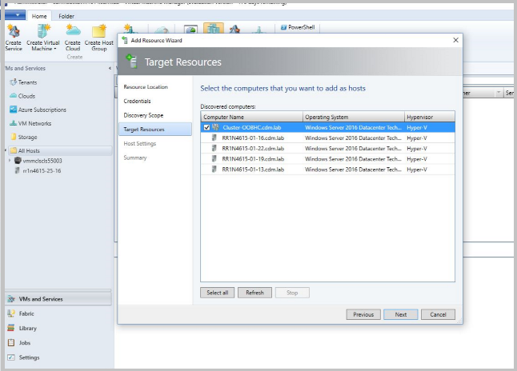
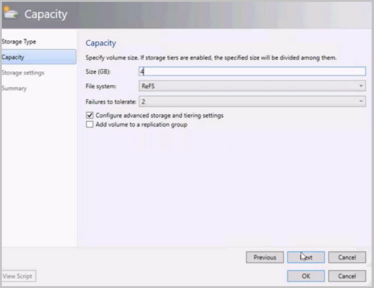
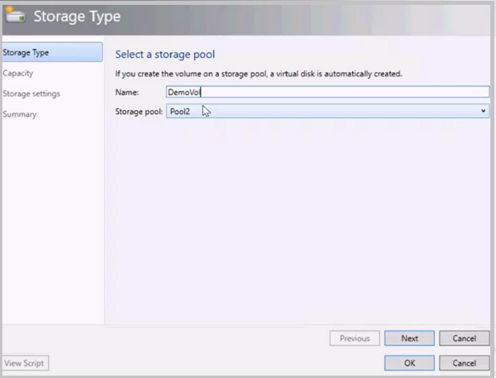
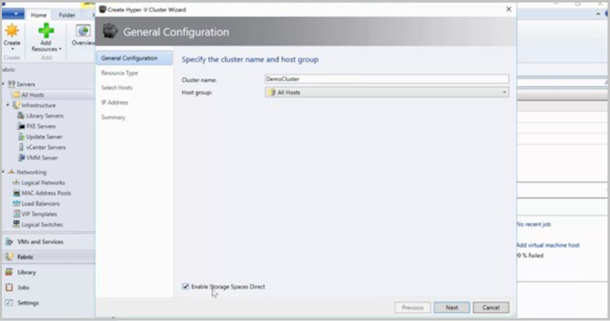

# Deploy cluster with Storage Spaces Direct in VMM

>Applies To: System Center 2016 - Virtual Machine Manager

This article describes how to set up Storage Spaces Direct (S2D) in the System Center 2016 - Virtual Manager (VMM) fabric. 

## Before you start

- Make sure you're running VMM 2016.
- Hyper-V hosts in a cluster should be running Windows Server 2016 with the Hyper-V Role installed and configured to host VMs.
- You should set up networks on hosts that are nodes in the cluster, before you enable S2D.
- For hyper-converged deployments, you can enable S2D when you add an existing Hyper-V cluster to the VMM fabric, or when you create a cluster from standalone Hyper-V hosts in the VMM fabric. You can't currently enable S2D on a Hyper-V cluster deployed from bare metal computers with the Nano operating system.

## Hyper-converged deployment

In a hyper-converged topology storage and compute are on the same cluster. Here's what you need to do:

1. Create a Hyper-V cluster in the VMM fabric, and enable S2D on the Hyper-V cluster. Alternatively if you already have a S2D cluster you configured outside VMM, you add it to the VMM fabric.
2. Set up networking on the cluster. [Learn more](../manage/manage-network-overview.md).
3. Modify the storage pool, and create cluster-shared volumes (CSVs)
4. Deploy VMs on the cluster.

### Set up a Hyper-V cluster and enable S2D

1. Click **Fabric Resources** > **Create** > **Hyper-V Cluster**.
2.  In **General Configuration**, specify a cluster name, select a host group, and select  **Enable Storage Spaces Direct**.
3. The rest of the steps are identical to the instructions for [creating a Hyper-V host cluster with an existing server](manage-compute-add-existing-servers.md). Note that you have to validate the cluster when S2D is enabled.

When you create the cluster, VMM does the following:

1.  On each host:
    - Installs the File Server role.
    - Installs the Failover Clustering feature.
    - Enables Storage Replica and data deduplication.
2.  Validates the cluster configuration.
3.  Creates the cluster.
4.  Enables S2D, and creates an storage pool with the same name as the one provided in the wizard.

### Add an existing Hyper-V cluster with S2D enabled

If you already have a hyper-converged cluster you can add it to the VMM fabric.

1.  Click **VMs and Services**, right-click **All Hosts**, and select **Add Hyper-V Hosts and Clusters**.
2. If the cluster isn't in the VMM domain, select **The Windows server computer is in an untrusted Active Directory domain**.
3. Specify the cluster, and provide a Run As account. This adds the host cluster into VMM.

     

### Manage pool and create CSVs

1. Click **Fabric** > **Storage** > **Arrays**, right-click the Storage Spaces Direct cluster > **Manage Pool**. Change the name of the pool that was created by default if you need to.
2. To create a volume, right-click the cluster > **Properties** > **Shared Volumes**.

    

3. In the Create Volume Wizard > **Capacity**, you can specify the volume size, file system, resiliency, and storage tiering options. A virtual disk will be created automatically when you create the volume.

    

If you use Powershell, the pool and the storage tier is automatically created with the **Enable-ClusterS2D autoconfig=true** option.

### Deploy VMs

VMs can be directly deployed on the hyper-converged cluster. Their virtual hard disks are placed on the volumes you create. You [create and deploy these VMs](../manage/manage-vm-overview.md) just as you would any other VM.

# Disaggregated deployment

In a disaggregated deployment compute and storage run in separate environments. The storage component is built using S2D and scale-out file server (SOFS) to provide a independently scalable storage repository for VMs and
apps. Here's what you need to do:

### Set up an SOFS cluster and enable S2D

1. Click **Fabric Resources** > **Create** > **File Server Cluster**.
2.  In **General Configuration**, specify a cluster name, select a host group, and select  **Storage attached directly to each cluster node (Storage Spaces Direct)**.

    

3. In **Resource Type**, specify the RunAs account with local admin permissions on the servers you want to add to the cluster, and specify whether to add existing Windows servers or bare-metal machines.
4. In **Cluster Nodes**, define a list of computers to add to the cluster.
5. On the **Summary** page, confirm the settings and then click Finish.

If you want to add additional nodes to the SOFS cluster, VMM automatically discovers any disks associated with the node. When you modify a storage pool and select the new disks to add, VMM makes those disks available to the hosts and VMs that use the share supported by that pool. [Learn more](manage-sofs-overview.md) about adding nodes to an SOFS.

### Add an existing SOFS cluster with S2D enabled

1. Click **Fabric** >**Add Resources**, **Storage Devices**
2. In the Add Resource Wizard, select **Windows-based File Server**
3. In **Discovery Scope**, specify the cluster IP address or FQDN, provide a Run As account with cluster access, and if required check that the cluster is in another domain.
4. In **Storage Device**, select the SOFS to add to the VMM fabric. You should only assign a classification to the pool after you add the provider.
5. In **Summary**, check settings and complete the wizard.

### Manage pool and create CSVs

1. After the SOFS cluster is in the VMM fabric, right-click **Storage** > **File Servers** > **Manage Pools**. Click **New** to create a pool.
2. In the New Storage Pool Wizard > **General**, specify a name and classification for the pool.
3. In **Physical Disks**, select the virtual disks to create the pool. Rescan and check that the pool appears in **Storage** > **Arrays**.
4. Now you can create file shares from the pool.  Click **Create File Share**.
5. In the Create File Share Wizard > **General**, specify a name for the share, and select the pool from which storage should be taken.
6. In **Capacity** specify the share size and settings.
7. In **Summary**, verify the settings. After the share is created, a new CSV is added under the storage pool.

### Allocate the storage in Hyper-V

1. In the Hyper-V properties > **Storage**, specify the file share path.
2. Now you can create VMs in this path.
