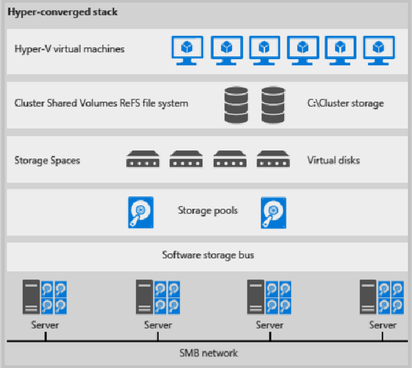

# Scenario: Storage Spaces Direct in VMM

>Applies To: System Center 2016 - Virtual Machine Manager

This article provides an overview of Storage Spaces Direct (S2D) deployment in the System Center 2016 Virtual Machine Manager (VMM) fabric.

Windows Server 2016 introduces Storage Spaces Direct (S2D), which provides the ability to virtualize storage by grouping physical storage drives into virtual storage pools. Advantages include:

- Manage multiple storage drives as a single virtual entity.
- Utilize inexpensive storage, with or without external storage
- Gather different types of storage into a single pool.
- Easily provision storage, and grow storage pools on demand by adding new drives to them.

S2D pools storage that's attached to specific nodes in a Windows Server cluster. The storage can be internal to the node, or disk devices
directly attached to a single node. Supported storage drives include NVMe, SSD connected via SATA or SAS, and HDD. [Learn more](https://technet.microsoft.com/windows-server-docs/storage/storage-spaces/choosing-drives-and-resiliency-types)

When you enable S2D on a cluster, S2D automatically discovers eligible storage drives, and adds them into a storage pool. S2D also creates a built-in server-side cache to maximize performance. S2D automatically uses all drives of the "fastest" type for caching. The remaining drives are used for capacity. [Learn more](https://technet.microsoft.com/en-us/windows-server-docs/storage/storage-spaces/understand-the-cache#cache-drives-are-selected-automatically) about the cache.

You create volumes from the pool. Creating a volume creates the virtual disk (storage space), partitions and formats it, adds it to the cluster, and converts it to a clustered shared volumes (CSV). You configure different levels of fault tolerance for a volume, to specify how the virtual disks is spread across physical disks in the pool. You can configure a volume with no resiliency, or with mirror or parity resilience. SMB 3.0 is used to spread the virtual disks across the pool. [Learn more](https://blogs.technet.microsoft.com/filecab/2016/09/06/volume-resiliency-and-efficiency-in-storage-spaces-direct/).

## Deployment options

The storage pool can be provisioned in a couple of ways:

- **Hyper-converged deployment**: No separation between compute and storage. In this scenario Hyper-V is enabled on the S2D nodes, and compute and storage is run across the cluster nodes.
- **Disaggregated (converged) deployment**: The environment is separated into compute and storage. One or more Hyper-V server provide compute resources. S2D and scale-out file storage provide storage resources.
In VMM you can deploy Storage Spaces direct in both a hyper-converged or disaggregated topology.

## Hyper-converged deployment

- Hyper-V (compute) and Storage Spaces Direct (storage) run on the same cluster.
- VM files are stored on local CSVs.
- File shares and SMB aren't used.
- Simultaneous scaling of Hyper-V compute clusters and the storage it is using.
- After S2D CSV volumes are available, you provision them as you would any  other Hyper-V deployment.
- Figure 1 illustrates the hyper-converged deployment stack.

**Figure 1: Hyper-converged deployment**

## Disaggregated deployment

- Hyper-V compute cluster is different to the storage cluster.
- File shares are created on the S2D CSVs. Hyper-V VMs are configured to store their files on the SOFS, and accessed using SMB 3.0. - You scale the Hyper-V and SOFS clusters separately for finely tuned management. For example, compute nodes might be near full capacity for the number of VMs, but storage nodes might have excess disk and IOPS capacity, so you add only additional compute nodes.   

## Next steps

- [Deploy Storage Spaces Direct](storage-spaces-deploy.md) in the VMM fabric
