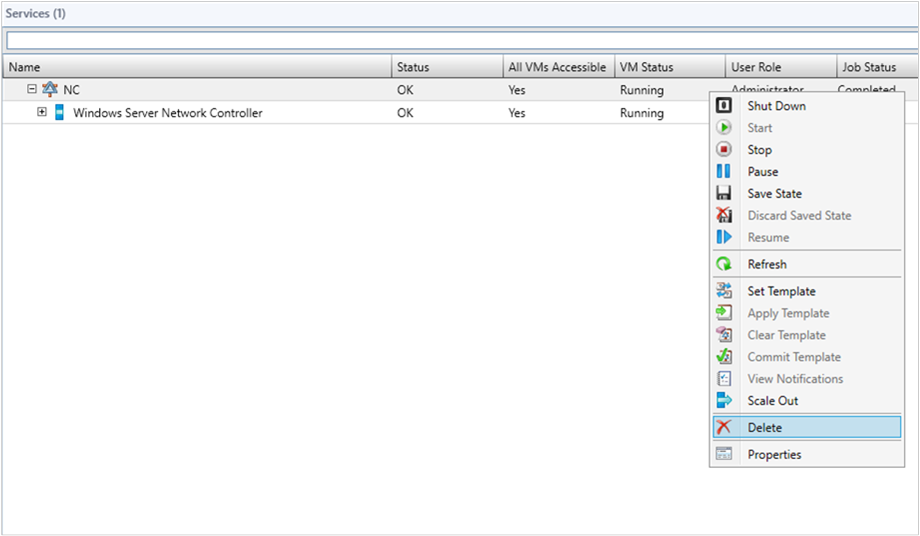

# Back up and restore the SDN infrastructure


This article describes the backup and recovery process of a software defined network (SDN) infrastructure in the System Center Virtual Machine Manager (VMM) fabric, and provides any applicable recommendations for the process completion.

To back up and restore an SDN, you must back up and restore the network controller (NC) that is deployed in the SDN. Use the following procedures in the sequence explained.

## Back up the network controller

Backup the network controller database by using the network controller Rest API. [Learn more](https://docs.microsoft.com/en-us/windows-server/networking/sdn/manage/update-backup-restore#a-namebkmkbackupabackup-the-sdn-infrastructure).

## Bring up the new network controller

Use the following procedures to bring up a new network controller:

1. In the VMM console, **VMs and Services** > **Services**, select the network controller service instance and click **Delete**.

    > [!NOTE]

    > Remove the network controller service instance only. Do not remove the network controller from **Fabric** > **Network Services.**

    

2. Deploy a new network controller service instance form the VMM by using the same service deployment settings that were  used for the original service instance deployment. [Learn more](https://docs.microsoft.com/en-us/system-center/vmm/sdn-controller).

3. Verify that the deployment job is successful.  


## Restore the network controller from a backup

Restore the network controller from a network controller backup by using the network controller Rest API. [Learn more](https://docs.microsoft.com/en-us/windows-server/networking/sdn/manage/update-backup-restore#a-namebkmkrestorearestore-the-sdn-infrastructure-from-a-backup).

## Refresh the network controller and synchronize VMM and NC
Depending on the SDN state captured in the network controller backup and the current VMM state, some of the resources in VMM and network controller might be out of sync.

Use the following refresh procedures to find any such differences between VMM and NC, and accordingly resolve them.


> [!NOTE]
> - Refresh cmdlets for refreshing network controller objects are available from VMM 2016 UR3.
> - If the network controller contains any objects which are not present in the VMM DB, then the  VMM will not refresh (even if those objects are created by using VMM earlier). Delete those objects from NC and recreate the objects from VMM to manage these objects from VMM again.

### Refresh port ACLs
1. Get all the NC managed port ACLs from the VMM server by using the following cmdlet:

    ```powershell

    $portACLs = Get-SCPortACL | Where-Object {$_.ManagedByNC -eq $True}

    ```
2. Run the **Read-SCPortACL** cmdlet on all the NC managed port ACLs to refresh.

    ```powershell
    foreach($portACL in $portACLs)
    {
       Read-SCPortACL -PortACL $portACL
    }

    ```

3. Verify the VMM jobs' log for the result status and follow the recommendations from the log in case of any failures.

### Refresh logical networks
1.	Get all the NC managed logical networks from the VMM
server by using the following cmdlet:

    ```powershell
    $logicalNetworks = Get-SCLogicalNetwork | Where-Object {$_.IsManagedByNetworkController -eq $True}
    ```
2.	Run the **Read-SCLogicalNetwork** cmdlet on all the NC managed logical networks to refresh.

    ```powershell
    foreach($logicalNetwork in $logicalNetworks)
    {
         Read-SCLogicalNetwork -LogicalNetwork $logicalNetwork
    }

    ```

3. Verify the VMM jobs' log for the result status and follow the recommendations from the log in case of any failures.

### Refresh gateways and load balancer muxes
1.	Get all the gateways and load balancer muxes by using the following cmdlet:

    ```powershell
    $networkService =  Get-SCNetworkService  | Where-Object {$_.Model -eq 'Microsoft Network Controller'}
    $fabricRoles = Get-SCFabricRole -NetworkService $networkService
    $fabricRoleResources = @()
    foreach($fabricRole in $fabricRoles)
    {
	     $fabricRoleResources += $fabricRole.ServiceVMs
    }
    $fabricRoleResources
    ```

2.	Run the **Read-SCFabricRoleResource** cmdlet to refresh.

    ```powershell
    foreach($fabricRoleResource in $fabricRoleResources)
    {
	     Read-SCFabricRoleResource -FabricResource $fabricRoleResource
    }
    ```

3.	Verify the VMM jobs' log for the result status and follow the recommendations from the log in case of any failures.

### Refresh NAT connections and NAT rules
1.	Get all the NAT connections by using the following cmdlet:

    ```powershell

    $vmNetworks = Get-SCVMNetwork | Where-Object {$_.NetworkManager.Model -eq 'Microsoft Network Controller' -and $_.IsolationType -eq 'WindowsNetworkVirtualization'}

    $natConnections = @()
    foreach($vmNetwork in $vmNetworks)
    {
	     $natConnections += $vmNetwork.NATConnections
    }
    $natConnections

    ```
2.	Run the **Read-SCNATConnection** cmdlet to refresh NAT connections and NAT rules.

    ```powershell
    foreach($natConnection in $natConnections)
    {
	     Read-SCNATConnection -NATConnection $natConnection
    }
    ```

3.	Verify the VMM jobs' log for the result status and follow the recommendations from the log in case of any failures.

### Refresh all load balancer VIPs
1.	Get all the load balancer VIPs configured on NC by using the following cmdlet:

    ```powershell
    $loadBalancerVIPs = Get-SCLoadBalancerVIP |  Where-Object {$_.LoadBalancer.Model -eq 'Microsoft Network Controller'}
    ```
2.	Run the **Read-SCLoadBalancerVIP** cmdlet to refresh all the load balancer VIPs.

    ```powershell
    foreach($loadBalancerVIP in $loadBalancerVIPs)
    {
        Read-SCLoadBalancerVIP -LoadBalancerVIP $loadBalancerVIP
    }

    ```

3.	Verify the VMM jobs' log for the result status and follow the recommendations from the log in case of any failures.

### Refresh VM Networks

1.	Get all the NC managed HNV VM networks from the VMM server by using the following cmdlet:

    ```powershell
    $VMNetworks = Get-SCVMNetwork | Where-Object {$_.NetworkManager.Model -eq 'Microsoft Network Controller' -and $_.IsolationType -eq 'WindowsNetworkVirtualization'}
    ```
2.	Run the **Read-SCVMNetwork** cmdlet on all the VM networks to refresh.

    ```powershell
    foreach($VMNetwork in $VMNetworks)

    {
            Read-SCVMNetwork -VMNetwork $VMNetwork
    }

    ```

3. Verify the VMM jobs' log for the result status and follow the recommendations from the log in case of any failures.

### Refresh gateway pools

1.	Get the gateway fabric role from the VMM server by using the following cmdlet:

    ```powershell
    $networkService =  Get-SCNetworkService  | Where-Object {$_.Model -eq 'Microsoft Network Controller'}
$gatewayFabricRole = Get-SCFabricRole -NetworkService $networkService | Where-Object {$_. RoleType -eq ‘Gateway ’}

    ```

2. Run the **Read-SCFabricRole** cmdlet to refresh the fabric role.

    ```powershell
foreach($fabricRole in $gatewayFabricRole )
{
        Read-SCFabricRole -FabricRole $fabricRole
}
    ```
3. Verify the VMM jobs' log for the result status and follow the recommendations from the log in case of any failures.

### Refresh VM network gateways

1.	Get all the VM network gateways that are configured for the  VM networks by using the following cmdlet:

    ```powershell
    $vmNetworks = Get-SCVMNetwork | Where-Object {$_.NetworkManager.Model -eq 'Microsoft Network  Controller' -and $_.IsolationType -eq 'WindowsNetworkVirtualization'  -and $_.VMNetworkGateways.Count -gt 0}}
    $VMNetworkGateways = @()
    foreach($vmNetwork in $vmNetworks)
	{
	     $VMNetworkGateways += $vmNetwork.$VMNetworkGateways
	}

    ```

2. Run the **Read-SCVMNetworkGateway** cmdlet to refresh the gateways.

 ```powershell

 foreach($VMNetworkGateway in $VMNetworkGateways)
 {
        Read-SCVMNetworkGateway -VMNetworkGateway $VMNetworkGateway
 }

 ```

3.	Verify the VMM jobs' log for the result status and follow the recommendations from the log in case of any failures.
