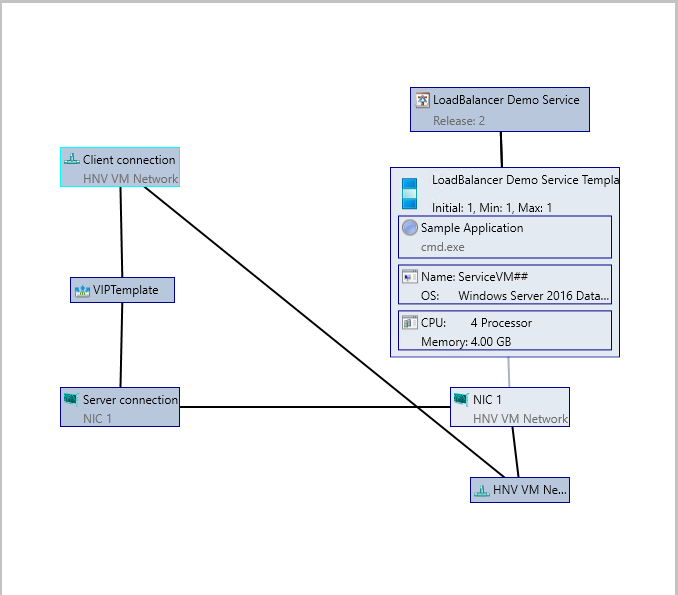

#	Configure SLB VIPs through VMM service templates

::: moniker range=">sc-vmm-2016"
Software Defined Networking (SDN) can use Software Load Balancing (SLB) to evenly distribute network traffic among workloads managed by service provider and tenants.
::: moniker-end

::: moniker range=">=sc-vmm-2019"

System Center Virtual Machine Manager (VMM) supports configuration of SLB VIPs while deploying multi-tier application by using service templates and also supports both public and internal load balancing.

::: moniker-end

## Before you begin

Ensure the following prerequisites are met:

-  [Deployed SDN Network Controller](sdn-controller.md).
-  [Deployed SDN Software load balancer](sdn-slb.md).

## Procedure to create SLB VIPs

**Use the following steps**:

1. Specify the affinity to logical networks.
   - In the VMM console, select **Fabric** > **Network Service** > **Network Controller** > **Properties** > **Logical Network Affinity** page.
   - Specify the Front-end and Back-end networks available for load balancing and select **OK**.

     

2. Create a VIP template.
   - In the VMM console, select **Fabric** > **Create VIP Template**.
   -  In the **Load Balancer VIP Template Wizard** > **Name**, specify the template name and description.  
   - In the **Virtual IP port**, specify the port that will be used for the type of network traffic you want to balance.
   - In the **Backend port**, specify the port on which the backend server is listening for requests.

     

   - In **Type**, under **Specify a template type**, select **Specific**. Select **Microsoft** from the Manufacturer dropdown and **Microsoft Network Controller** from the Model dropdown.
   - Select **Next**.

     

   - In **Protocol**, specify protocol options. Select **OK**.

     

   - In **Load Balancing method**, select the method and select **OK**.

     

   - In **Health Monitors**, you can optionally specify that a verification must run against the load balancer at regular intervals. To add a health monitor, specify the protocol and the request. For example, entering the command GET makes an HTTP GET request for the home page of the load balancer and checks for a header response. You can also modify the response type, monitoring interval, timeout, and retries.

   > [!NOTE]
   > The timeout must be less than the interval.

     

   - In **Summary**, confirm the settings and select **Finish** to create the VIP template.

3. Configure SLB VIP while deploying Service
   - If the service template isn't open, select **Library** > **Templates** > **Service Templates** and open it.
   - Select **Actions** > **Open Designer**.
   - In the **Service Template Designer**, select the **Service Template Components group** > **Add Load Balancer**.
   - Select the load balancer object. You'll identify it with the VIP template name.
   - Select **Tool** > **Connector**. Select the Server connection associated with the template and then select a NIC object to connect the load balancer to the adapter. In the **NIC properties**, check the address types and ensure that the MAC address is static.

   > [!NOTE]
   > The server connection must be connected to the back-end network interface of the service. The back-end network interface can be connected to either a One Connected VM Network or a network virtualized VM Network.

   - With the Connector enabled, select the client connection associated with the load balancer and then select a logical network object.

     > [!NOTE]
     > Client connection must be connected to a front-end network of the load balancer. This can be a Public VM network or a network virtualized VM network. A network virtualized VM Network is used for internal load balancing scenarios.

   - Save the service template in **Service Template** > **Save and Validate**.

**Example 1**: Configuring Service with *Public* VM Network as front-end. Here the *Backend* network can be One connected or network virtualized VM network.

**Example 2**: Configuring Service with front-end and back-end connected to network virtualized VM Network *HNV VM Network*. This scenario is used for internal load balancing.

## Set up the VIP for user access

When the service is deployed, VMM automatically selects a VIP from the reserved range in the static IP address pool and assigns it to the load-balanced service tier. To enable users to connect to the service, after the service is deployed, you need to determine the VIP and configure a DNS entry for it.

1.	After the service is deployed, select **Fabric** > **Networking** > **Load Balancers**.
2.	Select **Show** > **Service** > **Load Balancer Information for Services** and expand the service to see which VIP is assigned.
3.	If users use the DNS name to access the service, request the DNS administrator to manually create a DNS entry for the VIP. The entry must be the name that users will specify to connect to the service. For example, servicename.contosol.com.
