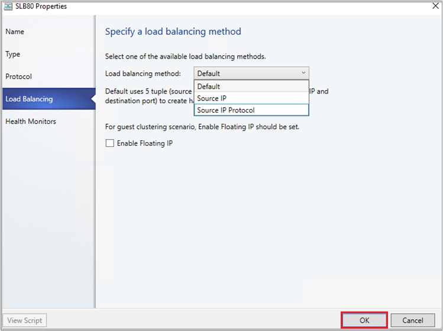

#	Configure SLB VIPs through VMM service templates (Technical Preview)

Software Defined Networking (SDN) in Windows 2016 can use Software Load Balancing (SLB) to evenly distribute network traffic among workloads managed by service provider and tenants. VMM 2016 only supports deploying SLB Virtual IPs (VIPs) using power shell.

With System Center VMM preview 1711, VMM supports configuration of SLB VIPs while deploying multi-tier application by using service templates and also supports both public and internal load balancing.

## Before you begin

Ensure the following prerequisites are met:

-  [Deployed SDN Network Controller](sdn-controller.md).
-  [Deployed SDN Software load balancer](sdn-slb.md).

## Procedure to create SLB VIPs

**Use the following steps**:

1. Specify the affinity to logical networks.
  - in VMM console click **Fabric** > **Network Service** > **Network Controller** > **Properties** > **Logical Network Affinity** page.
  - Specify the Front-end and Back-end networks available for load balancing and click **OK**.

    

2. Create a VIP template.
   - In the VMM console click **Fabric** > **Create VIP Template**.
   -  In the **Load Balancer VIP Template Wizard** > **Name**, specify the template name and description.  
    - In **Virtual IP port**, specify the port that will be used for the type of network traffic you want to balance.
    - In **Backend port**, specify the port on which the backend server is listening for requests.

        

   - In **Type** , specify a template type, click **Specific**. Select **Microsoft** for Manufacturer. Select **Microsoft network controller** for Model. Click **Next**.

        

 - In **Protocol**, specify protocol options. Click **Next**.

    

  - In **Load Balancing method**, select the method  and click **Next**.

    

   - In **Health Monitors**, you can optionally specify that a verification should run against the load balancer at regular intervals. To add a health monitor, specify the protocol and the request. For example, entering the command GET makes an HTTP GET request for the home page of the load balancer and checks for a header response. You can also modify the response type, and monitoring interval, timeout, and retries. Note that the timeout should be less than the interval.

    

       - In **Summary** , confirm the Settings and click **Finish** to create the VIP template.

3. Configure SLB VIP while deploying Service
  - If the service template isn't open, click **Library** > **Templates** > **Service Templates** and open it.
  -  Click **Actions** > **Open Designer**.
  - In the **Service Template Designer**, click the **Service Template Components group** > **Add Load Balancer**.
  - Click the load balancer object. You'll identify it with the VIP template name.
  -  Click **Tool** > **Connector**. Click the Server connection associated with template and then click a NIC object to connect the load balancer to the adapter. In the **NIC properties**, check the address types and that the MAC address is static.

    > [!NOTE]

    > Server connection must be connected to the Back-End network interface of the service. The back-end network interface can be connected to either a One Connected VM Network or a network virtualized VM Network.

 - With the Connector enabled,  click the client connection associated with the load balancer and then click a logical network object.

    > [!NOTE]

    > Client connection must be connected to a Front-End network of the load balancer. This can be a Public VM network or a network virtualized VM network. A network virtualized VM Network is used for internal load balancing scenarios.

  - Save the service template in **Service Template** > **Save and Validate**.

**Example 1**: Configuring Service with ‘Public’ VM Network as front end. Here the ‘Backend’ network can be One connected or network virtualized VM network.

**Example 2**: Configuring Service with Front-end and Back-end connected to network virtualized VM Network ‘HNV VM Network’. This scenario is used for Internal load balancing.

## Set up the VIP for user access

When the service is deployed, VMM automatically selects a VIP from the reserved range in the static IP address pool, and assigns it to the load-balanced service tier. To enable users to connect to the service, after the service is deployed you need to determine the VIP and configure a DNS entry for it.

1.	After the service is deployed click **Fabric** > **Networking** > **Load Balancers**.
2.	Click **Show** > **Service** > **Load Balancer Information for Services** and expand the service to see which VIP is assigned.
3.	If users use the DNS name to access the service, request that the DNS administrator manually create a DNS entry for the VIP. The entry should be the name that users will specify to connect to the service.  For example, servicename.contosol.com.
