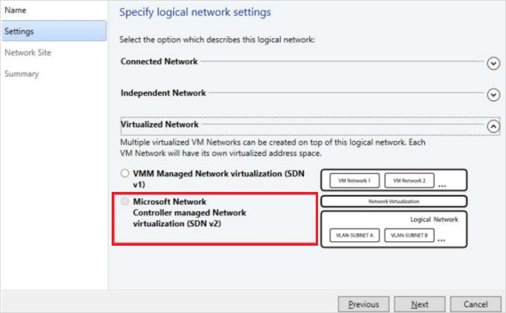
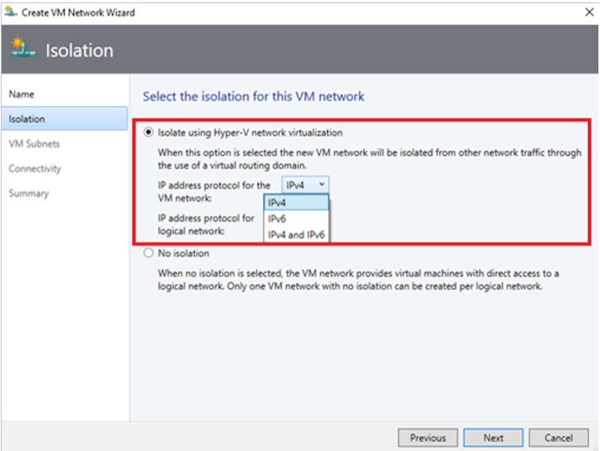
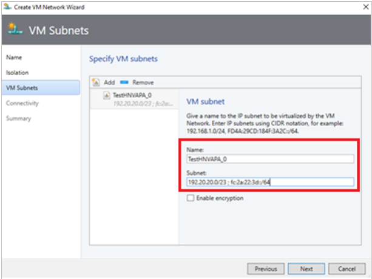
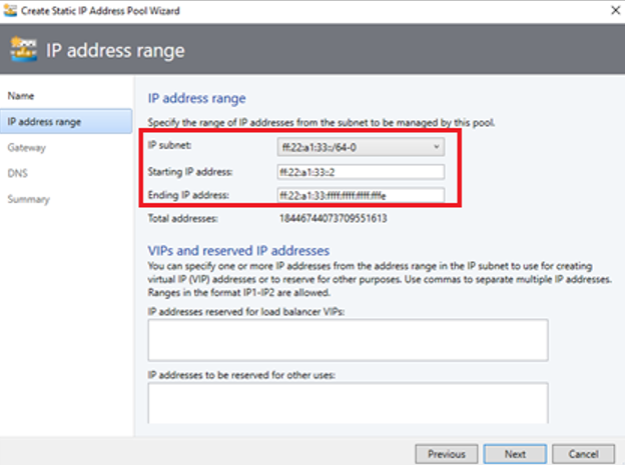

# Set up an SDN network controller in the VMM fabric

This article describes how to set up a Software Defined Networking (SDN) network controller in the System Center Virtual Machine Manager (VMM) fabric.

The SDN network controller is a scalable and highly available server role that enables you to automate network infrastructure configuration instead of performing manual network device configuration. [Learn more](/windows-server/networking/sdn/technologies/network-controller/network-controller).

::: moniker range=">=sc-vmm-2022"

VMM 2025 and 2022 provide dual stack support for SDN network controller.

::: moniker-end

For a great introduction, [watch a video](https://channel9.msdn.com/Blogs/hybrid-it-management/Demo-Deploy-Network-Controller) (~ five minutes) that provides an overview of network controller deployment.

::: moniker range="sc-vmm-2019"

>[!NOTE]
> - From VMM 2019 UR1, **One Connected** network type is changed as **Connected Network**.
> - VMM 2019 UR2 and later supports IPv6.
> - VMM 2019 UR3 and later supports [Azure Stack Hyper Converged Infrastructure (HCI, version 20H2)](deploy-manage-azure-stack-hci.md).

::: moniker-end

::: moniker range=">=sc-vmm-2022"

>[!NOTE]
> - VMM 2025 and 2022 support dual stack (Ipv4 + Ipv6) for SDN components.
> - See [System Requirements](system-requirements.md#servers-in-the-vmm-fabric) for the full list of supported server Operating System.

::: moniker-end

## Prerequisites
• Plan for a Software Defined Network (SDN). [Learn more](/windows-server/networking/sdn/plan/plan-a-software-defined-network-infrastructure).

• Plan for an SDN Network Controller Installation and deployment. [Learn more](/windows-server/networking/sdn/plan/installation-and-preparation-requirements-for-deploying-network-controller).

## Before you start

To set up SDN in the VMM fabric, you need the following:

- **A service template**: VMM uses a service template to automate network controller deployment. Service templates for the network controller support multi-node deployment on Generation 1 and Generation 2 VMs.
- **A virtual hard disk**: The service template needs a prepared virtual hard disk that's imported into the VMM library. This virtual hard disk is used for network controller VMs.
    - The virtual hard disk must be running the applicable Windows Server version with the latest patches installed.
    - It can be in VHD or VHDX format.
- **A management logical network**: That models your physical management network’s connectivity for the VMM hosts, network controller hosts, and tenant VM hosts.
- **A logical switch**: To provide the management logical network with connectivity to the network controller VMs.
- **An SSL certificate**: To authenticate communications between the VMM server and the network controller.
- **An HNV provider logical network and tenant VM networks**: To validate the network controller deployment.
- **Other prerequisites**: [Verify](/windows-server/networking/sdn/plan/installation-and-preparation-requirements-for-deploying-network-controller) other requirements.

## Deployment steps

Here's what you need to do to set up an SDN network controller:

1. **Configure hosts and physical network infrastructure**: You need access to your physical network devices to configure VLANs, routing, and others. You also need Hyper-V hosts to host the SDN infrastructure and tenant VMs. [Learn more](/windows-server/networking/sdn/plan/plan-a-software-defined-network-infrastructure).
2. **Prepare a virtual hard disk**: You can prepare a virtual hard disk for the network controller service template in VHD or VHDX format, as appropriate, for the service template generation you choose.
3. **Download the service templates**: Download the network controller service templates and import them to the VMM library.
4. **Set up Active Directory security groups**: You'll need an Active Directory security group for network controller management, and another security group for network controller clients. Each group will need at least one user account in it.
5. **Set up a VMM library share**. You can have an optional library file share for keeping diagnostic logs. This library share will be accessed by the network controller to store diagnostics information throughout its lifetime.
6. **Set up a VMM host group**: Set up a dedicated host group for all the SDN Hyper-V hosts.
     >[!NOTE]
     >Hosts must be running applicable Windows Server with latest patches installed and have the Hyper-V role enabled.

7. **Create the management logical network**: Create a logical network to mirror management network connectivity for the VMM host, network controller hosts, and tenant VM hosts. If you want to allocate static IP addresses from a pool, create a pool on this logical network.
8. **Create and deploy a management logical switch**: You create the logical switch and deploy it on network controller hosts to provide connectivity to the management network for network controller VMs.
9. **Set up a certificate**: You need an SSL certificate for secure/HTTPS communication with the network controller.
10. **Import the template**: Import and customize the network controller service template.
11. **Deploy the service**: Deploy the network controller service using the service template. Then add it as a VMM service.

## Prepare a virtual hard disk
1. Prepare the VHD or VHDX based on the type of template you would like to use.
2. After you prepare the hard disk, install the latest applicable Windows Server updates, and any language packs you need if you've a non-English environment.
3.   Import the VHD/VHDX files to the VMM library. [Learn more](library-files.md).

## Download the network controller service template

1. Download the SDN folder from the [Microsoft SDN GitHub repository](https://github.com/Microsoft/SDN) and copy the templates from **VMM** >**Templates** > **NC** to a local path on the VMM server.
2. Extract the contents to a folder on a local computer.
3. Refresh the library, you'll import the service templates, later.

   > [!NOTE]
   > The custom resource files are used when setting up the network controller and other SDN components (software load balancer, RAS gateway).  

    The NC folder contains four service templates and five custom resource folders. These are summarized in the following table:

### Templates and resource files

**Name** | **Type** | **Details**
--- | --- |---
**Network Controller Production Generation 1 VM.xml** | Template | Three-node network controller for Generation 1 VMs
**Network Controller Production Generation 2 VM.xml** | Template | Three-node network controller for Generation 2 VMs
**Network Controller Standalone Generation 1 VM.xml** | Template | Single-node network controller for Generation 1 VMs
**Network Controller Standalone Generation 2 VM.xml** | Template | Single-node network controller for Generation 2 VMs
**NcSetup.cr** | Custom resource file | A library resource containing scripts used to set up the network.
**ServerCertificate.cr** | Custom resource file | Library resource containing the private key for the network controller in .pfx format.
**NcCertificate.cr** | Custom resource file | Library resource containing the trusted root certificate (.CER) for the network controller. This is used for secure communications between the network controller and other subservices (For example, SLB MUXes).
**TrustedRootCertificate.cr** | Custom resource file | Library resource containing the CA public key (.cer) imported as the trusted root certificate to validate the SSL certificate.
**EdgeDeployment.cr** | Template | Used for installing SLB MUX roles and gateway roles (for example, VPN).

## Set up Active Directory groups
Create security groups for network controller management and clients.

1. In **Active Directory Users and Computers**, create a security group for network controller management.

    - In the group, add all the users who have permissions to configure the network controller. For example, create a group named Network Controller Admins.
    -  All the users that you add to this group must also be members of the Domain Users group in Active Directory.
    - The group for network controller management must be a domain local group. Members of this group will be able to create, delete, and update the deployed network controller configuration.
    - Create at least one user account that is a member of this group and have access to its credentials. After the network controller is deployed, VMM can be configured to use the user account credentials to establish communication with the network controller.
2. Create another security group for network controller clients.
    - Add users with permissions to configure and manage networks using network controller. For example, create a group named Network Controller Users.
    - All the users that you add to the new group must also be members of the Domain Users group in Active Directory.
    - All Network Controller configuration and management is performed using Representational State Transfer (DNS).
    -  The group must be a Domain Local group. After the network controller is deployed, any members of this group will have permissions to communicate with the network controller via the REST-based interface.
    - Create at least one user account that is a member of this group. After the network controller is deployed, VMM can be configured to use the user account credentials to establish communication with the network controller.

## Create a library share for logging

1. Optionally [create a file share](library-files.md) in the VMM library to keep diagnostic logs.
2. Ensure that the share can be accessed by the network controller. The network controller accesses the share to store diagnostic information. Note the credentials for the account that will have write access to the share.

## Set up host groups

1. [Create a dedicated host group](host-groups.md) for Hyper-V hosts that will be managed by SDN.
2. Ensure that Hyper-V hosts are running Windows Server 2016 with the latest patches installed.

## Create the management logical network

You can create a management logical network in VMM to mirror your physical management network.

- The logical network provides network connectivity settings for the VMM host, network controller hosts, and tenant VM hosts.
- We recommend that you create this logical network specifically to provide connectivity for infrastructure VMs that are managed by the network controller.
- If you already have a VMM logical network that's configured with **Create a VM Network with the same name to allow virtual machines to access this logical network directly**, then you can reuse this logical network to provide management connectivity to network controller.

**Use the following procedure to create management logical network**:

1.  Select **Fabric** > **Networking**. Right-click **Logical Networks**  > **Create Logical Network**.
2.  Specify a **Name** and optional **Description**.
::: moniker range="<sc-vmm-2019"
3.  In **Settings**, select **One Connected Network**. All the management networks need to have routing and connectivity between all hosts in that network. Select **Create a VM network with the same name to allow virtual machines to access this logical network directly** to automatically create a VM network for your management network.
::: moniker-end
::: moniker range=">=sc-vmm-2019"
3.  In **Settings**, select **One Connected Network**. All management networks need to have routing and connectivity between all hosts in that network. Select **Create a VM network with the same name to allow virtual machines to access this logical network directly** to automatically create a VM network for your management network.
::: moniker-end
::: moniker range="sc-vmm-2019"
   >[!NOTE]
   > From VMM 2019 UR1,**One Connected Network** type is changed to **Connected Network**.
::: moniker-end
4.  Select **Network Site** > **Add**. Select the host group for the hosts that will be managed by the network controller. Insert your management network IP subnet details. This network must already exist and be configured in your physical switch.
5.  Review the **Summary** information and select **Finish** to complete.

###  Create an IP address pool
::: moniker range="sc-vmm-2019"

>[!NOTE]
> From VMM 2019 UR1, you can create IP address pool using **Create Logical Network** wizard.

::: moniker-end

::: moniker range="sc-vmm-2022"

>[!NOTE]
> You can create IP address pool using **Create Logical Network** wizard.

::: moniker-end

If you want to allocate static IP addresses to network controller VMs, create an IP address pool in the management logical network. If you're using DHCP, you can skip this step.

1.  In the VMM console, right-click the management logical network and select **Create IP Pool**.
2.  Provide a **Name** and optional description for the pool, and ensure that the management network is selected for the logical network.
3.  In **Network Site** panel, select the subnet that this IP address pool will service.
4.  In **IP Address range** panel, enter the starting and ending IP addresses.
5. To use an IP as REST IP, enter one of the IP addresses from the specified range in the **IP addresses to be reserved for other uses** box. In case you want to use the REST End Point, skip this step.

    - Don't use the first three IP addresses of your available subnet. For example, if your available subnet is from .1 to .254, start your range at .4 or greater.
    - If the nodes are in the same subnet, you must provide REST IP address. If the nodes are in different subnets, you must provide a REST DNS name.

6. Specify the default gateway address and optionally configure DNS and WINS settings.
7.  In the **Summary** page, review the settings and select **Finish** to complete the wizard.

## Create and deploy a management logical switch

You need to deploy a logical switch on the management logical network. The switch provides connectivity between the management logical network and the network controller VMs.

1. In the VMM console, select **Fabric** > **Networking** > **Create Logical Switch**. Review the Getting Started information and select **Next**.
2. Provide a **Name** and optional description. Select **No Uplink Team**. If you need teaming, select **Embedded Team**.
   > [!NOTE]
   > Don't use **Team**.

3.  For minimum bandwidth mode, choose the **Weight** option.
4.  In **Extensions**, clear all the switch extensions. This is important. If you select any of the switch extensions at this stage, it could block the network controller onboarding later.
5.  You can optionally add a virtual port profile and choose a port classification for host management.
6.  Select an existing uplink port profile, or select **Add** > **New Uplink Port Profile**. Provide a **Name** and optional description. Use the defaults for load balancing algorithm and teaming mode. Select all the network sites in the management logical network.
7. Select **New Network Adapter**. This adds a host virtual network adapter (vNIC) to your logical switch and uplink port profile, so that when you add the logical switch to your hosts, the vNICs get added automatically.
8. Provide a **Name** for the vNIC. Verify that the management VM network is listed in **Connectivity**.
9. Select **This network adapter will be used for host management** > **Inherit connection settings from the host adapter**. This allows you to take the vNIC adapter settings from the adapter that already exists on the host. If you created a port classification and virtual port profile earlier, you can select it now.
10. In **Summary**, review the information and select **Finish** to complete the wizard.

### Deploy the logical switch

You must deploy the management logical switch on all the hosts where you intend to deploy the NC. These hosts must be a part of VMM host group that you created earlier. [Learn more](hyper-v-network.md).

## Set up the security certificates

You need an SSL certificate that will be used for secure/HTTPS communication with the network controller. You can use the following methods:

- **Self-signed certificate**: You can generate a  self-signed certificate, and export it with the private key protected with a password.
- **Certificate Authority (CA) certificate**: You can use a certificate signed by a CA.

### Use a self-signed certificate

The following example creates a new self-signed certificate and must be run on the VMM server.

> [!NOTE]
> - You can use an IP address as the DNS name, but this isn't recommended as it restricts the network controller to a single subnet.
> - You can use any friendly name for the network controller.
> - For multi-node deployment, The DNS name must be the REST name you want to use.
> - For single-node deployment, the DNS name must be the network controller name followed by the full domain name.

**Deployment** | **Syntax** | **Example**
--- | --- | ---
**Multi-node** | ``New-SelfSignedCertificate -KeyUsageProperty All -Provider "Microsoft Strong Cryptographic Provider" -FriendlyName "<YourNCComputerName>" -DnsName @("<NCRESTName>")`` | ``New-SelfSignedCertificate -KeyUsageProperty All -Provider "Microsoft Strong Cryptographic Provider" -FriendlyName "MultiNodeNC" -DnsName @("NCCluster.Contoso.com")``
**Single-node** | ``New-SelfSignedCertificate -KeyUsageProperty All -Provider "Microsoft Strong Cryptographic Provider" -FriendlyName "<YourNCComputerName>" -DnsName @("<NCFQDN>")`` | ``New-SelfSignedCertificate -KeyUsageProperty All -Provider "Microsoft Strong Cryptographic Provider" -FriendlyName "SingleNodeNC" -DnsName @("SingleNodeNC.Contoso.com")``

#### Export the self-signed certificate

Export the certificate and its private key in .pfx format.

  1. Open the **Certificates** snap-in (certlm.msc) and locate the certificate in Personal/Certificates.
  2. Select the certificate > **All Tasks** > **Export**.
  3. Select **Yes, export the private key** option, and select **Next**.  
  4. Choose **Personal Information Exchange - PKCS #12 (.PFX)** and accept the default to **Include all certificates in the certification path if possible**.
  5. Assign the **Users/Groups** and a password for the certificate you're exporting; select **Next**.
  6. On the **File to export** page, browse the location where you want to place the exported file, and give it a name.
  7. Similarly, export the certificate in .CER format
     > [!NOTE]
     > To export to .CER format, uncheck the **Yes, export the private key** option.

  8. Copy the .PFX to the ServerCertificate.cr folder.
  9. Copy the .CER file to the NCCertificate.cr folder.

When you're done, refresh these folders, and ensure that you've these certificates copied.

### Use a CA

1. Request a CA-signed certificate. For a Windows-based enterprise CA, [request certificates using the certificate request Wizard](/previous-versions/windows/it-pro/windows-server-2008-R2-and-2008/cc754490(v=ws.11)).
2. Ensure that the certificate includes the serverAuth EKU, specified by the OID 1.3.6.1.5.5.7.3.1. In addition, the certificate subject name must match the DNS name of the network controller.
3. Copy the .PFX to the ServerCertificate.cr folder.
4. Copy the .CER file to the NCCertificate.cr folder.
5. Copy the public key of the CA in .CER format to TrustedRootCertificate.cr.

    > [!NOTE]
    > Ensure that the enterprise CA is configured for certificate auto enrollment.

### Enhanced key usage

1. If the Personal (My – cert:\localmachine\my) certificate store on the Hyper-V host has more than one X.509 certificate with Subject Name (CN) as the host Fully Qualified Domain Name (FQDN), ensure that the certificate that is used by SDN has an additional custom Enhanced Key Usage property with the OID 1.3.6.1.4.1.311.95.1.1.1. Otherwise, the communication between Network Controller and the host might not work.

2. Ensure that certificate issued by CA for south bound communication has an additional custom Enhanced Key Usage property with the OID 1.3.6.1.4.1.311.95.1.1.1.

## Set up the service template

Import the template and update the parameters for your environment.

### Import the template

Import the service template into the VMM library. For this example, we'll import the Generation 2 template.

1.  Select **Library** > **Import Template**.
2.  Browse to your service template folder, select the **Network Controller Production Generation 2 VM.xml** file.
3. Update the parameters for your environment as you import the service template. Review the details and then select **Import**.

    - **WinServer.vhdx** Select the base virtual hard drive image that you prepared earlier.
    - **NCSetup.cr**: Map to the NCSetup.cr library resource in the VMM library.
    - **ServerCertificate.cr**: Map to the ServerCertificate.cr resource in the VMM library. In addition, put the .pfx SSL certificate that you prepared earlier inside this folder. Ensure that you only have one certificate in the ServerCertificate.cr folder.
    - **TrustedRootCertificate.cr**:  Map to the TrustedRootCertificate.cr folder in your VMM library. If you don't need a trusted root certificate, this resource still needs to be mapped to a CR folder. However, the folder must be left empty.

4.  Once done, ensure that the Job is complete.

### Customize the template

You can customize the service template to meet any specific requirements related to your organization, such as product key, IP assignment, DHCP, MAC Spoofing, and High availability. You can also customize properties for objects such as host groups, host clusters, and service instances.

As an example, here are the steps to enter the product key, enable DHCP and high availability:

1. In the VMM library, select the service template, and open it in designer mode.
2. Double-click the computer tier to open the Windows Server Network Controller Properties page.
3. To specify a product key, select **OS Configuration** > **Product Key**, and specify the key shared by CCEP.
5.  To enable high availability, select **Hardware configuration** > **Availability**, select the **Make the Virtual machine highly available** checkbox.
5.  To enable dynamic IP configuration and use DHCP for network controller management, select network adapter on the designer, and change the IPV4 address type to **Dynamic**.

    > [!NOTE]
    > - If you customize the template for high availability, ensure that you deploy this on clustered nodes.
    > - While configuring your Network Controller and specifying FQDN as the REST name, don’t pre-create Host A record for your primary NC node in your DNS. This may impact Network Controller connectivity once primary NC node changes. This is applicable even if you're deploying the NC by using the SDN Express or VMM Express script.

## Deploy the network controller

1. Select the network controller service template > **Configure Deployment**. Enter a service name, and select a destination for the service instance. The destination must map to the dedicated host group containing hosts that will be managed by the network controller.
2. Configure the deployment settings as described in the table below.
3. It's normal for the virtual machine instances to be initially red. Select **Refresh Preview** to have the deployment service automatically find suitable hosts for the virtual machines to be created.
4. After you configure these settings, select **Deploy Service** to begin the service deployment job.
   > [!NOTE]
   > Deployment times will vary depending on your hardware but are typically between 30 and 60 minutes. If you're not using a volume licensed VHD\VHDX, or if the VHD\VHDX doesn't supply the product key using an answer file, then the deployment stops at the **Product Key** page during network controller VM provisioning. You need to manually access the VM desktop and either skip or enter the product key.

5. If the network controller deployment fails, delete the failed service instance before you retry the network controller deployment. Select **VMs and Services** > **All Hosts** > **Services**, and delete the instance.

### Deployment settings

**Setting** | **Requirement** | **Description**
--- | --- |---
**ClientSecurityGroup** | Required | Name of the security group that you created, containing network controller client accounts.
**DiagnosticLogShare** | Optional | File share location where the diagnostic logs will be periodically uploaded. If this isn't provided, the logs are stored locally on each node.
**DiagnosticLogShareUsername** | Optional | Full username (including domain name) for an account that has access permissions to the diagnostic log share. In the format: [domain]\\[username].
**DiagnosticLogSharePassword** | Optional | The password for the account specified in the DiagnosticLogShareUsername parameter.
**LocalAdmin** | Required | Select a Run As account in your environment, which will be used as the local administrator on the network controller virtual machines.   **Note**: While creating Run As accounts, uncheck the **validate domain credentials option** if you're creating a local account.   Username must be .\Administrator (create it if it doesn't exist).
**Management** | Required | Select the management logical network you created earlier.
**MgmtDomainAccount** | Required | Select a Run As account in your environment, which will be used to prepare the network controller. This user must be a member of the management security group, specified below, which has privileges to manage the network controller.
**MgmtDomainAccountName** | Required | This must be the full username (including domain name) of the Run As account mapped to MgmtDomainAccount.   The domain username will be added to the Administrators group during deployment.
**MgmtDomainAccountPassword** | Required | Password for the management Run As account mapped to MgmtDomainAccount.
**MgmtDomainFQDN** | Required | FQDN for the Active directory domain that the network controller virtual machines will join.
**MgmtSecurityGroup** | Required | Name of the security group you created previously containing network controller management accounts.
**RestEndPoint** | Required| Enter the RESTName you used when preparing the certificates.  This parameter isn't used for standalone templates.    If the nodes are in the same subnet, you must provide the REST IP address. If the nodes are in different subnets, provide the REST DNS name.   
**ServerCertificatePassword** | Required | Password to import the certificate into the machine store.

::: moniker range=">=sc-vmm-2019"

> [!NOTE]
> Windows Server 2019 onwards, the Network Controller machines must be provided permission to register and modify the SPN in the Active Directory. For more information, see [Kerberos with Service Principal Name](/windows-server/networking/sdn/security/kerberos-with-spn).

::: moniker-end

## Add the network controller service to VMM

After the network controller service is successfully deployed, the next step is to add it to VMM as a network service.

1. In **Fabric**, right-click **Networking** > **Network Service**, and select **Add Network Service.**
2. The **Add Network Service Wizard** starts. Specify a name and optional description.
3. Select **Microsoft** for the manufacturer and for model select **Microsoft network controller**.
4. In **Credentials**, provide the Run As account you want to use to configure the network service. This must be the same account that you included in the network controller clients group.
5. For the **Connection String**:
    - In multi-node deployment, **ServerURL** must use the REST endpoint, and **servicename** must be the name of the  network controller instance.
    - In single node deployment, **ServerURL** must be the network controller FQDN and, **servicename** must be the network controller service instance name. Example: ``serverurl=https://NCCluster.contoso.com;servicename=NC_VMM_RTM``

6. In **Review Certificates**, a connection is made to the network controller virtual machine to retrieve the certificate. Verify that the certificate shown is the one you expect. Ensure that you select **These certificates have been reviewed and can be imported to the trusted certificate store box**.
7. On the next screen, select **Scan Provider** to connect to your service and list the properties and their status. This is also a good test of whether the service was created correctly, and that you’re using the right connect string to connect to it. Examine the results, and check that isNetworkController = true. When it completes successfully, select **Next**.
8. Configure the host group that your network controller will manage.
9. Select **Finish** to complete the wizard. When the service has been added to VMM, it will appear in the **Network Services** list in the VMM console. If the network service isn't added, check **Jobs** in the VMM console to troubleshoot.

## Validate the deployment

You can optionally validate the network controller deployment. To do this:

1. Create **HNV provider** network (the backend network), managed by the network controller for tenant VM connectivity. This network is used to validate that the network controller has been deployed successfully and that tenant VMs within the same virtual network can ping each other. This network must exist in your physical network infrastructure, and all SDN fabric hosts must have physical connectivity to it.
2. After creating the HNV provide network, you configure two tenant VM networks on top of it. Create VM networks and IP address pools, and then deploy the tenant VMs. You can also test connectivity between two tenant VMs deployed on different hosts to ensure the network controller is deployed correctly.

### Create the HNV provider network

1.  Start the **Create Logical Network Wizard**. Enter a name and optional description for this network.
::: moniker range="<sc-vmm-2019"
2. In **Settings**, verify that **One Connected Network** is selected, since all HNV Provider networks need to have routing and connectivity between all hosts in that network. Ensure that you check **Allow new VM networks created on this logical network to use network virtualization**. In addition, check **Managed by the network controller**.
::: moniker-end
::: moniker range="sc-vmm-2019"
2. In **Settings**, verify that **One Connected Network** is selected, since all HNV Provider networks need to have routing and connectivity between all hosts in that network. Ensure that you check **Allow new VM networks created on this logical network to use network virtualization**. In addition, check **Managed by the network controller**.

    

    >[!NOTE]
    > From VMM 2019 UR1,**One Connected Network** type is changed to **Connected Network**.

::: moniker-end
::: moniker range="sc-vmm-2022"
2. In **Settings**, verify that **Connected Network** is selected, since all HNV Provider networks need to have routing and connectivity between all hosts in that network. Ensure that you check **Allow new VM networks created on this logical network to use network virtualization**. In addition, check **Managed by the network controller**.

    

::: moniker-end

3. In **Network Site**, add the network site information for your HNV provider network. This must include the host group, subnet, and VLAN information for the network.
4. Review the **Summary** information and complete the wizard.

### Create the IP address pool

::: moniker range="sc-vmm-2019"

>[!NOTE]
> From VMM 2019 UR1, you can create IP address pool using **Create Logical Network** wizard.

::: moniker-end

::: moniker range="sc-vmm-2022"

>[!NOTE]
> You can create IP address pool using **Create Logical Network** wizard.

::: moniker-end

The configure HNV logical network needs an IP address pool, even if DHCP is available on this network. If you've more than one subnet on the configure HNV network, create a pool for each subnet.

1.  Right-click the configure HNV logical network > **Create IP Pool**.
2.  Provide a name and optional description, and ensure that the HNV Provider logical network is selected for the logical network.
::: moniker range="<sc-vmm-2019"
3.  In **Network Site**, you need to select the subnet that this IP address pool will service. If you've more than one subnet as part of your HNV provider network, you need to create a static IP address pool for each subnet. If you've only one site (for example, like the sample topology), then you can just select **Next**.
::: moniker-end
::: moniker range=">=sc-vmm-2019"
3. In **Network Site**, you need to select the subnet that this IP address pool will service. If you've more than one subnet as part of your HNV provider network, you need to create a static IP address pool for each subnet. If you've only one site (for example, like the sample topology), then you can just select **Next**.

::: moniker-end

::: moniker range="sc-vmm-2019"

>[!NOTE]
>To enable IPv6 support, add an IPv6 subnet and create an IPv6 address pool.

::: moniker-end

::: moniker range="sc-vmm-2022"

  >[!NOTE]
  > - To enable IPv6 support, add an IPv6 subnet and create an IPv6 address pool.
  > - To enable IPv4 support, add an IPv4 subnet and create an IPv4 address pool.
  > - To use IPv6 address space, add both IPv4 and IPv6 subnets to the network site.
  > - To enable dual stack support, create IP pools with both IPv4 and IPv6 address space.

::: moniker-end

4.  In **IP Address range**, configure the starting and ending IP address. Don't use the first IP address of your available subnet. For example, if your available subnet is from .1 to .254, start your range at .2 or greater.
5.  Next, configure the default gateway address. Select **Insert** next to the **Default gateways** box, enter the address, and use the default metric. Optionally configure DNS and WINS.
6.  Review the summary information and select **Finish** to complete the wizard.
7.  As part of network controller onboarding, the switch that you deployed on the hosts for the Management logical network connectivity was converted to an SDN switch. This switch can now be used to deploy a network controller managed network, including the HNV provider logical network. Ensure that you select the network site corresponding to the  HNV provider logical network in the uplink port profile settings for the Management logical switch.

    

The HNV provider logical network is now accessible to all the hosts in the network controller managed host group.

### Create tenant VM networks and IP pools

Now, create two VM networks and IP pools for two tenants in your SDN infrastructure to test connectivity.

> [!NOTE]
> - Do not use the first IP address of your available subnet. For example, if your available subnet is from .1 to .254, start your range at .2 or greater.
> - Currently you can’t create a VM network with **No Isolation** for logical networks that are managed by the network controller. You must choose the **Isolate using Hyper-V Network Virtualization** isolation option when creating VM Networks associated with HNV Provider logical networks.
>::: moniker range="<sc-vmm-2019"
> - Since the network controller isn't yet tested with IPv6, use IPv4 for both the logical network and the VM network when you create a VM network.
>::: moniker-end

1. [Create a VM network](network-virtual.md) for each tenant.

2. [Create an IP address pool](network-pool.md) for each VM network.

::: moniker range=">=sc-vmm-2019"

>[!NOTE]
> When you create a VM network, to enable IPv6 support, select IPv6 from the **IP address protocol for the VM network** dropdown menu.
> When you create a VM network, to enable dual stack support, select IPv4 and IPv6 from the **IP address protocol for the VM network** dropdown menu (applicable to 2022 and later).
>

When you create VM Subnets, to enable dual stack support, provide both IPv4 subnet and IPv6 subnet, separated by a semicolon (;). (applicable to 2022 and later)
>

::: moniker-end

### Create tenant virtual machines

Now, you can create tenant virtual machines connected to the tenant virtual network.
::: moniker range="<sc-vmm-2019"
- Ensure that your tenant virtual machines allow IPv4 ICMP through their firewall. By default, Windows Server blocks this.
- To allow IPv4 ICMP through the firewall, run the command **New-NetFirewallRule –DisplayName “Allow ICMPv4-In” –Protocol ICMPv4**.
::: moniker-end
::: moniker range=">=sc-vmm-2019"
- Ensure that your tenant virtual machines allow IPv4/IPv6 ICMP through their firewall. By default, Windows Server blocks this.
    - To allow IPv4 ICMP through the firewall, run the command **New-NetFirewallRule –DisplayName “Allow ICMPv4-In” –Protocol ICMPv4**.
    - To allow IPv6 ICMP through the firewall, run the command **New-NetFirewallRule –DisplayName “Allow ICMPv6-In” –Protocol ICMPv6** 
::: moniker-end

::: moniker range="sc-vmm-2019"

>[!NOTE]
>IPv6 ICMP is applicable for 2019 UR2 and later.

::: moniker-end

1. If you want to create a VM from an existing hard disk, [follow these instructions](vm-existing-disk.md).
2. After you deploy at least two VMs connected to the network, you can ping one tenant virtual machine from the other tenant virtual machine to validate that the network controller has been deployed as a network service successfully, and that it can manage the HNV Provider network so that tenant virtual machines can ping each other.

::: moniker range="sc-vmm-2022"

>[!NOTE]
>To enable dual stack support, for the VM networks, create two IP pools by selecting the two IP subnets from the dropdown menu.
>

Create a new VM and deploy the dual stack VM network to assign both IPv4 and IPv6 address to the virtual machine.

## Remove the network controller from the SDN fabric

Use [these steps](sdn-remove.md#remove-the-network-controller) to remove the network controller from the SDN fabric.

::: moniker-end

## Next steps
[Create a software load balancer](sdn-slb.md)
