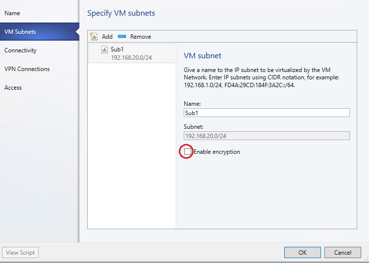
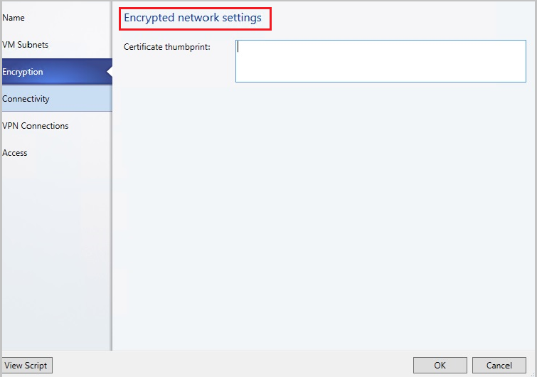

# Configure encrypted networks in SDN using VMM 1711 (Technical preview)

This article explains about how to encrypt the VM networks in software defined network (SDN) using  System Center Virtual Machine Manager preview 1711 (VMM 1711).

Today, network traffic can be encrypted by the guest OS or an application using technologies like IPSec and TLS. However, these technologies are difficult to implement because of their inherent complexity and challenges related to interoperability between systems because of the nature of implementation.

Using the new encrypted networks feature in VMM 1711, end-to-end encryption can be easily configured on the VM networks by using the Network Controller (NC). This encryption prevents traffic between two VMs on the same VM network and same subnet, from being read and manipulated.

The control of encryption is at the subnet level and encryption can be enabled/disabled for each subnet of the VM network.

This feature is managed through the SDN Network Controller (NC). If you do not already have a Software Defined Network (SDN) infrastructure with an NC, see [deploy SDN](deploy-sdn.md) for more information.

> [!NOTE]

> This feature currently provides protection from third-party and network admins, and doesn’t offer any protection against fabric admins. Protection against fabric admins is in the pipeline and will be available soon.

## Before you start

- At least two hosts for tenant VMs, to validate the encryption.
- HNV based VM network with encryption enabled and a  certificate, which can be created and distributed by fabric administrator. Not that The certificate along with its private key must be stored in the local certificate store of all the hosts, where the VMs (of that network) reside.

## Procedure - configure encrypted networks

**Use the following steps**:

1. Create a certificate and then place the certificate in the local certificate store of all the hosts, where you plan to place the tenant VMs for this validation.

    You can either create a self-signed certificate or get a certificate from a CA. For information on how to generate a self-signed certificate and place them in the appropriate locations of each host you will be using, [see this article ](https://docs.microsoft.com/en-us/windows-server/networking/sdn/vnet-encryption/sdn-config-vnet-encryption#bkmk_Certificate).

    > [!NOTE]

    > Make a note of the "Thumbprint" of the certificate that you generate.

    > In the article pointed above in step 2- you do not have to perform the actions detailed in "Creating a Certificate Credential" and "Configuring a Virtual Network for Encryption". You will configure those settings using VMM, in the following steps:

3. Set up an HNV provider network for tenant VM connectivity, which will be managed by the NC. [Learn more](sdn-controller.md#validate-the-deployment).
4. Create a tenant VM Network and a subnet. While creating the subnet, select **Enable Encryption** under **VM Subnets**. [Learn more](sdn-controller.md#validate-the-deployment).

    In the next step, paste the thumbprint of the certificate that you created.

    

    
5.	Create two VMs on two separate physical hosts, and connect them to the above subnet. [Learn more](sdn-controller.md#validate-the-deployment).
6.	Attach any packet sniffing application on the two network interfaces of the two hosts, where the tenant VMs are placed.
7.	Send traffic, ping, HTTP or any other packets, between the two hosts and check the packets in the packet sniffing application. The packets should not have any discernible plaintext like parameters of an HTTP request.
