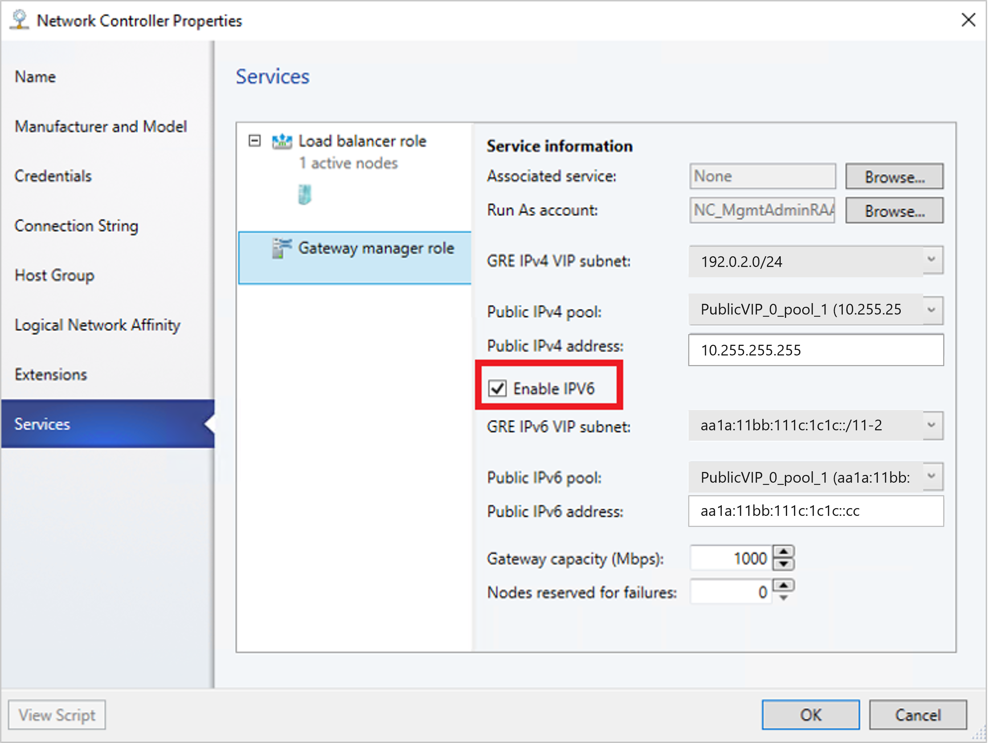

# Set up an SDN RAS gateway in the VMM fabric


This article describes how to set up a Software Defined Networking (SDN) RAS gateway in the System Center Virtual Machine Manager (VMM) fabric.

An SDN RAS gateway is a data path element in SDN that enables site-to-site connectivity between two autonomous systems. Specifically, a RAS gateway enables site-to-site connectivity between remote tenant networks and your datacenter using IPSec, Generic Routing Encapsulation (GRE), or Layer 3 Forwarding. [Learn more](/windows-server/networking/sdn/technologies/network-function-virtualization/ras-gateway-for-sdn).

::: moniker range=">=sc-vmm-2022"

> [!NOTE]
> VMM 2025 and 2022 provide dual stack support for RAS gateway.

::: moniker-end

::: moniker range="sc-vmm-2019"
>[!NOTE]
>- From VMM 2019 UR1, **One Connected** network type is changed to **Connected Network**.
>- VMM 2019 UR2 and later supports IPv6.
::: moniker-end

## Before you start

Here are some considerations before you set up an SDN RAS gateway:

- **Planning**: Read about planning a software defined network, and review the planning topology in [this](/windows-server/networking/sdn/plan/plan-a-software-defined-network-infrastructure) document. The diagram shows a sample 4-node setup. The setup is highly available with Three network controller nodes (VM) and Three SLB/MUX nodes. It shows Two tenants with One virtual network broken into Two virtual subnets to simulate a web tier and a database tier. Both the infrastructure and tenant virtual machines can be redistributed across any physical host.
- **Network controller**: You must deploy the network controller before you deploy the RAS gateway.
- **SLB**: To ensure that dependencies are handled correctly, you must also deploy the SLB before setting up the gateway. If an SLB and a gateway are configured, you can use and validate an IPsec connection.
- **Service template**: VMM uses a service template to automate GW deployment. Service templates support multi-node deployment on Generation 1 and Generation 2 VMs.

## Deployment steps

To set up a RAS gateway, follow these steps:

1. **Download the service template**: Download the service template that you need to deploy the GW.
2. **Create the VIP logical network**: Create a GRE VIP logical network. It needs an IP address pool for private VIPs and to assign VIPs to GRE endpoints. The network exists to define VIPs that are assigned to gateway VMs running on the SDN fabric for a site-to-site GRE connection.

    > [!NOTE]
    > To enable dual stack support, while creating GRE VIP logical network, add IPv6 subnet to the network site and create IPv6 address pool. (applicable for 2022 and later)

3. **Import the service template**: Import the RAS gateway service template.
4. **Deploy the gateway**: Deploy a gateway service instance, and configure its properties.
5. **Validate the deployment**: Configure site-to-site GRE, IPSec, or L3, and validate the deployment.


## Download the service template

To download the service template, follow these steps:

1. Download the SDN folder from the [Microsoft SDN GitHub repository](https://github.com/Microsoft/SDN) and copy the templates from **VMM** >**Templates** > **GW** to a local path on the VMM server.
2. Extract the contents to a folder on a local computer. You'll import them to the library later.

The download contains two templates:

- The EdgeServiceTemplate_Generation 1 VM.xml template is for deploying the GW Service on Generation 1 virtual machines.
- The EdgeServiceTemplate_Generation 2 VM.xml is for deploying the GW Service on Generation 2 virtual machines.

Both the templates have a default count of three virtual machines, which can be changed in the service template designer.

## Create the GRE VIP logical network

To create the GRE VIP logical network, follow these steps:

1. In the VMM console, run the Create Logical Network Wizard. Enter a **Name**, optionally provide a description, and  select **Next**.
::: moniker range="sc-vmm-2019"
2. In **Settings**, select **One Connected Network**. Optionally, you can select **Create a VM network with the same name**. This setting allows VMs to access this logical network directly. Select **Managed by the Network Controller**, and select **Next**.
- For VMM 2019 UR1 and later, in **Settings**, select **Connected Network**, select **Managed by the Network Controller**, and then select **Next**.
::: moniker-end

::: moniker range="sc-vmm-2022"
2. In **Settings**, select **Connected Network**, select **Managed by the Network Controller**, and then select **Next**.
::: moniker-end

3. In **Network Site**, specify the settings:

    Here are the sample values:

    - Network name: GRE VIP
    - Subnet: 31.30.30.0
    - Mask: 24
    - VLAN ID on trunk: NA
    - Gateway: 31.30.30.1
::: moniker range="<sc-vmm-2019"
4. In **Summary**, review the settings and finish the wizard.
::: moniker-end

::: moniker range="sc-vmm-2019"
4. To use IPv6, add both IPv4 and IPV6 subnet to the network site.
    Here are the sample values:

    - Network name: GRE VIP
    - Subnet: FD4A:293D:184F:382C::
    - Mask: 64
    - VLAN ID on trunk: NA
    - Gateway: FD4A:293D:184F:382C::1
5. In **Summary**, review the settings and finish the wizard.
::: moniker-end

::: moniker range="sc-vmm-2022"
4. To use IPv4, add IPv4 subnet to the network site and create IPv4 address pool.
   Here are the sample values:

    - Network name: GRE VIP
    - Subnet:
    - Mask:
    - VLAN ID on trunk: NA
    - Gateway:
5. To use IPv6, add both IPv4 and IPV6 subnets to the network site and create IPv6 address pool.
   Here are the sample values:

    - Network name: GRE VIP
    - Subnet: FD4A:293D:184F:382C::
    - Mask: 64
    - VLAN ID on trunk: NA
    - Gateway: FD4A:293D:184F:382C::1
6. In **Summary**, review the settings and finish the wizard.

::: moniker-end

### Create an IP address pool for GRE VIP addresses

::: moniker range="sc-vmm-2019"

>[!NOTE]
> From VMM 2019 UR1 and later, you can create IP address pool using the **Create Logical Network** wizard.

::: moniker-end

::: moniker range="sc-vmm-2022"

>[!NOTE]
> You can create an IP address pool using the **Create Logical Network** wizard.

::: moniker-end

::: moniker range=">=sc-vmm-2019"

To create an IP address pool, follow these steps:

1. Right-click the GRE VIP logical network > **Create IP Pool**.
2. Enter a **Name** and optional description for the pool, and check that the VIP network is selected. Select **Next**.
3. Accept the default network site and select **Next**.
::: moniker-end

::: moniker range="<sc-vmm-2019"
4. Choose a starting and ending IP address for your range.  Start the range on the second address of your available subnet. For example, if your available subnet is from .1 to .254, start the range at .2.
5. In the **IP addresses reserved for load balancer VIPs** box, enter the IP addresses range in the subnet. This must match the range you used for starting and ending IP addresses.
6. You don't need to provide gateway, DNS, or WINS information as this pool is used to allocate IP addresses for VIPs through the network controller only. Select **Next** to skip these screens.
7. In **Summary**, review the settings and finish the wizard.
::: moniker-end

::: moniker range=">=sc-vmm-2019"

4. If you had created IPv6 subnet, create a separate IPv6 GRE VIP address pool.
5. Choose a starting and ending IP address for your range. Start the range on the second address of your available subnet. For example, if your available subnet is from .1 to .254, start the range at .2. For specifying VIP range, don’t use the shortened form of IPv6 address; Use the *2001:db8:0:200:0:0:0:7* format instead of *2001:db8:0:200::7*.
6. In the **IP addresses reserved for load balancer VIPs** box, enter the IP addresses range in the subnet. This must match the range you used for starting and ending IP addresses.
7. You don't need to provide gateway, DNS, or WINS information as this pool is used to allocate IP addresses for VIPs through the network controller only. Select **Next** to skip these screens.
8. In **Summary**, review the settings and finish the wizard.

::: moniker-end

## Import the service template

To import the service template, follow these steps:

1. Select **Library** > **Import Template**.
2. Browse to your service template folder. As an example,  select the **EdgeServiceTemplate Generation 2.xml** file.
3. Update the parameters for your environment as you import the service template. 

> [!NOTE]
> The library resources were imported during the network controller deployment.

   - **WinServer.vhdx**: Select the virtual hard drive image that you prepared and imported earlier during the network controller deployment.
   - **EdgeDeployment.CR**: Map to the EdgeDeployment.cr library resource in the VMM library.

4. On the **Summary** page, review the details and select **Import**.

    > [!NOTE]
    > You can customize the service template. [Learn more](sdn-controller.md#customize-the-template).

## Deploy the gateway service

::: moniker range="sc-vmm-2022"

To enable IPv6, while onboarding Gateway service, select the **Enable IPv6** checkbox and select the IPv6 GRE VIP subnet that you created previously. Also, select public IPv6 pool and provide the public IPv6 address.

 ::: moniker-end

This example uses the Generation 2 template.

To deploy the gateway service, follow these steps:

1. Select the **EdgeServiceTemplate Generation2.xml** service template, and select **Configure Deployment**.
2. Enter a **Name**, and choose a destination for the service instance. The destination must map to a host group that contains the hosts configured previously for gateway deployment.
3. In **Network Settings**, map the management network to the management VM network.

    > [!NOTE]
    > The **Deploy Service** dialog appears after the mapping is complete. It's normal for the VM instances to be initially Red. Select **Refresh Preview** to automatically find suitable hosts for the VM.

4. On the left of the **Configure Deployment** window, configure the following settings:

    - **AdminAccount**. Required. Select a RunAs account that will be used as the local administrator on the gateway VMs.
    - **Management Network**. Required. Choose the Management VM network that you created for host management.
    - **Management Account**. Required. Select a Run As account with permissions to add the gateway to the Active Directory domain associated with the network controller. This can be the same account used for MgmtDomainAccount while deploying the network controller.
    - **FQDN**. Required. FQDN for the Active directory domain for the gateway.

5. Select **Deploy Service** to begin the service deployment job.

    > [!NOTE]
    >
    > - Deployment times will vary depending on your hardware but are typically between 30 and 60 minutes. If gateway deployment fails, delete the failed service instance in **All Hosts** > **Services** before you retry the deployment.
    >
    > - If you aren't using a volume licensed VHDX (or the product key isn't supplied using an answer file), then deployment will stop at the **Product Key** page during VM provisioning. You need to manually access the VM desktop, and either enter the key or skip it.
    >
    > - If you want to scale in or scale out a deployed SLB instance, read this [blog](https://blogs.technet.microsoft.com/scvmm/2011/05/18/scvmm-2012-an-explanation-of-scale-in-and-scale-out-for-a-service/).

## Gateway limits
The following are the default limits for NC managed gateway:
- **MaxVMNetworksSupported**= 50
- **MaxVPNConnectionsPerVMNetwork**= 10
- **MaxVMSubnetsSupported**= 550
- **MaxVPNConnectionsSupported**= 250

>[!NOTE]
> For an SDNv2 virtualized network, an internal routing subnet is created for every VM network. The **MaxVMSubnetsSupported** limit includes the internal subnets created for VM networks.
>
>You can [override the default limits](#override-the-gateway-limits) set for the network controller managed gateway. However, overriding the limit to a higher number could impact the performance of the network controller.

### Override the gateway limits
To override the default limits, append the override string to the network controller service connection string and update in VMM.

- **MaxVMNetworksSupported**= followed by the number of VM networks that can be used with this gateway.
- **MaxVPNConnectionsPerVMNetwork**= followed by the number of VPN Connections that can be created per VM network with this gateway.
- **MaxVMSubnetsSupported**= followed by the number of VM network subnets that can be used with this gateway.
- **MaxVPNConnectionsSupported**= followed by the number of VPN Connections that can be used with this gateway.

**Example**:

To override the maximum number of VM networks that can be used with the gateway to 100, update the connection string as follows:

 ``serverurl=https://NCCluster.contoso.com;servicename=NC_VMM_RTM; MaxVMNetworksSupported==100``

## Configure the gateway manager role

Now that the gateway service is deployed, you can configure the properties and associate it with the network controller service.

To configure the gateway manager role, follow these steps:

1. Select **Fabric** > **Network Service** to display the list of network services installed. Right-click the network controller service > **Properties**.
2. Select the **Services** tab, and select the **Gateway Manager Role**.
3. Find the **Associated Service** field under **Service information**, and select **Browse**. Select the gateway service instance you created earlier, and select **OK**.
4. Select the **Run As account** that will be used by network controller to access the gateway virtual machines.

   > [!NOTE]
   > The Run As account must have Administrator privileges on the gateway VMs.

5. In **GRE VIP subnet**, select the VIP subnet that you created previously.
::: moniker range="<sc-vmm-2019"
6. In **Public IPv4 pool**, select the pool you configured during SLB deployment. In **Public IPv4 address**, provide an IP address from the previous pool, and ensure you don't select the initial three IP addresses from the range.
::: moniker-end
::: moniker range=">=sc-vmm-2019"
6. To enable IPv4 support, in **Public IPv4 pool**, select the pool you configured during SLB deployment. In **Public IPv4 address**, provide an IP address from the previous pool, and ensure you don't select the initial three IP addresses from the range.
7. To enable IPv6 support, from **Network Controller Properties** > **Services**, select **Enable IPv6** checkbox, select the IPv6 GRE VIP subnet that you've created previously, and input the public IPv6 pool and public IPv6 address, respectively. Also, select IPv6 frontend subnet that will be assigned to Gateway VMs.

    

8. In **Gateway Capacity**, configure the capacity settings.

    The gateway capacity (Mbps) denotes the normal TCP bandwidth that is expected out of the gateway VM. You must set this parameter based on the underlying network speed you use.

    IPsec tunnel bandwidth is limited to (3/20) of the gateway capacity. Which means, if the gateway capacity is set to 1000 Mbps, the equivalent IPsec tunnel capacity would be limited to 150 Mbps.

    > [!NOTE]
    > The bandwidth limit is the total value of inbound bandwidth and outbound bandwidth.

    The equivalent ratios for GRE, and L3 tunnels are 1/5 and 1/2, respectively.

9. Configure the number of reserved nodes for backup in **Nodes for reserved for failures field**.
10. To configure individual gateway VMs, select each VM and select the IPv4 frontend subnet, specify the local ASN, and optionally add the peering device information for the BGP peer.

   > [!NOTE]
   > You must configure the gateway BGP peers if you plan to use GRE connections.

The service instance you deployed is now associated with the gateway Manager role. You must see the gateway VM instance listed under it.
::: moniker-end
::: moniker range="<sc-vmm-2019"
7. In **Gateway Capacity**, configure the capacity settings.

    The gateway capacity (Mbps) denotes the normal TCP bandwidth that is expected out of the gateway VM. You must set this parameter based on the underlying network speed you use.

    IPsec tunnel bandwidth is limited to (3/20) of the gateway capacity. Which means, if the gateway capacity is set to 1000 Mbps, the equivalent IPsec tunnel capacity would be limited to 150 Mbps.

    > [!NOTE]
    > The bandwidth limit is the total value of inbound bandwidth and outbound bandwidth.

    The equivalent ratios for GRE and L3 tunnels are 1/5 and 1/2, respectively.

8. Configure the number of reserved nodes for backup in **Nodes for reserved for failures field**.
9. To configure individual gateway VMs, select each VM and select the IPv4 frontend subnet, specify the local ASN, and optionally add the peering device information for the BGP peer.

::: moniker-end

   > [!NOTE]
   > You must configure the gateway BGP peers if you plan to use GRE connections.

The service instance you deployed is now associated with the gateway Manager role. You must see the gateway VM instance listed under it.

## Validate the deployment

After you deploy the gateway, you can configure S2S GRE, S2S IPSec, or L3 connection types, and validate them.
For more information, see the following contents:

- [Create and validate site-to-site IPSec connections](sdn-route-network-traffic.md#configure-ipsec-connection)
- [Create and validate site-to-site GRE connections](sdn-route-network-traffic.md#configure-gre-tunneling)
- [Create and validate L3 connections](sdn-route-network-traffic.md)

For more information on connection types, see [this](/windows-server/networking/sdn/technologies/network-function-virtualization/ras-gateway-for-sdn).


## Set up the traffic selector from PowerShell
Here's the procedure to set up the traffic selector by using the VMM PowerShell.

To set up the traffic selector, follow these steps:

1. Create the traffic selector by using the following parameters.

    > [!NOTE]
    > Values used are examples only.

    ```powershell
    $t= new-object Microsoft.VirtualManager.Remoting.TrafficSelector

    $t.Type=7 // IPV4=7, IPV6=8

    $t.ProtocolId=6 // TCP =6, reference: https://en.wikipedia.org/wiki/List_of_IP_protocol_numbers

    $t.PortEnd=5090

    $t.PortStart=5080

    $t.IpAddressStart=10.100.101.10

    $t.IpAddressEnd=10.100.101.100
    ```

2. Configure the above traffic selector by using **-LocalTrafficSelectors** parameter of **Add-SCVPNConnection** or **Set-SCVPNConnection**.

## Remove the gateway from the SDN fabric

Use [these steps](sdn-remove.md#remove-the-gateway) to remove the gateway from the SDN fabric.
