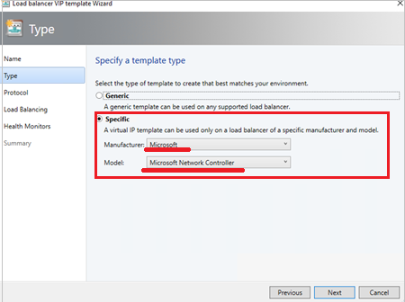

# Configure guest clusters in SDN though VMM (Technical preview)

This article explains about how to configure guest clusters in SDN using the System Center Virtual machine Manager preview 1711 (VMM 1711).

VMM currently supports guest clustering.  However, with the advent of the network controller (NC), Windows Server 2016 and System Center 2016, the configuration of guest clusters has undergone some change.

With the introduction of the network controller, VMs, which are connected to the virtual network are only permitted to use the IP address that NC assigns for communication. NC does not support floating IP addresses which are essential for technologies such as Microsoft Failover Clustering to work.

VMM 1711 enables this feature by emulating the floating IP functionality through the Software Load Balancer (SLB) in the SDN.

SCVMM 1711 supports guest clustering in SDN through an Internal Load Balancer(ILB) Virtual IP(VIP). The ILB uses probe ports which are created on the guest cluster VMs to identify the active node.  At any given time, the probe port of only the active node responds to the ILB and all the traffic directed to the VIP is routed to the active node.

## Before you start

Ensure the following prerequisite:

Guesting clustering is managed through the SDN NC. Ensure you have set up SDN and [deployed NC](#sdn-controller.md) and [SLB](#sdn-slb.md).   

## Procedure - configure guest clusters

**Use the following steps**:

1.	Create a cluster for your VMs using the information provided in [this article](https://docs.microsoft.com/en-us/windows-server/networking/sdn/manage/guest-clustering).

    > [!NOTE]

    >  Cluster should have a ProbePort parameter set to a port of your choice. This port is required while configuring the VIP template in the next step.

    > Note the reserved IP address you are using for this cluster. This IP will be required later while creating a VIP using the VIP template.

2.	Create a VIP template. In VMM console > **Fabric** >
**Networking** > **VIP Templates**, right-click and select **Add VIP Template**.

 - In **Type**, select **Microsoft Network Controller**.

  

 - In **Load Balancing**, select **Enable Floating IP** Checkbox.

  

 - In **Health Monitor**, add the probe which would be used on the guest cluster VMs. Here, you must add the same port which was configured while clustering the hosts in the previous step.

  

3.	Using PowerShell, create a VIP using the VIP template.

    Use the following sample PowerShell script  to create a VIP.  Modify the parameters as required.

    ```powershell
    “$VipMemberNames” – names of the VMs in the cluster.
    “$VipNetworkName” – name of the tenant network.
    “$VipAddress” – the reserved IP address from the tenant network which was used in step 2 as the IP address for the VM cluster.
    “$VipTemplateName” – name of the VIP template created in step 3, above.
    “$VipName” – any friendly name you want to refer to the VIP by.
    ```
## Next steps
