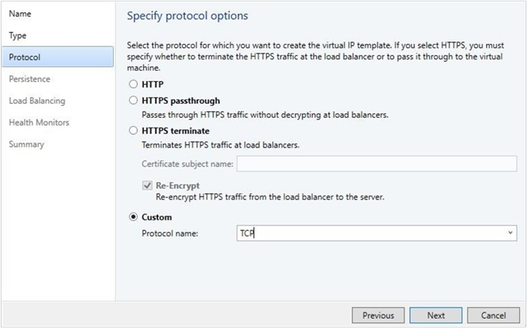

# Load balance network traffic in an SDN fabric using VMM


You can use the Software Load Balancer (SLB) to distribute the network traffic evenly among the workloads in Software Define Networking (SDN) managed by the Cloud Service Providers (CSPs) and the tenants. For more information, see [Software Load Balancer (SLB)](sdn-slb.md).

System Center Virtual Machine Manager (VMM) supports the following two scenarios of load balancing:

- **Load balancing the external network traffic**: This scenario includes load balancing the network traffic coming from an external network. Load balancing is done through a public Virtual IP (VIP). The workload VMs can be connected to a **no isolation** VM network or to a **network virtualization** enabled VM network.

- **Load balancing the internal network traffic** (Internal load balancing): This scenario includes load balancing the network traffic of workloads in the VM network that is enabled for **network virtualization**. Load balancing is done through a VIP.

  > [!NOTE]
  > VMM supports configuration of load balancing by using PowerShell. Configuration through Service templates is currently not supported.

This article provides information about how to configure the load balancing of workload VMs by using PowerShell.

::: moniker range="sc-vmm-2019"
>[!NOTE]
>- From VMM 2019 UR1, **One Connected** network type is changed to **Connected Network**
>- VMM 2019 UR2 and later supports IPv6.

::: moniker-end

## Before you start

Before you configure the load balancing of workload VMs, ensure the following:

- [SDN network controller](sdn-controller.md) and the SDN [software load balancer](sdn-slb.md) are deployed.

- Required VMs are created on appropriate networks and are identified for load balancing.

## Create a VIP template

To configure the VIPs to load balance the workload VMs (DIPs), follow these steps:

1. In the VMM console, select **Fabric** > **VIP Templates**. Right-click and select **Create VIP Template**.

    :::image type="content" source="./media/sdn-load-balance-network-traffic/lb-template-name-image1.png" alt-text="Screenshot of VIP template name.":::
2. In the **Name** page, provide the name and optional description. Specify the **Virtual IP Port** that will be used as front-end port for the network traffic. In the **Backend port**, specify the port on which the back-end workloads are hosted. Select **Next**.

    
3. In **Type**, under **Specify a template type**, select **Specific**. Select **Microsoft** from the Manufacturer dropdown and **Microsoft Network Controller** from the Model dropdown.
4. Select **Next**.

    
5. In **Specify Protocol options**, select the Custom option and TCP/UDP in Protocol name. Select **Next**.

    > [!NOTE]
    > SLB supports only layer 4 load balancing of TCP/UDP traffic. HTTP/HTTPS protocols are not supported.

6. For **Persistence** and **Load Balancing**, use the defaults. Select **Next**.

    
    > [!NOTE]
    > SLB doesn’t support persistence and different load balancing methods. By default, SLB uses Round Robin algorithm for load balancing.

7. In **Health Monitors**, optionally, insert appropriate values. Select **Next**.

    Options: TCP and HTTP are supported as health monitor protocols if SLB is used.

8. Verify the settings, and select **Finish**.

Once the template is created, you can find this under **Fabric** > **VIP Templates**.


## Create a VIP using PowerShell

Create a VIP by using the following example scripts. Select the script based on the type of network traffic that you want to load balance:

•	[Script for creating a VIP to load balance external network traffic](#script-for-creating-vip-to-load-balance-external-network-traffic)

•	[Script for creating a VIP to load balance internal network traffic](#script-for-creating-vip-to-load-balance-internal-network-traffic)

### Script for creating VIP to load balance external network traffic

The following example script creates the VIP from a public IP network to load balance the workload VMs WGB-001 & WGB-002 on port 80.
::: moniker range=">=sc-vmm-2019"
This script can be used to create load balancing VIP by passing IPv6 VIP address as well.
::: moniker-end

The workload VMs can be connected to a **no isolation** network or **network virtualization** enabled VM networks.

> [!NOTE]
> - In the script parameters section, substitute the actual values that match your test environment for the samples used in this script.
> - Ensure that you run the script on a VMM server or on a computer running the VMM console.

```powershell
param(

[Parameter(Mandatory=$false)]
# Name of the Network Controller Network Service
# This value should be the name you gave the Network Controller service
# when you on-boarded the Network Controller to VMM
$LBServiceName = "NC",

[Parameter(Mandatory=$false)]
# Name of the workload VMs you want to load balance.
$VipMemberVMNames =  @("WGB-001","WGB-002"),

[Parameter(Mandatory=$false)]
# Name of the VIP VM Network
$VipNetworkName = "PublicVIP",


[Parameter(Mandatory=$false)]
# VIP address you want to assign from the VIP VM Network IP pool.
# Pick any VIP that falls within your VIP IP Pool range.
$VipAddress = "44.15.10.253",


[Parameter(Mandatory=$false)]
# The name of the VIP template you created via the VMM Console.
$VipTemplateName = "WebsiteHTTP",

[Parameter(Mandatory=$false)]
# Arbitrary but good to match the VIP you're using.
$VipName = "scvmm_44_15_10_253_80"

)

Import-Module virtualmachinemanager

$lb = Get-scLoadBalancer | where { $_.Service.Name -like $LBServiceName};
$vipNetwork = get-scvmnetwork -Name $VipNetworkName;

$vipMemberNics = @();
foreach ($vmName in $VipMemberVMNames)
{
$vm = get-scvirtualmachine -Name $vmName;
#    if ($vm.VirtualNetworkAdapters[0].VMNetwork.ID -ne $vipNetwork.ID)
#    {
#        $vm.VirtualNetworkAdapters[0] | set-scvirtualnetworkadapter -VMNetwork $vipNetwork;
#    }

$vipMemberNics += $vm.VirtualNetworkAdapters[0];
}

$existingVip = get-scloadbalancervip -Name $VipName
    if ($existingVip -ne $null)
{
#    foreach ($mem in $existingVip.VipMembers)
#    {
#        $mem | remove-scloadbalancervipmember;
#    }

    $existingVip | remove-scloadbalancervip;
}

$vipt = get-scloadbalancerviptemplate -Name $VipTemplateName;

$vip = New-SCLoadBalancerVIP -Name $VipName -LoadBalancer $lb
-IPAddress $VipAddress -LoadBalancerVIPTemplate $vipt
-FrontEndVMNetwork $vipNetwork
-BackEndVirtualNetworkAdapters $vipMemberNics;
Write-Output "Created VIP " $vip;

$vip = get-scloadbalancervip -Name $VipName;
Write-Output "VIP created successfully " $vip;
```

### Script for creating VIP to load balance internal network traffic

For the following example script, we created a new VIP template by name ILB-VIP-Template for load balancing the port 443 using the procedure detailed in the [previous section](#create-a-vip-template). The script creates a VIP from tenant VM network to load balance the VMs ILB-001 & ILB-002, which are part of the same tenant VM network.

::: moniker range=">=sc-vmm-2019"
This script can be used to create load balancing VIP by passing IPv6 VIP address as well.
::: moniker-end

> [!NOTE]
> - In the internal load balancing scenario, the VIP comes from the tenant VM network. So, the **$VipNetworkName** is the same tenant VM network name where the VMs are connected. Ensure that the tenant VM network IP pool has the IPs reserved for VIPs. The **$VipAddress** is one of the IP addresses from the reserved VIPs.
> - In the script parameters section, substitute the actual values that match your test environment for the samples used in this script.
> - Ensure that you run the script on a VMM server or on a computer running the VMM console.

```powershell
param(

[Parameter(Mandatory=$false)]
# Name of the Network Controller Network Service
# This value should be the name you gave the Network Controller service
# when you on-boarded the Network Controller to VMM
$LBServiceName = "NC",

[Parameter(Mandatory=$false)]
# Name of the workload VMs you want to load balance.
$VipMemberVMNames =  @("ILB-001","ILB-002"),

[Parameter(Mandatory=$false)]
# Name of the VIP VM Network
$VipNetworkName = "TenantNetwork",

[Parameter(Mandatory=$false)]
# VIP address you want to assign from the VIP VM Network IP pool.
# Pick any VIP that falls within your VIP IP Pool range.
$VipAddress = "192.168.100.75",

[Parameter(Mandatory=$false)]
# The name of the VIP template you created via the VMM Console.
$VipTemplateName = "ILB-VIP-Template",

[Parameter(Mandatory=$false)]
# Arbitrary but good to match the VIP you're using.
$VipName = "scvmm_192_168_100_75_443"

)

Import-Module virtualmachinemanager

$lb = Get-scLoadBalancer | where { $_.Service.Name -like $LBServiceName};
$vipNetwork = get-scvmnetwork -Name $VipNetworkName;

$vipMemberNics = @();
foreach ($vmName in $VipMemberVMNames)
{
$vm = get-scvirtualmachine -Name $vmName;
#    if ($vm.VirtualNetworkAdapters[0].VMNetwork.ID -ne $vipNetwork.ID)
#    {
#        $vm.VirtualNetworkAdapters[0] | set-scvirtualnetworkadapter -VMNetwork $vipNetwork;
#    }

$vipMemberNics += $vm.VirtualNetworkAdapters[0];
}

$existingVip = get-scloadbalancervip -Name $VipName
if ($existingVip -ne $null)
{
#    foreach ($mem in $existingVip.VipMembers)
#    {
#        $mem | remove-scloadbalancervipmember;
#    }

$existingVip | remove-scloadbalancervip;
}

$vipt = get-scloadbalancerviptemplate -Name $VipTemplateName;

$vip = New-SCLoadBalancerVIP -Name $VipName -LoadBalancer $lb
-IPAddress $VipAddress -LoadBalancerVIPTemplate $vipt
-FrontEndVMNetwork $vipNetwork
-BackEndVirtualNetworkAdapters $vipMemberNics;
Write-Output "Created VIP " $vip;

$vip = get-scloadbalancervip -Name $VipName;
Write-Output " VIP created successfully " $vip;
```