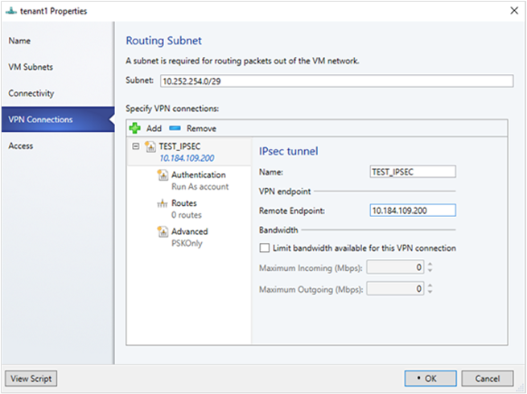
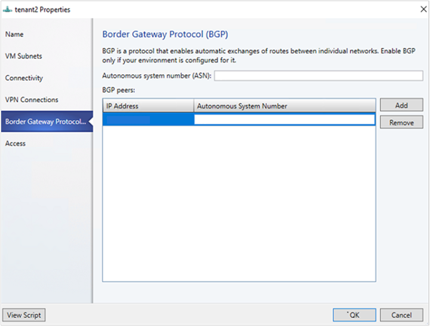
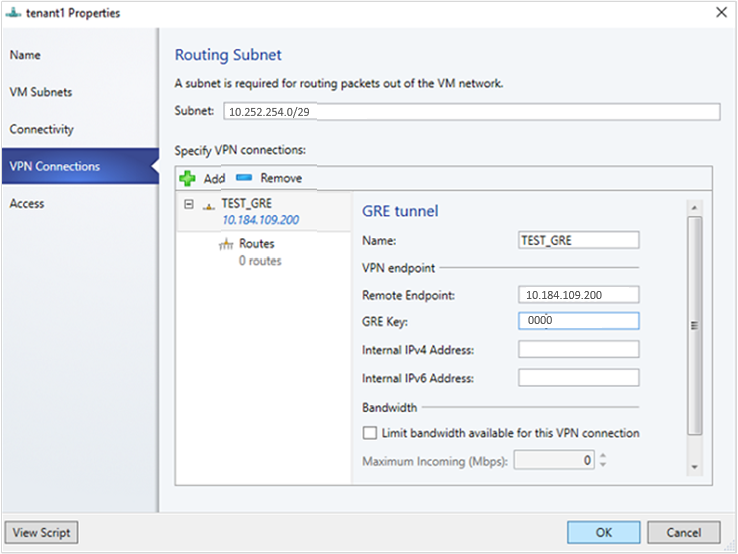
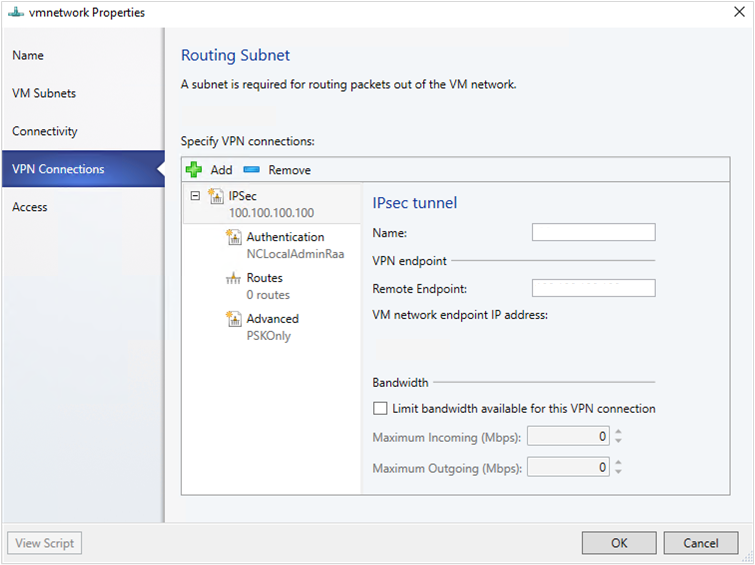

# Route traffic across networks in the SDN infrastructure

>Applies To: System Center 2016 - Virtual Machine Manager

An SDN RAS gateway enables you to route network traffic between physical and virtual networks, regardless of where the resources are located. SDN RAS gateway is multitenant, Boarder Gateway Protocol (BGP) capable and supports connectivity using Site-to-Site VPN using IPsec or Generic Routing Encapsulation (GRE) or Layer 3 Forwarding.  [Learn more](https://technet.microsoft.com/windows-server-docs/networking/sdn/technologies/network-function-virtualization/ras-gateway-for-sdn).

## Before you start

Ensure the following:

•	SDN [Network Controller](sdn-controller.md), SDN [Software Load Balancer](sdn-slb.md) and [SDN RAS gateway](sdn-gateway.md) are deployed.

•	An SDN VM network with network virtualization is created.

## Configure Site-to-Site VPN connections using VMM

A site-to-site VPN connection allows you to securely connect two networks at different physical locations by using  Internet.

For Cloud Service Providers (CSPs) that host many tenants in their datacenter, SDN RAS gateway provides a multi-tenant gateway solution that allows your tenants to access and manage their resources over Site-to-Site VPN connections from remote sites, which in turn allows network traffic between virtual resources in your datacenter and their physical network.

## Configure IPSec connection
**Use the following procedure**:
1.	Select the VM Network that you want to configure a Site-to-Site IPSec connection, and click **Connectivity**.
2.	Select **Connect to another network through a VPN tunnel**. Optionally, to enable BGP peering in your datacenter, select **Enable Border Gateway Protocol (BGP)**.
3.	Select the network controller service for the gateway device.
4.	Select the **VPN Connections** > **Add** > **Add IPSec Tunnel**.
5.	Type a subnet as shown in the following diagram. This subnet is used to route packets out of the VM Network. This subnet need not be pre-configured in your datacenter.


6.	Type the **Name** for the connection, and the IP address of the remote endpoint. Optionally, configure the bandwidth.
7.	In **Authentication**, select the type of authentication you want to use. If you choose to authenticate by using a Run as account, create a user account with a user name, and the IPSec key as the password for the account.
8.	In **Routes**, type all the remote subnets that you want to connect to. If you have selected **Enable Border Gateway Protocol (BGP)** in the Connectivity page, routes are not required.
9.	On the **Advanced** tab, accept the default settings.
10.	If you have selected **Enable Border Gateway Protocol (BGP)** in the Connectivity page, then you can fill out your ASN, peer BGP IP and its ASN on the **Border Gateway Protocol** wizard page as shown below:

11.	To validate the connection, try to ping the remote endpoint IP address from one of the virtual machines on your VM network.

## Configure GRE tunneling

GRE tunnels enable connectivity between tenant virtual networks and external networks.
Since the GRE protocol is lightweight and support for GRE is available on most of the network devices, it becomes an ideal choice for tunneling where encryption of data is not required. GRE support in Sit-to-Site (S2S) tunnels facilitates traffic forwarding between tenant virtual networks and tenant external networks.

**Use the following procedure**:
1.	Select the VM network where you want to configure a S2S GRE connection, and click **Connectivity**.
2.	Select **Connect to another network through a VPN tunnel**. Optionally, to enable BGP peering in your datacenter, select **Enable Border Gateway Protocol (BGP)**.
3.	Select the Network Controller Service for the Gateway Device.
4.	Select **VPN Connections** > **Add** > **Add GRE Tunnel**.
5.	Type a subnet as shown in the following diagram. This subnet is used to route packets out of the VM network. This subnet doesn't need to be preconfigured in your datacenter.

6.	Type a connection name, and specify the IP address of the remote endpoint.
7.	Type the GRE key.
8.	Optionally, you can complete the other fields on this screen but these values aren't needed to set up a connection.
9.	In **Routes**, add all the remote subnets that you want to connect to. If you selected **Enable Border Gateway Protocol (BGP)** in **Connectivity**, you can leave this screen blank and instead complete your ASN, peer BGP IP and ASN fields on the **Border Gateway Protoco** tab.
10.	You can use the defaults for the remaining settings.
11.	To validate the connection, try to ping the remote endpoint IP address from one of the virtual machines on the VM network.

## Set up remote sites for IPSec and GRE connections

On the remote peer device, use the  **VM network endpoint IP address** from the VMM UI as destination Address while setting up the IPSec\GRE connection.




## Configure L3 forwarding  

An L3 gateway acts as a bridge between the physical infrastructure in the datacenter and the virtualized infrastructure in the Hyper-V network virtualization cloud.
To learn more, check these articles: [Windows server gateway as a forwarding gateway](https://technet.microsoft.com/library/dn313101.aspx#bkmk_private) and [RAS gateway high availability](https://technet.microsoft.com/en-us/windows-server-docs/networking/sdn/technologies/network-function-virtualization/ras-gateway-high-availability).

> [!NOTE]

>- Ensure you're logged on as an administrator on the VMM server.
>- In an L3 connection, you can’t use the same VLAN subnet for two different tenants.
>- When you use BGP with a tunnel connection, BGP peering must be established between the gateway (VSID interface IP address) and the peer device on the physical network. For script based configuration, you will need to know the VSID interface IP address to be able to setup BGP peering. This IP is available in the JSON.
>- For BGP peering to work, there should be a route on the physical network with the destination as the GW VSID Address and the next hop as the L3 interface IP Address.

**Run the following script**:

    ```powershell
    param (
        [Parameter(Mandatory=$true)]
        # Name of the L3 VPN connection
        $L3VPNConnectionName,
        [Parameter(Mandatory=$true)]
        # Name of the VM network to create gateway
        $VmNetworkName,
        [Parameter(Mandatory=$true)]
        # Name of the Next Hop one connected VM network
        # used for forwarding
        $NextHopVmNetworkName,
        [Parameter(Mandatory=$true)]
        # IPAddresses on the local side that will be used
        # for forwarding
        # Format should be @("10.10.10.100/24")
        $LocalIPAddresses,
        [Parameter(Mandatory=$true)]
        # IPAddresses on the remote side that will be used
        # for forwarding
        # Format should be @("10.10.10.200")
        $PeerIPAddresses,
        [Parameter(Mandatory=$false)]
        # Subnet for the L3 gateway
        # default value 10.254.254.0/29
        $GatewaySubnet = "10.254.254.0/29",
        [Parameter(Mandatory=$false)]
        # List of subnets for remote tenants to add routes for static routing
        # Format should be @("14.1.20.0/24","14.1.20.0/24");
        $RoutingSubnets = @(),
        [Parameter(Mandatory=$false)]
        # Enable BGP in the tenant space
        $EnableBGP = $false,
        [Parameter(Mandatory=$false)]
        # ASN number for the tenant gateway
        # Only applicable when EnableBGP is true
        $TenantASN = "0"
    )

    # Import SC-VMM PowerShell module
    Import-Module virtualmachinemanager

    # Retrieve Tenant VNET info and exit if VM Network not available
    $vmNetwork = Get-SCVMNetwork -Name $VmNetworkName;
    if ($vmNetwork -eq $null)
    {
        Write-Verbose "VM Network $VmNetworkName not found, quitting"
        return
    }

    # Retrieve L3 Network info and exit if VM Network not available
    $nextHopVmNetwork = Get-SCVMNetwork -Name $NextHopVmNetworkName;
    if ($nextHopVmNetwork -eq $null)
    {
        Write-Verbose "Next Hop L3 VM Network $NextHopVmNetworkName not found, quitting"
        return
    }

    # Retrieve gateway Service and exit if not available
    $gatewayDevice = Get-SCNetworkGateway | Where {$_.Model -Match "Microsoft Network Controller"};
    if ($gatewayDevice -eq $null)
    {
        Write-Verbose "Gateway Service not found, quitting"
        return
    }

    # Retrieve Tenant Virtual Gateway info
    $vmNetworkGatewayName = $VmNetwork.Name + "_Gateway";
    $VmNetworkGateway = Get-SCVMNetworkGateway -Name $vmNetworkGatewayName -VMNetwork $vmNetwork

    # Create a new Tenant Virtual Gateway if not configured
    if($VmNetworkGateway -eq $null)
    {
        if($EnableBGP -eq $false)
        {
            # Create a new Virtual Gateway for tenant
            $VmNetworkGateway = Add-SCVMNetworkGateway -Name $vmNetworkGatewayName -EnableBGP $false -NetworkGateway $gatewayDevice -VMNetwork $vmNetwork -RoutingIPSubnet $GatewaySubnet;
        }
        else
        {
            if($TenantASN -eq "0")
            {
                Write-Verbose "Please specify valid ASN when using BGP"
                return
            }

            # Create a new Virtual Gateway for tenant
            $VmNetworkGateway = Add-SCVMNetworkGateway -Name $vmNetworkGatewayName -EnableBGP $true -NetworkGateway $gatewayDevice -VMNetwork $vmNetwork -RoutingIPSubnet $GatewaySubnet -AutonomousSystemNumber $TenantASN;
        }

    }

    if ($VmNetworkGateway -eq $null)
    {
        Write-Verbose "Could not Find / Create Virtual Gateway for $($VmNetwork.Name), quitting"
        return
    }

    # Check if the network connection already exists
    $vpnConnection = Get-SCVPNConnection -VMNetworkGateway $VmNetworkGateway -Name $L3VPNConnectionName
    if ($vpnConnection -ne $null)
    {
        Write-Verbose "L3 Network Connection for $($VmNetwork.Name) already configured, skipping"
    }
    else
    {
        # Create a new L3 Network connection for tenant
        $vpnConnection = Add-SCVPNConnection  -NextHopNetwork $nexthopvmNetwork  -Name $L3VPNConnectionName -IPAddresses $LocalIPAddresses -PeerIPAddresses $PeerIPAddresses -VMNetworkGateway $VmNetworkGateway -protocol L3;

        if ($vpnConnection -eq $null)
        {
            Write-Verbose "Could not add network connection for $($VmNetwork.Name), quitting"
            return
        }
        Write-Output "Created VPN Connection " $vpnConnection;
    }

    # Add all the required static routes to the newly created network connection interface
    foreach($route in $RoutingSubnets)
    {
        Add-SCNetworkRoute -IPSubnet $route -RunAsynchronously -VPNConnection $vpnConnection -VMNetworkGateway $VmNetworkGateway
    }
    After configuring the L3 VPN connection using the above script, if you enabled BGP, add the BGP peers using the Add-SCBGPPeer cmdlet.
    Example:
    Add-SCBGPPeer -Name "peer1" -PeerIPAddress "12.13.14.15" -PeerASN 15 -VMNetworkGateway $VmNetworkGateway
    ```

The table below provides examples of dynamic and static L3 connections.

**Parameter** | **Details/example values**
--- | ---
**L3VPNConnectionName** | User-defined name for the L3 forwarding network connection. **Example**: Contoso_L3_GW
**VmNetworkName** | Name of the tenant virtual network that's reachable over L3 network connection. **Example**: ContosoVMNetwork
**NextHopVMNetworkName** | User-defined name for the L3 forwarding network connection. Name of VLAN tagged L3 VM network you created. **Example**: Contoso_L3_Network
**LocalIPAddresses** |  IP addresses to be configured on the HNV gateway L3 network interface. IP address from the logical network you created. **Example**: 10.127.134.55/25
**PeerIPAddresses** |  IP address of the physical network gateway, reachable over L3 logical network.  IP address from the logical network you created. **Example**: 10.127.134.65
**GatewaySubnet** |  Subnet to be used for routing between HNV gateway and tenant virtual network. **Example**:192.168.2.0/24
**RoutingSubnets** |  Static routes that need to be on the L3 interface of the HNV gateway.
**EnableBGP** |  Option to enable BGP. **Default**: false.
**TenantASNRoutingSubnets** | ASN number of tenant gateway. Only if BGP is enabled.

## Set up the traffic selector from VMM PowerShell
 Use the following procedure;

> [!NOTE]
> Values used are examples only.

1. Create the traffic selector by using the following parameters.

    ```powershell
    $t= new-object Microsoft.VirtualManager.Remoting.TrafficSelector

    $t.Type=7 // IPV4=7, IPV6=8

    $t.ProtocolId=6 // TCP =6, reference: https://en.wikipedia.org/wiki/List_of_IP_protocol_numbers

    $t.PortEnd=5090

    $t.PortStart=5080

    $t.IpAddressStart=10.100.101.10

    $t.IpAddressEnd=10.100.101.100
    ```

2. Configure the above traffic selector by using **-LocalTrafficSelectors** parameter of **Add-SCVPNConnection**or **Set-SCVPNConnection**.
