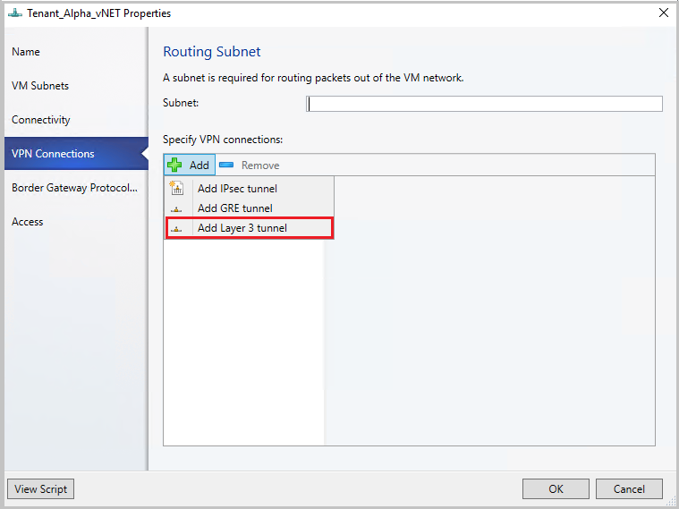

# Route traffic across networks in the SDN infrastructure


This article describes how to route traffic across networks in a software-defined network (SDN) infrastructure set up in the System Center Virtual Machine Manager (VMM) fabric.

An SDN RAS gateway enables you to route network traffic between physical and virtual networks, regardless of where the resources are located. SDN RAS gateway is multitenant, Boarder Gateway Protocol (BGP) capable and supports connectivity using Site-to-Site virtual private network (VPN) using IPsec or Generic Routing Encapsulation (GRE) or Layer 3 Forwarding.  [Learn more](/windows-server/networking/sdn/technologies/network-function-virtualization/ras-gateway-for-sdn).

::: moniker range="sc-vmm-2019"

>[!NOTE]
> - From VMM 2019 UR1, **One Connected** network type is changed as **Connected Network**.
> - VMM 2019 UR2 and later supports IPv6.
> - IPv6 is supported for IPSec tunnel, GRE tunnel, and L3 layer tunnel.

::: moniker-end

::: moniker range="sc-vmm-2022"

>[!NOTE]
> - IPv6 is supported for IPSec tunnel, GRE tunnel, and L3 layer tunnel.

::: moniker-end

## Before you start

Here are some considerations before you start routing traffic across networks in the SDN infrastructure:

-   Ensure SDN [Network Controller](sdn-controller.md), SDN [Software Load Balancer](sdn-slb.md), and [SDN RAS gateway](sdn-gateway.md) are deployed.

-   Ensure an SDN VM network with network virtualization is created.

## Configure Site-to-Site VPN connections using VMM

A Site-to-Site VPN connection allows you to securely connect two networks at different physical locations by using the Internet.

For Cloud Service Providers (CSPs) that host many tenants in their datacenter, SDN RAS gateway provides a multitenant gateway solution that allows your tenants to access and manage their resources over Site-to-Site VPN connections from remote sites, which in turn allows network traffic between virtual resources in your datacenter and their physical network.


::: moniker range=">=sc-vmm-2022"
VMM 2025 and 2022 support dual stack (Ipv4 + Ipv6) for SDN components.

::: moniker-end

::: moniker range=">=sc-vmm-2019"
To enable IPv6 for site-to-site VPN connection, routing subnet must be both IPv4 and IPv6. For gateway to work in IPv6, provide IPv4 and IPv6 addresses separated by semicolon (**;**) and provide IPv6 address in the remote endpoint. For example, *192.0.2.1/23;2001:0db8:85a3:0000:0000:8a2e:0370::/64*.
For specifying VIP range, don’t use the shortened form of the IPv6 address; use ‘2001:db8:0:200:0:0:0:7’ format instead of ‘2001:db8:0:200::7’.


::: moniker-end

## Configure IPSec connection

To configure IPSec connection, follow these steps:

1.  Select the VM Network that you want to configure a Site-to-Site IPSec connection and select **Connectivity**.
2.  Select **Connect to another network through a VPN tunnel**. Optionally, to enable BGP peering in your datacenter, select **Enable Border Gateway Protocol (BGP)**.
3.  Select the network controller service for the gateway device.
4.  Select the **VPN Connections** > **Add** > **Add IPSec Tunnel**.
5.  Enter a subnet as shown in the following diagram. This subnet is used to route packets out of the VM Network. You don't need to pre-configure this subnet in your datacenter.

6.  Enter a  name for the connection, and the IP address of the remote endpoint. Optionally, configure the bandwidth.
7.  In **Authentication**, select the type of authentication you want to use. If you choose to authenticate by using a Run as account, create a user account with a username, and the IPSec key as the password for the account.
8.  In **Routes**, enter all the remote subnets that you want to connect to. If you've selected **Enable Border Gateway Protocol (BGP)** in the **Connectivity** page, routes aren't required.
9.  On the **Advanced** tab, accept the default settings.
10. If you've selected **Enable Border Gateway Protocol (BGP)** in the Connectivity page, then you can fill out your ASN, peer BGP IP, and its ASN on the **Border Gateway Protocol** wizard page as shown below.

11. To validate the connection, try to ping the remote endpoint IP address from one of the virtual machines on your VM network.

## Configure GRE tunneling

GRE tunnels enable connectivity between tenant virtual networks and external networks.
Since the GRE protocol is lightweight and support for GRE is available on most of the network devices, it becomes an ideal choice for tunneling where encryption of data isn't required. GRE support in Site-to-Site (S2S) tunnels facilitates traffic forwarding between tenant virtual networks and tenant external networks.

To configure GRE tunneling, follow these steps:

1.  Select the VM network where you want to configure a S2S GRE connection, and select **Connectivity**.
2.  Select **Connect to another network through a VPN tunnel**. Optionally, to enable BGP peering in your datacenter, select **Enable Border Gateway Protocol (BGP)**.
3.  Select the Network Controller Service for the Gateway Device.
4.  Select **VPN Connections** > **Add** > **Add GRE Tunnel**.
5.  Enter a subnet as shown in the following diagram. This subnet is used to route packets out of the VM network. This subnet doesn't need to be preconfigured in your datacenter.

6.  Enter a connection name, and specify the IP address of the remote endpoint.
7.  Enter the **GRE key**.
8.  Optionally, you can complete the other fields on this screen; these values aren't needed to set up a connection.
9.  In **Routes**, add all the remote subnets that you want to connect to. If you selected **Enable Border Gateway Protocol (BGP)** in **Connectivity**, you can leave this screen blank and instead complete your ASN, peer BGP IP, and ASN fields on the **Border Gateway Protocol** tab.
10. You can use the defaults for the remaining settings.
11. To validate the connection, try to ping the remote endpoint IP address from one of the virtual machines on the VM network.

## Configure IPsec and GRE connections on the remote site

To configure IPsec and GRE connections on the remote site, follow this step:

On the remote peer device, use the **VM network endpoint IP address** from the VMM UI as destination Address while setting up the IPSec\GRE connection.


::: moniker range="<sc-vmm-2019"

## Configure L3 forwarding

L3 forwarding enables connectivity between the physical infrastructure in the datacenter and the virtualized infrastructure in the Hyper-V network virtualization cloud.

Using L3 forwarding, tenant network virtual machines can connect to a physical network through the Windows Server 2016 SDN Gateway, which is already configured in an SDN environment. In this case, the SDN gateway acts as a router between the virtualized network and the physical network.  

To learn more, check these articles: [Windows server gateway as a forwarding gateway](/previous-versions/windows/it-pro/windows-server-2012-R2-and-2012/dn313101(v=ws.11)#bkmk_private) and [RAS gateway high availability](/windows-server/networking/sdn/technologies/network-function-virtualization/ras-gateway-high-availability).


Before you attempt to configure L3 forwarding, ensure the following:

 - Ensure you're logged on as an administrator on the VMM server.
 - You must configure a unique next-hop logical network, with unique VLAN ID, for each Tenant VM network for which L3 forwarding needs to be set up. There must be 1:1 mapping between a tenant network and corresponding physical network (with unique VLAN ID).

To create the next-hop logical network in SCVMM, follow these steps:

1. On the VMM console, select **Logical Networks**, right-click and select **Create Logical Network**.

2. In the **Settings** page, choose **One connected network** and select the checkbox for **Create a VM network with the same name to allow virtual machines to access this logical network directly** and **Managed by Microsoft Network Controller**

3. Create an IP Pool for this new logical network.

IP address from this pool is required in the script for setting up L3 forwarding.

The following table provides examples of dynamic and static L3 connections:

  **Parameter** | **Details/example values**
  --- | ---
  **L3VPNConnectionName** | User-defined name for the L3 forwarding network connection. **Example**: Contoso_L3_GW
  **VmNetworkName** | Name of the tenant virtual network that's reachable over L3 network connection. This network must exist when running the script. **Example**: ContosoVMNetwork
  **NextHopVMNetworkName** |User-defined name for the next hop VM network, which was created as a  prerequisite. This represents the physical network that wants to communicate with the tenant VM network. This network must exist when running this script. **Example**: Contoso_L3_Network
  **LocalIPAddresses** |  IP addresses to be configured on the SDN gateway L3 network interface. This IP address must belong to the next hop logical network you created. You must also provide the subnet mask. **Example**: 10.127.134.55/25
  **PeerIPAddresses** |  IP address of the physical network gateway, reachable over L3 logical network. This IP address must belong to the next hop logical network you created in the prerequisites. This IP will serve as the next hop once traffic destined to the physical network from the tenant VM network reaches the SDN gateway. **Example**: 10.127.134.65
  **GatewaySubnet** |  Subnet to be used for routing between HNV gateway and tenant virtual network. You can use any subnet, ensure that it doesn't overlap with the next hop logical network.  **Example**:192.168.2.0/24
  **RoutingSubnets** |  Static routes that need to be on the L3 interface of the HNV gateway. These routes are for  the physical network subnets, which must be reachable from the tenant VM network over the L3 connection.
  **EnableBGP** |  Option to enable BGP. **Default**: false.
  **TenantASNRoutingSubnets** | ASN number of the tenant gateway, only if BGP is enabled.


Run the following script to set up L3 forwarding. Refer to the table above to check what each script parameter identifies.


  ```powershell
    param (
        [Parameter(Mandatory=$true)]
        # Name of the L3 VPN connection
        $L3VPNConnectionName,
        [Parameter(Mandatory=$true)]
        # Name of the VM network to create gateway
        $VmNetworkName,
        [Parameter(Mandatory=$true)]
        # Name of the Next Hop one connected VM network
        # used for forwarding
        $NextHopVmNetworkName,
        [Parameter(Mandatory=$true)]
        # IPAddresses on the local side that will be used
        # for forwarding
        # Format should be @("10.10.10.100/24")
        $LocalIPAddresses,
        [Parameter(Mandatory=$true)]
        # IPAddresses on the remote side that will be used
        # for forwarding
        # Format should be @("10.10.10.200")
        $PeerIPAddresses,
        [Parameter(Mandatory=$false)]
        # Subnet for the L3 gateway
        # default value 10.254.254.0/29
        $GatewaySubnet = "10.254.254.0/29",
        [Parameter(Mandatory=$false)]
        # List of subnets for remote tenants to add routes for static routing
        # Format should be @("14.1.20.0/24","14.1.20.0/24");
        $RoutingSubnets = @(),
        [Parameter(Mandatory=$false)]
        # Enable BGP in the tenant space
        $EnableBGP = $false,
        [Parameter(Mandatory=$false)]
        # ASN number for the tenant gateway
        # Only applicable when EnableBGP is true
        $TenantASN = "0"
    )

    # Import SC-VMM PowerShell module
    Import-Module virtualmachinemanager

    # Retrieve Tenant VNET info and exit if VM Network not available
    $vmNetwork = Get-SCVMNetwork -Name $VmNetworkName;
    if ($vmNetwork -eq $null)
    {
        Write-Verbose "VM Network $VmNetworkName not found, quitting"
        return
    }

    # Retrieve L3 Network info and exit if VM Network not available
    $nextHopVmNetwork = Get-SCVMNetwork -Name $NextHopVmNetworkName;
    if ($nextHopVmNetwork -eq $null)
    {
        Write-Verbose "Next Hop L3 VM Network $NextHopVmNetworkName not found, quitting"
        return
    }

    # Retrieve gateway Service and exit if not available
    $gatewayDevice = Get-SCNetworkGateway | Where {$_.Model -Match "Microsoft Network Controller"};
    if ($gatewayDevice -eq $null)
    {
        Write-Verbose "Gateway Service not found, quitting"
        return
    }

    # Retrieve Tenant Virtual Gateway info
    $vmNetworkGatewayName = $VmNetwork.Name + "_Gateway";
    $VmNetworkGateway = Get-SCVMNetworkGateway -Name $vmNetworkGatewayName -VMNetwork $vmNetwork

    # Create a new Tenant Virtual Gateway if not configured
    if($VmNetworkGateway -eq $null)
    {
        if($EnableBGP -eq $false)
        {
            # Create a new Virtual Gateway for tenant
            $VmNetworkGateway = Add-SCVMNetworkGateway -Name $vmNetworkGatewayName -EnableBGP $false -NetworkGateway $gatewayDevice -VMNetwork $vmNetwork -RoutingIPSubnet $GatewaySubnet;
        }
        else
        {
            if($TenantASN -eq "0")
            {
                Write-Verbose "Please specify valid ASN when using BGP"
                return
            }

            # Create a new Virtual Gateway for tenant
            $VmNetworkGateway = Add-SCVMNetworkGateway -Name $vmNetworkGatewayName -EnableBGP $true -NetworkGateway $gatewayDevice -VMNetwork $vmNetwork -RoutingIPSubnet $GatewaySubnet -AutonomousSystemNumber $TenantASN;
        }

    }

    if ($VmNetworkGateway -eq $null)
    {
        Write-Verbose "Could not Find / Create Virtual Gateway for $($VmNetwork.Name), quitting"
        return
    }

    # Check if the network connection already exists
    $vpnConnection = Get-SCVPNConnection -VMNetworkGateway $VmNetworkGateway -Name $L3VPNConnectionName
    if ($vpnConnection -ne $null)
    {
        Write-Verbose "L3 Network Connection for $($VmNetwork.Name) already configured, skipping"
    }
    else
    {
        # Create a new L3 Network connection for tenant
        $vpnConnection = Add-SCVPNConnection  -NextHopNetwork $nexthopvmNetwork  -Name $L3VPNConnectionName -IPAddresses $LocalIPAddresses -PeerIPAddresses $PeerIPAddresses -VMNetworkGateway $VmNetworkGateway -protocol L3;

        if ($vpnConnection -eq $null)
        {
            Write-Verbose "Could not add network connection for $($VmNetwork.Name), quitting"
            return
        }
        Write-Output "Created VPN Connection " $vpnConnection;
    }

    # Add all the required static routes to the newly created network connection interface
    foreach($route in $RoutingSubnets)
    {
        Add-SCNetworkRoute -IPSubnet $route -RunAsynchronously -VPNConnection $vpnConnection -VMNetworkGateway $VmNetworkGateway
    }
  ```

::: moniker-end

::: moniker range=">=sc-vmm-2019"

## Configure L3 forwarding

L3 forwarding enables connectivity between the physical infrastructure in the datacenter and the virtualized infrastructure in the Hyper-V network virtualization cloud.

::: moniker-end

::: moniker range="sc-vmm-2019"

Using L3 forwarding connection, tenant network virtual machines can connect to a physical network through the Windows Server 2016/2019 SDN Gateway, which is already configured in an SDN environment. In this case, the SDN gateway acts as a router between the virtualized network and the physical network.  

::: moniker-end

::: moniker range="sc-vmm-2022"

Using L3 forwarding connection, tenant network virtual machines can connect to a physical network through the Windows Server 2016/2019/2022 SDN Gateway, which is already configured in an SDN environment. In this case, the SDN gateway acts as a router between the virtualized network and the physical network.  

::: moniker-end

::: moniker range="sc-vmm-2025"

Using L3 forwarding connection, tenant network virtual machines can connect to a physical network through the Windows Server 2019/2022/2025 SDN Gateway, which is already configured in an SDN environment. In this case, the SDN gateway acts as a router between the virtualized network and the physical network.  

::: moniker-end

::: moniker range=">=sc-vmm-2019"

To learn more, check these articles: [Windows server gateway as a forwarding gateway](/previous-versions/windows/it-pro/windows-server-2012-R2-and-2012/dn313101(v=ws.11)#bkmk_private) and [RAS gateway high availability](/windows-server/networking/sdn/technologies/network-function-virtualization/ras-gateway-high-availability).


Before you attempt to configure L3 connection, ensure the following:

- Ensure you're logged on as an administrator on the VMM server.
- You must configure a unique next-hop logical network, with unique VLAN ID, for each Tenant VM network for which L3 forwarding needs to be set up. There must be 1:1 mapping between a tenant network and corresponding physical network (with unique VLAN ID).

To create the next-hop logical network in VMM, follow these steps:

1.  On the VMM console, select **Logical Networks**, right-click and select **Create Logical Network**.
2. In the **Settings** page, choose **One connected network** and select  **Create a VM network with the same name to allow virtual machines to access this logical network directly** and **Managed by Microsoft Network Controller**.

    

::: moniker-end

::: moniker range="sc-vmm-2019"

   >[!NOTE]
   > From VMM 2019 UR1, **One Connected** network type is changed as **Connected Network**.

::: moniker-end

::: moniker range=">=sc-vmm-2019"

3. Create an IP Pool for this new logical network. IP address from this pool is required for setting up L3 forwarding.

> [!NOTE]
> You can't limit bandwidth in L3 VPN connection.

To configure L3 forwarding, follow these steps:

1. In the VMM console, select the tenant virtual network that you want to connect to the physical network through L3 gateway.  
2. Right-click the selected tenant virtual network, select **Properties** > **Connectivity**.
3. Select **Connect to another network through a VPN tunnel**. Optionally, to enable BGP peering in your datacenter, select **Enable Border Gateway Protocol (BGP)**.
    
4. Select the network controller service for the gateway device.
5. In the **VPN Connections** page, select **Add**> **Add Layer 3 tunnel**.

    

6. Provide a subnet in the CIDR notation format for **Routing Subnet**. This subnet is used to route packets out of the VM network. You don't need to pre-configure this subnet in your datacenter.

    

7. Use the following information and configure the L3 connection:

|**Parameter** | **Details** |
    | --- | --- |
    | Name |  User-defined name for the L3 forwarding network connection.
    | VM Network (NextHop) |  User-defined name for the next hop VM network, which was created as a prerequisite. This represents the physical network that wants to communicate with the tenant VM network.  When you select *Browse*, only the *One Connected VM Networks* managed by Network service will be available for selection.
    |Peer IP Address | IP address of the physical network gateway, reachable over L3 logical network. This IP address must belong to the next hop logical network that you created as the prerequisite. This IP will serve as the next hop, once the traffic destined to the physical network from the tenant VM network reaches the SDN gateway. This must be an IPv4 address. There can be multiple peer IP addresses, and they must be separated by commas.  
    | Local IP Addresses |  IP addresses to be configured on the SDN gateway L3 network interface. These  IP addresses must belong to the next hop logical network that you created as prerequisite. You must also provide the subnet mask. Example: 10.127.134.55/25. This must be an IPv4 address and must be in CIDR notation format. Peer IP address and Local IP addresses must be from the same Pool. These IP addresses must belong to the subnet defined in Logical Network Definition of VM Network.


- If you're using static routes, enter all the remote subnets that you want to connect to, in **Routes**.

    

    > [!NOTE]
    > You must configure routes in your physical network, for the tenant virtual network subnets, with the next hop as the IP address of the L3 interface on the SDN gateway (Local IP address used in the creation of L3 connection). This is to ensure that the return traffic to the tenant virtual network is routed correctly through the SDN gateway.


-  If you're using BGP, ensure that BGP peering is established between the SDN gateway internal interface IP address, which is present in a different compartment on the gateway VM (not the default compartment) and the peer device on the physical network.

    For BGP to work, follow these steps:

    1. Add BGP peer for the L3 connection. Enter your ASN, peer BGP IP, and its ASN on the **Border Gateway Protocol** page.

       

    2. Determine the SDN gateway internal address as detailed in [the following section](#determine-the-sdn-gateway-internal-address).

    3. Create BGP peer on the remote end (physical network gateway). While creating the BGP peer, use the SDN gateway internal address (as determined in the previous step) as the peer IP address.

    4. Configure a route on the physical network with the destination as the SDN gateway internal address and the next hop as the L3 interface IP address (Local IP address value used when creating L3 connection).

::: moniker-end

::: moniker range="<sc-vmm-2019"

> [!NOTE]
> After configuring the L3 connection, you must configure routes in your physical network for the tenant virtual network subnets, with the next hop as the IP address of the L3 interface on the SDN gateway (parameter LocalIpAddresses in the script). This is to ensure that the return traffic to the tenant virtual network is routed correctly through the SDN gateway.

You can choose to configure static routes or dynamic routes (over BGP) with the L3 connection. If you're using static routes, you can add them using **Add-SCNetworkRoute** as described in the script below.

If you use BGP with L3 tunnel connection, BGP peering must be established between the SDN gateway internal interface IP address, which is present in a different compartment on the gateway VM (not the default compartment) and the peer device on the physical network.

For BGP to work, follow these steps:

1. Add BGP peer for the L3 connection using the **Add-SCBGPPeer** cmdlet.

   *Example*: Add-SCBGPPeer -Name "peer1" -PeerIPAddress "12.13.14.15" -PeerASN 15 -VMNetworkGateway $VmNetworkGateway

2. Determine the SDN gateway internal address as detailed in the [following section](#determine-the-sdn-gateway-internal-address).

3. Create BGP peer on the remote end (physical network gateway). While creating the BGP peer, use the SDN gateway internal address (determined in step 2 above) as the peer IP address.

4. Configure a route on the physical network with the destination as the SDN gateway internal address and the next hop as the L3 interface IP address (*LocalIPAddresses* parameter in the script).

::: moniker-end


## Determine the SDN gateway internal address

To determine the SDN gateway internal address, follow these steps:

Run the following PowerShell cmdlets on a network controller installed computer or a computer that was configured as a network controller client:

  ```powershell
  $gateway = Get-NetworkControllerVirtualGateway -ConnectionUri <REST uri of your deployment>
  $gateway.Properties.NetworkConnections.Properties.IPAddresses
  ```
  The results of this command can display multiple virtual gateways depending on how many tenants have configured gateway connections. Each virtual gateway can have multiple connections (IPSec, GRE, L3).

  As you already know the L3 interface IP address (LocalIPAddresses) of the connection, you can identify the correct connection based on that IP address. After you've the correct network connection, run the following command (on the corresponding virtual gateway) to get the BGP router IP address of the virtual gateway.

  ```powershell
  $gateway.Properties.BgpRouters.Properties.RouterIp
  ```

The result of this command provides the IP address that you must configure on the remote router as the peer IP Address.

## Set up the traffic selector from VMM PowerShell

> [!NOTE]
> Values used are examples only.

To set up the traffic selector from VMM PowerShell, follow these steps:

1. Create the traffic selector by using the following parameters.

    ```powershell
    $t= new-object Microsoft.VirtualManager.Remoting.TrafficSelector

    $t.Type=7 // IPV4=7, IPV6=8

    $t.ProtocolId=6 // TCP =6, reference: https://en.wikipedia.org/wiki/List_of_IP_protocol_numbers

    $t.PortEnd=5090

    $t.PortStart=5080

    $t.IpAddressStart=10.100.101.10

    $t.IpAddressEnd=10.100.101.100
    ```

2. Configure the above traffic selector by using **-LocalTrafficSelectors** parameter of **Add-SCVPNConnection** or **Set-SCVPNConnection**.

