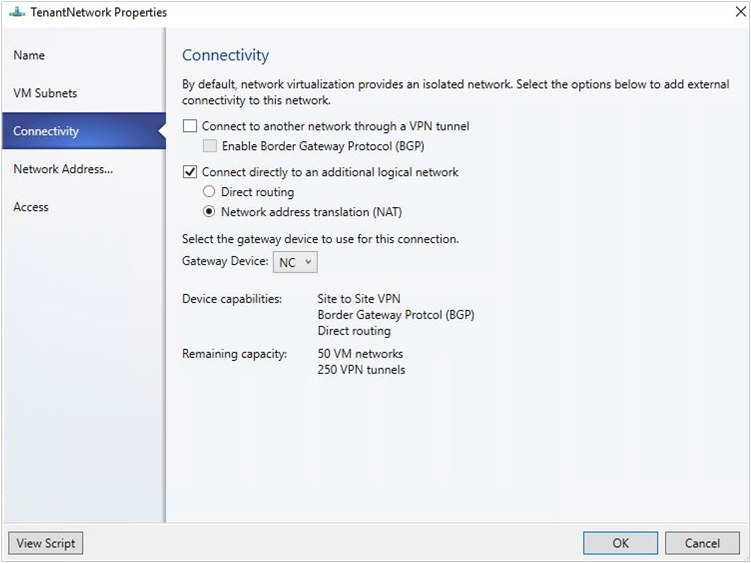
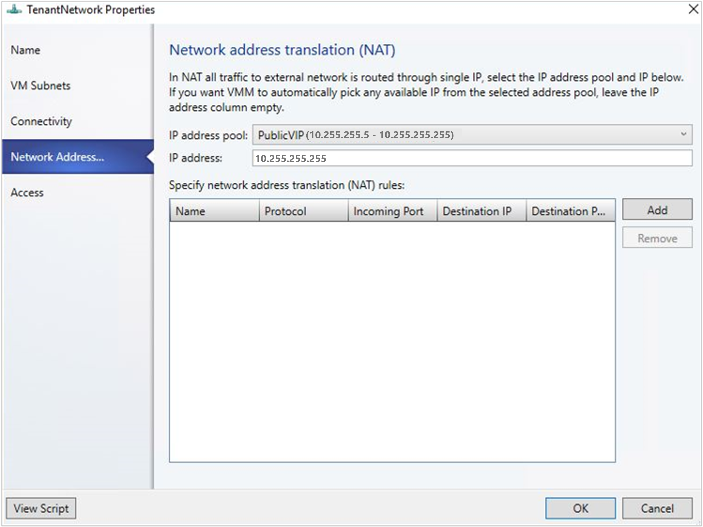
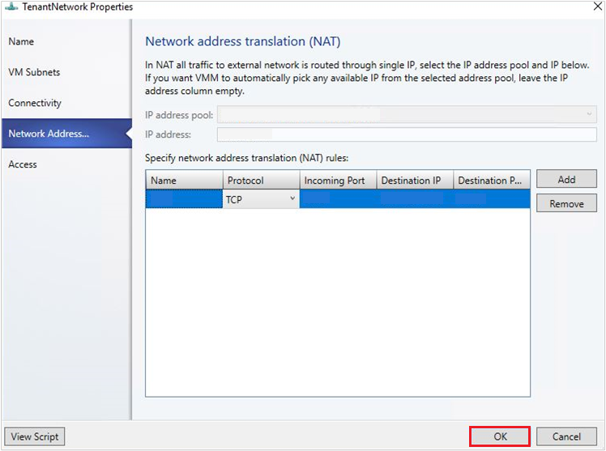

# Set up NAT for traffic forwarding in the SDN infrastructure

>Applies To: System Center 2016 - Virtual Machine Manager

This article describes how to set up Network Address Translation (NAT) for traffic forwarding in a software-defined network (SDN) infrastructure set up in the System Center Virtual Machine Manager (VMM) fabric.

NAT allows virtual machines (VMs) in an isolated SDN virtual network to obtain external connectivity. VMM configures a Virtual IP (VIP) to forward the traffic to and from an external network.

The following two NAT types are supported by VMM.

- **Outbound NAT** - Forwards the VM network traffic from a virtual network to external destinations.
- **Inbound NAT** - Forwards the external traffic to a specific VM in a virtual network.

This article provides information about how to configure a NAT connection for SDN virtual networks using VMM.

## Before you start

Ensure the following:
- [SDN network controller](sdn-controller.md) and the SDN [software load balancer](sdn-slb.md) are deployed.
- An SDN VM network with network virtualization is created.

## Create a NAT connection

Use the following procedure:

1. In VMM console, click **VMs and Services** > **VM Networks**. Right-click the selected VM network for which you want to create the NAT connection, and select **Properties**.
2. Click **Connectivity** on the wizard page displayed.

    

3. In **Connectivity**, select **Connect directly to an additional logical network** and select **Network address translation (NAT)** under this option.   

    

4. In the **IP address pool**, choose the IP pool from which the VIP should come from. In IP address, choose an IP address from the pool selected. Click **OK**.

A NAT connection will be created for this VM network.

> [!NOTE]
> - Along with the NAT connection, this procedure also creates  a default Outbound NAT rule that enables the outbound connectivity for the VM network.
> - To enable inbound connectivity and forward an external traffic to a specific VM, you must add NAT rules to the NAT connection.

## Add rules to a NAT connection

Use the following procedure:

1.	In VMM console, click **VMs and Services** > **VM Networks**. Right-click the selected VM network and select **Properties**.
2.	Click **Network Address Translation** on the wizard.

    
3.	Under **Specify network address translation (NAT) rules**, click **Add**.
Type the following details as appropriate:

    - **Name** – Name for the inbound NAT rule.
    -	**Protocol** – Inbound network traffic protocol. TCP/UDP are supported.
    -	**Incoming Port** – Port number that you want to use along with the VIP to access the VM.
    -	**Destination IP** – IP address of the VM to which you want to direct the external traffic.
    -	**Destination Port** – Port number on the VM, the external traffic should be forwarded to.
4.	Click **OK**.

>[!NOTE]

> Multiple NAT rules can be created to forward the traffic to multiple VMs that are part of the VM network.

## Remove a NAT rule
Use the following procedure:

1.	In VMM console, click **VMs and Services** > **VM Networks**. Right-click the selected VM network and select **Properties**.
2.	Click **Network Address Translation** on the wizard.
3. Select the NAT rule that you want to remove, Click **Remove** and then click **OK**.

## Remove a NAT connection
1.	In VMM console, click **VMs and Services** > **VM Networks**. Right-click the selected VM network and select **Properties**.
2. Click **Connectivity** on the wizard.
3. Clear the option **Connect directly to an additional logical network** and click **OK**.
