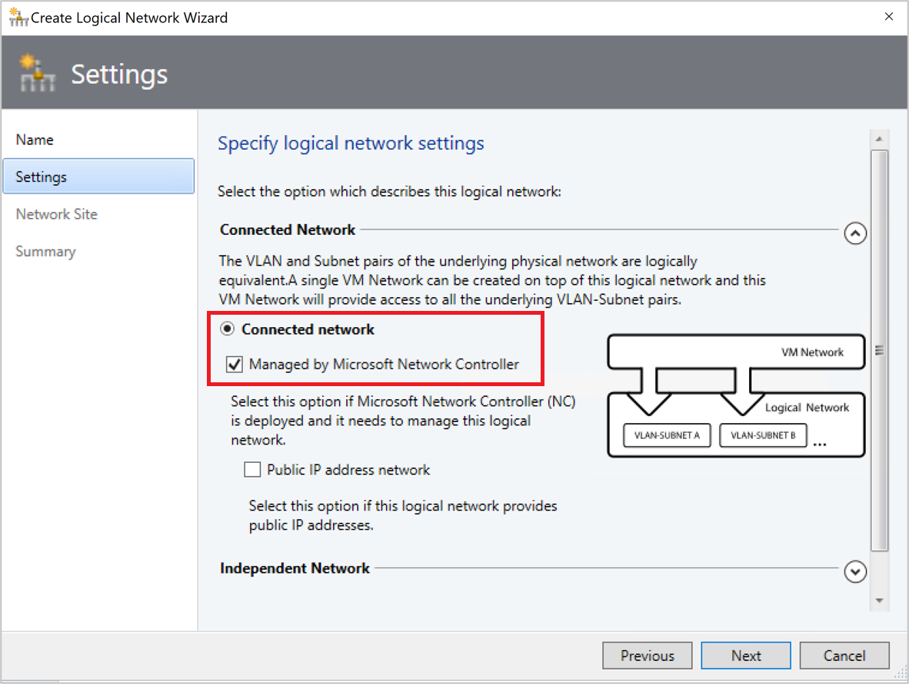
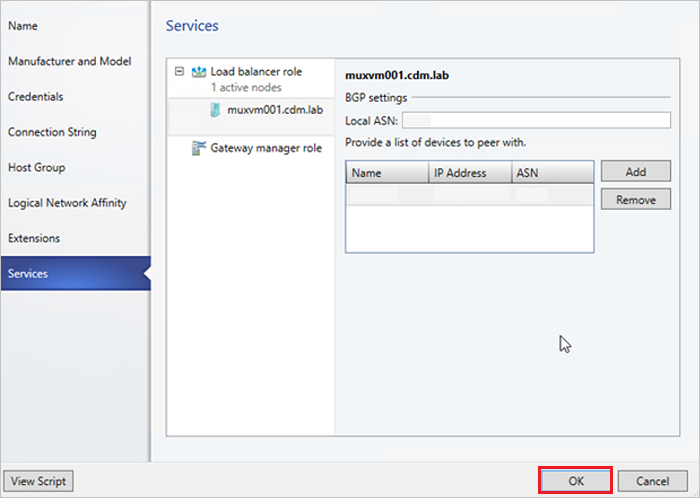

# Set up an SDN software load balancer (SLB) in the VMM fabric

This article provides information on how to deploy a software load balancer (SLB) in a Software Defined Network (SDN).

The SLB enables even distribution of tenant and tenant customer network traffic among virtual network resources so that multiple servers can host the same workload to provide high availability and scalability. [Learn more](/windows-server/networking/sdn/technologies/network-function-virtualization/software-load-balancing-for-sdn).

You can use VMM to deploy a network controller and a software load balancer. After you set up the SLB, you can use the multiplexing and NAT capabilities in your SDN infrastructure.

::: moniker range=">=sc-vmm-2022"
VMM 2025 and 2022 provide dual stack support for SLB.
::: moniker-end

::: moniker range="sc-vmm-2019"
>[!NOTE]
>- From VMM 2019 UR1, **One Connected** network type is changed to **Connected Network**
>- VMM 2019 UR2 and later supports IPv6.

::: moniker-end

## Before you start
Here are some considerations before you set up an SDN software load balancer:

- **Planning**: Read about planning a software defined network, and review the planning topology in [this](/windows-server/networking/sdn/plan/plan-a-software-defined-network-infrastructure) document. The diagram shows a sample 4-node setup. The setup is highly available with Three network controller nodes (VM) and Three SLB/MUX nodes. It shows Two tenants with One virtual network broken into Two virtual subnets to simulate a web tier and a database tier. Both the infrastructure and tenant virtual machines can be redistributed across any physical host.
- **Network controller**: You must have an [SDN network controller](sdn-controller.md) deployed in the VMM fabric so that you've the compute and network infrastructure running before you set up the load balancing.
- **SSL certificate**: To import the SLB service template, you'll need to prepare an SSL certificate. You made the certificate available during network controller deployment. To use the certificate you prepared in network controller deployment for SLB, right-click the certificate and export it without a password in .CER format. Place it in the library in the NCCertificate.cr folder you created when you set up the network controller.
- **Service template**: VMM uses a service template to automate SLB deployment. Service templates support multi-node deployment on Generation 1 and Generation 2 VMs.
- **SLB VMs**: All the SLB virtual machines must be running Windows Server 2016 or later with the latest patches installed.
- **HNV Network**: Ensure that you created the Provider HNV network as part of NC validation. [Learn more](./sdn-controller.md).

## Deployment steps

To deploy SDN software load balancer, follow these steps:

1. **Prepare the SSL certificate**: Put the certificate in the VMM library.
2. **Download the service template**: Download the service template that you need to deploy the SLB/MUX.
3. **Create the transit logical networks**: You need to create logical networks:
    - A logical network to mirror the transit (Frontend) physical network.
    - Private virtual IP (VIP) and public VIP networks to assign VIPs to the SLB service.
4. **Create private and public VIP logical networks**: Private virtual IP (VIP) and public VIP networks to assign VIPs to the SLB service.
5. **Import the service template**: Import and customize the SLB service template.
6. **Deploy SLB**: Deploy SLB as a VMM service and configure the service properties.
7. **Validate the deployment**: Configure BGP peering between the SLB/MUX instance and a BGP router, assign a public IP address to a tenant VM or service, and access the VM or service from outside the network.

## Prepare the certificate
Ensure that the SSL certificate that you created during the NC deployment is copied to NCCertificate.cr folder.

## Download the service template

To download the service template, follow these steps:

1. Download the SDN folder from the [Microsoft SDN GitHub repository](https://github.com/Microsoft/SDN), and copy the templates from **VMM** >**Templates** > **SLB** to a local path on the VMM server.
2. Extract the contents to a folder on a local computer. You'll import them to the library later.

The download contains two templates:
- The SLB Production Generation 1 VM.xml template is for deploying the SLB Service on Generation 1 virtual machines.
- The SLB Production Generation 2 VM.xml template is for deploying the SLB Service on Generation 2 virtual machines.

Both the templates have a default count of three virtual machines, which can be changed in the service template designer.

We recommend you use simplified SDN topology (two physical network) for SLB deployments. Skip creating transit logical network when simplified SDN topology template is used.

## Create the transit logical network

To create the service template, follow these steps:

1. Open the **Create logical network Wizard**, and enter a **Name** and optional description.
::: moniker range="sc-vmm-2019"
2. In **Settings**, select **One Connected Network**. Select **Create a VM network with the same name** box to allow virtual machines to access this logical network directly, and **Managed by the network controller**.
- For VMM 2019 UR1 and later, in **Settings**, select **Connected Network**, and then select **Managed by the Network Controller**.
::: moniker-end
::: moniker range="sc-vmm-2022"
2. In **Settings**, select **Connected Network**, and then select **Managed by the network controller**.
::: moniker-end

3. In **Network Site**, add the network site information for your subnet.
4. Review the **Summary** information and complete the logical network wizard.

### Create an IP address pool for the transit logical network
::: moniker range="<sc-vmm-2019"
This is the IP address pool where DIPs are assigned to the SLB/MUX virtual machines and BGP Peer virtual machine (if deployed).
::: moniker-end

::: moniker range=">=sc-vmm-2019"
This is the IP address pool where DIPs are assigned to the SLB/MUX virtual machines and BGP Peer virtual machine (if deployed). 
::: moniker-end
::: moniker range="sc-vmm-2019"
From VMM 2019 UR1 and later, you can create IP address pool using the **Create Logical Network** wizard.
::: moniker-end
::: moniker range="sc-vmm-2022"
You can create IP address pool using the **Create Logical Network** wizard.
::: moniker-end

>[!NOTE]
>- Ensure that you use the IP address range that corresponds to your transit network IP address space. Don't include the first IP address of your subnet in the IP pool you're about to create. For example, if your available subnet is from .1 to .254, start your range at .2.
>- After you create the Transit logical network, ensure that you associate this logical network with the Management switch uplink port profile you created during the network controller deployment.

**Create the IP address pool**

To create the IP address pool, follow these steps:

1. Right-click the logical network > **Create IP Pool**.
2. Provide a **Name** and optional description for the IP Pool and ensure that the correct logical network is selected.
3. In **Network Site**, select the subnet that this IP address pool will service. If you've more than one subnet as part of your HNV provider network, you need to create a static IP address pool for each subnet. If you've only one site (for example, like the sample topology), then you can just select **Next**.
4. In **IP Address range**, configure the starting and ending IP address. Don't use the first three IP addresses of your available subnet. For example, if your available subnet is from .1 to .254, start your range at .4 or greater.
5. Next, configure the default gateway address. Select **Insert** next to the **Default gateways** box, enter the address, and use the default metric. Optionally configure DNS and WINS.
6. Review the summary information, and select **Finish** to complete the wizard.

    > [!NOTE]
    > Ensure that you associate the logical network with the management switch uplink port profile.

## Create private and public VIP logical networks

You need a private VIP address pool to assign a VIP, and a public VIP, to the SLB Manager service.

> [!NOTE]
> The procedure for creating both is similar, but there are some differences.

**Create a private VIP**

To create a private VIP, follow these steps:

1. Start the **Create logical network Wizard**. Enter a **Name** and optional description for this network.
::: moniker range="<sc-vmm-2019"
2. In  **Settings**, select **One Connected Network**. Select **Create a VM network with the same name to allow virtual machines to access this logical network directly**. Select **Managed by the network controller**.

::: moniker-end
::: moniker range=">=sc-vmm-2019"
2. In  **Settings**, select **One Connected Network**. Select **Create a VM network with the same name to allow virtual machines to access this logical network directly**. Select **Managed by the network controller**.
    For UR1 and later, in **Settings**, select **connected Network** and select **Managed by the network controller**.
    
::: moniker-end
3. In **Network Site**, add the network site information for your private VIP logical network.
4. Review the **Summary** information, and complete the wizard.

**Create a public VIP**

To create a public VIP, follow these steps:

1. Start the **Create logical network Wizard**. Enter a **Name** and optional description for this network.
::: moniker range="<sc-vmm-2019"
2. In **Settings**, select **One Connected Network**. Select **Create a VM network with the same name to allow virtual machines to access this logical network directly**. Select **Managed by the network controller** and **Public IP Address Network**.
::: moniker-end
::: moniker range=">=sc-vmm-2019"
2. In  **Settings**, select **One Connected Network**. Select **Create a VM network with the same name to allow virtual machines to access this logical network directly**. Select **Managed by the network controller**.

    For UR1 and later, in **Settings**, select **connected Network** and select both **Managed by the network controller** and **Public IP address network**.

    

::: moniker-end
3. In **Network Site**, add the network site information for your public VIP logical network.
4. Review the **Summary** information and complete the wizard.

### Create IP address pools for the private and public VIP networks

To create IP address pools for the private and public VIP networks, follow these steps:

1. Right-click the private VIP logical network > **Create IP Pool**.
2. Provide a **Name** and optional description for the IP Pool and ensure that the correct logical network is selected.
3. Accept the default network site and select **Next**.
::: moniker range="<sc-vmm-2019"
4. In **IP Address range**, configure the starting and ending IP address.
    >[!NOTE]
    > Don't use the first IP address of your available subnet. For example, if your available subnet is from .1 to .254, start your range at .2 or greater.

::: moniker-end
::: moniker range="sc-vmm-2019"
4. In **IP Address range**, configure the starting and ending IP address. Specify the IPv6 address pool if you're using the IPv6 address space.
    >[!NOTE]
    > Don't use the first IP address of your available subnet. For example, if your available subnet is from .1 to .254, start your range at .2 or greater.
    >
    >The maximum number of addresses allowed in a single VIP range is 1024.
::: moniker-end

::: moniker range="sc-vmm-2022"
4. In **IP Address range**, configure the starting and ending IP address. Add IPv6 subnet to network site and create IPv6 address pools if you're using the IPv6 address space.
    >[!NOTE]
    > - Add IPv6 address pools when you onboard an SLB.
    > - Don't use the first IP address of your available subnet. For example, if your available subnet is from .1 to .254, start your range at .2 or greater.
    > - The maximum number of addresses allowed in a single VIP range is 1024.

::: moniker-end

5. In **IP addresses reserved for load balancer VIPs**, enter the IP address range in the subnet. It must match the start and end addresses you specified.
6. You don't need to provide gateway, DNS, or WINS information because this pool is used to allocate IP addresses for VIPs through the network controller only. Select **Next** to skip these screens. Enter the address and use the default metric. Optionally configure DNS and WINS.
7. Review the summary information, and select **Finish** to complete the wizard.
8. Repeat the procedure for the public VIP logical network; this time enter the IP address range for the public network.

## Import the service template

Import the service template into the VMM library. For this example, we'll import the Generation 2 template.

To import the Generation 2 template, follow these steps:

1. Select **Library** > **Import Template**.
2. Browse to your service template folder, select the **SLB Production Generation 2 VM.xml** file.
3. Update the parameters for your environment as you import the service template.

    > [!NOTE]
    > The library resources were imported during network controller deployment.

    - **WinServer.vhdx**: Select the virtual hard drive image that you prepared and imported earlier during the network controller deployment.
    - **NCCertificate.cr**: This library resource contains scripts used to set up the network controller. Map to the NCCertificate.cr library resource in the VMM library.
    - **EdgeDeployment.cr**: Map to the EdgeDeployment.cr library resource in the VMM library.

4. Remember that you must have copied the .CER certificate that you previously created to the **NCCertificate.cr** folder.
5. On the **Summary** page, review the details and select **Import**.

    > [!NOTE]
    > You can customize the service template. [Learn more](sdn-controller.md#customize-the-template).

## Deploy the SLB service

Now deploy an SLB/MUX service instance.

To deploy an SLB/MUX service instance, follow these steps:

1. Select the **SLB Production Generation 2 VM.xml** service template > **Configure Deployment**. Enter a **Name** and optional destination for the service instance. The destination must map to a host group that contains the hosts you've configured.
2. In the **Network Settings** section, map **TransitNetwork** to your transit VM network and **ManagementNetwork** to your management VM network.

    >[!NOTE]
    >- Transit network isn't applicable when you're using simplified topology templates.
    >- The **Deploy Service** screen appears after the mapping is complete. It is normal for the virtual machine instances to be initially Red. Select **Refresh Preview** to automatically find suitable hosts for the virtual machine.

3. On the left of the **Configure Deployment** window, configure the settings as detailed in the following table:

    **Setting** | **Requirement** | **Description**
    --- |--- |---
    **Transit network** | Required | Your transit VM network.
    **LocalAdmin** | Required | Select a Run As Account in your environment, which will be used as the local Administrator on the virtual machines. The username must be Administrator.
    **Management network** | Required | Choose the management VM network that you created for host management.
    **MgmtDomainAccount** | Required | Select a Run As Account with permissions to add the SLB/MUX virtual machines to the Active Directory domain associated with the network controller. This can be the same account you used in MgmtDomainAccount while deploying the network controller.
    **MgmtDomainFQDN** | Required | FQDN for the Active directory domain that the SLB/MUX virtual machines will join.
    **SelfSignedConfiguration** | Required | Specify **True** if the certificate you're using is self-signed.

4. After you configure these settings, select **Deploy Service** to begin the service deployment job. Deployment times will vary depending on your hardware but are typically between 30 and 60 minutes.
5. If you're not using a volume licensed VHDX, or if the VHDX doesn't have the product key from an answer file, then deployment will stop at the **Product Key** page during SLB/MUX VM provisioning. You need to manually access the VM desktop, and either skip or enter the product key.
6. When the service deployment job is complete, verify that your service appears in **VMs and Services** > **Services** > **VM Network Information for Services**. Right-click the service and verify that the state is **Deployed** in **Properties**.

After deployment, verify that the service appears in **All Hosts** > **Services** > **VM Network Information for Services**. Right-click the SLB MUX service > **Properties**, and verify that the state is **Deployed**. If the SLB/MUX deployment fails, ensure that you delete the failed service instance before you try to deploy the SLB once again.

If you want to scale in or scale out a deployed software load balancer service instance, [read this blog](https://blogs.technet.microsoft.com/scvmm/2011/05/18/scvmm-2012-an-explanation-of-scale-in-and-scale-out-for-a-service/).

> [!NOTE]
> After the SLB service is deployed, disable DNS registration on the virtual network adapter connected to the transit VM network on all the SLB MUX VMs.

## Configure the SLB role and SLB/MUX properties

> [!NOTE]
> Before you proceed, ensure that you create the HNV PA Logical Network.

Now that the service is deployed, you can configure its properties. You'll need to associate the SLB service instance that you deployed with network controller, and then configuring BGP peering between the SLB/MUX instance and a TOR switch or a BGP router peer.

To configure the SLB role and SLB/MUX properties, follow these steps:

1. Select **Fabric** > **Network Service**. Right-click the **network controller** service > **Properties**.
2. Select the **Services** tab > **Load Balancer Role** > **Associated Service** > **Browse**.
3. Select the SLB/MUX service instance you created earlier. Select a Run As Account.
4. For the **Management IP address**, use an IP address from the private VIP pool you created earlier. Optionally specify the IP address ranges to be excluded from the outbound NAT.
Under **SLBM VIP Pools**, select both the private and public VIP pools for publishing to NC.
5. Select the SLB/MUX instance listed under **Load Balancer Role** in the wizard. Enter the local ASN for your datacenter and the details for the devices or BGP peers the SLB/MUX can peer with.
6. Select **OK**.

The SLB service instance is now associated with the SLBM service, and you must see the SLB/MUX virtual machine instance with all the settings listed under the **Load Balancer role**.

## Validate the deployment

After you deploy the SLB/MUX, you can validate the deployment by configuring BGP peering between the SLB/MUX instance and a BGP router, assigning a public IP address to a tenant virtual machine or Service, and accessing the tenant virtual machine or service from outside the network.

**Use the following procedure to validate**

To validate the deployment, follow these steps:

1. Enter your external router details in the wizard. For example:

    

2. Select **OK** to complete the SLB/MUX service instance configuration.
3. Check the **Jobs** window to verify that the **Update Fabric Role with required configuration** and **Associate service instance with fabric role** jobs have completed successfully.
4. To complete the BGP peering operation, you need to configure BGP to peer with your SLB/MUX instance on the router. If you use a hardware router, you need to consult your vendor’s documentation regarding how to set up BGP peering for that device.

    You also need to know the IP address of the SLB/MUX instance that you deployed earlier. To do this, you can either sign in to the SLB MUX virtual machine and run **ipconfig /all** from the command prompt, or you can get the IP address from the VMM console.

    > [!NOTE]
    > Enter an IP from the transit network.

5. If you create a new VIP pool after peering is complete, you need to advertise all the VIP address pools using the VMM console.

After you validate, you can start using the SLB for load balancing. For related information, see [load balance network traffic](sdn-load-balance-network-traffic.md) and [configure NAT rules](sdn-set-up-nat.md).

## Remove the software load balancer from the SDN fabric

Use [these steps](sdn-remove.md#remove-the-software-load-balancer) to remove the SLB from the SDN fabric.

## Next steps

[Create a RAS gateway](sdn-gateway.md).
