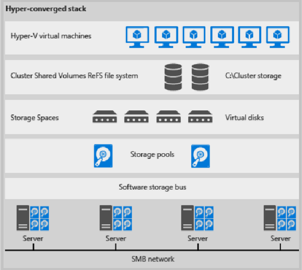

# Scenario: Deploy Storage Spaces Direct with VMM

This article provides an overview of Storage Spaces Direct (S2D) deployment in the System Center - Virtual Machine Manager (VMM) fabric.

S2D was introduced in Windows Server 2016. It virtualizes storage by grouping physical storage drives into virtual storage pools. Using S2D you can:

- Manage multiple physical storage sources as a single virtual entity.
- Get inexpensive virtual storage, with or without external physical storage devices.
- Gather different types of storage into a single virtual storage pool.
- Easily provision storage, and grow virtualized storage pools on demand by adding new drives to them.

## How does it work?

S2D creates pools of virtual storage, from physical storage that's attached to specific nodes in a Windows Server cluster. The storage can be internal on the node, or disk  directly attached to a single node. Supported storage drives include NVMe, SSD connected via SATA or SAS, and HDD. [Learn more](https://technet.microsoft.com/windows-server-docs/storage/storage-spaces/choosing-drives-and-resiliency-types)

- When you enable S2D on a cluster, S2D automatically discovers eligible storage drives, and adds them into a storage pool.
- S2D creates a built-in server-side cache to maximize performance. S2D automatically uses the fastest drives for caching. The remaining drives are used for capacity. [Learn more](https://technet.microsoft.com/en-us/windows-server-docs/storage/storage-spaces/understand-the-cache#cache-drives-are-selected-automatically) about the cache.
- You create volumes from a storage pool. Creating a volume creates the virtual disk (storage space), partitions and formats it, adds it to the cluster, and converts it to a clustered shared volume (CSV).
- You configure different levels of fault tolerance for a volume, to specify how virtual disks are spread across physical disks in the pool, using SMB 3.0. You can configure a volume with no resiliency, or with mirror or parity resilience. [Learn more](https://blogs.technet.microsoft.com/filecab/2016/09/06/volume-resiliency-and-efficiency-in-storage-spaces-direct/).

## Converged and non-converged deployment

An S2D cluster can be deployed in a couple of ways:

- **Hyper-converged deployment**: Hyper-V compute and S2D run on the same cluster, with no separation between them.
- **Disaggregated deployment**: The environment is separated into compute and storage. Compute resources run on one Hyper-V cluster. Storage runs on a different cluster.

In VMM you can deploy S2D in both a hyper-converged or disaggregated topology.

## Hyper-converged deployment

Hyper-converged clusters have the following characteristics:

- Hyper-V (compute) and S2D (storage) run on the same cluster.
- VM files are stored on local CSVs.
- File shares and SMB aren't used.
- You scale the Hyper-V compute cluster and its storage together.
- After S2D CSV volumes are available, you provision them as you would any  other Hyper-V deployment.
- Figure 1 illustrates the hyper-converged deployment stack.

**Figure 1: Hyper-converged deployment**

## Disaggregated deployment

A disaggregated cluster has the following characteristics:

- The Hyper-V compute cluster is different to the storage cluster.
- File shares are created on the S2D cluster CSVs. Hyper-V VMs are configured to store their files on the SOFS, and accessed using SMB 3.0.
- You scale the Hyper-V and SOFS clusters separately for finely tuned management. For example, compute nodes might be near full capacity for the number of VMs, but storage nodes might have excess disk and IOPS capacity, so you add only additional compute nodes.   

## Next steps

- [Deploy Storage Spaces Direct](storage-spaces-deploy.md) in the VMM fabric
