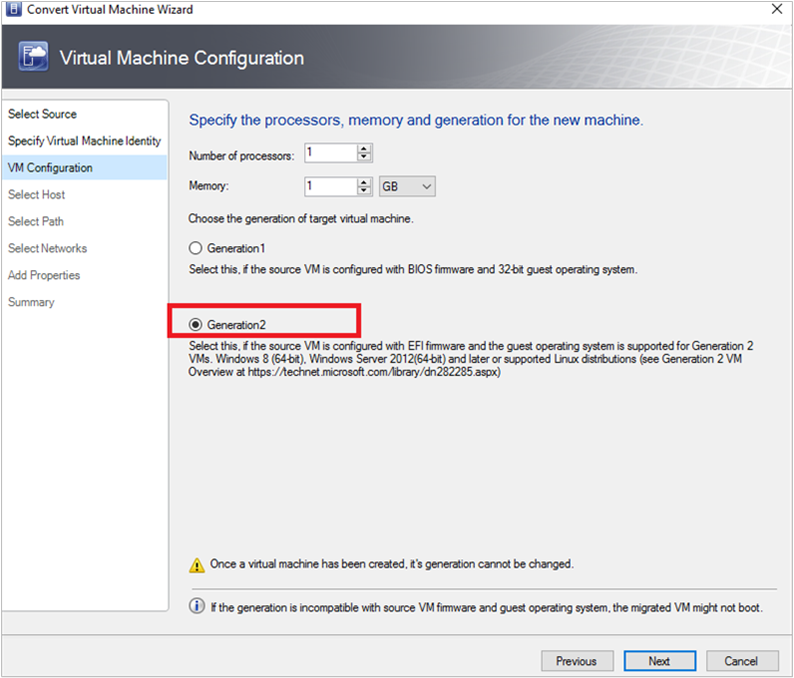

# Convert a VMware VM to Hyper-V in the VMM fabric


This article describes how to convert VMware VMs in the System Center - Virtual Machine Manager (VMM) fabric to Hyper-V.

::: moniker range=">=sc-vmm-2019"

You can convert the VMs using the *Convert Virtual Machine* wizard. You can use this wizard from the VMM console.

::: moniker-end

::: moniker range="sc-vmm-2019"

VMM 2019 UR3 supports conversion of VMware VMs to Hyper-V and Azure Stack HCI 20H2. [Learn more about support to Azure Stack HCI 20H2](deploy-manage-azure-stack-hci.md).

::: moniker-end

::: moniker range="sc-vmm-2019"


>[!Important]
  >- See [system requirements](system-requirements.md) for supported versions of vSphere (ESXi).
  >- You can't convert VMware workstations.
  >- You can't convert VMs with virtual hard disks connected to an IDE bus.
  >- Anti-virus apps must be supported.
  >- Online conversions aren't supported. You need to power off the VMware VMs.
  >- VMware tools must be uninstalled from the guest operating system of the VM.

>[!NOTE]
> From a same ESXi source to a same Hyper-V destination, we recommend not more than 10 VM conversions to be triggered in parallel. If the source-destination pair is different, VMM can support upto 100 VM conversions in parallel with the rest being queued. However, we recommend you stage the VM conversions in smaller batches for higher efficiency.

>[!NOTE]
> After conversion, all VM disks except for the OS disk will be offline. This is because the NewDiskPolicy parameter is set to offlineALL on VMware VMs by default. To override this and to have the new disks brought online after conversion, you can make one of the following changes to your VMware VM disk policy before initiating the conversion:
  >- Set-StorageSetting -NewDiskPolicy OfflineShared: To have all the new shared bus disks offline and all the new local bus disks online
  >- Set-StorageSetting -NewDiskPolicy OnlineAll: To have all the new disks online, regardless of whether the disks are on a local or shared bus.

::: moniker-end

::: moniker range="sc-vmm-2022"


>[!Important]
  >- See [system requirements](system-requirements.md) for supported versions of vSphere (ESXi).
  >- You can't convert VMware workstations.
  >- You can't convert VMs with virtual hard disks connected to an IDE bus.
  >- Anti-virus apps must be supported.
  >- Online conversions aren't supported. You need to power off the VMware VMs.
  >- VMware tools must be uninstalled from the guest operating system of the VM.
  >- We recommend upgrading to VMM 2022 UR2 to convert your VMware VMs to Hyper-V four times faster.

>[!NOTE]
> From a same ESXi source to a same Hyper-V destination, we recommend not more than 10 VM conversions to be triggered in parallel. If the source-destination pair is different, VMM can support upto 100 VM conversions in parallel with the rest being queued. However, we recommend you stage the VM conversions in smaller batches for higher efficiency.

>[!NOTE]
> After conversion, all VM disks except for the OS disk will be offline. This is because the NewDiskPolicy parameter is set to offlineALL on VMware VMs by default. To override this and to have the new disks brought online after conversion, you can make one of the following changes to your VMware VM disk policy before initiating the conversion:
  >- Set-StorageSetting -NewDiskPolicy OfflineShared: To have all the new shared bus disks offline and all the new local bus disks online
  >- Set-StorageSetting -NewDiskPolicy OnlineAll: To have all the new disks online, regardless of whether the disks are on a local or shared bus.

::: moniker-end

::: moniker range="sc-vmm-2016"
There are currently a couple of methods for converting VMware VMs to Hyper-V:

- **Convert Virtual Machine Wizard**: You can use this wizard from the VMM console.

  >[!Important]
    >- See [system requirements](system-requirements.md) for supported versions of vSphere (ESXi).
    >- You can't convert VMware workstations.
    >- You can't convert VMs with virtual hard disks connected to an IDE bus.
    >- Anti-virus apps must be supported.
    >- Online conversions aren't supported. You need to power off the VMware VMs.
    >- VMware tools must be uninstalled from the guest operating system of the VM.

- [**Microsoft Virtual Machine Converter**](https://techcommunity.microsoft.com/t5/system-center-blog/microsoft-virtual-machine-converter-3-0-is-now-available-for/ba-p/349874): This standalone tool converts VMware VMs to Hyper-V hosts or Azure VMs. It also converts physical machines and disks to Hyper-V hosts.

  >[!Important]
  > This tool has reached end of support.

::: moniker-end

## Convert using the wizard

1. Select **VMs and Services** > **Home** > **Create** > **Create Virtual Machines** > **Convert Virtual Machine**.
2. In **Convert Virtual Machine** wizard > **Select Source**, select **Browse** and in **Select Virtual Machine Source**, select the VMware VMs you want to convert.
3. In **Specify Virtual Machine Identity**, modify the machine name and description as required.
4. In **Virtual Machine Configuration**, specify the number of processors and memory settings.
5. In **Select Host**, select a Hyper-V host/Azure Stack HCI (applicable from VMM 2019 UR3 and later) for placement. In **Select Path**, configure the storage location on the host for the VM files. The default VM paths are listed.
6. In **Select Networks**, select the logical network, virtual network, and the VLAN as applicable.
7. In **Add Properties**, configure the required settings. In **Summary**, review the settings, and select **Start the virtual machine after deploying it** if necessary.
8. Select **Create** to start the conversion.
   Verify the VM's conversion in **VMs and Services** > **Home** > **Show** > **VMs**.

::: moniker range=">sc-vmm-2016"

## Convert EFI-based VM to Hyper-V generation 2 VM
System Center VMM enables the migration of EFI-based VMware VMs to Hyper-V. VMware VMs that you migrate to Microsoft Hyper-V platform can now take advantage of generation 2 features.

::: moniker-end

::: moniker range="sc-vmm-2019"

The **Convert Virtual Machine** wizard enables this migration. Based on the firmware type (BIOS or EFI), the wizard selects and defaults the Hyper-V VM generation appropriately.

::: moniker-end

::: moniker range="sc-vmm-2022"

The **Convert Virtual Machine** wizard enables this migration. Based on the firmware type (BIOS or EFI), the wizard selects and defaults the Hyper-V VM generation appropriately.

::: moniker-end

::: moniker range=">sc-vmm-2016"

- BIOS-based VMs are migrated to Hyper-V VM Generation 1.
- EFI-based VMs are migrated to Hyper-V VM Generation 2.

### Before you start
Ensure the following prerequisites are met:

- VMware VMs with firmware type as EFI
- VMware ESXi Hosts added in System Center VMM

### Conversion procedure
1. To convert, follow the [above procedure](#convert-using-the-wizard) and select **Generation 2** in step 4.

    

2. Once the VM is converted, you can see the Generation 2 VM as shown in the image below:

    

> [!NOTE]
> - PowerShell commands allow you to provide the disk type for the target Hyper-V VM, which will enable the VMware thick provisioned disk to be migrated as Hyper-V dynamic disk or vice versa, based on the requirements.

## Convert using PowerShell cmdlets

Here are the sample cmdlets:

```powershell

New-SCV2V -VMHost <Host> -VMXPath <string> [-EnableVMNetworkOptimization <bool>] [-EnableMACAddressSpoofing
<bool>] [-VMMServer <ServerConnection>] [-LibraryServer <LibraryServer>] [-JobGroup <guid>] [-Trigger] [-VhdType
{UnknownType | DynamicallyExpanding | FixedSize}] [-VhdFormat {VHD | VHDX}] [-Description <string>] [-Name
<string>] [-Owner <string>] [-UserRole <UserRole>] [-Path <string>] [-StartVM] [-CPUCount <byte>]
[-CPURelativeWeight <int>] [-CPUType <ProcessorType>] [-MemoryMB <int>] [-Generation <int>] [-DelayStartSeconds
<int>] [-StartAction {NeverAutoTurnOnVM | AlwaysAutoTurnOnVM | TurnOnVMIfRunningWhenVSStopped}] [-StopAction
{SaveVM | TurnOffVM | ShutdownGuestOS}] [-LogicalNetwork <LogicalNetwork>] [-VMNetwork <VMNetwork>]
[-NoConnection] [-MACAddress <string>] [-MACAddressType <string>] [-SourceNetworkConnectionID <string>]
[-VirtualNetwork <VirtualNetwork>] [-VirtualNetworkAdapter <VirtualNetworkAdapter>] [-VLanEnabled <bool>] [-VLanID
<uint16>] [-OverridePatchPath <string>] [-SkipInstallVirtualizationGuestServices] [-NetworkLocation <string>]
[-NetworkTag <string>] [-RunAsynchronously] [-PROTipID <guid>] [-JobVariable <string>]  [<CommonParameters>]
```

::: moniker-end

## Convert VMware VMs to Hyper-V faster

- As a prerequisite to start converting VMware VMs to Hyper-V four times faster, upgrade to SCVMM 2022 UR2 or later.
- As part of SCVMM 2022 UR2, a new registry named **V2VTransferChunkSizeBytes** is introduced at *HKLM:\SOFTWARE\Microsoft\Microsoft System Center Virtual Machine Manager Agent* in the Hyper-V hosts managed by SCVMM.
- This registry of type REG_DWORD, with a value of *2147483648*, which is 2 GB in bytes has to be set on every Hyper-V host managed by VMM by running [this script](https://download.microsoft.com/download/2/c/a/2caf6779-853a-4455-9c67-a0d2b1e2ccfe/Script%20To%20Add%20Registry%20with%20new%20Chunk%20Size%20On%20All%20Hosts.ps1) from the VMM Console.
- Alternatively, if you want to set this registry value in a single host and not on all the hosts, run [this script](https://download.microsoft.com/download/4/4/6/446e9dac-0356-44ce-a0c9-707a8d3e2bb0/Script%20To%20Add%20Registry%20with%20new%20Chunk%20Size%20On%20Single%20Host.ps1) from the VMM Console.
- After setting this registry value, if you remove any Hyper-V host(s) from SCVMM, stale entries for this registry might remain. If the same host(s) is re-added to SCVMM, the previous value of registry **V2VTransferChunkSizeBytes** will be honored. 


## Next steps

[Manage the VM settings](vm-settings.md).
