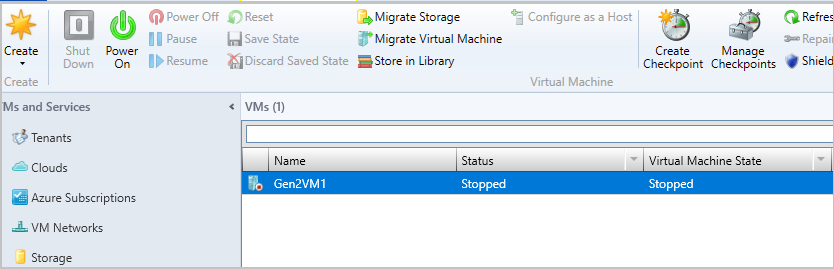
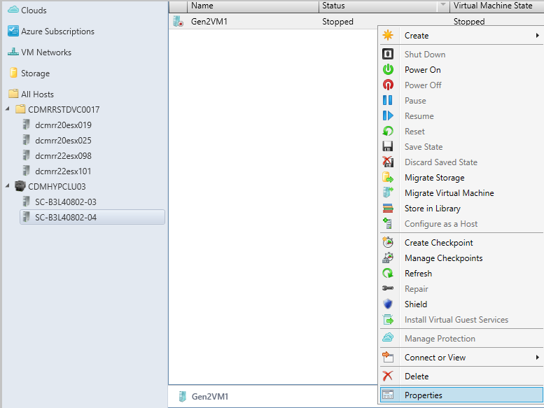
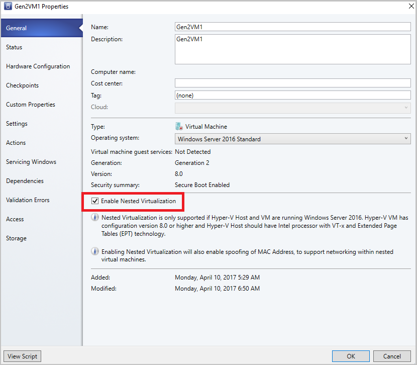
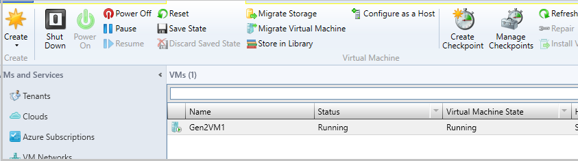
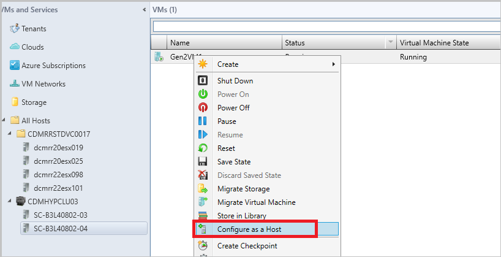
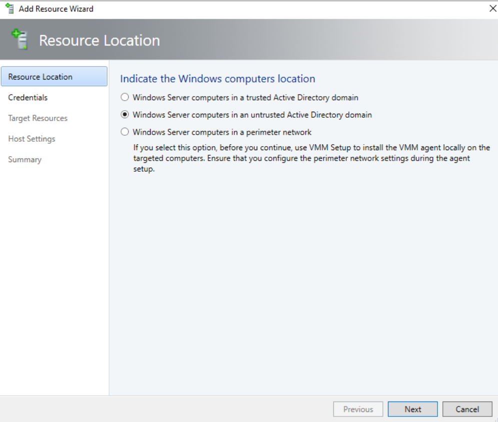

# Configure a nested VM as host (Technical preview)

Nested Virtualization is a new functionality in Windows Server 2016  and above that allows you to run Hyper-V inside a Hyper-V virtual machine. In other words, with nested virtualization, a Hyper-V host itself can be virtualized. Nested virtualization can be enabled out-of-band by using PowerShell and Hyper-V host configuration.

You can leverage the functionality to reduce your infrastructure expense for development and test scenarios without the need for individual hardware.

System Center VMM Preview 1711 (VMM 1711) allows you to enable and disable the nested virtualization through VMM console. You can configure the nested VM as a host in VMM and perform host operations from VMM, on this VM. For example, VMM dynamic optimization will consider a nested VM host for placement.

>[!NOTE]

> Virtualization applications other than Hyper-V are not supported in Hyper-V virtual machines, and are likely to fail. This includes any software that requires hardware virtualization extensions.

## Before you start

Ensure the following prerequisites are met:

- A Hyper-V host running Windows Server 2016, Windows Server 1709.
- A Hyper-V VM running Windows Server 2016, Windows Server 1709.
- A Hyper-V VM with configuration version 8.0 or greater.
- An Intel processor with VT-x and EPT technology.

## Procedure - configure a nested VM as a host

Enable the nested virtualization on a VM and then configure it as a host.
Administrators/delegated administrators can configure nested virtualization by using VMM. Use the following two procedures:

**Use the following steps**:

- [Enable nested virtualization on a  VM](#enable-nested-virtualization-on-an-existing-virtual-machine)
- [Configure the VM as a host in VMM](#configure-the-nested VM-as-a-host).

### Enable nested virtualization on an existing virtual machine

1.	Identify the VM that meets the above [pre-requisites](before-you-start).
2.	Ensure the VM is in **stopped** state.

    

3. Browse the selected VM’s  **Properties**.

4. On **General**, select **Enable Nested Virtualization**.

### Configure the nested VM as a host
1.	Enable the following inbound and outbound firewall rules on the nested VM that you want to configured as the host.

    **Inbound Firewall rules**

    - File and printer sharing
    - Windows remote management (HTTP-In)
    - Windows management Instrumentation

    **Outbound Firewall rules**
    - File and printer sharing
    - Windows management instrumentation (WMI-Out)

2. Ensure the VM is in **running** state. Start the VM if it is not running.

    

2. Right-click the VM and select **Configure as a Host**. The **Add Resource** wizard appears.

    

    

3. Run through the wizard, select the options as appropriate and complete the wizard.

### Disable nested virtualization

1.	Select the host or VM for which nested virtualization is enabled.
2.	Ensure the VM is in **stopped** state. Stop the VM if it is running.
3.	Browse the VM **Properties**.
4.	On **General**, clear the **Enable Nested Virtualization** CheckBox.

    >[!NOTE]

    > Check the note at the bottom of the wizard page before you disable nested virtualization.

## [Next steps](https://docs.microsoft.com/en-us/virtualization/hyper-v-on-windows/user-guide/nested-virtualization)
