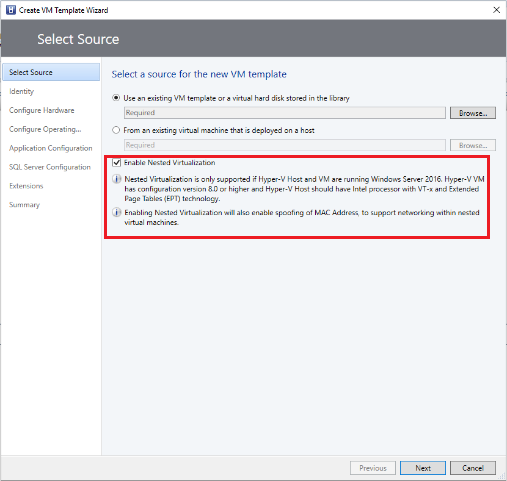
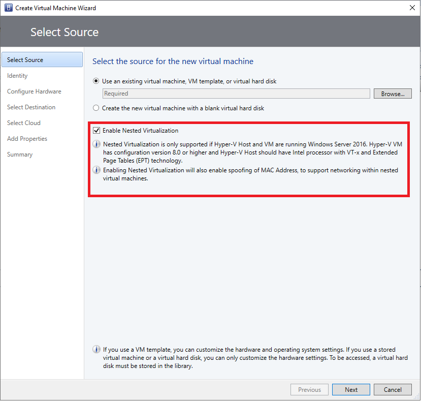
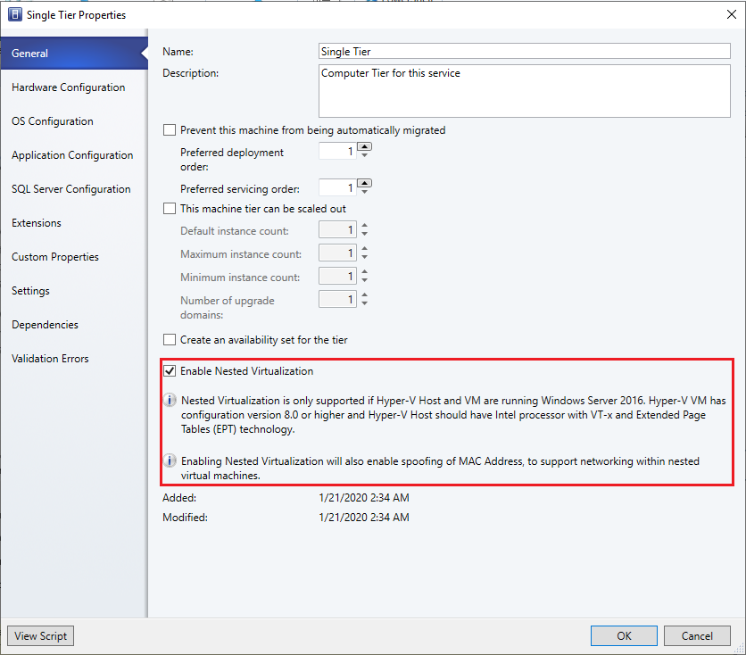

# Configure a nested VM as a host

::: moniker range=">= sc-vmm-1801 <= sc-vmm-1807"

[!INCLUDE [eos-notes-virtual-machine-manager.md](../includes/eos-notes-virtual-machine-manager.md)]

::: moniker-end

Nested virtualization is a functionality in Windows Server 2016 and above that allows you to run Hyper-V inside a Hyper-V virtual machine. In other words, with nested virtualization, a Hyper-V host itself can be virtualized. Nested virtualization can be enabled out-of-band by using PowerShell and Hyper-V host configuration.

You can leverage this functionality to reduce your infrastructure expense for development and test scenarios without the need for individual hardware.

With System Center - Virtual Machine Manager (VMM) 1801 and later, you can enable and disable the nested virtualization feature through VMM console. You can configure the nested Virtual Machine (VM) as a host in VMM and perform host operations from VMM, on this VM. For example, VMM dynamic optimization will consider a nested VM host for placement.

Enable the nested virtualization on a VM and then configure it as a host.

>[!NOTE]
> Virtualization applications other than Hyper-V are not supported in Hyper-V virtual machines, and are likely to fail. This includes any software that requires hardware virtualization extensions.

## Before you start

::: moniker range="sc-vmm-2019"

Ensure the following prerequisites are met:

- A Hyper-V host running Windows Server 2016, Windows Server 2019.
- A Hyper-V VM running Windows Server 2016, Windows Server 2019.
- A Hyper-V VM with configuration version 8.0 or greater.
- An Intel processor with VT-x and EPT technology.

::: moniker-end

::: moniker range="<sc-vmm-2019"

Ensure the following prerequisites are met:

- A Hyper-V host running Windows Server 2016.
- A Hyper-V VM running Windows Server 2016.
- A Hyper-V VM with configuration version 8.0 or greater.
- An Intel processor with VT-x and EPT technology.

::: moniker-end

## Enable network virtualization

Administrators/delegated administrators can configure nested virtualization by using VMM. Use the following procedures:

- [Enable nested virtualization](#enable-nested-virtualization-on-an-existing-virtual-machine)
- [Configure the VM as a host in VMM](#configure-the-nested-vm-as-a-host)

### Enable nested virtualization on an existing virtual machine

1.	Identify the VM that meets the above [prerequisites](#before-you-start).
2.	Ensure the VM is in **stopped** state.

    

3. Browse the selected VM’s  **Properties**.

4. On **General**, select **Enable Nested Virtualization**.

## Configure the nested VM as a host
1.	Enable the following inbound and outbound firewall rules on the nested VM that you want to configured as the host.

    **Inbound Firewall rules**

    - File and printer sharing
    - Windows remote management (HTTP-In)
    - Windows management Instrumentation

    **Outbound Firewall rules**
    - File and printer sharing
    - Windows management instrumentation (WMI-Out)

2. Ensure the VM is in **running** state. Start the VM if it is not running.

    

2. Right-click the VM and select **Configure as a Host**. The **Add Resource** wizard appears.

    

    

3. Run through the wizard, select the options as appropriate and complete the wizard.

## Disable nested virtualization

1.	Select the host or VM for which nested virtualization is enabled.
2.	Ensure the VM is in **stopped** state. Stop the VM if it is running.
3.	Browse the VM **Properties**.
4.	On **General**, clear the **Enable Nested Virtualization** check box.

    >[!NOTE]
    > Check the note at the bottom of the wizard page before you disable nested virtualization.

::: moniker range="sc-vmm-2019"

## Nested virtualization in 2019 ur1

With VMM 2019 UR1, in addition to enabling nested virtualization on an existing VM, you can also enable nested virtualization while creating new VMs through VM templates, service templates or through VM creation wizard on VMM console.

- [Enable nested virtualization through VM templates](#enable-nested-virtualization-through-vm-templates)

- [Enable nested virtualization through *Create Virtual Machines wizard*](#enable-nested-virtualization-through-create-virtual-machines-wizard)

- [Enable nested virtualization through service templates](#enable-nested-virtualization-through-service-template)

### Enable nested virtualization through VM templates
You can enable nested virtualization on VMs that are created through a VM template.

>[!NOTE]
> Ensure the VMs that will be created using this templates meets the above [prerequisites](#before-you-start).

To enable nested virtualization, on the **Create VM Template Wizard**, select **Select Source** and then select **Enable Nested Virtualization** on the right pane of the wizard.

### Enable nested virtualization through create virtual machines wizard

You can enable nested virtualization on VMs that are created through Create Virtual Machine wizard.

>[!NOTE]
> Ensure the VMs that will be created using this wizard meets the above [prerequisites](#before-you-start).

To enable nested virtualization, on the **Create Virtual Machines wizard**, select  **Select Source** and then select **Enable Nested Virtualization** on the right pane of the wizard.

### Enable nested virtualization through service template
You can enable nested virtualization on VMs that are created through service templates.

>[!NOTE]
> Ensure the VMs that will be created using this template meets the above [prerequisites](#before-you-start).

To enable nested virtualization,  from  **Single Tier Properties**, select  **General** and then select **Enable Nested Virtualization** on the right pane of the wizard.

::: moniker-end

## Next steps
[Run Hyper-V in a nested VM](https://docs.microsoft.com/virtualization/hyper-v-on-windows/user-guide/nested-virtualization)
