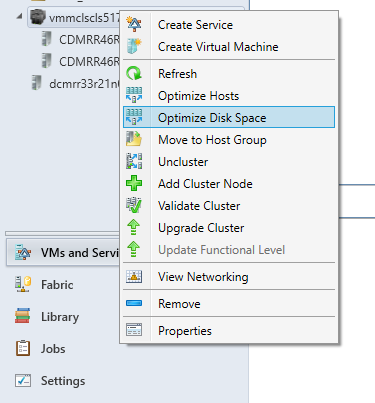

# Set up dynamic and power optimization in the VMM compute fabric

Read this article to learn about enabling dynamic optimization (DO) and power optimization for virtual machines (VMs) in the System Center - Virtual Machine Manager (VMM) compute fabric. The article includes features overview, instructions for setting up BMC for power optimization, and describes how to enable and run these features.

- **Dynamic optimization**: Using dynamic optimization, VMM performs live migration of VMs and VHDs within a host cluster, using the settings you specify, to improve load balancing among hosts and cluster shared volumes (CSVs), and to correct the placement issues for VMs.
- **Power optimization**: Power optimization is a feature of dynamic optimization that saves energy by turning off hosts that aren't needed to meet resource requirements within a cluster, and turns them back on when they're needed.

VMM supports dynamic optimization and power optimization on Hyper-V host clusters, and on VMware host clusters in the VMM fabric that support live migration.

## Before you start

### Dynamic optimization

- Dynamic optimization and power optimization can be configured on host clusters that support live migration.
- Dynamic optimization can be configured on a host group, to migrate virtual machines and virtual hard disks (VHDs) within host clusters with a specified frequency and aggressiveness. Aggressiveness determines the amount of load imbalance that is required to initiate a migration during dynamic optimization.
- By default, virtual machines are migrated every 10 minutes with medium aggressiveness, if automatic migration is enabled. When configuring frequency and aggressiveness  for dynamic optimization, an administrator should factor in the resource cost of additional migrations against the advantages of balancing load among hosts/CSVs in a host cluster. By default, a host group inherits Dynamic Optimization settings from its parent host group.
- If you set up dynamic optimization on a host group without a cluster it will have no effect.
- Dynamic optimization can be set up for clusters with two or more nodes. If a host group contains stand-alone hosts or host clusters that do not support live migration, dynamic optimization isn't performed on those hosts. Any hosts that are in maintenance mode also are excluded from dynamic optimization. In addition, VMM only migrates highly available virtual machines that use shared storage. If a host cluster contains virtual machines that are not highly available, those virtual machines are not migrated during Dynamic Optimization.
- On-demand dynamic optimization is also available for individual host clusters by using the Optimize Hosts/ Optimize Disk space  action in the VMs and Services workspace. It can be performed without configuring dynamic optimization on host groups. After dynamic optimization is requested for a host cluster, VMM lists the virtual machines that will be migrated, for the administrator's approval. Optimize Hosts performs VM load balancing across hosts in a cluster, while Optimize disk space migrates VHDs across CSVs in a cluster.

#### Node fairness

Node fairness is a new fdature in Windows Server 2016. It identifies cluster nodes with light loads, and distributes VMs to those node to balance load. This is similar to VMM's dynamic optimization. To avoid potential performance issues, dynamic optimization and node fairness shouldn't work together. To ensure this doesn't happen VMM disables node faireness in all clusters in a host group for which dynamic optimization is set to automatic. If you enable node fairness outside the VMM console, VMM will turn it off the next time that dynamic optimization refreshes. If you do want to use node faireness, disable dynamic optimization, and then manually enable node fairness.

### Power optimization

- For power optimization, the computers must have a baseboard management controller (BMC) that enables out-of-band management.
- Power optimization ensures that a cluster maintains a quorum if an active node fails. For clusters created outside VMM and added to VMM, Power Optimization requires more than four nodes. For each additional one or two nodes in a cluster, one node can be powered down. For instance:
	- One node can be powered down for a cluster of five or six nodes.
	- Two nodes can be powered down for a cluster of seven or eight nodes.
	- Three nodes can be powered down for a cluster of nine or ten nodes.
- When VMM creates a cluster, it creates a quorum disk and uses that disk as part of the quorum model. For clusters created by VMM, Power Optimization can be set up for clusters of more than three nodes. This means that the number of nodes that can be powered down is as follows:
	- One node can be powered down for a cluster of four or five nodes.
	- Two nodes can be powered down for a cluster of six or seven nodes.
	- Three nodes can be powered down for a cluster of eight or nine nodes.

## Configure BMC

For hosts with BMC that supports IMPI 1.5/2.0, DCMI 1.0 or SMASH 1.0 overe WS-Management you can figure BMC settings as follows:

1. Create a Run As account with permissions to access the BMC on a host.
2. Click **Fabric** > **Servers** > **All Hosts** > host > **Properties** > **Hardware** > **Advanced** > **BMC Setting**.
3. To enable VMM management, select **This physical machine is configured for OOB management**.
4. In **This computer supports the specified OOB power management configuration provider**, click the supported management protocol. Type in the IP address of the BMC, and accept the default port offered by VMM. Select the Run As account and click **OK**.

## Enable dynamic and power optimization for a host group

1.  Click **Fabric** > **Servers** > **All Hosts**, and select the host group that you want to configure.
2.  With the host group selected, click **Folder** > **Properties** group > **Properties**.
3.  In the host group properties, click **Dynamic Optimization**.
4.  In  **Specify dynamic optimization settings**, clear the **Use Dynamic Optimization settings from the parent host group** check box.
5.  In **Aggressiveness**, select **High**, **Medium**, or **Low**.

    Aggressiveness determines the amount of imbalance in virtual machine load on the hosts that is required in order to initiate a migration during Dynamic Optimization. When you configure frequency and aggressiveness for dynamic optimization, you should try to balance the resource cost of additional migrations against the advantages of balancing load among hosts in a host cluster. Initially, you might accept the default value of **Medium**. After you observe the effects of dynamic optimization in your environment, you can increase the aggressiveness.

    To help conserve energy by having VMM turn off hosts when they are not needed and turn them on again when they are needed, configure power optimization for the host group. Power optimization is only available when virtual machines are being migrated automatically to balance load.

6.  To periodically run dynamic optimization on qualifying host clusters in the host group, enter the following settings:

    1.  Select the **Automatically migrate virtual machines to balance load** check box.
    2. In **Frequency**, specify how often to run dynamic Optimization. You can enter any value between 10 minutes and 1440 minutes \(24 hours\).

7.  To turn on power optimization on the host group, select the **Enable power optimization** check box.  Click **OK** again to save your changes.

## Configure power optimization settings

1.  In the **Fabric** navigate to the host group and open its properties.
2.  Click **Dynamic Optimization** > **Specify dynamic optimization settings** > **Settings**.
3.  In **Customize Power Optimization Schedule**, change the settings for any of these resources: CPU, memory, disk I/O , or network I/O.
4.  Under **Schedule**, select the hours when you want power optimization to be performed. Click a box to turn power optimization on or off for that hour. VMM applies the schedule according to the host time zone.

## Run dynamic optimization on-demand in a host cluster

You can run dynamic optimization on demand on a host cluster. within a host cluster. To do this dynamic optimization doesn't need to be configured on the parent host group.

1. Open **Fabric** > **Servers** > **Host Groups**, and navigate the host cluster.
2. To optimize VM load on host, click **Folder** > **Optimization** > **Optimize Hosts**. VMM performs a dynamic optimization review to determine whether virtual machines can be migrated to improve load balancing in the host cluster. If migrating virtual machines can improve load balancing, VMM displays a list of virtual machines that are recommended for migration, with the current and target hosts indicated. The list excludes any hosts that are in maintenance mode in VMM and any virtual machines that are not highly available.
3. Click **Migrate**.

## Set storage DO thresholds

You can set the threshold value to receive a warning while you replace the VHD placement, if the placement causes the CSV free storage space to fall below the threshold.  You can also choose to automatically migrate the VHDs when the free storage space in CSV falls below the threshold.

 > [!NOTE]
 >
 - Clusters should have more than one CSV.
 - By default, you can set the Dynamic Optimization (DO) at host group level. To use the settings from parent host group, select the *Use Dynamic Optimization settings from the parent host group* checkbox.

Use the following steps:

 1. To set CSV free space threshold and receive a warning during placement or auto VHD migration between CSVs in a cluster, go to <add additional details for path here> **Dynamic Optimization**, enter a value in **Disk Space**
  The value can be represented in either GB or % of CSV allocated storage space.

2. Select the frequency to set the time interval at which the storage DO should run.

	The frequency number for compute and storage DO must be the same value in minutes.

 	

> [!NOTE]

> To run a storage DO manually, select a **cluster** > **Optimize Disk Space**. This operation will return a list of VHDs that will be migrated to other CSVs in the cluster if any of the CSVs had free storage below the threshold.

## Power a computer on and off in VMM

1. Click **Fabric** > **Servers** > **All Hosts** > host name.
2. On the **Host** tab, in the **Host** group click **Power On** or **Power Off**. You can view information about power on and off events in the BMC logs (click on **Hardware** > **Advanced** > **BMC Logs**).

## Next steps

Learn about [provisioning VMs](provision-vms.md).
