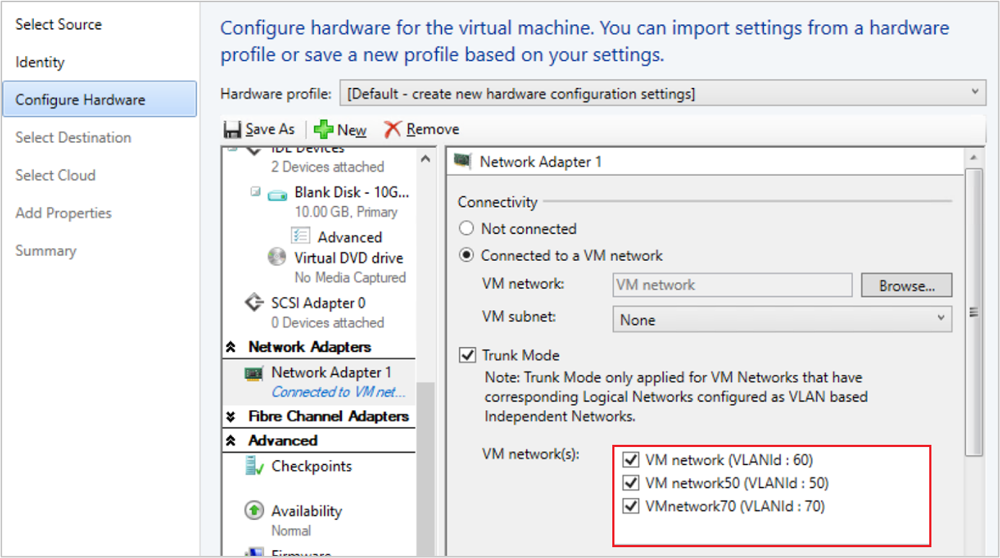

# Configure virtual machine settings in the VMM compute fabric


This article describes how to configure performance and availability settings for VMs in the System Center Virtual Machine Manager (VMM) fabric.

Settings include changing VM properties and setting up performance options, such as quality-of-storage (QoS), availability options, resource throttling, and virtual NUMA.

## Add a virtual adapter to a VM

You can add and remove virtual network adapters (vNICs) from VMs that are running. This reduces the workload downtime.

> [!NOTE]
> - You add new virtual network adapters by creating or modifying a VMM hardware profile.
> - This feature is only available for Generation 2 VMs.
> - By default, added virtual network adapters aren't connected to a virtual network. You can configure VMs assigned with the hardware profile to use one or more of the virtual network adapters after they're deployed on a host.


1. In the virtual machine properties > **Hardware Configuration**, select **Network Adapters**, and select the network adapter you want to add.


2. You can configure many properties for the network adapter, including:

    - **Connected to**: Select what the adapter is connected to.
    - **Not connected**: Select if you don't want to specify a network now.
    - **Internal network**: Select if you want to connect to an isolated internal network that enables communication among VMs on the same host. Virtual machines attached to the internal virtual network can't communicate with the host, with any other physical computers on the host's LAN, or with the Internet.
    - **External network**: Select to specify that a virtual machine created using this hardware profile will be connected to a physical network adapter on its host. Virtual machines attached to a physical network adapter can communicate with any physical or virtual computer that the host can communicate with and with any resources available on the intranet and over the Internet that the host computer can access.
    - **Ethernet (MAC) address**: A virtual MAC address on virtual machines uniquely identifies each computer on the same subnet. Select one of the following options:
        - **Dynamic**: Select this option if you want to enable a dynamic MAC address for a virtual machine.
        - **Static**: Select this option if you want to specify a static MAC address for a virtual machine. Enter a static MAC address in the field provided.
        - **Trunk Mode**: Select to enable Trunk mode.

::: moniker range="sc-vmm-2019"

VMM 2019 UR3 and later support *trunk* mode for VM vNICs.

::: moniker-end

## Support for trunk mode

> [!NOTE]
> **Trunk mode** is supported only in VLAN-based independent networks.

Trunk mode is used by NFV/VNF applications like virtual firewalls, software load balancers, and virtual gateways to send and receive traffic over multiple vLANs. You can enable trunk mode through console and PowerShell.

See the following section for enabling Trunk mode through console; see [Set-SCVirtualNetworkAdapter](/powershell/module/virtualmachinemanager/set-scvirtualnetworkadapter?preserve-view=true&view=systemcenter-ps-2019) and [New-SCVirtualNetworkAdapter](/powershell/module/virtualmachinemanager/new-scvirtualnetworkadapter?preserve-view=true&view=systemcenter-ps-2019) for enabling through PowerShell commandlets.

## Configure trunk mode

To configure trunk mode in VMM, follow these steps:

1. Under VM **Properties**, navigate to **Configure Hardware Settings** > **Network Adapter**, and select **Trunk mode** to enable trunk mode for VM vNICs.
1. Select the VM networks (multiple vLANs) through which you want to direct the VM network traffic.

3. The VM Network that is selected as part of *Connected to a VM Network* workflow must also be made the native VLAN. You can't change the native VLAN later, as this is based on the VM network that was selected as part of *Connected to a VM Network* workflow.

### Add a virtual adapter with PowerShell

You can use PowerShell to add a virtual adapter.

Here are the sample cmdlets for setting this up. Select the required tab to view or copy the sample cmdlets:

# [Add a vNIC](#tab/AddvNIC)

Sample cmdlets for adding a vNIC:

- The first command gets the virtual machine object named VM01 and then stores the object in the $VM variable.
- The second command creates a virtual network adapter on VM01.

```
PS C:\> $VM = Get-SCVirtualMachine -Name "VM01"
PS C:\> New-SCVirtualNetworkAdapter -VM $VM -Synthetic
```

# [Remove a vNIC](#tab/RemovevNIC)

The following PowerShell commands will remove a vNIC from a running VM. It assumes there's only one vNIC on the VM.

- The first command gets the virtual machine object named VM02, and then stores the object in the $VM variable.
- The second command gets the virtual network adapter object on VM02, and then stores the object in the $Adapter variable.
- The last command removes the virtual network adapter object stored in $Adapter from VM02.

```
PS C:\> $VM = Get-SCVirtualMachine -Name "VM02"
PS C:\> $Adapter = Get-SCVirtualNetworkAdapter -VM $VM
PS C:\> Remove-SCVirtualNetworkAdapter -VirtualNetworkAdapter $Adapter
```
---

## Manage static memory on a running VM

You can modify the memory configuration of a running VM that uses static memory. This feature helps in eliminating workload downtime due to reconfiguration. You can increase or decrease the memory allocation, or switch the virtual machine to dynamic memory. Users can already modify dynamic memory for a running VM from VMM, and this feature is about modifying the static memory.

Use the following PowerShell examples to modify the static memory setting.

### Example 1

 Change the static memory for a running virtual machine.

- The first command gets the virtual machine object named VM01, and then stores the object in the $VM variable.
 - The second command changes the memory allocated to VM01 to 1024 MB.

```
PS C:\> $VM = Get-SCVirtualMachine -Name "VM01"
PS C:\> Set-SCVirtualMachine -VM $VM -MemoryMB 1024
```


### Example 2

Enable dynamic memory for a running virtual machine.

- The first command gets the virtual machine object named VM02, and then stores the object in the $VM variable.
- The second command enables dynamic memory, sets the startup memory to 1024 MB, and sets the maximum memory to 2048 MB.

```
PS C:\> $VM = Get-SCVirtualMachine -Name "VM02"
PS C:\> Set-SCVirtualMachine -VM $VM -DynamicMemoryEnabled $True -MemoryMB 1024 -DynamicMemoryMaximumMB 2048
```

## Add a servicing window to a VM

You can set up a servicing window for a VM or service so that you can maintain it outside the VMM console. You [set up the window](hyper-v-service.md#set-up-a-servicing-window) and assign it to the VM properties.


## Create a production checkpoint for a VM

Production checkpoints allow you to easily create *point in time* images of a VM, which can then be restored later.

- Production checkpoints are achieved using backup technology inside the guest to create the checkpoint instead of using the saved state technology.
- On a virtual machine running a Windows operating system, production checkpoints are created with the Volume Snapshot Service (VSS).
- Linux virtual machines flush their file system buffers to create a file system consistent checkpoint.
- If you want to create checkpoints using saved state technology, you can still choose to use standard checkpoints for your virtual machine.
- You can set one of these checkpoint settings for a VM:

    - **Disabled**: No checkpoint taken.
    - **Production**: Production checkpoints are application consistent snapshots of a virtual machine. Hyper-V uses the guest VSS provider to create an image of the virtual machine where all its applications are in a consistent state. The production snapshot doesn't support the autorecovery phase during creation. Applying a production checkpoint requires the restored virtual machine to boot from an off-line state just like with a restored backup. This is always more suitable for production environments.
    - **ProductionOnly**: This option is the same as Production with one key difference: With ProductionOnly, if a production checkpoint fails, then no checkpoint will be taken. This is different from Production where if a production checkpoint fails, a standard checkpoint will be taken instead.
    - **Standard**: All the memory state of running applications gets stored so that when you apply the checkpoint, the application reverts to the previous state. For many applications this wouldn't be suitable for a production environment. Therefore, this type of checkpoint is typically more suitable for development and test environments for some applications.

Set the checkpoint with the following PowerShell command:
`Set-SCVirtualMachine -CheckpointType (Disabled, Production, ProductionOnly, Standard)`

> [!NOTE]
> - VM Checkpoints with a `Recovery` SnapshotType will not be visible from SCVMM.

## Configure availability options for clustered VMs

You can configure many settings that help high availability and resilience for virtual machines in a cluster:

- **Storage QoS**: You can configure Hyper-V VM hard disks with quality-of-service (QoS) settings to control bandwidth. You use Hyper-V Manager to do this.
- **Virtual machine priority**: You can configure priority settings for VMs deployed in a host cluster. Based on VM priority, the host cluster starts or places high-priority virtual machines before medium-priority or low-priority virtual machines. This ensures that the high-priority virtual machines are allocated memory and other resources first for better performance. Also, after a node failure, if the high-priority virtual machines don't have the necessary memory and other resources to start, the lower priority virtual machines will be taken offline to free up resources for the high-priority virtual machines. Virtual machines that are preempted are restarted later in priority order.
- **Preferred and possible owners of virtual machines**: These settings influence the placement of virtual machines on the nodes of the host cluster. By default, there are no preferred owners (there's no preference), and the possible owners include all server nodes on the cluster.
- **Availability sets**: When you place multiple virtual machines in an availability set, VMM will attempt to keep those virtual machines on separate hosts and avoid placing them together on the same host whenever possible. This helps to improve continuity of service.

Select the required tab for steps to configure QoS, priority, preferred owners, or availability sets:

# [Configure QoS for a VM](#tab/ConfigureQoS)

Follow these steps to configure QoS for a VM:

1. Open **Hyper-V Manager** and select **Action** > **Settings**.
2. In **SCSI Controller**, select **Hard Drive**
3. In **Advanced Features**, select **Enable Quality of Service management**.
4. Specify minimum and maximum IOPS values.

# [Configure priority](#tab/ConfigurePriority)

Follow these steps to configure priority:

1. Configure a virtual machine or virtual machine template using one of the following options:

    - To configure a deployed virtual machine, in **VMs and Services**, navigate to the host on which the virtual machine is deployed. Right-click the virtual machine > **Properties**.
    - To configure a stored virtual machine, in the **Library**, navigate to the library server on which the virtual machine is stored. Right-click the virtual machine > **Properties**.
    - You can also set up priority while you're configuring a VM on the **Configure Hardware** page.
    To configure a virtual machine template, in **Library** > **Templates**, select **VM Templates**. Right-click the virtual machine template, > **Properties**.
3. In **Hardware Configuration** or **Configure Hardware**, scroll down to **Advanced**, and select **Availability**. Ensure that **Make this virtual machine highly available** is checked. On a deployed virtual machine, this setting can't be changed because it depends on whether the virtual machine is deployed on a host cluster.
4. In **Virtual machine priority**, select a priority of High, Medium, or Low for the VM. If you want the virtual machine to always require a manual start and never preempt other virtual machines, select **Do not restart automatically**.

# [Configure preferred owners](#tab/ConfigureOwners)

Follow these steps to configure preferred owners:

1. In **VMs and Services**, navigate to the host on which the virtual machine is deployed. Right-click the virtual machine > **Properties**.
2. Select **Settings** and configure the options:

    - To control which nodes (servers) in the cluster will own the virtual machine most of the time, configure the preferred owners list.
    - To prevent a virtual machine from being owned by a particular node, configure the possible owners list, omitting only the nodes that must never own the virtual machine.

# [Configure availability sets](#tab/ConfigureAvailabilitySets)

You can configure availability sets for standalone VMs in a cluster, or in availability sets in a service template, to specify how VMs created with the template must be placed on hosts.

Follow these steps to configure availability sets:

1. Configure a virtual machine or virtual machine template using one of the following options:

    - To configure a deployed virtual machine, in **VMs and Services**, navigate to the host on which the virtual machine is deployed. Right-click the virtual machine > **Properties**.
    - To configure a stored virtual machine, in the **Library**, navigate to the library server on which the virtual machine is stored. Right-click the virtual machine > **Properties**.
    - You can also set up priority while you're configuring a VM on the **Configure Hardware** page.
    - To configure a virtual machine template, in **Library** > **Templates**, select **VM Templates**. Right-click the virtual machine template, > **Properties**.

2.  On the **Hardware Configuration** tab, scroll down to **Advanced** and under it, select **Availability**.
3.  Confirm that **Make this virtual machine highly available** has the intended setting. (On a deployed virtual machine, the setting can't be changed because it depends on whether the virtual machine is deployed on a host cluster.)
4.  Under **Availability sets**, select **Manage availability sets**.
5.  Select the name of an availability set, and use the controls to add or remove the set. Repeat this action until all the intended availability sets appear in the **Assigned properties** list. To create a new availability set, select the **Create** button, provide a name for the set, and select **OK**.
6.  To verify the setting for a deployed virtual machine, in the listing for the virtual machine, view the name under **Availability Set Name**.

For virtual machines that have been deployed on a host cluster, another way to configure this setting is to use Windows PowerShell commands for failover clustering. In this context, the setting appears in the [Get-ClusterGroup](/powershell/module/failoverclusters/get-clustergroup) as **AntiAffinityClassNames**.

---

## Configure resource throttling

VMM includes resource throttling features, such as processor (CPU) and memory throttling, to control resource allocation and help virtual machines to run more effectively.

- **Processor throttling**: You can set the weight of a virtual processor to provide the processor with a larger or smaller share of CPU cycles. The properties ensure that VMs can be prioritized or deprioritized when CPU resources are overcommitted. For highly intensive workloads, more virtual processors can be added, especially when a physical CPU is close to its upper limit.
    -   **High, Normal, Low, Custom**: Specifies how the CPU is distributed when contention occurs. Higher priority virtual machines will be allocated CPU first.
    - **Reserve CPU cycles (%)**: Specifies the percentage of CPU resources that are associated with one logical processor that must be reserved for the virtual machine. This is useful when a virtual machine runs applications that are particularly CPU-intensive and you want to ensure a minimal level of CPU resources. A zero setting indicates that no specific CPU percentage is reserved for the virtual machine.
    - **Limit CPU cycles (%)**: Specifies that the virtual machine must not consume more than the indicated percentage of one logical processor.

- **Memory throttling and weight**: Memory throttling helps to prioritize or deprioritize access to memory resources in scenarios where memory resources are constrained. When memory usage on a host is high, the virtual machines with a higher memory priority are allocated memory resources before the virtual machines with a lower priority. If you specify a lower priority, it might prevent a virtual machine from starting when other virtual machines are running, and the available memory is low. You can set the memory priority settings and thresholds as follows:

  - **Static**: The amount of static memory that is assigned to a specific virtual machine.
  - **Dynamic**: Dynamic memory settings include:
     - **Start-up memory**: The amount of memory that is allocated to the virtual machine when it starts up. It must at least be set to the minimum amount of memory that is required to run the operating system and applications on the virtual machine. Dynamic memory will adjust the memory amount as required.
     - **Minimum memory**: The minimum amount of memory that is required for the virtual machine. It allows an idle machine to scale back the memory consumption below the start-up memory requirement. The available memory can then be used by other virtual machines.
     - **Maximum memory**: The memory limit that is allocated to the virtual machine. The default value is 1 TB.
     - **Memory Buffer Percentage**: Dynamic memory adds memory to a virtual machine as required, but there's a chance that an application might demand memory more quickly than the dynamic memory allocates it. The memory buffer percentage specifies the amount of available memory that will be assigned to the virtual machine if needed. The percentage is based on the amount of memory that is needed by the applications and services that run on the virtual machine. It's expressed as a percentage because it changes depending on the virtual machine requirements. The percentage is calculated as follows: Amount of memory buffer = memory needed by the virtual machine/(memory buffer value/100). For example, if the memory that is committed to the virtual machine is 1000 MB and the buffer is 20%, then an additional buffer of 20% (200 MB) will be allocated for a total of 1200 MB of physical memory allocated to the virtual machine.
  - **Memory weight**: The priority that is allocated to a virtual machine when the memory resources are in full use. If you set a high priority value, it will prioritize a virtual machine when the memory resources are allocated. If you set a low priority, a virtual machine might be unable to start if memory resources are insufficient.
  
Select the required tab for steps to configure processor or memory throttling:

# [Processor throttling](#tab/ProcessorThrottling)

Follow these steps to configure processor throttling:

1. In the virtual machine > **Properties** > **Advanced**, select **CPU Priority**.
2. Select a priority value for the virtual machine. These values specify how the CPU resources are balanced between virtual machines and correspond to the relative weight value in Hyper-V:

   - High - Relative weight value of 200
   - Normal - Relative weight value of 100
   - Low - Relative weight value of 50
   - Custom - Relative weight values that are supported are between 1 and 10000

3. In **Reserve CPU cycles (%)**, specify the percentage of the CPU resources on one logical processor that must be reserved for a virtual machine. This is useful when a virtual machine runs applications that are particularly CPU-intensive and you want to ensure a minimal level of CPU resources. A zero setting indicates that no specific CPU percentage is reserved.
4. In **Limit CPU cycles (%)**, specify the maximum percentage of the CPU resources on one logical processor that the virtual machine must consume. The virtual machine won't be allocated more than this percentage.

# [Memory throttling](#tab/MemoryThrottling)

Follow these steps to configure memory throttling:

1. In the virtual machine > **Properties** > **General**, select **Memory**.
2. Select **Static** to specify that a fixed amount of memory must be assigned to a virtual machine.
3. Select **Dynamic** to specify the dynamic memory settings for a virtual machine, as follows:

   - In **Startup memory**, specify the amount of memory that is allocated to the virtual machine when it starts up. The memory value must be set at least to the minimum amount of memory that's required for the virtual machine operating system and applications to run.
   - In **Minimum memory**, specify an amount of memory that allows an idle virtual machine to scale back the memory consumption below the startup memory requirement. This makes more memory available for use by other virtual machines.
   - In **Maximum memory**, specify the maximum amount of memory that is allocated to a virtual machine. The default setting is 1 TB.
   - In **Memory buffer percentage**, specify the amount of available memory that will be assigned to a virtual machine if the need arises. The percentage must be based on the amount of memory that is actually needed by the applications and services that run on the virtual machine. The memory buffer percentage must be calculated as follows: Amount of memory buffer = memory that is needed by the virtual machine/(memory buffer value/100). For example, if the memory that is committed to the virtual machine is 1000 MB and the buffer is 20%, then an additional buffer of 20% (200 MB) will be allocated for a total of 1200 MB of physical memory allocated to the virtual machine.

---

## Configure virtual NUMA

You configure, deploy, and manage virtual Non-Uniform Memory Access (NUMA) in VMM. Virtual NUMA has the following properties:

- NUMA is a memory architecture that is used in multiprocessor systems, where the time that is required for a processor to access memory depends on the location of the memory relative to the processor. On a NUMA system, a processor can access the local memory (the memory that is directly attached to the processor) faster than the nonlocal memory (the memory that is attached to another processor). NUMA attempts to close the gap between the speed of processors and the memory they use. To do so, NUMA provides separate memory on a per-processor basis. Thus, this helps to avoid the performance degradation that occurs when multiple processors try to access the same memory. Each block of dedicated memory is known as a NUMA node.
- Virtual NUMA enables the deployment of larger and more mission-critical workloads that can be run without significant performance degradation in a virtualized environment, when compared to running nonvirtualized computers with physical NUMA hardware. When a new virtual machine is created, by default, Hyper-V uses values for the guest settings that are in sync with the Hyper-V host NUMA topology. For example, if a host has 16 cores and 64 GB divided evenly between two NUMA nodes with two NUMA nodes per physical processor socket, then a virtual machine that is created on the host with 16 virtual processors will have the maximum number of processors per node setting set to eight, maximum nodes per socket set to two, and the maximum memory per node set to 32 GB.
- NUMA spanning can be enabled or disabled. With spanning enabled, individual virtual NUMA nodes can allocate nonlocal memory, and an administrator can deploy a virtual machine that has more virtual processors per virtual NUMA node than the number of processors that are available on the underlying hardware NUMA node on the Hyper-V host. NUMA spanning for a virtual machine does incur a performance cost because virtual machines access memory on nonlocal NUMA nodes.


Set up virtual NUMA for VMs as follows:


1.  In the virtual machine > **Properties** > **Advanced**, select **Virtual NUMA**.
2.  In **Maximum processors per virtual NUMA node**, specify the maximum number of virtual processors that belong to the same virtual machine and that can be used concurrently on a virtual NUMA node. Configure this setting to ensure the maximum bandwidth. Different NUMA virtual machines use different NUMA nodes. The minimum limit is 1, and the maximum is 32.
3.  In **Maximum memory per virtual NUMA node (MB)**, specify the maximum amount of memory (MB) that can be allocated to a single virtual NUMA node. The minimum limit is 8 MB, and the maximum is 256 GB.
4.  In **Maximum virtual NUMA nodes per socket**, specify the maximum number of virtual NUMA nodes that are allowed on a single socket. The minimum number is 1, and the maximum is 64.
5. To enable spanning, select **Allow virtual machine to span hardware NUMA nodes**.
