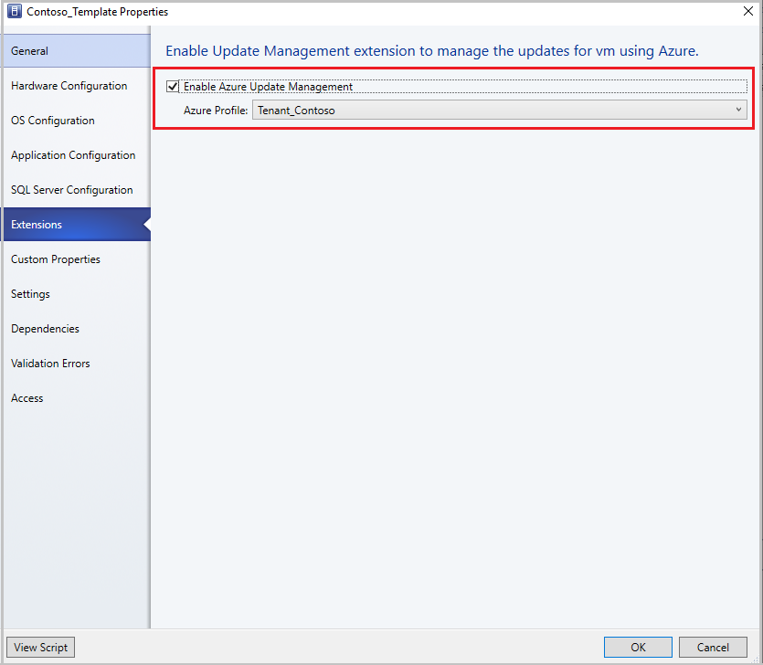

# Azure update management
This article provides information about Azure update management feature in System Center Virtual Machine Manager (VMM).

Using Azure update Management feature, you can manage updates for Virtual Machines (VMs) and Workloads running in a VMM.

Currently, VMM supports update management feature for all new VMs with Windows operating system and are deployed using a VM template with *Azure Update Management Extension* enabled.

## Create a VM template linked to Azure profile

To create a VM template linked to Azure profile, follow these steps:

1.	Create a profile for Azure Update management using steps detailed in [Azure subscriptions article](azure-subscription.md).
2.	In the **Create VM Template** wizard, select **Source Page** > **Use an existing VM template or a virtual hard disk stored in the library**.
3.	On the **Extensions** page, select **Enable Azure Update Management** and select your profile from the **Azure Profile** dropdown menu. Select **OK**.

    

4.	Deploy the VMs from the VM template.
5.	VMM onboards the VMs deployed through VM template to the *Azure Update Management* service and provides the link to the Azure console for managing the updates.
    
6.	Select the **Update Status** link under **Azure Update Management info** to assess and deploy the updates for the VM.

    >[!NOTE]
    > Azure update management capability also supports service deployments using service templates; the procedure is the same as above.  

## Next steps
[Manage Azure VMs](manage-azure-vms.md).
