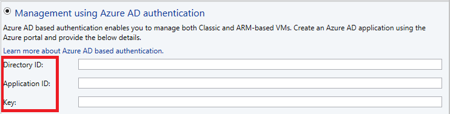
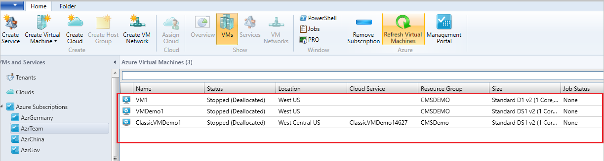

# Manage VMs using Microsoft Entra ID-based authentication & authorization and region-specific Azure subscriptions

This article provides information about how to manage the Azure Resource Manager-based and region-specific Azure subscriptions using System Center Virtual Machine Manager (VMM).
:::moniker range="<=sc-vmm-2019"
You can add Microsoft Azure subscriptions to System Center 2016 - Virtual Machine Manager (VMM) and later, and perform the required actions. [Learn more](azure-subscription.md). The VMM Azure plugin allows the management of Azure subscriptions through certificate-based authentication and authorization and VMs in global Azure region.

VMM 2019 and later supports management of Azure subscriptions through Microsoft Entra ID and region-specific Azure subscriptions. (namely, Germany, China, US Government Azure regions).
:::moniker-end
:::moniker range="sc-vmm-2022"
You can add Microsoft Azure subscriptions to System Center Virtual Machine Manager (VMM) and perform the required actions. [Learn more](azure-subscription.md). The VMM Azure plugin allows the management of Azure subscriptions through certificate-based authentication and authorization and VMs in global Azure region.

VMM also supports the management of Azure subscriptions through Microsoft Entra ID and region-specific Azure subscriptions. (namely, Germany, China, US Government Azure regions).
:::moniker-end
Management of Azure subscriptions through certificate-based authentication and authorization requires Management certificate. [Learn More](/azure/azure-api-management-certs).

Management of VMs using Microsoft Entra ID-based authentication and authorization requires Microsoft Entra ID application.

>[!NOTE]
> Azure AD mentioned in this article refers to Microsoft Entra ID. [Learn more](https://azure.microsoft.com/updates/azure-ad-is-becoming-microsoft-entra-id/).

## Before you start

Ensure the following prerequisites are met:

- **Microsoft Entra ID application** - To manage VMs using VMM through AD authentication and authorization, you need to create a Microsoft Entra ID application and then provide the following details through VMM Azure plugin:

    -	Azure Subscription ID
    -   Microsoft Entra ID
    - 	Microsoft Entra ID - Application ID & Application Key

  [Learn more](/azure/azure-resource-manager/resource-group-create-service-principal-portal) on how to create a Microsoft Entra ID app.  

- **A management certificate** - Configured as described in [this article](./azure-subscription.md).

  - The subscription must have a management certificate associated with it so that VMM can use the classic deployment model in Azure.
  - Make note of the subscription ID and the certificate thumbprint.
  - Certificates must be x509 v3 compliant.
  - The management certificate must be in the local certificate store on the computer on which you add the Azure subscription feature.  
  - The certificate must also be in the Current User\Personal store of the computer running the VMM console.

	> [!NOTE]
    > The certificate is required only if you choose to use certificate-based authentication to manage your Azure subscription.

## Manage Microsoft Entra ID-based authentication & authorization and region-specific Azure subscriptions

To manage authentication and subscriptions, follow these steps:

1.	Browse to **Azure Subscriptions** and select **Add Subscription**.

2. Provide **Display Name**, **Azure cloud**, and **Subscription ID**.

    You can provide any friendly name as display name. Choose either global Azure or region-specific subscription as appropriate.

    

3. Select **Management using Azure AD authentication** (to use certificate-based management, go to step 5).

    

4. Provide **Directory ID**, **Application ID**, and **Key**, and select **Finish** (after this step, go to step 6 directly).

5. To use management certificate, select **Management using management certificate** (not required if already performed step 3 and 4).

    If you want to continue using certificate-based authentication, then instead of selecting Microsoft Entra ID authentication, choose management certificate-based authentication and provide the management certificate from **Current User\Personal** certificate store and select **Finish**.

    

6. Verify the Azure subscription and the VMs hosted on Azure.

## Next steps

- [Create certificates](/azure/cloud-services/cloud-services-certs-create#what-are-management-certificates).
- [Create active directory](/azure/azure-resource-manager/resource-group-create-service-principal-portal).
