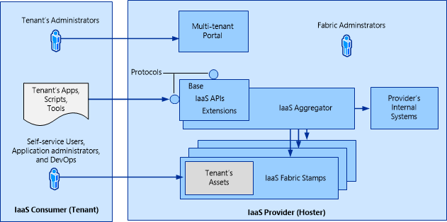
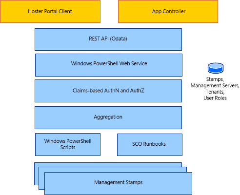

# Architecture Overview of Service Provider Foundation
Service providers can use [!INCLUDE[spflong](../../spf/Deploy/includes/spflong_md.md)] technology to offer infrastructure as a service \(IaaS\) to their clients. If a service provider has a front\-end portal for clients to interact with, [!INCLUDE[spfshort](../../spf/Deploy/includes/spfshort_md.md)] makes it possible for the clients to access the resources on their hosting provider’s system without making changes to the portal.  
  
## Overview  
The following illustration provides a high\-level view of how [!INCLUDE[spfshort](../../spf/Deploy/includes/spfshort_md.md)] operates.  
  
  
  
The tenant represents a hoster's customer, and the tenant has assets on the hoster's system. Each tenant has their own administrators, applications, scripts, and other tools.  
  
The hoster provides tenants with the environment, which can include virtual machines. The hoster has an existing front\-end portal, which all tenants can use. On the back end, the hoster has a collection of resources, which is called the *fabric*. The hoster allocates those resources into discrete groups according to the hoster’s needs. Each of these groups is known as a *stamp*. The hoster can then assign the tenant’s resources to stamps in whatever manner is appropriate to the hoster. The resources may be divided across several stamps, according to the hoster’s business model scheme. [!INCLUDE[spfshort](../../spf/Deploy/includes/spfshort_md.md)] makes it possible for the hoster to present a seamless user experience to the tenant by aggregating the data from each stamp and allowing the tenant to use the [!INCLUDE[spfshort](../../spf/Deploy/includes/spfshort_md.md)] application programming interfaces \(APIs\) to access that data.  
  
A stamp in [!INCLUDE[spfshort](../../spf/Deploy/includes/spfshort_md.md)] is a logical scale unit designed for scalability that provides an association between a server and its [!INCLUDE[sc2012sp1_long](../../om/manage/includes/sc2012sp1_long_md.md)] components. As tenant demand increases, the hoster provides additional stamps to meet the demand. Note that [!INCLUDE[spfshort](../../spf/Deploy/includes/spfshort_md.md)][!INCLUDE[sc2012sp1_short](../../om/manage/includes/sc2012sp1_short_md.md)] supported only one type of stamp; that is a single server that has Virtual Machine Manager \(VMM\) installed.  
  
[!INCLUDE[spfshort](../../spf/Deploy/includes/spfshort_md.md)] does not configure clouds; instead, it manages their resources. Virtual machines are set to clouds, for example, when they are created for [!INCLUDE[vmm12short](../../spf/Deploy/includes/vmm12short_md.md)] or when they are created by the T:Microsoft.SystemCenter.VirtualMachineManager.Cmdlets.New\-SCVirtualMachine cmdlet.  
  
  
  
The hoster can have a portal client, which faces the tenant, that provides access to the infrastructure that the hoster has granted. The portal uses an extensible representational state transfer \(REST\) API to communicate with the web service by using the OData protocol. The claims\-based authentication verifies the tenant’s identity and associates it with the user role that the hoster assigns.  
  
[!INCLUDE[spfshort](../../spf/Deploy/includes/spfshort_md.md)] uses a database to aggregate the tenant resources, which are managed with Windows PowerShell scripts and [!INCLUDE[orchshort](../../om/manage/includes/orchshort_md.md)] runbooks. This makes it possible for the hoster to distribute tenant resources among management stamps in whatever way it decides, while to the tenant the resources are easy to access and appear contiguous.  
  
## See Also  
[Deploying Service Provider Foundation](../../spf/Deploy/Deploying-Service-Provider-Foundation.md)  
[Administering Service Provider Foundation](../../spf/Deploy/Administering-Service-Provider-Foundation.md)  
[Integrating Service Management Portal and API with System Center 2012 SP1](http://go.microsoft.com/fwlink/?LinkId=298454)  
[Cloud Resource Management with System Center 2012 Service Pack 1 \(SP1\) – Orchestrator and Service Provider Foundation](http://go.microsoft.com/fwlink/p/?LinkId=263682)  
[Cmdlets in System Center 2012 \- Service Provider Foundation](http://go.microsoft.com/fwlink/p/?LinkId=263677)  
[Service Provider Foundation Developer's Guide](http://go.microsoft.com/fwlink/p/?LinkID=263700)  
  
