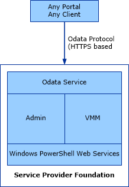

# Portals in Service Provider Foundation
Service Provider Foundation provides services for multiple tenants who receive IaaS through portal applications, and uniquely identifies each tenant and isolates them from one another. Portals communicate with the Service Provider Foundation Admin and --- translation.priority.ht:    - ar-sa   - cs-cz   - da-dk   - de-de   - el-gr   - es-es   - fi-fi   - fr-fr   - he-il   - hu-hu   - it-it   - ja-jp   - ko-kr   - nb-no   - nl-nl   - pl-pl   - pt-br   - pt-pt   - ro-ro   - ru-ru   - sv-se   - tr-tr   - zh-cn   - zh-hk   - zh-tw --- VMM services through REST APIs as described in the [Service Provider Foundation Developer's Guide](http://go.microsoft.com/fwlink/p/?LinkID=263700).  
  
The following illustration shows how portal applications and Windows PowerShell interact with Service Provider Foundation.  
  
  
  
## Portal topics  
  
-   [Configuring Portals for Service Provider Foundation](../../spf/Deploy/Configuring-Portals-for-Service-Provider-Foundation.md)  
  
    Describes the configurations required for [!INCLUDE[conceroshort](../../om/manage/includes/conceroshort_md.md)] and [!INCLUDE[katal_1](../../orch/getstarted/includes/katal_1_md.md)].  
  
-   [Importing Gallery Items in Service Provider Foundation](../../spf/Deploy/Importing-Gallery-Items-in-Service-Provider-Foundation.md)  
  
    Describes how to use Windows PowerShell cmdlets to import gallery items from downloaded packages so they can be easily accessible by portal applications.  
  
-   [How to Configure the System Center Resource Provider for Windows Azure Pack](../../spf/Deploy/How-to-Configure-the-System-Center-Resource-Provider-for-Windows-Azure-Pack.md)  
  
    Describes how to use Windows PowerShell cmdlets to change the endpoints for Windows Azure Pack in case a different installation of Service Provider Foundation is required.  
  
## Other resources for this component  
  
-   [Administer Windows Azure Pack for Windows Server](assetId:///7fd779ae-979f-46c0-bfe7-d375f172c065)Administer Windows Azure Pack for Windows Server  
  
-   TechNet Library main page for [Service Provider Foundation](../../spf/Deploy/Service-Provider-Foundation.md)  
  
-   [Administering Service Provider Foundation](../../spf/Deploy/Administering-Service-Provider-Foundation.md)  
  
-   [Deploying Service Provider Foundation](../../spf/Deploy/Deploying-Service-Provider-Foundation.md)  
  
