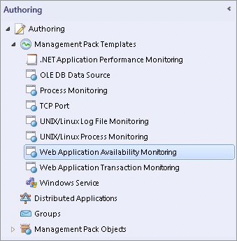

# How to Configure Web Application Availability Monitoring
The **Web Application Availability Monitoring** template in [!INCLUDE[om12long](../../om/manage/includes/om12long_md.md)] lets you monitor web applications from internal locations.  
  
## Key Concepts and Strategies  
Here are some key concepts and strategies to keep in mind as you use the template to configure tests:  
  
-   Web Application Availability Monitoring can monitor applications as well as individual URLs. Your tests can be authored to optimize for application monitoring or vertical application feature monitoring. For example, a website shopping experience is a vertical application feature. Alternatively, you can monitor horizontal application features, such as all home pages on a site.  
  
-   Give your tests friendly names you can easily recognize when you monitor.  
  
-   Group URLs by Web Application and you will see one entry in the monitoring view for each application. This lets you see the state of each application template run at a glance and helps isolate problems related to servers or networks.  
  
-   Web Applications State is a defined as the worst of rollup of individual tests. You can use overrides to change what it displays.  
  
-   Validate each test configuration before exiting the Add Monitoring Wizard so you can check that the response you get is the one you expect for internal watcher nodes.  
  
-   If you are monitoring a vertical website or an application, you can focus alerts on application state by setting up a summary alert for an application, rather than choosing to receive an alert for each URL test for an application. This will reduce the number of alerts you receive and keep the focus of your alerts the overall state of the application. You can further reduce alerts by set the threshold for how many failures you want to have before receiving an alert. Together, these two approaches will focus your alerts on what is most important to you: how well the application is running.  
  
## How to Configure Monitoring  
  
#### To configure Web Application Availability Monitoring  
  
1.  To configure internal URL tests, use the Web Application Availability Monitoring template. This template allows you to create availability monitoring tests for one or more Web Application URLs and run them from internal locations and will walk you through selecting the URLs you want to monitor and where you want to monitor them from.  
  
    To open the Web Application Availability Monitoring template, in the [!INCLUDE[om12short](../../om/manage/includes/om12short_md.md)] console, in the navigation pane, click the **Authoring** button, click **Management Pack Templates**, click **Web Application Availability Monitoring**, and then, in the tasks pane, click the **Add Monitoring Wizard**. Click **Web Application Availability Monitoring**, and then click **Next**.  
  
    **Location of Web Application Availability Monitoring**  
  
      
  
2.  On the **General** page, enter a friendly name and description for your test and the management pack, which stores settings that are specific to this version of the template. Click **Next**  
  
    > [!TIP]  
    > It is important to give your tests names you can easily recognize as this will help you identify them later when you begin monitoring.  
  
3.  On the **What to Monitor** page, enter the URLs you want to monitor. You can add URLs to the list by typing, pasting, or importing a file \(such as a spreadsheet\) into the table, including the appropriate protocol \(http:\/\/ or https:\/\/\). You can paste entire rows as pairs of comma\-separated values \(CSV\) that are in the format “Name, URL”, or you can paste just the list of URLs.  
  
    -   To type or paste a URL, click in the **Name** and **URL** boxes, respectively, and follow the examples on the page to enter the information.  
  
    -   To import names and URLs from another source, click **Add** and follow the instructions to browse and select to the file you want to import.  
  
    > [!TIP]  
    > Group URLs by web application. Example: **Microsoft website** would be the name of many URLs to test from various locations. This keeps the application, **Microsoft website**, the focus of the monitoring rather than the many URLs you are testing for this application. This strategy takes advantage of the dashboard monitoring views, which show the **Web application state** by application name and state so you can easily see the overall health of your monitored application and separate problems related to external factors, such as Internet or network problems, from application or service problems.  
  
4.  On the **Where to Monitor From** page, select the locations from which you want the URLs monitored.  
  
5.  To monitor from internal locations, use the dropdown menu to select to run tests from a server agent or a resource pool. Above the **Internal locations** field, click **Add** and select the internal locations \(server names\) you want to monitor from and add those to your list of **Selected locations**. Click **OK**  
  
    > [!NOTE]  
    > The **Select internal locations** page verifies the version of health service on the agents and only [!INCLUDE[om12short](../../om/manage/includes/om12short_md.md)] agents are shown. If the version is not verifiable or not supported, the agents will not be displayed.  
  
6.  The **View and Validate Tests** page shows a summary of all internal tests that will be run. You can only validate a configuration of internal tests. To validate an internal test configuration, select a test and click **Run Test**.  If you want to change the default settings for the tests, performance data, and alerts for all tests \(external and internal\) created in this template, click **Change Configuration**. For more information, see the “Configuring alerts and performance data collection” in this document. When you have validated your tests, click **Next** to see the **Test Results** page of the test configuration you created with this template.  
  
    > [!TIP]  
    > Validate internal test configurations before exiting the wizard so you can make sure that the response you get is the one you expect.  
  
7.  On the **Test Results** page, the **Summary** tab shows if your test succeeded and whether any of your error criteria failed. To see more details, click through the **Details**, **HTTP Request**, and **HTTP Response** tabs. Click **Close** to return to the **View and Validate Tests** page where you can either choose to reconfigure your tests, or, if the test results look good, click **Create** to initiate the live testing.  
  
#### To configure alerts and performance data collection  
  
1.  Configure alerts and performance during test configuration. To configure alerts, on the **View and Validate Tests** page, click **Change Configuration**. Here you can set the criteria that are most important for you to monitor. These are the URL monitoring performance counters you can set and a description of what each tracks. Most of these are collected by default. For detailed information about the authoring template, see [Web Application Availability Monitoring Template](../../om/manage/Web-Application-Availability-Monitoring-Template.md)  
  
    Base page \(the page served by the request URL\)  
  
    -   Content size: Size of the response body received.  
  
    -   DNS resolution time: Time taken to resolve the URL domain name to the IP address.  
  
    -   Content time: Base page download time \(base page only\).  
  
    -   Download time \(cumulative\): Processing time for the request, such as opening a browser and waiting for all resources to load.  
  
    -   TCP connect time: Time taken to establish a TCP connection to the target server and receive the initial greeting from the service.  
  
    -   Time to first byte: Time take since the TCP connection is established till the first byte of response is received.  
  
    -   Time to last byte \(cumulative\): Time from when TCP connection is established until the last byte of response is completely received.  
  
    -   Response time \(cumulative\): DNS\_RESOLUTION\_TIME \+ TCP\_CONNECT\_TIME \+ TIME\_TO\_LAST\_BYTE.  
  
    Total data  
  
    -   Total transaction time: Same a download time for the single URL case. In multi\-step \(transaction\) case, it’s the sum of download times for all requests in the transaction \(cumulative\).  
  
2.  In the **Test Frequency\/Performance Data Collection Interval** section, you can set your tests’ frequency, how often you want performance data collected, and when the test should time out.  
  
3.  In the **Alerts** section, select the criteria that you want to use to generate an error health state, a warning health state, and the number of consecutive times criteria should fail before an alert is generated. When you monitor your alerts, here is how they will appear based on your alert configuration:  
  
    -   Healthy state\=Green  
  
    -   Error state\=Yellow  
  
    -   Warning state\=Red  
  
    > [!TIP]  
    > If you are monitoring a vertical website or an application, you can focus alerts on application state by setting up a summary alert for an application, rather than choosing to receive an alert for each URL test for an application. To do this, select the **Generate a single summary alert** checkbox. This will reduce the number of alerts you receive and keep the focus of your alerts the overall state of the application. You can further reduce alerts by raising the threshold for how many failures you want to have before receiving an alert. Together, these two approaches will focus your alerts on what is most important to you: How well the application is running, given the performance you require.  
  
4.  You also can change settings for **Http Headers**, designate a **Proxy Server** \(used for internal locations only\), and change other general settings. When you have finished configuring the settings for your tests, click **OK** to return to the **View and Validate Tests** page.  
  
