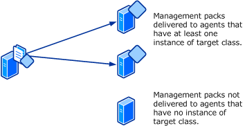
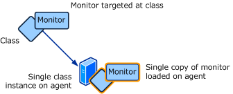
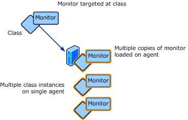

# Selecting a target
Every time you create a monitor or rule, you must select a target for it. The target determines where the monitor or rule will run and how its information will be organized in the Operations console. It is important to understand how targets work so that you can select the most appropriate one for the monitor or rule that you are creating.  
  
If you are creating a monitor or rule for an application or device that already has a management pack installed, then you can most likely use a target that already exists in your management group. If you are creating a monitor or rule for a new application then you may need to create a new target specifically for this purpose. Creating a new target is covered in [Creating a new target](../../om/manage/Creating-a-new-target.md).  
  
You do not select specific objects to target in Operations Manager 2012 but rather you select a particular class of object. The monitor or rule will apply to all instances of the target class. For more information on classes and instances of classes, see [Understanding Classes and Objects](../../om/manage/Understanding-Classes-and-Objects.md).  
  
## Quick Logic  
If you do not have a full understanding of the logic behind the selection of a target, you can use the following quick logic. Refer to the rest of this section for a complete explanation of the effects of a target and how to select an appropriate one.  
  
### Examples  
  
-   If you want the monitor or rule to run on all Windows computers in your management group, then select **Microsoft Windows Computer**.  
  
-   If you want the monitor or rule to run on all Unix computers in your management group, then select **Unix Computer**.  
  
-   If you want the monitor or rule to run on all computers running SQL Server 2008 in your management group, then select **SQL 2008 DB Engine**.  
  
-   If you want the monitor or rule to run on all computers running any version of SQL Server in your management group, then select **SQL DB Engine**.  
  
-   If you want the monitor or rule to run against all logical disks on all Windows servers in your management group, then select **Logical Disk \(Server\)**.  
  
## Effects of a target  
The target of a monitor or rule determines the following:  
  
-   [Where the monitor or rule will run](../../om/manage/Selecting-a-target.md#WhereMonitorWillRun)  
  
-   [How many copies of the monitor or rule will run on the agent](../../om/manage/Selecting-a-target.md#HowManyCopies)  
  
-   [What object the data will be associated with](../../om/manage/Selecting-a-target.md#WhatObject)  
  
-   [What properties will be available for the expression and the alert description](../../om/manage/Selecting-a-target.md#WhatProperties)  
  
### Where the monitor or rule will run  
The monitor or rule will run on each agent that has at least one instance of the target class. You should select a target that only includes those agents where you want the rule or monitor to run.  
  
When a management pack is installed or changed, it is delivered to any agent that manages at least one instance of a class that is used as a target on at least one included workflow. Only workflows targeted at classes that have discovered instances on the agent are actually loaded.  
  
You must ensure that the data that the monitor or rule is accessing will be available in the agent where it is running. For example, if you are creating a monitor that looks for a particular event, you must ensure that the event will be written to the event log where the monitor is running. If you are creating a rule that collects a performance counter, you must ensure that the performance counter is available on that agent. If you are creating a monitor that runs a script, then the script will run on that agent and any resources that it access must be available on the local computer.  
  
If you select a very broad class such as **Windows Computer**, then the monitor or rule will probably run on the agents that you need, but it will also probably run on additional agents where it is not needed. If a broad class such as this is the only one that includes the agents that you need, then consider creating a new target as described in [Creating a new target](../../om/manage/Creating-a-new-target.md).  
  
**Management pack delivery**  
  
  
  
### How many copies of the monitor or rule will run on the agent  
One copy of the monitor or rule will run for each instance of the target. If there is more than one instance of the target on an agent, then more than one copy of the monitor or rule will run on that agent. You can determine how many objects are running on each agent in your environment using the procedure in [Viewing Classes and Objects](../../om/manage/Selecting-a-target.md#ViewingObjects).  
  
For targets such as **Windows Computer**, you can be assured that they will only have a single object on a particular agent. Other targets such as **Logical Disk** may have only object but could have multiple depending on the configuration of the agent computer.  
  
**Workflow targeted at a single instance**  
  
  
  
**Workflow targeted at multiple instances**  
  
  
  
If you do target a class that may have multiple instances on a single agent, then you need to include criteria in the expression to unique identify each instance.  
  
### What object the data will be associated with  
Monitors are included in the Health Explorer of their target object. This has implications beyond just the user interface. Any downtime from the monitor would be included in the availability of the target object. For example, while using **Windows Computer** as a target might cause a monitor to run on the agent computers that you want, any downtime from the monitor would result in downtime for the entire computer, which may not be valid. It would be better to use a target more specific to the component that you want to monitor.  
  
Alerts and data collected by rules will be associated with their target object.  When you right\-click an open alert and select **Health Explorer**, you will open the Health Explorer of the target object. When you right \-click an object and select **Performance View**, you will open a view with performance data for the target object. To achieve optimum functionality from the monitors and rules that you create, you should select or create a target that most accurately represents the component that you want to monitor.  
  
### What properties will be available for the expression and the alert description  
Properties of the target object are available for both any expressions that are used in the monitor or rule and in the description of the resulting alert.  
  
## Viewing Classes and Objects  
You can use the **Discovered Inventory** view in the Operations Console to assist in selecting an appropriate target for a particular monitor or rule.  This view will list all instances of a specified class with its entire set of properties. This shows which instances of the class are managed by different agents, how many instances each agent is managing, and what properties the class has available. Any workflows targeted at the selected class will be run against each of the objects listed in the view. If no instances are listed for a particular class, then none have been discovered on any agents. Any workflows targeted at these classes would not be run.  
  
You can view the discovered inventory for a particular class using the following procedure.  
  
1.  In the Operations console, click the **Monitoring** button.  
  
2.  In the **Monitoring** pane, select **Discovered Inventory**.  
  
3.  In the **Actions** pane click **Change Target Type**.  
  
4.  In the **Select Items to Target** dialog box, select the class to view, and then click **OK**.  
  
## Targeting a group  
Groups are included in the dialog box for selecting a target, but you will receive a warning if you select one. The reason for this is that there is rarely a case where you will want to select one. Monitors and rules run on the agent that manages their target object. The workflow will not enumerate the contents of the group but will attempt to run against the group object itself. Since groups are managed by the management server currently running the Root Management Server services, any workflows targeted at them will be loaded only on that server.  
  
If you do want to have a monitor or rule run only on the members of a particular group, then you can use the following procedure. Note that this is not an ideal strategy, and under most circumstances it would be more effective to create a target for your application as described in [Creating a new target](../../om/manage/Creating-a-new-target.md).  
  
#### To create a monitor or rule that runs on agents in a group  
  
1.  Create the monitor or rule and use Windows Computer for the target.  
  
2.  Disable the monitor or rule that you just created.  
  
3.  Create an override to enable the monitor or rule for the group.  
  
## Selecting a group for a monitoring wizard  
Certain monitoring wizards will require a group to be specified. This specifies the group of computers that will be searched to determine if they have the component that the wizard is monitoring. For example, if you run the Windows Service monitoring wizard, you specify the name of a service to monitor. The wizard will search all computers in the target group that have the service installed. Only those computers with the service will be monitored.  
  
### Examples  
  
-   If you want the wizard to include all Windows agents in your management group, select **All Windows Computers**.  
  
-   If you want the wizard to include all Unix agents in your management group, select **Unix Computer Group**.  
  
-   If you want the wizard to include all computers running SQL Server 2008 in your management group, then select **SQL 2008 Computers**.  
  
-   If you want the wizard to include all computers running any version of SQL Server in your management group, then select **SQL Computers**.  
  
