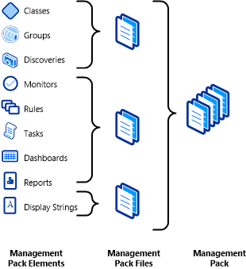

# Structure of a Management Pack
*Management packs* to [!INCLUDE[om12short](../../om/manage/includes/om12short_md.md)] are the equivalent of games to a video game console. The main function of the console is to provide the basic functionality required to run the game, but the game provides the true value of the overall system. A variety of games are available that each provides a distinct entertainment experience. Similarly, Operations Manager provides basic functionality such as deployment of agents to managed computers and central collection, and analysis of collected information. A management pack is then required for each application that you want to monitor. The management pack only has to provide logic specific to the application and can take advantage of the platform provided by Operations Manager.  
  
## Management Pack Files  
A single management pack is comprised of one or more *management pack files*. A management pack file is either an .xml file that can be viewed and edited, or an .mp file which is a sealed .xml file that cannot be changed. When you download a management pack from the management pack catalog, it typically includes a set of management pack files that each contains a specific set of elements. When you create a new element in the Operations console, you must select a management pack file to store it in.  
  
**Conceptual view of management pack files and elements**  
  
  
  
## Management Pack Elements  
A *management pack element* is a single item in a management pack such as a class, monitor, dashboard, or report. There are reasons that management pack authors group different elements in a particular file, but you can ignore the reasons until you get to more advanced concepts. For now, just understand that the word element refers to one of these items.  
  
## Compatibility with Operations Manager 2007  
[!INCLUDE[om12short](../../om/manage/includes/om12short_md.md)] supports management packs that use a later version of the XML schema than Operations Manager 2007. Management packs written for Operations Manager 2007 work without changes in [!INCLUDE[om12short](../../om/manage/includes/om12short_md.md)]. However, management packs written by using new [!INCLUDE[om12short](../../om/manage/includes/om12short_md.md)] elements or using the updated schema do not work in Operations Manager 2007. This includes management packs that are created in the Operations Manager 2012 Operations console because they are based on the new schema.  
  
## Types of Management Packs  
All management packs use the same schema and can contain any elements that are used in [!INCLUDE[om12short](../../om/manage/includes/om12short_md.md)]. Management packs with a specific set of elements are referred to with a more specific term as described below.  
  
### Monitoring Pack  
*Monitoring packs* are management packs intended to perform general monitoring scenarios. These are the primary management packs obtained from the management pack catalog. They also are the primary management pack that you create with the Operations console and Authoring console.  
  
### Feature Pack  
*Feature packs* contain additional features for a monitoring pack. These can be features that are optional. You can select which set of features you want to install. Another reason for a feature pack is that it can contain elements specific to [!INCLUDE[om12short](../../om/manage/includes/om12short_md.md)] so that the monitoring pack can be used in Operations Manager 2007 and [!INCLUDE[om12short](../../om/manage/includes/om12short_md.md)] with the additional features only used in [!INCLUDE[om12short](../../om/manage/includes/om12short_md.md)].  
  
### Dashboard Packs  
*Dashboard packs* are feature packs that contain dashboards which are a new feature to [!INCLUDE[om12short](../../om/manage/includes/om12short_md.md)], so they cannot be imported into an Operations Manager 2007 management group. Dashboards are not included in monitoring packs so that the monitoring pack can be used with both version of Operations Manager.  
  
### Security Packs  
*Security Packs* are feature packs that monitor the security of an application.  
  
### Language Packs  
Any text displayed by a management pack in the Operations Console is defined in a *display string*. Wizards populate the display strings, so you do not have to distinguish them from the elements that they are associated with. Some management pack files contain only display strings in a particular language. These are referred to as *language packs*. If you require a management pack in alternate languages, you can download the appropriate language packs for the languages that you require. If you are creating your own management pack, you can use the Authoring console or XML code to define display strings in any languages that you require.  
  
## Management Pack Schema  
Knowledge of the schema for a management pack is only required if you edit the management pack directly by using an XML editor. You are never exposed to this schema when using the Operations console and only rarely with the Authoring console. Wizards are available for creating common elements, and custom user interface pages are available for common modules. Direct XML editing is only required for configuring modules and workflows that do not have custom UI pages. The XML for defining complex data types might be required, and the schema for these data types is provided in the [Schema Type Reference](http://go.microsoft.com/fwlink/?LinkID=192053).  
  
## See Also  
[Sealed Management Pack Files](../../om/manage/Sealed-Management-Pack-Files.md)  
  
