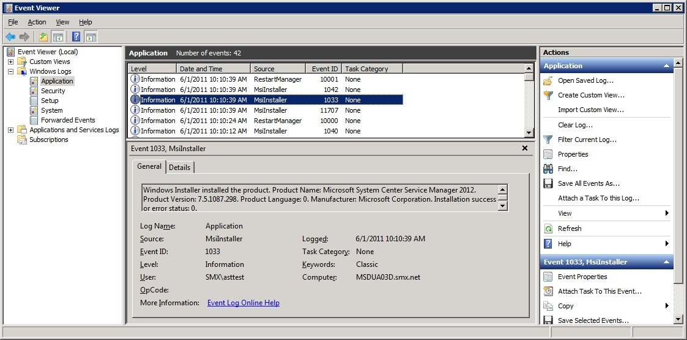

# Deploying Service Manager from a Command Line

This section describes how to deploy System Center 2012 - Service Manager using command\-line parameters. For easier reading, the command\-line examples in this guide list each command\-line parameter on its own line. If you copy these examples, you must remove the carriage returns\/line\-feeds \(CRs\/LFs\) from each line before you can run the commands.  

> [!NOTE]  
>  The **\/silent** parameter must be the last parameter used in a command\-line install.  

 In this guide, the command\-line arguments that you provide are delineated by brackets: \[\]. For example, you provide the Registered Owner’s name **\[owners name\]** and Registered Organization’s name **\[company name\]** as shown in the following example:  

```  
Setup.exe  
/Install:Datawarehouse  
/RegisteredOwner:[owners name]  
/RegisteredOrganization:[company name]   
/Silent  

```  

 If your command\-line argument contains a space—for example, **\[owners name\]**—enclose the argument in double quotation marks. For example, if you use **Garret Young** as the argument for the **RegisteredOwner** command\-line parameter, type the name as shown in the following example:  

```  
/RegisteredOwner:”Garret Young”  
```  

 Some of the command\-line parameters that are used for the Operations Manager and Configuration Manager data marts define Structured Query Language \(SQL\) path statements as command\-line arguments. You must define the drive name and make sure that the path that is listed in this guide is the correct path for your version of Microsoft SQL Server. The examples in this guide are correct for SQL Server 2008, as shown in the following example:  

```  
/OMDataMartDatabaseLogFilePath:[drive name]\Program Files\Microsoft SQL Server\MSSQL10.MSSQLSERVER\MSSQL\DATA  
```  

 The following is an example of the same command\-line argument that you would use for SQL Server 2008 R2.  

```  
/OMDataMartDatabaseLogFilePath:[drive name]\Program Files\Microsoft SQL Server\MSSQL10_50.MSSQLSERVER\MSSQL\DATA  
```  

 For additional information about command\-line parameters, type **setup.exe \/?**. The parameters in the following table are optional.  

|||  
|-|-|  
|**\/ProductKey**|If this parameter is omitted, Service Manager is installed as an evaluation edition with an evaluation period of 180 days.|  
|**\/Installpath**|If this parameter is omitted, Service Manager is installed in the default folder and path:<br /><br /> \[drive name\]:\\Program Files\\Microsoft System Center\\Service Manager 2012.|  
|**\/ServiceRunUnderAccount**|If this parameter is omitted, the local system account is used.|  
|**\/WorkflowAccount**|If this parameter is omitted, the local system account is used.|  

## Before you run the command line  
 To help prevent an installation failure, perform the following steps on the computer where you will be installing Service Manager:  

1.  Run the UI\-based Setup up to the point where you run the prerequisite checker. Make sure that the prerequisite checker passes, or at least passes with a warning.  

2.  On the computer where you will be installing the reporting server, make sure that the SQL Server Reporting Services \(SSRS\) service has started.  

3.  If you are going to deploy the Reporting Server on a computer other than the computer hosting the data warehouse management server, make sure that you have completed the procedure in [Manual Steps to Configure the Remote SQL Server Reporting Services](../../../sm/deploy/deploy-guide/Manual-Steps-to-Configure-the-Remote-SQL-Server-Reporting-Services.md).  

## Determining When Installation Is Complete  
 When installation of either the Service Manager management server or the data warehouse management server is complete, an event with Event ID 1033 is written into the Application Event log, as shown in the following illustration.  

   


 If you use the **start \/w** command when you are using setup.exe, the command window will remain open when Setup completes, giving you the opportunity to examine any return codes.  

## Checking Error Codes  
 When the command\-line Setup is complete, the command prompt appears. You can view the error code that was returned by typing **echo %errorlevel%**. An error code of 0 means that the installation was successful. The error codes that could be returned by the command\-line installation are listed in [Appendix A \- Command\-Line Option Error Codes](../../../sm/deploy/deploy-guide/Appendix-A---Command-Line-Option-Error-Codes.md) in this guide.  

 The command\-line installation will not check the database name that you supply to see if it already exists. If you supply a database name that already exists, the command\-line installation will fail and a \-1 will be returned as an error code.  

## Deploying Service Manager from a Command Line Topics  

-   [How to Deploy a Service Manager Management Server Using the Command Line](../../../sm/deploy/deploy-guide/How-to-Deploy-a-Service-Manager-Management-Server-Using-the-Command-Line.md)  

     Describes how to install a Service Manager management server using the command line.  

-   [How to Deploy a Data Warehouse Management Server Using the Command Line](../../../sm/deploy/deploy-guide/How-to-Deploy-a-Data-Warehouse-Management-Server-Using-the-Command-Line.md)  

     Describes how to install a data warehouse management server using the command line.  

-   [How to Deploy a Service Manager Console Using the Command Line](../../../sm/deploy/deploy-guide/How-to-Deploy-a-Service-Manager-Console-Using-the-Command-Line.md)  

     Describes how to install a Service Manager console using the command line.  

-   [How to Deploy the Service Manager Self\-Service Portal Using the Command Line](../../../sm/deploy/deploy-guide/How-to-Deploy-the-Service-Manager-Self-Service-Portal-Using-the-Command-Line.md)  

     Describes how to install the Self-Service Portal using the command line.
