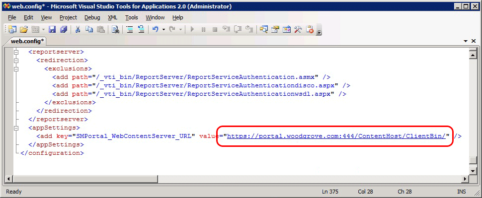

# How to Reconfigure the Web Content Server URL
When you use certificates with the [!INCLUDE[smssp](../../../sm/deploy/deploy-guide/includes/smssp_md.md)] in [!INCLUDE[smlong12](../../../sm/deploy/deploy-guide/includes/smlong12_md.md)], you can use this procedure to change the web content server URL. For example, you may have installed the web content server only to find that the URL you used for the web content server results in a certificate warning. While resolving the certificate warning issue—for example, for a name mismatch—you may find that you are going to use a different URL to connect to the web content server. In this case, you must open a web.config file on both the SharePoint website server and web content server and update the URL.  
  
 In this example, the computer is in Woodgrove National Bank, and the fully qualified domain name \(FQDN\) for the computer is portal.woodgrove.com. When the web content server was installed, Secure Sockets Layer \(SSL\) and port 444 were used. \(Port 443 was saved for the SharePoint website.\) Now, the web.config file is edited using the URL https:\/\/portal.woodgrove.com:444\/ContentHost\/ClientBin\/, as shown in the following illustration. \(This image is of the web.config file on a SharePoint website server.\)  
  
   
  
### To reconfigure the web content server URL on the SharePoint website server  
  
1.  Log on to the computer that hosts the SharePoint website server with administrator privileges.  
  
2.  Using Windows Explorer, navigate to the folder location where you installed the SharePoint website server. The default location is \<drive\>:\\\\intetpub\\wwwroot\\wss\\VirtualDirectories\\Service Manager Portal.  
  
3.  Right\-click the web.config file, and open it with the editor of your choice, for example, Notepad.  
  
4.  Scroll to the bottom of the web.config file, locate the \<appSettings\> area, and then locate the \<add key\=…\> line.  
  
5.  Edit the URL in the value\= section to match the new URL that you want to use for the web content server.  
  
6.  Close the editor and save your changes.  
  
### To reconfigure the web content server URL on the web content server  
  
1.  Log on to the computer that hosts the web content server with administrator privileges.  
  
2.  Using Windows Explorer, navigate to the folder location where you installed the web content server. The default is \<drive\>:\\\\inetpub\\wwwroot\\System Center Service Manager Portal\\ContentHost.  
  
3.  Right\-click the file web.config, and then open it with the editor of your choice, for example, Notepad.  
  
4.  Scroll to the bottom of the web.config file, locate the \<appSettings\> area, and then locate the \<add key\=…\> line.  
  
5.  Edit the URL in the value\= section to match the new URL that you want to use for the web content server.  
  
6.  Close the editor and save your changes.  
  
## See Also  
 [SSL Certificates for the Self\-Service Portal](../../../sm/deploy/deploy-guide/SSL-Certificates-for-the-Self-Service-Portal.md)