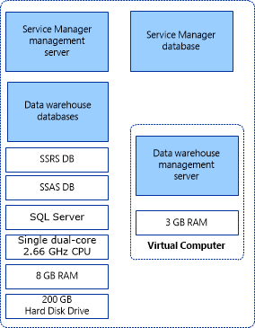

# Installing Service Manager on a Single Computer (Minimum Configuration)
If you want to evaluate [!INCLUDE[smlong12](../../../sm/deploy/deploy-guide/includes/smlong12_md.md)] and you have a minimal amount of hardware available, install [!INCLUDE[smshort](../../../sm/deploy/deploy-guide/includes/smshort_md.md)] on one computer. A sample single\-computer configuration is shown in figure 1. This configuration will not support a production environment, and no scalability or performance estimates are provided. Because you cannot install both the [!INCLUDE[smshort](../../../sm/deploy/deploy-guide/includes/smshort_md.md)] management server and the data warehouse management server on the same computer, use Hyper\-V to create a virtual computer to host the data warehouse management server. For more information about the hardware requirements for Hyper\-V, see [Hyper\-V Server 2008 R2 system requirements](http://go.microsoft.com/fwlink/p/?LinkId=231898).  
  
 To install [!INCLUDE[smshort](../../../sm/deploy/deploy-guide/includes/smshort_md.md)] on a single computer, start with a physical computer that is running Windows Server 2008 and Hyper\-V, and make sure that the CPU on the physical computer is compatible with Hyper\-V. Of the 8 gigabytes \(GB\) of RAM on the host computer, 3 GB is used for the virtual computer that hosts the data warehouse management server. Make sure that at least 200 GB of free space is available on the hard disk drive.  
  
 **Figure 1: Single\-computer installation in which you use a physical computer that is running Windows Server 2008 and Hyper\-V**  
  
   
  
 If your organization’s best practice guidelines do not allow you to install applications on a Hyper\-V host, you can create a second virtual computer to host the [!INCLUDE[smshort](../../../sm/deploy/deploy-guide/includes/smshort_md.md)] management server, the [!INCLUDE[smshort](../../../sm/deploy/deploy-guide/includes/smshort_md.md)] database, and the data warehouse databases. Use the following procedures to install [!INCLUDE[smshort](../../../sm/deploy/deploy-guide/includes/smshort_md.md)] on a single computer.  
  
## Installing Service Manager on a single computer topics  
  
-   [How to Install Service Manager on a Single Computer](../../../sm/deploy/deploy-guide/How-to-Install-Service-Manager-on-a-Single-Computer.md)  
  
     Describes how to install [!INCLUDE[smshort](../../../sm/deploy/deploy-guide/includes/smshort_md.md)] on a single computer.  
  
-   [How to Validate the Single\-Computer Installation](../../../sm/deploy/deploy-guide/How-to-Validate-the-Single-Computer-Installation.md)  
  
     Describes how to validate the installation.  
  
## Other resources for this component  
  
-   TechNet Library main page for [System Center 2012 – Service Manager](http://go.microsoft.com/fwlink/p/?LinkId=220655)  
  
-   [Operations Guide for System Center 2012 – Service Manager](http://go.microsoft.com/fwlink/p/?LinkId=220656)  
  
-   [Administrator's Guide for System Center 2012 – Service Manager](http://go.microsoft.com/fwlink/p/?LinkId=209669)  
  
-   [Planning Guide for System Center 2012 – Service Manager](http://go.microsoft.com/fwlink/p/?LinkId=209672)