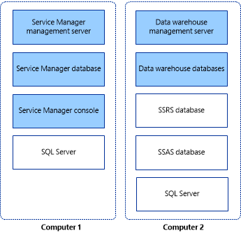

# Installing Service Manager on Two Computers
If you want to evaluate [!INCLUDE[smlong12](../../../sm/deploy/deploy-guide/includes/smlong12_md.md)] and its reporting capabilities in a lab environment, we recommend that you install the [!INCLUDE[smshort](../../../sm/deploy/deploy-guide/includes/smshort_md.md)] management server and data warehouse management server on two computers. The first computer hosts the [!INCLUDE[smshort](../../../sm/deploy/deploy-guide/includes/smshort_md.md)] management server and the [!INCLUDE[smshort](../../../sm/deploy/deploy-guide/includes/smshort_md.md)] database. The second computer hosts the data warehouse management server and the data warehouse databases. This deployment topology is shown in figure 2.  
  
 **Figure 2: An installation on two physical computers**  
  
   
  
> [!IMPORTANT]  
>  For this release, [!INCLUDE[smshort](../../../sm/deploy/deploy-guide/includes/smshort_md.md)] does not support case\-sensitive instance names. Setup will display a warning if you attempt to install [!INCLUDE[smshort](../../../sm/deploy/deploy-guide/includes/smshort_md.md)] on a case\-sensitive instance of Microsoft SQL Server.  
  
## Installing Service Manager on two computers  
  
-   [How to Install the Service Manager Management Server \(Two\-Computer Scenario\)](../../../sm/deploy/deploy-guide/How-to-Install-the-Service-Manager-Management-Server--Two-Computer-Scenario-.md)  
  
     Describes how to install the [!INCLUDE[smshort](../../../sm/deploy/deploy-guide/includes/smshort_md.md)] management server, [!INCLUDE[smshort](../../../sm/deploy/deploy-guide/includes/smshort_md.md)] database, and [!INCLUDE[smcons](../../../sm/deploy/deploy-guide/includes/smcons_md.md)].  
  
-   [How to Install the Service Manager Data Warehouse \(Two\-Computer Scenario\)](../../../sm/deploy/deploy-guide/How-to-Install-the-Service-Manager-Data-Warehouse--Two-Computer-Scenario-.md)  
  
     Describes how to install the data warehouse management server and the data warehouse database.  
  
-   [How to Validate the Two\-Computer Installation](../../../sm/deploy/deploy-guide/How-to-Validate-the-Two-Computer-Installation.md)  
  
     Describes how to validate the installation.