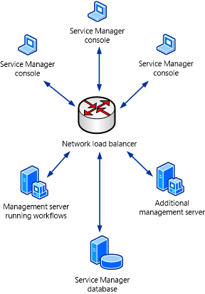
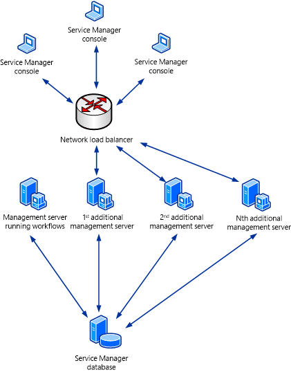

# Load-Balancing Service Manager Management Servers
You can use network Load Balancing \(NLB\) in Windows Server 2008 to configure a pool of computers so that they take turns responding to requests. In [!INCLUDE[smlong12](../../../sm/deploy/deploy-guide/includes/smlong12_md.md)], the initial [!INCLUDE[smshort](../../../sm/deploy/deploy-guide/includes/smshort_md.md)] management server that you deploy is the server that processes workflows. You can deploy additional management servers to provide failover for a failed initial management server and to provide load balancing for handling [!INCLUDE[smcons](../../../sm/deploy/deploy-guide/includes/smcons_md.md)]. For more information about Windows Server 2008 NLB, see the [Network Load Balancing Deployment Guide](http://go.microsoft.com/fwlink/p/?LinkID=183567). For more information about additional [!INCLUDE[smshort](../../../sm/deploy/deploy-guide/includes/smshort_md.md)] management servers, see [Deploying Additional Service Manager Management Servers](assetId:///5b14fe8d-45ab-44f8-9bf1-cf3c49b68672).  
  
 As a minimum, you have to deploy an initial [!INCLUDE[smshort](../../../sm/deploy/deploy-guide/includes/smshort_md.md)] management server—the management server that hosts the workflow processes—and at least one additional [!INCLUDE[smshort](../../../sm/deploy/deploy-guide/includes/smshort_md.md)] management server. In an environment of this kind that consists of two [!INCLUDE[smshort](../../../sm/deploy/deploy-guide/includes/smshort_md.md)] management servers, configure NLB to use both management servers, as shown in the following illustration.  
  
   
  
 If you deploy two or more additional [!INCLUDE[smshort](../../../sm/deploy/deploy-guide/includes/smshort_md.md)] management servers, you can isolate the initial [!INCLUDE[smshort](../../../sm/deploy/deploy-guide/includes/smshort_md.md)] management server from the NLB pool. This reduces the workload on the initial [!INCLUDE[smshort](../../../sm/deploy/deploy-guide/includes/smshort_md.md)] management server, resulting in better workflow performance. It also load\-balances all of the [!INCLUDE[smcons](../../../sm/deploy/deploy-guide/includes/smcons_md.md)]s across the remaining [!INCLUDE[smshort](../../../sm/deploy/deploy-guide/includes/smshort_md.md)] management servers. This scenario is shown in the following illustration.  
  
 