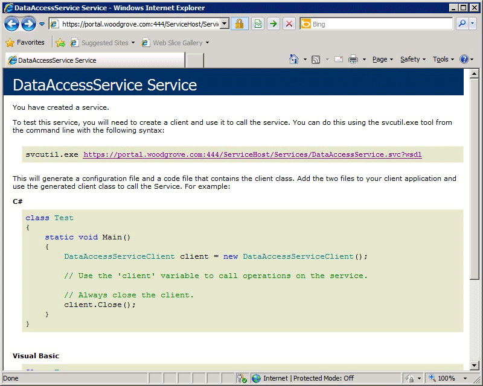

# How to Connect Directly to the Web Content Server Using a Browser

When you use certificates with the Self-Service Portal in System Center 2012 - Service Manager, you can use this procedure to connect directly to the web content server using a browser. This gives you the opportunity to make sure that the URL you specify for the web content server does not result in any certificate warnings.  

 In this example, the computer is in Woodgrove National Bank, and the fully qualified domain name \(FQDN\) for the computer is portal.woodgrove.com. When the web content server was installed, Secure Sockets Layer \(SSL\) and port 444 were used. \(Port 443 was saved for the SharePoint website.\) The browser appears as shown in the following illustration.  

   

### To connect directly to the web content server with a browser  

1.  On any computer on the network, open Internet Explorer.  

2.  In the address line, type the URL that you want to use for the test. For this example, type **https:\/\/portal.woodgrove.com:444\/ServiceHost\/Services\/DataAccessService.svc**.  

3.  Examine the resulting web page for the following:  

    1.  The web page loaded with no certificate warnings.  

    2.  The background in the address bar is white \(indicating no certificate errors\).  

    3.  The web page looks very similar to the previous illustration.  

4.  Make a note of this URL that you used successfully, and use this URL as the URL for the web content server when you deploy the SharePoint website. In this example, the URL for the web content server is **https:\/\/portal.woodgrove.com:444**.  

## See Also

 [SSL Certificates for the Self\-Service Portal](../../../sm/deploy/deploy-guide/SSL-Certificates-for-the-Self-Service-Portal.md)
