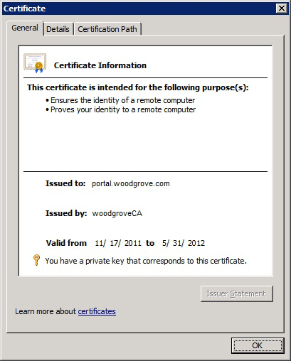

# How to Examine Properties of a Certificate

Use this procedure to examine the properties of a certificate you use with the Self-Service Portal in System Center 2012 - Service Manager. Make sure that the URL you use for the Self-Service Portal matches the name on the certificate, and make sure that the certification authority \(CA\) that issued the certificate is a trusted CA. This gives you the opportunity to make sure that the URL you specify for the Self-Service Portal does not result in any certificate warnings or blank frames in the browser. In this example, the computer is in Woodgrove National Bank. The fully qualified domain name \(FQDN\) for the computer is portal.woodgrove.com. The CA that issued the certificate is woodgroveCA. Note the Issued to" and "Issued by" fields in the following illustration.  

   

 To view the properties of a certificate, you add the Certificates snap\-in to the Microsoft Management Console \(MMC\). When you examine the certificate, the value in the "Issued to" field represents the URL that you must use when you are accessing the SharePoint website server, and the value in the "Issued to" field must match the URL that the your browser will use to connect to the web content server. The value in the "Issued by" field represents the CA that issued this certificate, and it must trace back to the trusted root.  

 You can also use this procedure to determine the thumbprint of a certificate.  

### To examine the properties of a certificate  

1.  Log on to the computer where you want to examine a certificate with administrator privileges.  

2.  Click **Start**, in **Search programs and files** type **mmc**, and then press Enter.  

3.  In the **Console1** window, click **File**, and then click **Add\/Remove Snap\-in**.  

4.  In **Add or Remove Snap\-ins**, click **Certificates**, and then click **Add**.  

5.  In the **Certificates** snap\-in, click **Computer account**, and then click **Next**.  

6.  In **Select Computer**, make sure that **Local computer** is selected, and then click **Finish**.  

7.  In **Add or Remove Snap\-ins**, click **OK**.  

8.  In the **Console1** window, expand **Certificates \(Local Computer\)**, expand **Personal**, and then click **Certificates**.  

9. In the **Issued To** pane, double\-click the certificate that you want to use for the Self-Service Portal. Examine the **Issued to** and **Issued by** fields.  

10. Click **OK**.  

11. In the **Console1** window, expand **Trusted Root Certification Authorities**, and then click **Certificates**.  

12. In the **Issued To** pane, make sure that the CA that issued your certificate is listed here.  

### To determine the thumbprint of a certificate  

1.  If you have not done so already, create a certificate snap\-in, as described in steps 1 through 8 in the previous procedure.  

2.  In the **Issued To** pane, double\-click the certificate that you want to examine.  

3.  In the **Certificate** dialog box, click **Details**.  

4.  In the **Show** list, click **Properties Only**.  

5.  Copy the thumbprint and use it to define the certificate that you want to use.  

6.  Click **OK** to close the **Certificate** dialog box.  

## See Also

 [SSL Certificates for the Self\-Service Portal](../../../sm/deploy/deploy-guide/SSL-Certificates-for-the-Self-Service-Portal.md)
