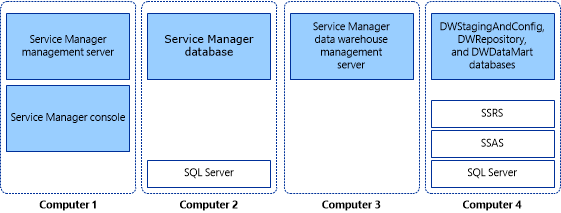

# Installing Service Manager on Four Computers

When you are ready to move System Center 2012 - Service Manager into a production environment, or if you want to maximize performance and scalability, you can consider an installation topology in which each part of the Service Manager installation resides on its own computer. This topology requires the use of four computers, as shown in figure 3.  

 **Figure 3: Four\-computer topology**  

   

 In this deployment scenario, you install Microsoft SQL Server only on the computers that hosts databases \(computers 2 and 4\). You install SQL Server Reporting Services \(SSRS\) and SQL Server Analysis Services \(SSAS\) on the computer that hosts the data warehouse databases \(computer 4\).  

## Installing Service Manager on four computers  

-   [How to Install the Service Manager Management Server \(Four\-Computer Scenario\)](../../../sm/deploy/deploy-guide/How-to-Install-the-Service-Manager-Management-Server--Four-Computer-Scenario-.md)  

     Describes how to install the Service Manager management server and Service Manager database.  

-   [How to Install the Service Manager Data Warehouse \(Four\-Computer Scenario\)](../../../sm/deploy/deploy-guide/How-to-Install-the-Service-Manager-Data-Warehouse--Four-Computer-Scenario-.md)  

     Describes how to install the data warehouse management server and data warehouse databases.  

-   [How to Validate the Four\-Computer Installation](../../../sm/deploy/deploy-guide/How-to-Validate-the-Four-Computer-Installation.md)  

     Describes how to validate the installation of Service Manager and the configuration of SSRS.  

> [!IMPORTANT]  
>  For this release, Service Manager does not support case\-sensitive instance names. Setup will display a warning if you attempt to install Service Manager on a case\-sensitive instance of Microsoft SQL Server.
