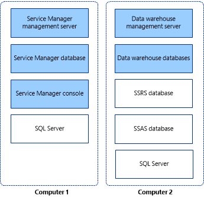

# Installing Service Manager on Two Computers

If you want to evaluate System Center 2012 - Service Manager and its reporting capabilities in a lab environment, we recommend that you install the Service Manager management server and data warehouse management server on two computers. The first computer hosts the Service Manager management server and the Service Manager database. The second computer hosts the data warehouse management server and the data warehouse databases. This deployment topology is shown in figure&nbsp;2.  

 **Figure 2: An installation on two physical computers**  

   

> [!IMPORTANT]  
>  For this release, Service Manager does not support case\-sensitive instance names. Setup will display a warning if you attempt to install Service Manager on a case\-sensitive instance of Microsoft SQL&nbsp;Server.  

## Installing Service Manager on two computers  

-   [How to Install the Service Manager Management Server \(Two\-Computer Scenario\)](../../../sm/deploy/deploy-guide/How-to-Install-the-Service-Manager-Management-Server--Two-Computer-Scenario-.md)  

     Describes how to install the Service Manager management server, Service Manager database, and Service Manager console.  

-   [How to Install the Service Manager Data Warehouse \(Two\-Computer Scenario\)](../../../sm/deploy/deploy-guide/How-to-Install-the-Service-Manager-Data-Warehouse--Two-Computer-Scenario-.md)  

     Describes how to install the data warehouse management server and the data warehouse database.  

-   [How to Validate the Two\-Computer Installation](../../../sm/deploy/deploy-guide/How-to-Validate-the-Two-Computer-Installation.md)  

     Describes how to validate the installation.
