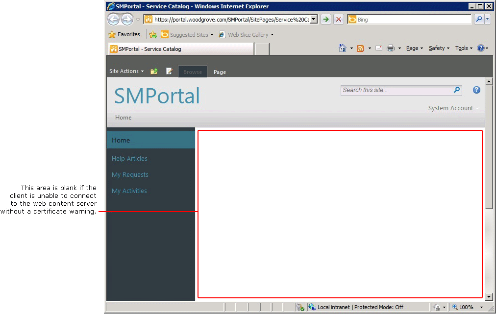

# SSL Certificates for the Self-Service Portal

We strongly recommend using Secure Sockets Layer \(SSL\) certificates with the Self-Service Portal in System Center 2012 - Service Manager. The Self-Service Portal consists of two parts, a Microsoft SharePoint website server and a web content server. When you are using SSL on the Self-Service Portal, you should use SSL certificates on both parts.  

 When a client connects to the Self-Service Portal, they are connecting to the SharePoint website server. The framework of the portal is delivered to the client from the SharePoint website server. The SharePoint server instructs the browser to download the Silverlight components from the web content server. The Silverlight components then contact the Windows Communication Foundation \(WCF\) service on the web content server. You define the URL for the web content server when you are deploying the SharePoint website server, and it is this web content server URL that is delivered to the client.  

 If there is a certificate\-related problem when a client is establishing an SSL connection to the Self-Service Portal, a certificate warning appears. For example, if the name the client that is typed for the URL does not match the computer name on the certificate, a name mismatch warning appears. The client has the option to continue with the connection. However, if there is a certificate\-related error when the client's computer attempts to download Silverlight components from the web content server, there is no opportunity to manually respond to the certificate warning. The result is that part of the Self-Service Portal web page appears blank.  

 Therefore, you should be aware of the following when you are working with SSL certificates:  

-   The certificates that you use for the Self-Service Portal must be issued from a Certification Authority that is trusted by the client.  

-   The name on the certificate for the SharePoint website server must match the URL that your users enter into the browser. For example, if the user types the URL https:\/\/portal\/SMPortal, then the certificate must have been issued to portal and not, for example, portal.woodgrove.com.  

-   The name on the certificate for the web content server must match the name that you entered when you deployed the SharePoint website server.  

 The default port for SSL is 443. So that your users do not have to enter a port number in the browser when they connect to the Self-Service Portal, you should specify port 443 when you deploy the SharePoint website server. Because users never enter the URL for the web content server \(remember, the web content server URL is delivered to the client when users connect to the SharePoint website server\), you can use a port other than 443 \(for example, port 444\) for the SSL port on the web content server. If you deploy both the SharePoint website server and web content server on the same computer, you be prompted to specify the options for the web content server first; then, you install the SharePoint website server. Therefore, the first time that you are prompted to enter a port number, it will be for the web content server, and you should not use port 443 if you plan to install the SharePoint website server on the same computer. During deployment, the second port number that you are asked to provide will be for the SharePoint website server, and that is when we recommend using port 443.  

 If you are deploying both the SharePoint website server and web content server on the same computer, you need only one certificate. That one certificate will work for both ports. If you are deploying the SharePoint website server and web content server on different servers \(which is recommended in a production environment\), you will need one certificate for each computer.  

 Certificates are labeled by their subject name, and subject names on certificates do not have to be unique. During Service Manager setup, certificates are listed by their subject name. Therefore, during deployment of the Self-Service Portal, it is possible that you will be presented with multiple certificates with the same name. If you pick the second certificate in the list of certificates that are available to use, there is a possibility that Service Manager might use the first one in the list. This can be especially problematic when the client is attempting to connect to the web content server, because there is no opportunity for manual intervention. To resolve this issue, you can change the certificate in Internet Information Services \(IIS\) Manager.  

 The following sections expand on the steps you can take to solve SSL\-related problems that you might encounter with the Self-Service Portal.  

## Certificate “Issued to” Name  
 The address that you type into the browser to connect to the SharePoint website and the address of the web content server that was defined in the SharePoint website *must each match the “Issued to” name on their associated certificate or certificates*. When you connect to the SharePoint website, if the address that you type in the browser does not match the “Issued to” name on the certificate, you will see a Certificate Warning and the background in the browser's address line will be red. If the web content server address that was configured in the SharePoint website does not match the “Issued to” name on the certificate, the center frame in the browser will be blank, as shown in the following illustration.  

   

### Name Mismatch on the SharePoint Website  
 If the address that you type in the browser when you connect to the SharePoint website does not match the “Issued to” address in the certificate, you have the following options:  

-   Continue past the warning and continue  

-   Change the name in the address line in the browser to match the “Issued to” name on the certificate  

-   Obtain a new certificate where the “Issued to” name matches the address that you want to enter in the browser  

### Name Mismatch for the Web Content Server  
 If the address for the web content server that is configured on the SharePoint website does not match the “Issued to” address in the certificate on the web content server, the center frame in the Self-Service Portal will be blank. In this case, you have the following options:  

-   Obtain a new certificate for the web content server that matches the URL that is configured on the SharePoint website  

-   Configure the address for the web content server that is stored on the SharePoint website to match the “Issued to” name on the certificate that is used for the web content server  

## Certificate Must Be Trusted  
 Make sure that the Certification Authority \(CA\) that issued your certificates is listed in the Trusted Root Certification Authority store for the clients accessing the site. For information about determining whether a certificate is trusted, see [How to Examine Properties of a Certificate](../../../sm/deploy/deploy-guide/How-to-Examine-Properties-of-a-Certificate.md).  

## SSL Certificates for the Self\-Service Portal Topics  

-   [How to Examine Properties of a Certificate](../../../sm/deploy/deploy-guide/How-to-Examine-Properties-of-a-Certificate.md)  

     Describes how to learn what the “Issue to” name is for a certificate, determine whether the certificate is trusted, and determine the certificate thumbprint.  

-   [How to Reconfigure the Web Content Server URL](../../../sm/deploy/deploy-guide/How-to-Reconfigure-the-Web-Content-Server-URL.md)  

     Describes the procedure to use if you are using a different certificate for the web content server than the certificate that you originally selected during installation.  

-   [How to Select a Certificate for Web Content Server Use](../../../sm/deploy/deploy-guide/How-to-Select-a-Certificate-for-Web-Content-Server-Use.md)  

     Describes how to select the certificate that is used for the web content server.  

-   [How to Connect Directly to the Web Content Server Using a Browser](../../../sm/deploy/deploy-guide/How-to-Connect-Directly-to-the-Web-Content-Server-Using-a-Browser.md)  

     Describes how to use a browser to connect to the web content server and test a certificate.
