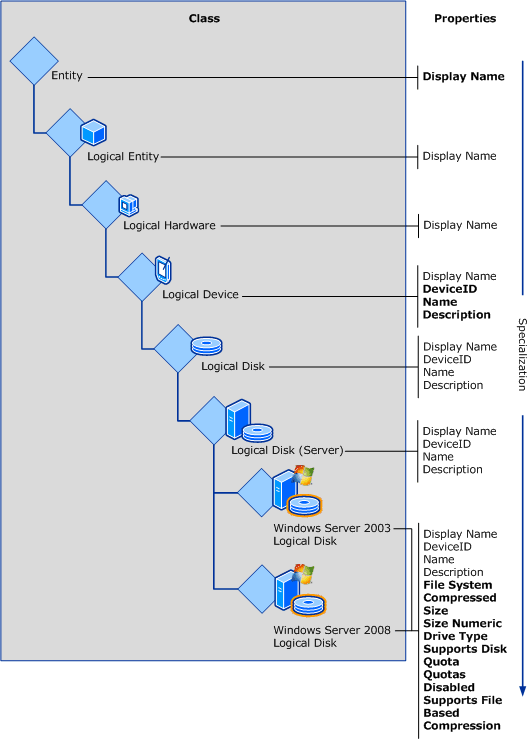
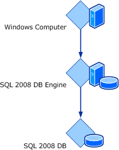

# Classes: Key Concepts

Objects in System Center 2012 - Service Manager are *instances* of a particular base class. All instances of a base class have a common set of properties and common behavior.  

 Like all management pack elements, classes have *ID* and *Display Name* properties. In this documentation, "ID" refers to the unique name of the class that is seen only in the Authoring Tool, while "Name" and "Display Name" refer to the language\-specific name that appears in the Service Manager console.  

> [!NOTE]  
>  When you are creating a class, always ensure that class names are unique among management packs. If possible, use class names that are meaningful in your environment. You can determine whether a class name already exists by using the search feature in the **Class Browser** window of the System Center 2016 - Service Manager Authoring Tool.  

## Properties  
 All instances of a particular class share a common set of *properties*. The values for these properties are provided in various methods by users and can vary among different instances. Properties are used to represent details of the actual object, such as a unique name, location, and other details that may be interesting to the user or that are required for management scenarios.  

### Key Properties  
 A *key property* uniquely identifies each instance of a particular class. If a property is marked as a key property, each instance of the class must have a unique value for that property, and the value cannot be null. For *hosted classes*, the value must only be unique for all instances of the class that have the same hosting parent. For *unhosted classes*, it must be unique for all instances of the class in the management group. Hosting relationships are further described later in this section.  

 Classes do not always require a key property. A key property is only required if more than one instance of a class is expected for a single parent. If only a single instance is expected, a key property is not required but may still be defined.  

 For example, **SQL Database Engine** has a key property of **Instance Name** because a single computer can have more than one instance of Microsoft SQL&nbsp;Server installed. When there are multiple instances of **SQL Database Engine**, each instance must have a different value for **Instance Name** in order to clearly distinguish between the different objects. The **IIS Web Server** class, by contrast, does not define a key property because there can be only one instance installed on any computer.  

 All objects have a **Path Name** property that is calculated from the object's key property or properties and those of its hosting parent or parents. For unhosted objects, **Path Name** will be the key property of the class itself. **Path Name** can be used to uniquely identify any instance of a class in the management group.  

## Base Classes and Inheritance  
 Every class must specify a *base class* that identifies an existing class that the new class will *specialize*. The management pack libraries that are included with Service Manager contain several classes that can be used as the base for custom classes in management packs. A management pack will typically have at least one class inheriting from a library class and potentially other classes inheriting from classes in the same management pack.  

 The concept of a base class can be illustrated with the Windows&nbsp;Server Operating System management pack. This management pack includes classes representing logical disks installed on the computer. The following illustration shows the classes **Windows&nbsp;Server&nbsp;2003 Logical Disk** and **Windows&nbsp;Server&nbsp;2008 Logical Disk**. These classes are both based on **Logical Disk \(Server\)** that is defined in the Microsoft.Windows.Server.Library management pack file. **Logical Disk \(Server\)** is in turn based on **Logical Disk**, which itself is based on **Logical Device**, and so on through **Logical Hardware**, **Logical Entity**, and finally **Entity**. All classes can trace a similar inheritance path and will always end up at **Entity**, which is the root of the class structure. This is the only class that does not have a base class, and all other classes eventually inherit from it.  

 **Inheritance of properties between classes**  

   

 **Entity** has a single property, named **Display Name**. This property is inherited by all classes inheriting from **Entity**. All classes eventually inherit from **Entity**. That is why all classes have a **Display Name** property. No other classes in this example have properties until **Logical Device**, which defines **Name**, **Description**, and **DeviceID**. **DeviceID** is specified as the key property. These properties are all inherited by **Logical Disk** and **Logical Disk \(Server\)**. **Logical Disk \(Server\)** then adds the additional properties **Size**, **Drive Type**, and **File System**. The bottom\-level classes that are specific to the version of the operating system inherit the entire set of properties provided by those classes above them in the inheritance tree.  

## Class Types  
 Most classes have one or more actual instances and are known as *concrete classes*. *Abstract classes* and *singleton classes* are special kinds of classes that behave differently and are used for particular scenarios.  

### Abstract Classes  
 Abstract classes have no instances and exist only to act as a base class for other classes. All properties and relationships that are defined at the abstract class level are inherited by child classes and do not have to be defined again. Most of the classes that are defined in management pack libraries are abstract, since they are only provided to act as base classes for classes that are defined in custom management packs.  

 Abstract classes are used where there is a common set of properties, relationships, or grouping that can be defined across all further specializations of a class. In the previous example, all of the classes shown above **Windows&nbsp;Server&nbsp;2003 Logical Disk** and **Windows&nbsp;Server&nbsp;2008 Logical Disk** are abstract. They exist only for the lower\-level classes to inherit from.  

### Singleton Classes  
 *Singleton classes* are used when there is one and only one instance of a class. The class is the instance, and it always exists. The single instance is being created when the management pack is installed. Similarly, a key property is not required for a singleton class, because it will only ever have a single instance. A common use of singleton classes is for the **Groups** class, because there is only a single instance of this class required throughout the management group.  

## Class Extensions  
 To customize a class, you can extend it by adding new properties to the existing class definition. The new properties will now be included in all instances of that class that already exist, and in any new instances that will be created. An abstract class cannot be extended.  

## Relationships  
 *Relationships* are defined between classes to indicate an association between a particular instance of one class and the particular instance of another. There are three types of relationships, and they are detailed in the following sections:  

-   Hosting relationship  

-   Containment relationship  

-   Reference relationship  

 Class relationships affect objects in the following ways.  

|Relationship type|Key property and existence|Available properties|  
|-----------------------|--------------------------------|--------------------------|  
|Hosting|The value of the key property must be unique for all instances of the class in the management group. For hosted classes however, the key property value must be unique only for all objects that have the same hosting parent.   To uniquely identify a hosted object, the key property of both the object and the object's parent are required and the key of the hosted class will be the combination of both the hosting class key property, and the hosted class key property.   The existence of a hosted class depends on the existence of the hosting class.|Any workflow that is targeted at a class have access to that class's properties in addition to the properties of any of its hosting parent\(s\).   For example, a script in a workflow using the **SQL&nbsp;2008 DB Engine** class as its target might require the name of the computer on which the instance of SQL Server 2008 is installed. Because an object can have only one hosting parent, we know the computer that hosts any particular instance of the **SQL&nbsp;2008 DB Engine** class. The workflow script can access the properties of the targeted object and the properties of that target's hosting parent.|  
|Containment|Key property and existence are not dependent on container object.|Any workflow that is targeted at a class have access to that class's properties in addition to the properties of any of its container parent\(s\).   For example, a script in a workflow targeting an incident class, can access the properties of the container queue's class.|  
|Reference|Key property and existence are not dependent on referenced object.|Any workflow that is targeted at a class have access only to that class's properties.|  

### Reference Relationship  
 The *reference relationship* is the most general relationship type. A reference relationship is used when the parent and child classes are not dependent on one another; for example, a database could reference another database that it is replicating. One database is not dependent on the other, and the objects exist separately.  

### Containment Relationship  
 The *containment relationship* type is less restrictive than the hosting relationship. It declares that one class is related to another class, although one is not required for the other. Unlike a hosting relationship, a containment relationship is many\-to\-many. This means that one object can contain multiple objects, and a single object can be contained by multiple other objects. For example, one group can contain multiple objects, and a single object can be a member of multiple groups.  

 Containment relationships are typically used for group membership where objects are included in a group through a containment relationship between the group and the member object.  

### Hosting Relationship  
 The most restrictive relationship between classes is the *hosting* relationship. A class hosted by another class is called a *hosted class*, and an instance of the class is called a *hosted object*. If a class is not hosted by another, it is called an *unhosted class*, and an instance of the class is called an *unhosted object*.  

 When one object is hosted by another, that object relies on its hosting parent for its very existence. If the hosting parent is removed, the hosted child will also be removed. For example, a logical disk cannot exist without the computer that it is installed on.  

 A hosted object can have only one hosting parent, but one parent can host multiple children. For example, a particular disk can be installed on only a single computer, but one computer can have several disks installed.  

 The SQL Server management pack provides another example of hosting relationships. The hosting relationship between the **Windows Computer** class, the **SQL 2008 DB Engine** class, and the **SQL 2008 DB** class is shown here.  

 **Hosting relationships for SQL&nbsp;Server&nbsp;2008 classes**  

   

 The **SQL&nbsp;2008 DB Engine** class represents an instance of SQL Server&nbsp;2008 installed on a particular computer. Because a database can be installed on only a single database engine, the **SQL&nbsp;2008 DB Engine** class hosts the **SQL&nbsp;2008 DB** class. There can be several databases with the same name in a management group, but any databases installed on a particular instance of the **SQL Server** class must have a unique name. The database engine, in turn, is hosted by the **Windows Computer** class. There can be several **SQL Server** instances with the same name in a management group. Each one on a particular computer must have a unique name.  

 Because there are two hosting relationships, the path name for each database will be the computer name followed by the instance name followed by the database name. An example is shown in the following diagram.  

 **Sample database hosting relationships**  

   

## See Also

 [Classes: Customizing and Authoring](../Topic/Classes:%20Customizing%20and%20Authoring.md)
