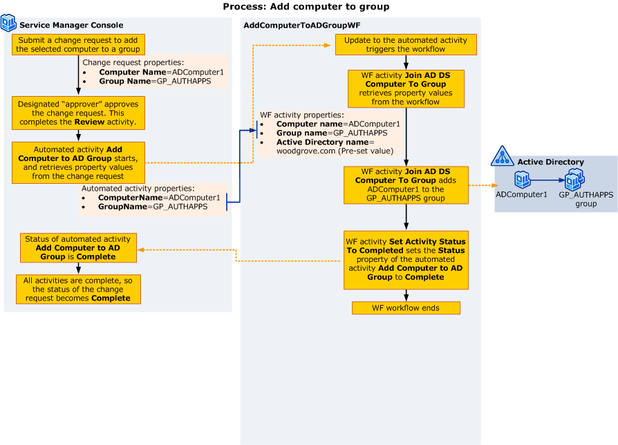

# Configuring the Way Activities Manage and Pass Information

The activity properties provide ways to transfer data. For the Woodgrove Bank customization scenario, the name of the computer and the name of the group must be transferred from the automated provisioning activity to the workflow activity that does the actual work. The following illustration shows how the computer and group names pass from the Service Manager automated activity to the Windows Workflow Foundation \(WF\) activities in the workflow.  

   

 You can use the following steps to configure properties to pass the values:  

-   [How to Set an Activity Property to a Constant Value](../../../sm/manage/author/How-to-Set-an-Activity-Property-to-a-Constant-Value.md)—Sets the **Active Directory Server** property of the **Add AD DS Computer To Group** activity to a constant value.  

-   [How to Set an Activity Property to Use a Value from the Trigger Class](../../../sm/manage/author/How-to-Set-an-Activity-Property-to-Use-a-Value-from-the-Trigger-Class.md)—Associates the **ComputerName** and **GroupName** properties defined previously with the **Computer name** and **Group name** properties of the **Add AD DS Computer To Group** activity.  

 For larger, more complex workflows, you have an additional option. To pass values from one activity to another, complete the steps in [How to Set an Activity Property to Use a Value from Another Activity](../../../sm/manage/author/How-to-Set-an-Activity-Property-to-Use-a-Value-from-Another-Activity.md).  

## Configuring Activities Topics  

-   [How to Set an Activity Property to a Constant Value](../../../sm/manage/author/How-to-Set-an-Activity-Property-to-a-Constant-Value.md)  

     Describes how to set an activity property to a constant value.  

-   [How to Set an Activity Property to Use a Value from Another Activity](../../../sm/manage/author/How-to-Set-an-Activity-Property-to-Use-a-Value-from-Another-Activity.md)  

     Describes how to set an activity property to use a value from another activity.  

-   [How to Set an Activity Property to Use a Value from the Trigger Class](../../../sm/manage/author/How-to-Set-an-Activity-Property-to-Use-a-Value-from-the-Trigger-Class.md)  

     Describes how to set an activity property to use a value from the trigger class.
