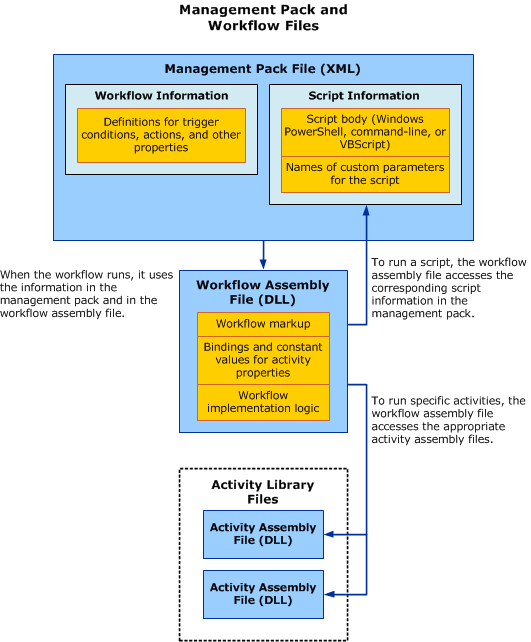

# Workflows and Management Packs
[!INCLUDE[smlong12](../../../sm/deploy/deploy-guide/includes/smlong12_md.md)] runs a Windows Workflow Foundation \(WF\) workflow using trigger condition information stored in the management pack. For each workflow, the management pack contains one data source module and one write action module. The data source module defines the condition that triggers the workflow to run, and the write action module defines the workflow actions. The management pack also stores any script information that the workflow uses.  
  
## Files and Formats  
 In addition to the management pack file, WF workflows require several supporting files:  
  
-   **Authoring environment files**. When you create or edit a workflow, these files store the raw workflow information, such as property values and workflow logic.  
  
-   **Compiled workflow assembly file** \(*workflowname*.dll\). When you save a management pack in the [!INCLUDE[smatfull2012](../../../sm/manage/author/includes/smatfull2012_md.md)], the tool also compiles any raw workflow files \(the XOML and CS files\) into a workflow assembly \(DLL\) file.  
  
-   **Activity assembly files** \(*activityname*.dll\). These files contain definitions of the available workflow activities. The [!INCLUDE[scauthoringshort](../../../sm/manage/author/includes/scauthoringshort_md.md)] cannot modify the activity assembly files.  
  
 To implement a management pack with workflows in your [!INCLUDE[smcons](../../../sm/deploy/deploy-guide/includes/smcons_md.md)] environment, make sure that [!INCLUDE[smshort](../../../sm/deploy/deploy-guide/includes/smshort_md.md)] has access to the workflow assembly file and the activity assembly files, as well as the management pack itself. The following illustration shows how the various files interact when a workflow runs.  
  
   
  
## Trigger Conditions for Workflows  
 A workflow’s data source module defines the workflow trigger condition. A workflow can have one of two types of trigger condition:  
  
-   **Timer.** This option \(also referred to as a *schedule*\) triggers the workflow on designated days of the week or at another specified interval.  
  
-   **Database query**. This option \(also referred to as a *subscription*\) triggers the workflow when a specific type of change occurs to a specific class of object. You can select the class from any of the installed management packs, and you can choose from three types of changes:  
  
    -   When a new instance of the class is created  
  
    -   When an instance of the class is updated  
  
    -   When an instance of the class is deleted  
  
## See Also  
 [Managing Workflows](../../../sm/manage/author/Managing-Workflows.md)   
 [How to Deploy a Workflow to Service Manager](../../../sm/manage/author/How-to-Deploy-a-Workflow-to-Service-Manager.md)   
 [Automating IT Processes with Workflows](../../../sm/manage/author/Automating-IT-Processes-with-Workflows.md)