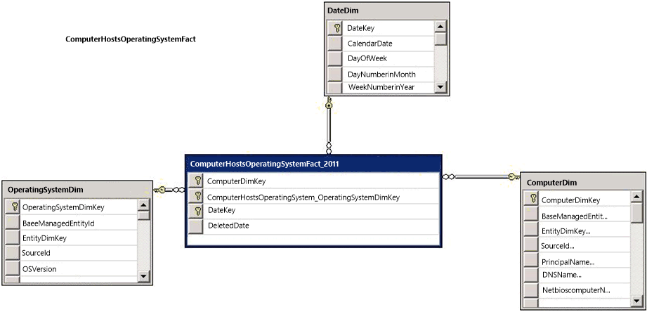

# How to Create an OLAP Cube Using a Management Pack
A System Center online analytical processing \(OLAP\) cube is defined as a collection of the following management pack elements:  
  
-   Measure groups, which points to the facts that are included  
  
-   Substitutions to be performed on the fact  
  
-   MDX resources  
  
-   Drill\-Through Actions  
  
-   KPIs  
  
-   Named Calculations  
  
-   Custom Measures  
  
-   Many to Many Relationships  
  
 All elements other than MeasureGroups are optional.  
  
 When you define an OLAP cube using the schema above and you import the management pack, the [!INCLUDE[smlong12](../../../sm/deploy/deploy-guide/includes/smlong12_md.md)] data warehouse deploys the cube using SQL Server Analysis Management Objects \(AMO\), and it creates the required infrastructure to maintain it. For example, you can create a simple OLAP cube based on *ComputerHostsOperatingSystemFact*. The following illustration is the dimensional view of the fact in the warehouse.  
  
   
  
### To create an OLAP cube using a management pack  
  
1.  Copy the following management pack source code and save it:  
  
    ```  
    <Warehouse>  
    <Extensions>  
    <SystemCenterCube ID="ComputerCube">  
    <MeasureGroups>  
    <MeasureGroup ID="ComputerHostsOperatingSystem" Fact="DWBase!ComputerHostsOperatingSystemFact" />  
    </MeasureGroups>  
    </SystemCenterCube>  
    </Extensions>  
    </Warehouse>  
  
    ```  
  
2.  Import the management pack, and then run the MPsync job. The OLAP cube will appear in the [!INCLUDE[smcons](../../../sm/deploy/deploy-guide/includes/smcons_md.md)] in an unprocessed state.  
  
3.  To view OLAP cube, open the [!INCLUDE[smcons](../../../sm/deploy/deploy-guide/includes/smcons_md.md)], navigate to **Data Warehouse** and **Cubes**, and then click **ComputerCube**.  
  
4.  A data warehouse process job is created for the OLAP cube with a default 24\-hour job schedule. Therefore,  process the cube using the [!INCLUDE[smcons](../../../sm/deploy/deploy-guide/includes/smcons_md.md)] or using the cmdlet **Start\-SCDWJob \-JobName Process.ComputerCube**.  
  
5.  Open the cube in Excel using the link from the **Task** pane, and look at the cube structure that was created.  
  
6.  Notice that the following measure groups are created for the OLAP cube:  
  
    -   A measure group corresponding to the fact ComputerHostsOperatingSystemFact with a Count measure  
  
    -   A measure group corresponding to the dimensions that it points to  
  
    -   Computerdim and OperatingsystemDim with the count measure  
  
7.  Notice that the following cube dimensions are created:  
  
    -   The outrigger dimensions corresponding to the fact are added as cube dimensions so that you can slice the facts on those dimensions. These dimensions include Priority and Status.  
  
    -   DateDim is added to the OLAP cube because it is relevant to any fact.  
  
    -   EntityStatus and RelationshipStatus cube dimensions are defined for all cubes to indicate whether the entity or relationship is deleted.  
  
## See Also  
 [Understanding OLAP Cubes](../../../sm/manage/operate/Understanding-OLAP-Cubes.md)